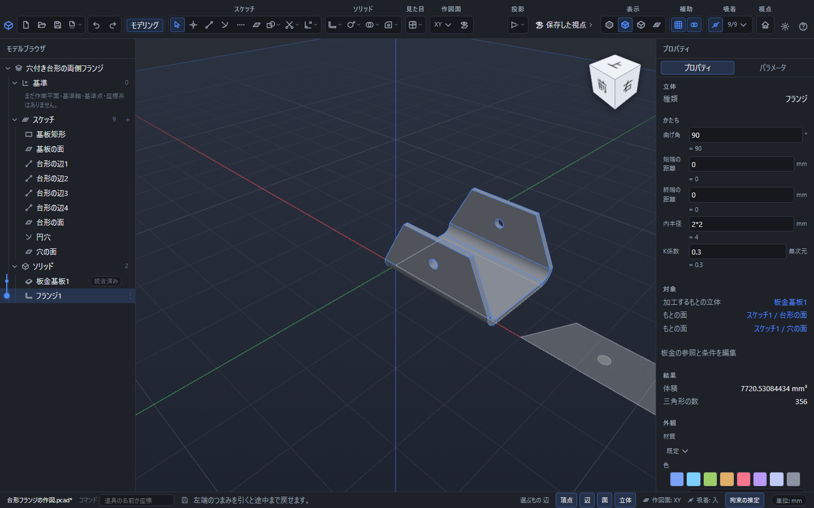
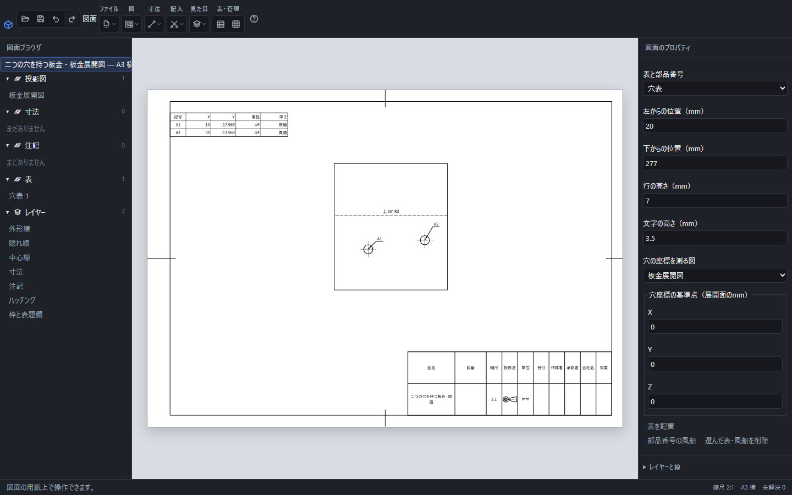

# PointerCAD

**座標で描く手軽さと、寸法を変えて作り直せる3D設計を、一つに。**

PointerCADは、**「前の点から右へ40mm」「板厚の2倍の位置」など、作りたい形の決め方をそのまま入力できる3D CAD**です。座標・相対距離・角度・数式を使って描き、マウスで形を確かめながら立体や加工を加えられます。機械部品の設計、DIY、3Dプリントに向けて、部品作成から組み立て、データの受け渡しまで扱います。

Web版とデスクトップ版を開発しており、無料公開を予定しています。**現在は開発中で、正式リリース前です。**

## PointerCADを選ぶ理由

### 分かっている寸法を、そのまま作図に使える

寸法や点の位置が分かっている部品は、コマンド欄から続けて描けます。例えば、作図面で次の順に入力すると、右へ40mm、そこから上へ30mmのL字ができます。各入力をEnterで決定し、最後にEscで終えます。

```text
L        線分を描く
0,0      原点から始める
@40,0    直前の点から右へ40mm
@30<90   直前の点から90°の方向へ30mm
```

マウスでの作図や吸着、拘束と組み合わせられるので、数値が分かる部分は入力し、位置を見て決めたい部分は画面上で選べます。[コマンド入力の使い方](packages/help-content/docs/ja/command-line.md)

線分が交わったら、交点に共有する点を作り、線を区間へ自動で分けられます。その点を動かして途中を曲げたり、はみ出した区間だけを削除したりでき、座標で描いた後の手直しも続けて行えます。[交点の接続と区間編集](packages/help-content/docs/ja/sketch-intersections.md)

### 日本語の名前と数式で、寸法違いを作りやすい

よく使う寸法には`板厚`や`穴径`と名前を付けられます。例えば、`板厚 = 3`、押し出しの距離を`板厚 * 2`とすれば、距離は6mm。板厚を5に変えると10mmへ追従します。式は保存して開き直した後も編集でき、サイズ違いの部品や試作の寸法調整に使えます。

名前付きの数値は、プロパティ、その場の入力欄、コマンド欄で共通して使えます。**位置を決める式と、厚みや穴径を決める式を、同じ設計の中で管理できる**ことが強みです。[パラメータの使い方](packages/help-content/docs/ja/parameters.md)

### 数値で決めて、形を見ながら組み立てまで進められる

描いた輪郭から押し出し、穴・面取りなどの加工を加えると、操作が履歴に残ります。元のスケッチや加工の値を編集すると、それに続く形も再計算されます。Undo/Redoや履歴の途中の確認もでき、作った形を見ながら設計を修正できます。

さらに、複数の部品を面や軸の関係で組み立て、回転・スライドの動きや部品どうしの干渉を確かめられます。ボルト・ナット・座金・軸受などの規格部品、分解表示、部品表にも対応しています。

### 繰り返す作図を、自分の道具にできる

JavaScriptで点・線・面・立体や穴をまとめて作り、よく使う処理を名前付きの道具として登録できます。例えば穴あき板の作成を自動化し、作った後は通常の履歴や画面から寸法を編集できます。処理全体をUndo1回で戻せるので、手作業と自動化を行き来しながら試作できます。[自動作図](packages/help-content/docs/ja/scripts.md) · [道具の登録と保存](packages/help-content/docs/ja/script-tools.md)

### 作った形を、製作につなげられる

STEP・STL・DXFの読み書きに対応しています。他のCADで作った形を取り込んだり、3Dプリントや加工へ渡すデータを書き出したりできます。距離・角度・体積・質量の測定や、3Dプリント向けの肉厚・オーバーハングの点検も備えています。

梁の曲げ・軸のねじり・ボルトの引張は、寸法や荷重を入力して簡易計算できます。公式、代入値、材料値の出典と適用条件を確認しながら、形を決める際の検討に使えます。[簡易強度計算の範囲と使い方](packages/help-content/docs/ja/strength.md)

### 同じ部品から、図面と板金の展開まで

3D部品から三面図・断面図・詳細図を作り、寸法、公差、表面性状、溶接記号を記入できます。元の部品を編集したら図面を更新し、形の変更を反映できます。部品表や穴表も使え、PDF・SVG・DXFで製作指示を渡せます。[図面の使い方](packages/help-content/docs/ja/drawing.md)

板金では、基板からフランジや指定線の曲げを作り、切欠きを加えて展開できます。板厚・曲げ半径・K係数にも名前付きの寸法を使えるので、寸法違いの構成を切り替え、折り曲げた形と展開の両方を確かめられます。展開DXFや折曲げ・展開STEP、曲げ指示を含む図面まで、一つの設計から出力できます。[板金の使い方](packages/help-content/docs/ja/sheet-metal.md)

## 他のCADと比べたときの位置づけ

PointerCADが重視するのは、**座標で点・線を置く操作と、数式で寸法を管理する3D設計を、画面操作と行き来しながら使えること**です。使い慣れた設計方法から見ると、次のように位置づけられます。

| 比較する設計方法 | PointerCADで重視している使い方 |
|---|---|
| **AutoCADのように座標を入力して描く**。AutoCADは絶対座標・相対座標・極座標で点を指定できます。[公式説明](https://help.autodesk.com/cloudhelp/2026/ENU/AutoCAD-OnBoarding/files/ACD_FOUNDATIONS_MAIN6.html) | `@40,0`や`@30<90`による作図から始め、同じアプリ内で押し出し・加工履歴・部品の組み立てへ進めます。座標で形を考える人が、3D部品へつなげやすい構成です。 |
| **Fusionのように名前付きの寸法や式で形を管理する**。Fusionにもパラメータと数式による寸法管理があります。[公式説明](https://help.autodesk.com/view/fusion360/ENU/?contextId=SLD-REF-PARAMETERS) | パラメータを加工寸法に加え、点を置くコマンド入力にも使います。`板厚`などの日本語名で、座標から加工までの寸法の関係を読める形で残せます。 |
| **OpenSCADのように数式やパラメータで形を定義する**。OpenSCADはモデルを記述したスクリプトから形を生成します。[公式説明](https://openscad.org/about.html) | 画面での点・辺・面の選択や式入力と、JavaScriptによる自動作図を組み合わせられます。自動で作った形も通常の履歴に残り、画面で後から寸法を編集できます。 |

比較は各製品の公式説明とPointerCAD開発版の機能に基づく、操作方法の整理です（2026年9月9日確認）。

## 実際の画面・操作デモ

以下は開発版を実際に操作した画面です。正式リリース時には公開版の画面に更新し、座標入力・寸法変更・組み立ての短い操作動画も順次掲載する予定です。

<!-- pointercad:demo-media:start -->

**穴付きの輪郭を使い、二つの縁へフランジを作成。** 曲げ角や内半径、K係数を後から式で編集できます。



**展開した形を、曲げ指示と穴表が付いた製作図へ。** 部品の穴位置を変えた後も、図面を更新して追従させられます。




<!-- 公開する実画面と操作動画の選定・撮影・掲載条件は rules/05-リリース.md §11.4 を参照。公開後は上の案内を実画像・動画へのリンクと説明に置き換える。 -->
<!-- pointercad:demo-media:end -->

## できること

| 用途 | 開発版に実装済みの機能 |
|---|---|
| 下書きを描く | 点・線分・円・円弧・矩形・多角形・楕円・スプライン、交点の自動接続・折曲げ・区間削除、寸法や位置の拘束、3Dスケッチ |
| 立体を作る | 押し出し・回転・スイープ・ロフト、スプライン断面・案内線を使った曲面、箱・球・円柱などの基本形状、立体の結合・切り抜き |
| 部品を加工する | 穴・ねじ穴・面取り・角丸め、ミラー・配列、平面による切断、コイルばね |
| 組み立てる | 部品の配置と合致、回転・スライド、干渉確認、分解表示、規格部品、部品表 |
| 図面を作る | 三面図・断面図・詳細図、寸法・公差・幾何公差、表面性状・溶接記号、部品表・穴表、PDF・SVG・DXF出力 |
| 板金を設計する | 基板、複数縁・任意輪郭のフランジ、指定線の曲げ、曲げリリーフ、K係数による展開、曲げ指示付き図面、折曲げ・展開STEP |
| 形を調べる | 距離・角度・体積・質量、断面表示、3Dプリント向け点検 |
| 強度を検討する | 梁の曲げ・軸のねじり・ボルトの引張の簡易計算、公式と数値の代入、材料値の出典・適用条件の確認 |
| 作図を自動化する | JavaScriptの作図API、例からの実行、処理全体のUndo、中止、処理ファイルとモジュールの保存、よく使う処理の道具登録 |
| 見やすくする | 色・材質・透明度の指定、選択セット、表示テーマと画面の拡大率の切替 |
| 保存・受け渡し | 編集可能な文書の保存・再読込、自動保存からの復元、STEP・STL・DXFの読み書き |

上記は開発版の機能です。製品全体の受入検査と配布準備を進めています。実装状況は[開発計画](docs/plans/)と[進捗台帳](docs/progress.json)で確認できます。

## 追加開発の計画：数式から曲線・曲面を設計する

**以下は追加計画で、現在の開発版ではまだ利用できません。初回リリースの対象として実装を進めます。**

- **関数と範囲から形を作る**：座標式・媒介式・陰関数とXYZの描画範囲から曲線や曲面を作り、閉じた有効な面を立体にします。式・係数・範囲を後から変更できるようにします。
- **関数の形を、寸法や位置の設計へつなぐ**：XYZのうち1つか2つを指定し、点が定まる場合は関数上へ点を作成します。複数の候補がある場合は選べるようにし、断面線や接線・法線、係数のスライダーも用意します。
- **普段の座標欄でも大学数学を使う**：分数、累乗、階乗、絶対値、三角関数、対数、微積分、行列、複素数、確率統計などを分野別に整備します。XYZ、係数、πなどの定数、演算記号を区別して指定できる入力欄と数学パレットを用意し、計算結果の型や複数解も明示します。

目指すのは、数学で表した曲線・曲面を、通常の選択・加工・寸法変更へつなげられる設計です。対応する記号・演算、精度、適用範囲、操作方法をヘルプと取扱説明書へ揃えて公開します。[数学入力の計画と対応表](docs/plans/追加-数学入力.md) · [関数作図の計画](docs/plans/追加-関数作図.md)

## 入手方法・取扱説明書

初回の正式リリースに向けて準備中です。公開時には、ここから各配布物とWeb版へ直接進めるようにします。

<!-- pointercad:release-links:start -->
| 利用方法 | 公開状況 |
|---|---|
| Windows版のインストーラーをダウンロード | 初回リリース時にダウンロードリンクを掲載 |
| Linux版のAppImageをダウンロード | 初回リリース時にダウンロードリンクを掲載 |
| 取扱説明書を読む・ダウンロード（HTML / PDF） | 初回リリース時に説明書のリンクを掲載 |
| Webアプリ版をブラウザで使う | 初回リリース時にWebアプリのリンクを掲載 |
<!-- pointercad:release-links:end -->

[リリースの公開状況](https://github.com/oltotlo79-rgb/PointerCAD/releases) · [開発中の機能別ヘルプ](packages/help-content/docs/ja/)

## 使用データと参照先

規格部品・図面・材料・計算で使うデータの参照先です。**メーカー公開資料、規格の書誌、原典未照合の参考値、アプリ独自の表示設定を区別**しています。採用版・適用寸法・確認状況は各データと資料記録にあります。資料のリンクがあることだけで、全数値の規格適合を意味するものではありません。

### 規格部品と製図の数値表

保存した全データ表と、その表に記録されている参照URLを以下に掲載します。複数資料の一致・食い違い・未取得値の扱いは、[規格部品の確認記録](docs/standards/jis/README.md)と[製図データの確認記録](docs/standards/jis-drawing/README.md)で確認できます。

<details>
<summary>規格部品の全データと参照先</summary>

| データ | アプリ内の表・確認記録 | 掲載元・照合先 |
|---|---|---|
| 熱間圧延形鋼の形状，寸法，質量及びその許容差 — 溝形鋼 | [JIS G 3192](docs/standards/jis/channel-jis-g-3192.json) | [www.jisf.or.jp 1](https://www.jisf.or.jp/business/standard/jis/documents/docs_kouzai004_jis02G3192_20201202.pdf) / [ranoblog.org 2](https://ranoblog.org/channel-steel-material-c-standard-size-cross-sectional-area-weight-jis-g-3192/) / [webdesk.jsa.or.jp 3](https://webdesk.jsa.or.jp/books/W11M0090/index/?bunsyo_id=JIS+G+3192%3A2024) |
| 転がり軸受—深溝玉軸受 | [JIS B 1521](docs/standards/jis/deep-groove-ball-bearing-jis-b-1521.json) | [www.nsk.com 1](https://www.nsk.com/jp-ja/engineering/6000-apn.html) / [hayamihyou.net 2](https://hayamihyou.net/bearing/) / [webdesk.jsa.or.jp 3](https://webdesk.jsa.or.jp/books/W11M0090/index/?bunsyo_id=JIS+B+1521:2012) / [webdesk.jsa.or.jp 4](https://webdesk.jsa.or.jp/books/W11M0090/index/?bunsyo_id=JIS+B+1513:1995) / [www.nsk.com 5](https://www.nsk.com/jp-ja/engineering/) |
| 熱間圧延形鋼の形状，寸法，質量及びその許容差 — 等辺山形鋼 | [JIS G 3192](docs/standards/jis/equal-angle-jis-g-3192.json) | [www.jisf.or.jp 1](https://www.jisf.or.jp/business/standard/jis/documents/docs_kouzai004_jis02G3192_20201202.pdf) / [ranoblog.org 2](https://ranoblog.org/angle-yamagata-steel-%E2%85%BC-standard-size-cross-section-weight/) / [webdesk.jsa.or.jp 3](https://webdesk.jsa.or.jp/books/W11M0090/index/?bunsyo_id=JIS+G+3192%3A2024) |
| 熱間圧延形鋼の形状，寸法，質量及びその許容差 — H形鋼 | [JIS G 3192](docs/standards/jis/h-beam-jis-g-3192.json) | [www.jisf.or.jp 1](https://www.jisf.or.jp/business/standard/jis/documents/docs_kouzai004_jis02G3192_20201202.pdf) / [hayamihyou.net 2](https://hayamihyou.net/h-beam/) / [webdesk.jsa.or.jp 3](https://webdesk.jsa.or.jp/books/W11M0090/index/?bunsyo_id=JIS+G+3192%3A2024) |
| 六角ボルト | [JIS B 1180](docs/standards/jis/hex-bolt-jis-b-1180.json) | [jp.misumi-ec.com 1](https://jp.misumi-ec.com/tech-info/categories/machine_design/md05/a0041.html) / [www.fasteners.eu 2](http://www.fasteners.eu/standards/ISO/4014/) / [webdesk.jsa.or.jp 3](https://webdesk.jsa.or.jp/books/W11M0090/index/?bunsyo_id=JIS+B+1180:2014) |
| 六角ナット | [JIS B 1181](docs/standards/jis/hex-nut-jis-b-1181.json) | [www.yura-sansyo.co.jp 1](https://www.yura-sansyo.co.jp/handbook/handbookV8-3-42.pdf) / [jp.misumi-ec.com 2](https://jp.misumi-ec.com/tech-info/categories/machine_design/md05/a0042.html) / [www.khkgears.co.jp 3](https://www.khkgears.co.jp/gear_technology/gear_reference/KHK494_2.html) / [webdesk.jsa.or.jp 4](https://webdesk.jsa.or.jp/books/W11M0090/index/?bunsyo_id=JIS+B+1181:2014) |
| 十字穴付き小ねじ — なべ小ねじ | [JIS B 1111](docs/standards/jis/pan-head-screw-jis-b-1111.json) | [www.yura-sansyo.co.jp 1](https://www.yura-sansyo.co.jp/handbook/handbookV8-6.pdf) / [www.onoue1950.co.jp 2](https://www.onoue1950.co.jp/products/koneji/jujikoneji/1667/) / [webdesk.jsa.or.jp 3](https://webdesk.jsa.or.jp/books/W11M0090/index/?bunsyo_id=JIS+B+1111:2017) |
| 平行ピン | [JIS B 1354](docs/standards/jis/parallel-pin-jis-b-1354.json) | [www.yura-sansyo.co.jp 1](https://www.yura-sansyo.co.jp/handbook/handbookV8-8-07.pdf) / [webdesk.jsa.or.jp 2](https://webdesk.jsa.or.jp/books/W11M0090/index/?bunsyo_id=JIS+B+1354:2012) |
| 平座金 | [JIS B 1256](docs/standards/jis/plain-washer-jis-b-1256.json) | [www.yura-sansyo.co.jp 1](https://www.yura-sansyo.co.jp/handbook/handbookV8-5-08.pdf) / [hayamihyou.net 2](https://hayamihyou.net/washer/) / [webdesk.jsa.or.jp 3](https://webdesk.jsa.or.jp/books/W11M0090/index/?bunsyo_id=JIS+B+1256:2008) |
| 六角穴付きボルト | [JIS B 1176](docs/standards/jis/socket-head-cap-screw-jis-b-1176.json) | [jp.misumi-ec.com 1](https://jp.misumi-ec.com/tech-info/categories/technical_data/td01/a0196.html) / [www.mikipulley.co.jp 2](https://www.mikipulley.co.jp/jp/resources/standards-hex-socket-head-cap-screw) / [sanwa-fastener.com 3](https://sanwa-fastener.com/specs) / [webdesk.jsa.or.jp 4](https://webdesk.jsa.or.jp/books/W11M0090/index/?bunsyo_id=JIS+B+1176:2014) |
| ばね座金 | [JIS B 1251](docs/standards/jis/spring-washer-jis-b-1251.json) | [www.yura-sansyo.co.jp 1](https://www.yura-sansyo.co.jp/handbook/handbookV8-5-20.pdf) / [hayamihyou.net 2](https://hayamihyou.net/washer/) / [webdesk.jsa.or.jp 3](https://webdesk.jsa.or.jp/books/W11M0090/index/?bunsyo_id=JIS+B+1251:2018) |

</details>

<details>
<summary>製図の全データと参照先</summary>

| データ | アプリ内の表・確認記録 | 掲載元・照合先 |
|---|---|---|
| 製図—寸法及び公差の記入方法—第1部：一般原則 | [JIS Z 8317-1](docs/standards/jis-drawing/dimensioning-jis-z-8317.json) | [webdesk.jsa.or.jp 1](https://webdesk.jsa.or.jp/books/W11M0090/index/?bunsyo_id=JIS+Z+8317-1:2008) / [jp.misumi-ec.com 2](https://jp.misumi-ec.com/tech-info/categories/technical_data/td01/g0049.html) / [zumen-bank.com 3](https://zumen-bank.com/column/8962) / [d-engineer.com 4](https://d-engineer.com/seizu/sunpouhojyo.html) / [mechanic.chansato.com 5](https://mechanic.chansato.com/dimension-auxiliary-symbols/) / [kikai-seizu.s-projects.net 6](https://kikai-seizu.s-projects.net/dimension-general.html) |
| 製品の幾何特性仕様(GPS)—長さに関わるサイズ公差の ISO コード方式—第2部：穴及び軸の許容差並びに基本サイズ公差クラスの表 | [JIS B 0401-2](docs/standards/jis-drawing/fits-jis-b-0401.json) | [webdesk.jsa.or.jp 1](https://webdesk.jsa.or.jp/books/W11M0090/index/?bunsyo_id=JIS+B+0401-2:2016) / [www.osg.co.jp 2](https://www.osg.co.jp/media_dl/technical/file/hameai.pdf) / [www.toishi.info 3](https://www.toishi.info/faq/question-seven/hameai-jis.html) / [d-engineer.com 4](https://d-engineer.com/seizu/hameichi.html) / [hayamihyou.net 5](https://hayamihyou.net/tolerance/) / [jp-2dx.meviy.misumi-ec.com 6](https://jp-2dx.meviy.misumi-ec.com/meviy-guide/ja/customer_manual/2dx_tolerance/1683/) |
| 普通公差—第1部：個々に公差の指示がない長さ寸法及び角度寸法に対する公差 | [JIS B 0405](docs/standards/jis-drawing/general-tolerances-jis-b-0405.json) | [www.mikipulley.co.jp 1](https://www.mikipulley.co.jp/JP/Services/Tech_data/tech02.html) / [eco-ksk.jp 2](https://eco-ksk.jp/wp-content/uploads/2024/02/4343ad48909d9c7059d0d6a58619028e.pdf) / [hayamihyou.net 3](https://hayamihyou.net/tolerance/) / [jp.c.misumi-ec.com 4](https://jp.c.misumi-ec.com/book/NGS1_T09/pdf/0458.pdf) |
| 普通公差—第2部：個々に公差の指示がない形体に対する幾何公差 | [JIS B 0419](docs/standards/jis-drawing/geometric-general-tolerances-jis-b-0419.json) | [www.mikipulley.co.jp 1](https://www.mikipulley.co.jp/JP/Services/Tech_data/tech02.html) / [eco-ksk.jp 2](https://eco-ksk.jp/wp-content/uploads/2024/02/4343ad48909d9c7059d0d6a58619028e.pdf) |
| 機械製図 | [JIS B 0001](docs/standards/jis-drawing/line-types-jis-b-0001.json) | [jp.misumi-ec.com 1](https://jp.misumi-ec.com/tech-info/categories/technical_data/td01/g0048.html) / [kikakurui.com 2](https://kikakurui.com/b0/B0001-2019-01.html) |
| 製図—表示の一般原則—線の基本原則 | [JIS Z 8312](docs/standards/jis-drawing/line-widths-jis-z-8312.json) | [www.pref.gifu.lg.jp 1](https://www.pref.gifu.lg.jp/uploaded/attachment/4099.PDF) / [mechanical-engineer48.com 2](https://mechanical-engineer48.com/post-2965/) / [moriumm.hatenablog.com 3](https://moriumm.hatenablog.com/entry/2024/02/22/102144) / [webdesk.jsa.or.jp 4](https://webdesk.jsa.or.jp/books/W11M0090/index/?bunsyo_id=JIS+Z+8316:1999) |
| 製図—製図用紙のサイズ及び図面の様式 | [JIS Z 8311](docs/standards/jis-drawing/paper-sizes-jis-z-8311.json) | [webdesk.jsa.or.jp 1](https://webdesk.jsa.or.jp/books/W11M0090/index/?bunsyo_id=JIS+Z+8311%3A1998) / [manual.persc.jp 2](https://manual.persc.jp/jwcad/standards/drawing-frame-spec) / [kikai-seizu.s-projects.net 3](https://kikai-seizu.s-projects.net/style.html) / [ocf.or.jp 4](https://ocf.or.jp/pdf/referencebook/2017/reference_book_04_20170613.pdf) / [mechanical-engineer48.com 5](https://mechanical-engineer48.com/post-2965/) |
| 製図—尺度 | [JIS Z 8314](docs/standards/jis-drawing/scales-jis-z-8314.json) | [webdesk.jsa.or.jp 1](https://webdesk.jsa.or.jp/books/W11M0090/index/?bunsyo_id=JIS+Z+8314%3A1998) / [rivi-manufacturing.com 2](https://rivi-manufacturing.com/mechanical-design/drafting-modeling/4088/) / [zumen-bank.com 3](https://zumen-bank.com/column/1252) |
| P8「図面と寸法」で使う JIS 製図規格の番号と版 | [—](docs/standards/jis-drawing/standard-numbers.json) | [webdesk.jsa.or.jp 1](https://webdesk.jsa.or.jp/common/W10K0010/?post_type=book_common&page_id=seizu_jis) / [webdesk.jsa.or.jp 2](https://webdesk.jsa.or.jp/books/W11M0090/index/?bunsyo_id=JIS+Z+8310:2010) / [webdesk.jsa.or.jp 3](https://webdesk.jsa.or.jp/books/W11M0090/index/?bunsyo_id=JIS+Z+8311%3A1998) / [webdesk.jsa.or.jp 4](https://webdesk.jsa.or.jp/books/W11M0090/index/?bunsyo_id=JIS+P+0138:1998) / [webdesk.jsa.or.jp 5](https://webdesk.jsa.or.jp/books/W11M0090/index/?bunsyo_id=JIS+Z+8312:1999) / [webdesk.jsa.or.jp 6](https://webdesk.jsa.or.jp/books/W11M0090/index/?bunsyo_id=JIS+Z+8313-0%3A1998) / [webdesk.jsa.or.jp 7](https://webdesk.jsa.or.jp/books/W11M0090/index/?bunsyo_id=JIS+Z+8313-1%3A1998) / [webdesk.jsa.or.jp 8](https://webdesk.jsa.or.jp/books/W11M0090/index/?bunsyo_id=JIS+Z+8313-5%3A2000) / [webdesk.jsa.or.jp 9](https://webdesk.jsa.or.jp/books/W11M0090/index/?bunsyo_id=JIS+Z+8314%3A1998) / [webdesk.jsa.or.jp 10](https://webdesk.jsa.or.jp/books/W11M0090/index/?bunsyo_id=JIS+Z+8315-1:1999) / [webdesk.jsa.or.jp 11](https://webdesk.jsa.or.jp/books/W11M0090/index/?bunsyo_id=JIS+Z+8315-2:1999) / [webdesk.jsa.or.jp 12](https://webdesk.jsa.or.jp/books/W11M0090/index/?bunsyo_id=JIS+Z+8315-3:1999) / [webdesk.jsa.or.jp 13](https://webdesk.jsa.or.jp/books/W11M0090/index/?bunsyo_id=JIS+Z+8316:1999) / [webdesk.jsa.or.jp 14](https://webdesk.jsa.or.jp/books/W11M0090/index/?bunsyo_id=JIS+Z+8317-1:2008) / [webdesk.jsa.or.jp 15](https://webdesk.jsa.or.jp/books/W11M0090/index/?bunsyo_id=JIS+B+0001:2019) / [webdesk.jsa.or.jp 16](https://webdesk.jsa.or.jp/books/W11M0090/index/?bunsyo_id=JIS+B+0401-1:2016) / [webdesk.jsa.or.jp 17](https://webdesk.jsa.or.jp/books/W11M0090/index/?bunsyo_id=JIS+B+0401-2:2016) / [webdesk.jsa.or.jp 18](https://webdesk.jsa.or.jp/books/W11M0090/index/?bunsyo_id=JIS+B+0405:1991) / [webdesk.jsa.or.jp 19](https://webdesk.jsa.or.jp/books/W11M0090/index/?bunsyo_id=JIS+B+0419:1991) / [webdesk.jsa.or.jp 20](https://webdesk.jsa.or.jp/books/W11M0090/index/?bunsyo_id=JIS+B+0031:2003) / [webdesk.jsa.or.jp 21](https://webdesk.jsa.or.jp/books/W11M0090/index/?bunsyo_id=JIS+B+0601:2013) / [webdesk.jsa.or.jp 22](https://webdesk.jsa.or.jp/books/W11M0090/index/?bunsyo_id=JIS+B+0021:1998) / [webdesk.jsa.or.jp 23](https://webdesk.jsa.or.jp/books/W11M0090/index/?bunsyo_id=JIS+Z+3021:2016) / [webdesk.jsa.or.jp 24](https://webdesk.jsa.or.jp/books/W11M0090/index/?bunsyo_id=JIS+Z+8114%3A1999) |
| 製品の幾何特性仕様(GPS)—表面性状：輪郭曲線方式—用語，定義及び表面性状パラメータ | [JIS B 0601](docs/standards/jis-drawing/surface-roughness-jis-b-0601.json) | [webdesk.jsa.or.jp 1](https://webdesk.jsa.or.jp/books/W11M0090/index/?bunsyo_id=JIS+B+0601:2013) / [www.linex.co.jp 2](https://www.linex.co.jp/products/jis/parts13/) / [www.punch-web.net 3](https://www.punch-web.net/catalog_data/P6/pdf/1166.pdf) / [eco-ksk.jp 4](https://eco-ksk.jp/wp-content/uploads/2024/02/c07936fe52c77892828dc86db498525b.pdf) |
| 製図—文字 | [JIS Z 8313](docs/standards/jis-drawing/text-heights-jis-z-8313.json) | [www.pref.gifu.lg.jp 1](https://www.pref.gifu.lg.jp/uploaded/attachment/4099.PDF) / [www.nilim.go.jp 2](https://www.nilim.go.jp/lab/bcg/siryou/tnn/tnn0403pdf/ks0403013.pdf) / [webdesk.jsa.or.jp 3](https://webdesk.jsa.or.jp/books/W11M0090/index/?bunsyo_id=JIS+Z+8313-0%3A1998) |
| 製品の幾何特性仕様(GPS)—長さに関わるサイズ公差の ISO コード方式—第1部：サイズ公差，サイズ差及びはめあいの基礎 | [JIS B 0401-1](docs/standards/jis-drawing/tolerance-grades-jis-b-0401.json) | [webdesk.jsa.or.jp 1](https://webdesk.jsa.or.jp/books/W11M0090/index/?bunsyo_id=JIS+B+0401-1:2016) / [hayamihyou.net 2](https://hayamihyou.net/tolerance/) / [white-circle7338.com 3](https://white-circle7338.com/dimensional-tolerance-jis-standard/) |

</details>

規格部品を形状へ変換するときの採用値と追加照合先は、[締結部品](packages/model/src/assembly/standard/fasteners.ts)、[軸受](packages/model/src/assembly/standard/bearings.ts)、[形鋼](packages/model/src/assembly/standard/sections.ts)にも記録しています。規格票の全文は配布していません。

### 材料・ねじ・強度計算・板金

| データ・用途 | 参照先と適用範囲 |
|---|---|
| SS400相当の板厚別強度 | [日本製鉄 CORSPACE・表4-1](https://www.nipponsteel.com/product/plate/list/machinery/pdf/kyouken.pdf)。100mm以下の掲載区分。[採用値・条件・資料指紋](docs/standards/strength-sources.md) |
| SUS304の強度・密度・弾性係数の参照資料 | [日本製鉄 ステンレス冷延鋼板S008](https://www.nipponsteel.com/product/catalog_download/pdf/S008.pdf)。強度計算には冷延・固溶化処理の掲載値を採用。[材料表](packages/model/src/measure/strengthMaterials.ts) |
| S45Cの焼ならし・焼入焼戻の強度 | [椿本チエイン 降伏点強度一覧](https://tt-net.tsubakimoto.co.jp/tecs/calc/kpl/calc_kpl_strength.asp?lang=jp&yp=b)。適用寸法・温度未指定の参考値。[採用条件](docs/standards/strength-sources.md) |
| A5052P-H34の強度 | [日本アルミニウム協会 建材ガイド](https://www.aluminum.or.jp/fields/kenchiku/kenzai/guide/b/)。板厚0.2〜1.3mmの掲載範囲のみ。未掲載の弾性係数は補完しません |
| 鋼のヤング率・せん断弾性係数 | [JFEスチール 建築便覧・第4章](https://www.jfe-steel.co.jp/products/building/assets/pdf/binran/binran_chapter04.pdf)。鋼一般の参考値。[材料別の適用記録](docs/standards/strength-sources.md) |
| ボルトの公称引張有効断面積 | [ミルコン JIS B1082-2009表](https://www.milcon.co.jp/data/pdf/product_2669.pdf)、[ハードロック ねじの構造](https://navi.hardlock.co.jp/column/%E3%81%AD%E3%81%98%E3%81%AE%E6%A7%8B%E9%80%A0%E3%81%AB%E3%81%A4%E3%81%84%E3%81%A6/)。[採用した48組](packages/model/src/measure/boltStressAreas.ts)と[不一致の除外記録](docs/standards/strength-sources.md) |
| ボルト断面積の近似式 | [SOLIDWORKS公式説明](https://help.solidworks.com/2018/english/solidworks/cworks/r_tensile_stress_area_bolt.htm)。明示的に近似を選んだ場合だけ計算。[計算式](packages/model/src/measure/tensileStressArea.ts) |
| メートルねじの呼び径・ピッチ・基本山形 | [採用表とJIS B0205-4／ISO 261・262の参照注記](packages/model/src/thread/metricThread.ts)、[ねじの説明](packages/help-content/docs/ja/thread.md)。細目の選択と原典の全行照合が未完了である点も同表に記録 |
| 質量計算の密度19種（金属・樹脂・ガラス・ゴム・木材） | [密度表](packages/model/src/appearance/densityMaterials.ts)、[木材6樹種の共通表](packages/model/src/appearance/materialPresets.ts)。現行の旧資料は「便覧・Wood Handbook相当の目安」という注記までで、版・ページ・個別URLの記録が不足しています。**出典確認済みの材料保証値として扱わず、参照先の補完をリリース前の残件として管理**します |
| 色・粗さ・光沢・透明度・木目 | [外観プリセット](packages/model/src/appearance/materialPresets.ts)。アプリの見た目を整える設定値です。測定した光学特性・強度値ではありません |
| 梁・軸・ボルトの応力、たわみ、ねじれ | [計算式](packages/model/src/measure/strengthCalculation.ts)、[数値評価](packages/model/src/measure/strengthExact.ts)、[適用条件と操作説明](packages/help-content/docs/ja/strength.md)。許容応力は採用強度と入力安全率から計算 |
| 板金の曲げ代・曲げ控除・展開長 | [曲げ代の式](packages/model/src/sheetMetal/bendAllowance.ts)、[板金の操作説明](packages/help-content/docs/ja/sheet-metal.md)。入力した板厚・内半径・K係数・角度から計算します。材料別の加工実測表を搭載した値ではありません |
| 単位換算 | [長さの単位定義](packages/model/src/units/length.ts)。部品内部のmmと画面のmm／inchを変換。数式入力は文書へ残ります |

### 記号・書体・同梱資産

| データ・用途 | 参照先 |
|---|---|
| 幾何公差・データム・最大実体条件・溶接記号 | [P9規格資料索引](docs/plans/P9-規格資料索引.md)。JIS B0021:1998、B0022:1984、B0023:1996、Z3021:2016、ISO 7083:1983について、発行元書誌・公式プレビュー・補助資料を区別して記録。[幾何公差の説明](packages/help-content/docs/ja/gdt.md)、[溶接記号の説明](packages/help-content/docs/ja/welding.md) |
| はめあい偏差の追加照合 | [MISUMI meviy はめあい公差](https://jp-2dx.meviy.misumi-ec.com/meviy-guide/ja/customer_manual/2dx_tolerance/1683/)、[採用値と区分](packages/drawing/src/dimension/fitTableData.ts) |
| 表面性状の記号 | [MISUMI meviy 解説](https://jp.meviy.misumi-ec.com/info/ja/howto/54355/)、[記号の実装と参照注記](packages/drawing/src/annotation/surfaceFinish.ts) |
| 深さ・ざぐり・皿もみ等の寸法補助記号 | [MISUMI JIS B0001抜粋](https://sg.misumi-ec.com/tech-info/categories/technical_data/td01/g0049.html)、[SOLIDWORKS記号説明](https://help.solidworks.com/2018/english/SolidWorks/sldworks/t_customizing_a_symbol.htm)、[実装と未照合の比率](packages/drawing/src/annotation/symbols.ts) |
| 日本語書体 | [Noto Sans JP Regular・Sans2.004の原ファイル](https://raw.githubusercontent.com/notofonts/noto-cjk/Sans2.004/Sans/SubsetOTF/JP/NotoSansJP-Regular.otf)、[版・SHA-256](packages/drawing/src/text/fontAsset.ts)、[SIL OFL 1.1ライセンス](packages/help-content/docs/ja/font-licenses.md) |
| スクリプト実行用WASM | [採用版・原ソース・修正・再現ビルド・ライセンスの記録](docs/standards/scripting-runtime.md)、[配布資産の版とSHA-256](packages/model/src/vendor/script-runtime/manifest.json)。自動作図機能は接続・受入検査中 |
| 外部加工ソフト・DWG変換先の案内 | [加工先の公式参照リンク](packages/help-content/docs/ja/cam.md)、[DWG変換の案内](packages/help-content/docs/ja/dxf.md)。各社の公式案内へ移動し、設計ファイルを自動送信しません |

登録したパラメータ、独自材料値、スクリプト、読み込んだCADファイルは利用者が用意するデータです。アプリ同梱データの出典と混同せず、設計の責任者が入力元と適用条件を管理できます。

## ソースから試す・開発に参加する

開発版を手元で動かす場合の手順です。

<details>
<summary>開発環境・起動・検査方法を表示</summary>

### 開発環境

- Git
- Node.js **22.12.0以上**（CIでは22系を使用）
- pnpm **11.25.0**（`package.json`の`packageManager`で固定）
- Windows PowerShell 5.1、またはPowerShell 7以降（`pwsh`）

以下はPowerShellでの例です。コマンドはリポジトリのルートから実行します。

### セットアップ

```powershell
git clone https://github.com/oltotlo79-rgb/PointerCAD.git
Set-Location PointerCAD
corepack enable
./scripts/install-hooks.ps1
./scripts/check.ps1 -Install
```

`corepack enable`はCorepackを同梱したNode.js環境で使います。Corepackがない環境では、先に上記の固定版pnpmを利用できるようにしてください。

`check.ps1 -Install`はロックファイルに従って依存関係を導入し、型検査・lint・ユニットテスト・ビルド・E2Eを順に実行します。初回は幾何計算用のWebAssemblyやPlaywrightのブラウザを取得するため、ネットワーク接続が必要です。`install-hooks.ps1`はコミット・プッシュ時の検査を有効にします。

### 起動

#### Web版

セットアップ時のビルド結果を表示します。

```powershell
Push-Location apps/web
try {
    node node_modules/vite/bin/vite.js preview --port 4174 --strictPort --host 127.0.0.1
} finally {
    Pop-Location
}
```

ブラウザで <http://127.0.0.1:4174/> を開きます。終了はターミナルで`Ctrl+C`です。4174番ポートを使用中の場合は、空いているポートへ変更してください。

ソースの変更を反映しながら開発するときは、同じ`apps/web`ディレクトリで次を実行します。

```powershell
node node_modules/vite/bin/vite.js --port 5173 --strictPort --host 127.0.0.1
```

開発用のURLは <http://127.0.0.1:5173/> です。Viteの設定で幾何計算に必要な配信ヘッダーを付けるため、HTMLファイルを直接開くのではなくサーバー経由で使用します。

#### デスクトップ版（Windows）

ビルド後、リポジトリのルートで実行します。

```powershell
./apps/desktop/node_modules/electron/dist/electron.exe apps/desktop
```

ソースを変更した後は、下記の全体検査でビルドを更新してから起動します。

### 検査

```powershell
./scripts/check.ps1
```

手動検査・Gitフック・CIの入口は共通の[`scripts/check.ps1`](scripts/check.ps1)です。通常の手動検査は引数なしで全5段を実行します。コミット時はE2Eを除く4段、プッシュ時はE2Eを含む5段を自動実行します。CIはWindowsとUbuntuで実行します。

対象を絞った診断の使い方や合格条件は[品質ゲート](rules/03-品質ゲート.md)を参照してください。診断の成功だけを全体検査の合格として扱わないでください。

### リポジトリ構成

| 場所 | 役割 |
|---|---|
| `apps/web` | Web版の起動・ビルド |
| `apps/desktop` | Electronのメイン処理・プリロード・画面 |
| `packages/ui` | 共通画面、操作、状態管理 |
| `packages/model` | 文書、履歴、部品・アセンブリ・図面の計算接続 |
| `packages/kernel` | OpenCascadeによる形状計算とWorker |
| `packages/expression` | 数式・単位の評価 |
| `packages/drawing` | 図面の2D幾何・用紙・寸法・配置 |
| `packages/io` | 文書の保存形式と読み書き |
| `packages/help-content` | ヘルプの内容 |
| `packages/test-utils` | 共通の検査用処理 |
| `e2e` | Playwrightによる実アプリの操作検査 |
| `scripts` | 品質ゲートとGitフック |

### 仕様・進捗・作業規約

- [要件定義書](docs/requirements.md)：プロジェクト全体で実現する機能と品質条件
- [フェーズ別計画](docs/plans/)：実装タスクと完了条件
- [進捗台帳](docs/progress.json)：完了したタスクIDと全体件数。将来フェーズの見積もりも分母に含めます
- [報告記録](docs/報告記録.md)：変更内容、検査結果、判断の根拠、残件
- [AGENTS.md](AGENTS.md)：コーディングエージェント向けの入口
- [CLAUDE.md](CLAUDE.md)・[rules](rules/)：作業規約の正本。作業開始前に全文を確認してください
- [引き継ぎ資料](docs/引き継ぎ/)・[Claude用フック](.claude/hooks/)：過去の判断と規約を機械的に守る仕組み

進捗や規約の詳細は上記の正本で管理します。READMEに完了件数を重複記載しないことで、実装の進行との食い違いを防ぎます。

</details>
