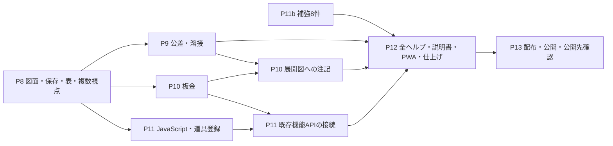

# PointerCAD 実装計画の索引

2026-09-10更新。計画の正式な置き場は **`docs/plans/`**。要件の正本は [requirements.md](../requirements.md)、規約は [CLAUDE.md](../../CLAUDE.md) と `rules/`。この索引は作業の順序と計画への入口を示し、規約を複製しない。

## P9〜P13の個別計画

利用者の指示により、P9〜P13の実装より先に個別計画を作成した。既存のP6・P8・P11bと同じ構成で、判断事項、実証、技術方式、変更範囲、番号付きタスク、依存、数値付き合格条件、画面・保存・Undo・出力・ヘルプ・検査、完了確認を定める。

| フェーズ | 個別計画 | 原計画ID | 件数 | 機能としてのまとまり |
|---|---|---|---:|---|
| P9 | [幾何公差と高度な図面](P9-幾何公差と高度な図面.md) | P9-1〜P9-20 | 20 | データム・14種類の公差・基本寸法・最大実体・溶接を含む製作指示付き図面 |
| P10 | [板金](P10-板金.md) | P10-1〜P10-25 | 25 | 基板・フランジ・曲げ・リリーフ・展開図・DXF/STEP受渡し |
| P11 | [拡張](P11-拡張.md) | P11-1〜P11-20 | 20 | 通信できないJavaScriptによる自動作図・道具登録 |
| P12 | [ヘルプと仕上げ](P12-ヘルプと仕上げ.md) | P12-1〜P12-30 | 30 | 操作案内/設定/履歴/比較15件、全説明書/PWA/仕上げ15件 |
| P13 | [公開](P13-公開.md) | P13-1〜P13-20 | 20 | 配布準備18件と、検査済みcommitの公開・公開先確認2件 |
| **合計** | | | **115** | 計画時の総数。現在の完了状態は進捗台帳を参照 |

[P11b-補強](P11b-補強.md) は別の既存計画で、**8件（1、2、3、4、5a、5b、5c、6）**。CAM受渡し、簡易強度計算、DWG案内、曲面強化を担当する。P9〜P13の115件には含めず、製品全体の552件には含める。旧計画にある当時の分母・旧モデル名・委譲表は履歴であり、現在の件数やサブエージェント使用の根拠にしない。

## 完成度の数え方

最新の確定件数は[進捗台帳](../progress.json)と[報告記録](../報告記録.md)を正とする。以下は計画作成時の基準 **412/552件（74.6%、残り140件）**。現在値と混同しない。

```text
305（P7以前の完了済み）
+ 53（P7）+ 71（P8）+ 8（P11b）+ 115（今回具体化したP9〜P13）
= 552件

計画作成時の残り = P8の17件 + P11bの8件 + P9〜P13の115件 = 140件
```

台帳の `futureEstimateTasks: 115` は今回の5計画に対応する既存枠であり、115件をさらに分母へ足さない。後続の実装で当該フェーズのIDを台帳の追跡対象へ移すときは、予定ID・見積もり枠・集計検査を同時に移し、二重計上がないことを検証する。計画作成時は分母552件と確定完了412件を変更していない。後続の実装完了は台帳へ反映する。

完了とするのは、各タスクの実装と合格条件、関連画面、保存、Undo、出力、ヘルプが揃い、必須検査とmain着地を確認した後。規格調査、ファイル数、検査数、追加の不具合修正だけを別の完成件数へ置き換えない。規格照合や実証を含むタスクも、製品に接続する契約と検証が完成して初めて閉じる。

## フェーズ間の依存と進め方



- P8の進行中の変更を保持して完成させる。各後続計画の接続先が未完成の場合は、既存ファイルがあるだけで着手条件成立としない。
- 依存がない計算や資料は順次進めてよい。サブエージェントは利用者の指示があるまで使わない。検査中に進める下書きは作業ツリー外に置く。
- コミットは原計画IDを10件以上、機能として区切りのよい範囲でまとめる。P11bの8件は、関連するP11の20件またはP12の最初の15件と合わせ、独立した8件実装コミットにしない。結合先の完了条件も満たす。
- P13の公開・公開先確認は検査済みcommitに対する運用作業。公開前に全機能を完成させ、公開後に予定機能の実装を残さない。公開結果だけの記録更新を少数件の実装コミットと混同しない。

## 共通の設計判断とレビューの引継ぎ

判断の履歴は [P9-P13-計画前の決定事項](P9-P13-計画前の決定事項.md)。各個別計画の§0で、確定契約、未実証API、利用者未決、例外を区別する。採用候補の追加依存・証明書・費用・公開先の権限を、決定済みと偽らない。

| 論点 | 担当・処理する時点 |
|---|---|
| 幾何公差/溶接の規格条項 | P9-1/14。JSA書誌の確認と個別条項/図示の照合を区別 |
| K係数の手動入力/製造条件表 | P10-2/10。既定値を全材料の正しい製造値と表示しない |
| JS VMの追加依存 | P11-1〜3。版/容量/制限/ライセンス/通信境界を具体化して採用判断 |
| P11bの材料・安全率・曲面の意味 | 既存P11bと事前決定事項§6。既定材料一覧を手入力だけで代替しない |
| 説明書の全機能・実画面・分冊 | 各機能で本文と画面を追加し、P12-16〜20で同じmanifestから全巻を生成/検査、P13-12/15で配布物を確認 |
| PWAの準備時点 | P12-21〜25。全資産検証後だけ準備完了。更新でdirty文書を失わない |
| OCCT配布サイズ | P13-3。圧縮配布は既存実装あり。新buildの全資産・全PDF巻で制限/復元を確認 |
| 署名・更新・公開権限 | P13-2/8〜11。必要な資格と費用は具体化して早期に確認 |
| READMEの差別化と実リンク | P13-13/14/20。公式比較根拠と実取得/閲覧/起動が一致 |

2026-09-09の[実装状態レビュー](../reviews/2026-09-09-実装状態レビュー.md)で妥当な指摘は、先行修正済み・作業中・未解決を区別する。R01〜R05/R08/R09の保存/数値/文書境界はP8の修正を継続し、後続の同じ入口へ回帰を適用する。R06/R07/R10の巨大入力/CRCは発見済みの残件として早く修正し、P12-26で全入口を確認する。R11/R15のCSP/権限/依存監視はP13-4/5/7、R12のFirefox/実DesktopはP12-27とP13-10、R13の検査中変更検出は現行ゲートを維持し、R14は各計画の責務分離で新たな集中を防ぐ。

## 計画の変更と抜けの防止

新しい後段作業は、個別計画のタスク一覧・本文・要件対応表へ同じIDで追加してから実装する。計画を新設/改名するときはこの索引を同時更新する。各計画の「実装/保存移行/Undo/派生cache/選択/各出力/エラー/性能/help/検査」の列を埋め、該当しない場合も理由を書く。

今回の確認対象は5計画の115個の一意ID、欠番なし、一覧と本文の一致、フェーズ内の依存の非循環、相対リンク先、要件対応表、将来枠115件との一致。合格条件の数値は計画上の目標であり、未実行の試験を合格済みとは記録しない。
