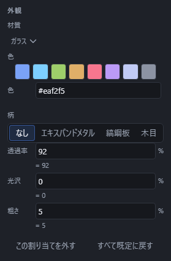

# ガラス・鏡と映り込み

透ける・映り込むといった、特別な見え方をする材質です。

## ガラスの透過率を数値で決める

材質で「ガラス」を選ぶと、その面は透けて向こう側が見えるようになります。「透過率」の数値(0〜100、式も打てます)を上げるほどよく透け、下げるほど不透明に近づきます。

透過率は、ガラス以外の材質でも個別に調整できます。金属のように透過率が 0 の材質へ数値を入れると、その分だけ透けて見えるようになります。

## 鏡

材質で「鏡」を選ぶと、固定された照明と周囲の環境を使って、鏡らしい光沢と反射を表現します。作図中のほかの部品や画面の内容が鏡面に映るわけではありません。

## 色を変えても計算はやり直されないので、すぐに見た目が変わる

色や材質、柄を変えても、立体の形そのものを作り直す計算は起きません。そのため、「材質」を選んだり「透過率」の数値を打ったりした瞬間に、待たされることなくその場で見た目が変わります。

## うまくいかないとき

うまくいかない理由や、出る文の一覧は色・材質と共通です。「色と材質を選ぶ」のヘルプを見てください。
