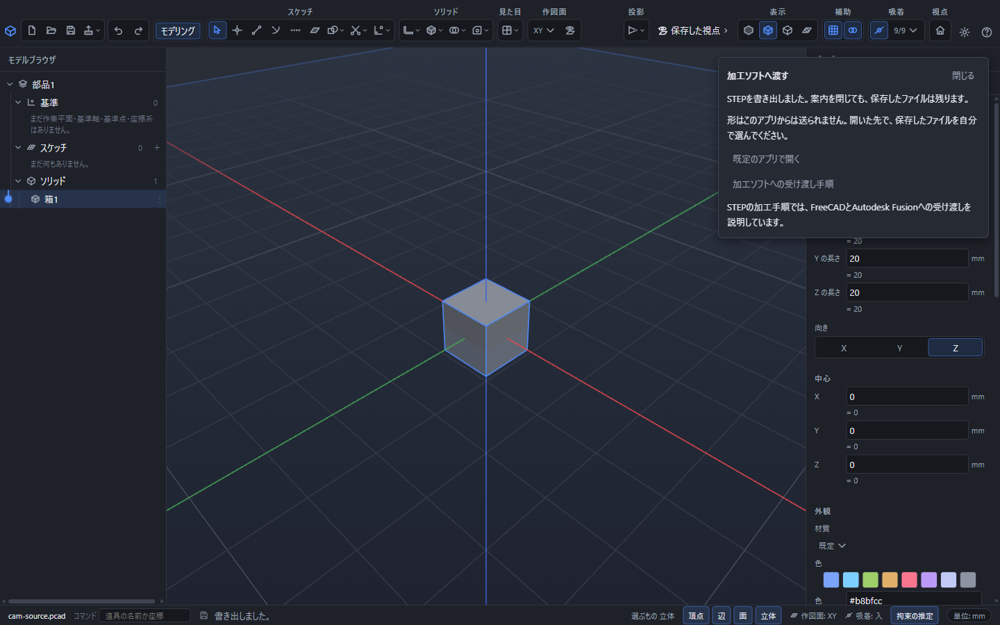
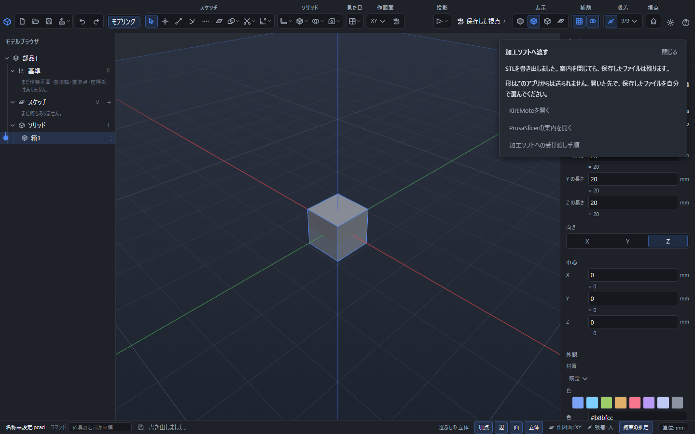

# 作った形を加工ソフトへ渡す

PointerCADで形を作り、加工機や3Dプリンターに合うソフトで加工条件を決めます。加工機へ渡す命令は、受け渡し先のソフトで作成します。

## 書き出してから加工先を選ぶ

1. 渡す立体を選び、「ファイルのほかの操作」→「書き出す」を開きます。
2. 切削加工へ正確な曲面を渡す場合は **STEP**、三角形の形を渡す場合は **STL**、3Dプリント用の形と色を渡す場合は **3MF** を選びます。STLに色は付きません。
3. 必要なら[3Dプリントの前の点検](print-check.md)を行い、保存します。
4. 保存成功後に「加工ソフトへ渡す」が表示されます。STEPでは加工手順、STL・3MFではKiri:MotoやPrusaSlicerの案内を開けます。
5. Desktop版で「既定のアプリで開く」を押すと、今保存したファイルを、この拡張子に関連付けたアプリで開きます。関連付けがない場合は、利用するアプリを自分で起動し、保存先からファイルを開いてください。

**押さなくても書き出しは完了しています。** 「閉じる」やEscで案内を閉じても、保存したファイルは残ります。別の書き出しを始めるか新規文書へ切り替えると、前の案内は消えます。

**形はこのアプリからは送られません。** Webサイトへのボタンは案内先を開きます。開いた先で、いま保存したファイルを自分で選んでください。ブラウザ版には「既定のアプリで開く」はありません。ダウンロードしたファイルを保存先から選びます。

## Kiri:Motoで加工する

1. PointerCADからSTLまたは3MFを書き出し、「Kiri:Motoを開く」を押します。STEPの場合は下のFreeCADまたはFusionの手順を使います。
2. Kiri:Motoでファイルを読み込み、切削ならCAM、熱溶解積層ならFDMなどの方式を選びます。
3. Arrangeで形の向きと位置を揃え、使用する装置・工具・材料と加工条件を指定します。
4. Sliceで加工経路を作り、Previewで形と加工順を確認し、Exportで装置用のファイルを書き出します。

ボタンの位置や方式ごとの設定は[Kiri:Moto公式の画面説明](https://docs.grid.space/kiri-moto/interface/)を参照してください。

## PrusaSlicerなどのスライサーで3Dプリントする

1. STLまたは3MFを書き出します。「PrusaSlicerの案内を開く」は[公式の入手ページ](https://www.prusa3d.com/p/prusaslicer/)を開きます。既にインストールしている場合は、PrusaSlicerを起動してください。
2. 保存したファイルをウィンドウへドラッグするか、「追加」から読み込みます。
3. プリンターの機種、材料、積層の細かさ、形の向き、支えの有無を設定します。
4. スライスし、プレビューで各層を確認して、プリンター用のファイルを書き出します。

手順と各版の画面は[PrusaSlicer公式の最初のプリント](https://help.prusa3d.com/article/first-print-with-prusaslicer-2-9_1753)にあります。手元の版に合う説明を選んでください。

## FreeCAD CAMで切削加工する

1. PointerCADでSTEPを書き出し、FreeCADでそのファイルを開きます。
2. CAMの作業画面で加工ジョブを作り、対象の立体、材料の大きさ、原点と加工方向を指定します。以前の版ではPathという名前です。
3. 工具と切込み量などを指定して、輪郭加工やポケット加工を作成します。
4. 加工経路を確認し、機械に合う出力方式を選んで機械用のファイルを書き出します。

[FreeCAD公式の機能紹介](https://www.freecad.org/features.php)、[輪郭加工の手順](https://github.com/FreeCAD/FreeCAD-documentation/blob/main/wiki/CAM_Profile.md)、[加工命令の書き出し](https://github.com/FreeCAD/FreeCAD-documentation/blob/main/wiki/CAM_Post.md)を参照してください。後者2つは公式の旧文書の保管版です。手元の版と項目名が異なる場合は、その版に付属するヘルプも確認してください。

## Autodesk Fusionの個人利用版で切削加工する

1. 利用条件を確認したうえで、PointerCADから書き出したSTEPをFusionで開きます。
2. 「製造」の作業画面で新しいセットアップを作り、対象の立体、材料の大きさ、原点と加工方向を指定します。
3. 利用できる加工方法から輪郭加工やポケット加工を選び、工具と加工条件を設定します。
4. 加工経路を確認し、機械に合う出力方式で加工命令を書き出します。

個人利用版には利用対象と機能の制限があります。[公式の利用条件](https://www.autodesk.com/solutions/free-cam-software)、[セットアップの作成](https://help.autodesk.com/view/fusion360/ENU/?guid=MFG-CREATE-SETUP)、[製造の流れ](https://help.autodesk.com/view/fusion360/ENU/?guid=GUID-BEC5DEA9-AC3E-4FA8-998E-4AE8CD0D0B1E)を確認してください。

どの加工先でも、形を読み込んだ後に寸法・単位・向き・原点を確認します。工具や機械に合う条件は受け渡し先で指定してください。
