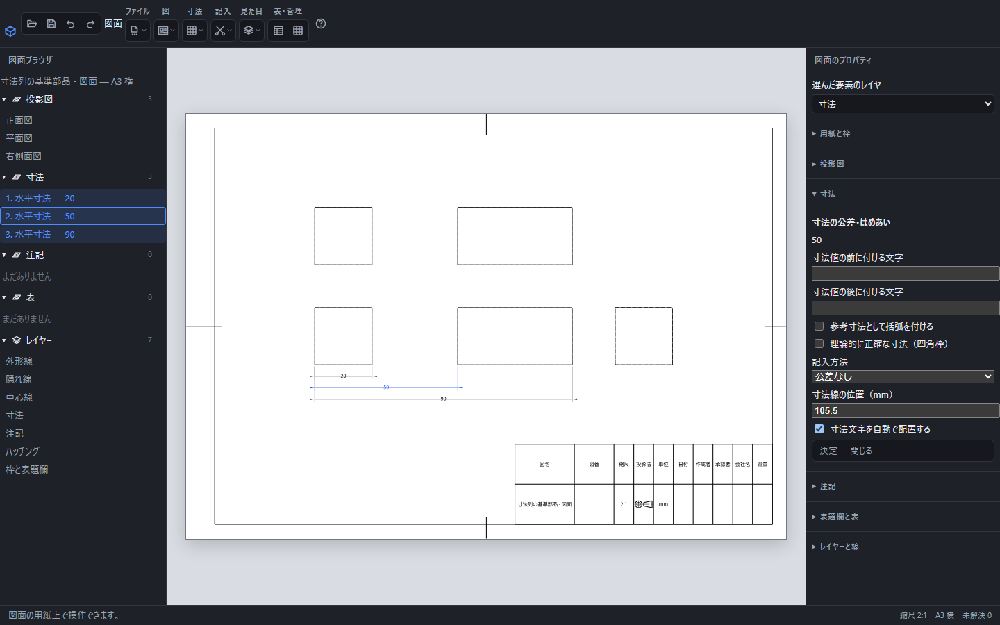

# 寸法線をまとめて整列する

左の図面ブラウザで、整列する長さ寸法をCtrlを押しながら2つ以上選び、「寸法」→「寸法を整列」を押します。水平・垂直・斜めの長さ寸法と厚さ寸法を整列できます。

共通の基準から20・50・90を記入して整列した画面。右側の「寸法線の位置」は、選択中の50の寸法線が通る用紙上の座標です。

## 整列の基準

同じ図で、寸法線の向きと対象に対する内外の側が同じものをまとめます。それぞれの組の最も内側の寸法線を基準に、用紙上で8mmずつ外へ並べます。異なる図や向きの寸法を同じ線へ移しません。測定値と参照先は変わりません。

寸法文字は実際の字体の幅・高さで調べ、既存の寸法文字と重ならない位置を探します。選んでいない寸法は移動しません。文字の位置を手動で指定した寸法も、寸法線と同じ移動量で動きます。

## 整列後の確認

移動後の用紙を確認してください。重なりが残る場合は画面下に件数が出ます。文字をドラッグするか、公差・文字位置の欄で置き直してください。自動の調整は既存の図・表・注記との接触や用紙の外へのはみ出しをすべて解消するものではありません。

参照切れの寸法や、角度・半径・弧長・座標・累進寸法が選択に含まれる場合は整列を確定せず、選び直す案内を出します。

整列全体は「元に戻す」1回で戻せます。すでに同じ配置の場合は履歴を増やしません。

[寸法の記入](dimension.md)・[公差と文字位置](dimension-tolerance.md)・[自動寸法](dimension-auto.md)
