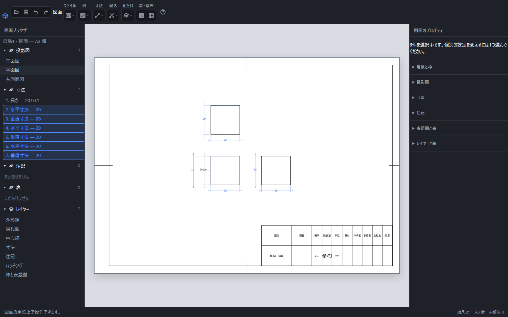

# 自動寸法を記入する

「寸法」→「自動寸法」を選ぶと、図面の投影図へ主要な寸法をまとめて記入します。元の形の計算と図の表示が終わってから実行してください。

手動の20±0.1を残して自動寸法6本を追加した画面。正面図の左側では文字どうしの間隔を取って配置し、追加した寸法を青く選択しています。

## 自動で記入する内容

- 外形の横幅と高さ。
- 投影図から元の辺を特定できる円の直径と円弧の半径。同じ径の穴は数量をまとめます。
- 穴の中心の位置。図の外形を基準に測り、同じ列に並ぶ穴はまとめます。

設計者の意図に応じた基準の選択や、すべての製造指示を自動で決める機能ではありません。結果を確認し、必要な寸法を手動で追加してください。

## 重なりと修正

記入時には、既存の手動寸法の文字と用紙上で2mm以上離れる位置を探します。自動で入った寸法も、手動の寸法と同じように選択・移動・削除できます。公差や補足も右側で編集できます。

十分な間隔を取れない寸法がある場合は、画面下に重なりが残る件数を表示します。寸法文字を移動するか図の配置を変え、隣の指示と区別できる位置に整えてください。

もう一度実行すると、自動寸法を作り直し、手動で作った寸法は残します。自動寸法へ加えた位置調整などは作り直しで置き換わるため、再実行の後に最終的な配置を整えてください。自動記入全体は「元に戻す」1回で戻ります。

字体や元の形を読み込めないときは理由が出て、途中の寸法だけを確定しません。

[手動寸法](dimension.md)・[公差とはめあい](dimension-tolerance.md)
