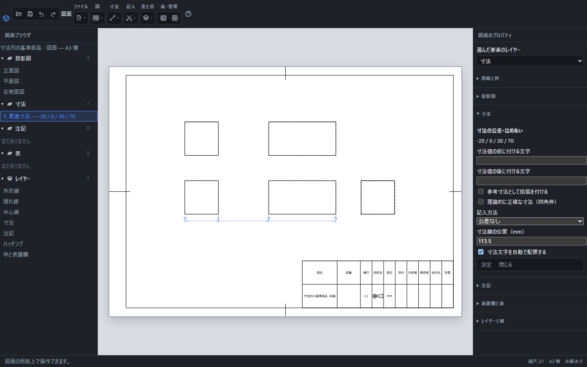

# 直列・並列・座標・累進の寸法をまとめて記入する

同じ図の頂点を順に選び、寸法をまとめて記入できます。値は元の3D形状から測り、形が変わると参照先から測り直します。

途中の点を0にした累進寸法。選択した4点に−20・0・30・70が並び、0の位置には基準を示す丸が付きます。

## 操作手順

1. 「寸法」から「直列寸法」「並列寸法」「座標寸法の列」「累進寸法」のいずれかを選びます。
2. 同じ図の頂点を順にクリックします。選んだ順に小円と番号が表示されます。Shiftを押し続ける必要はありません。同じ頂点をもう一度押すと選択から外れます。
3. 右側の「寸法」で選択点の数を確認します。水平・垂直、基準点、対象からの間隔を指定します。
4. 「決定」または用紙に焦点がある状態でEnterを押します。全体を一度で作成します。

先に頂点をShiftで複数選んでから、寸法の方式を選ぶこともできます。Escまたは「閉じる」で入力を中止すると、文書と履歴は増えません。

## 方式の違い

| 方式 | 測定・配置 | Xが0・20・50・90の4点を選んだ例 |
| --- | --- | --- |
| 直列寸法 | 選択順で隣り合う点を測り、同じ寸法線の位置に配置 | 20・30・40 |
| 並列寸法 | 指定した基準から各点まで測り、用紙上で8mmずつずらす | 先頭を基準に20・50・90 |
| 座標寸法の列 | 基準からの符号付きX・Yを各点の脇に記す | 基準はX: 0 / Y: 0、各点にX: 20など |
| 累進寸法 | 1本の線に各点の目盛り・矢印・数値を記す | 0・20・50・90。基準には小円 |

座標と累進では、基準の反対側にある点の値は負になります。直列と並列の長さは正の値です。水平・垂直は各図の向きを基準にし、用紙の縮尺では値を変えません。

「対象からの間隔」は用紙上のmmです。選んだ点が図の中心のどちら側にあるかに応じて外向きに配置し、並列寸法は同じ側へ8mmずつ離します。作成後は文字をドラッグするか、寸法のプロパティで配置を調整できます。

## 修正と保存

作成全体は「元に戻す」1回で戻ります。直列・並列・座標はそれぞれの寸法を個別に編集・削除できます。累進は1つの寸法として選択・移動・削除します。累進の公差・前後文字・参考括弧は各目盛りに適用されます。

元の頂点が特定できなくなった場合は「？」で知らせ、別の頂点へ勝手に付け直しません。測定値は手入力せず、元の部品で変更してください。図面ファイルへ保存すると対象の参照と配置が残ります。

異なる図の点を混ぜたり、頂点以外をクリックしたりした場合は理由を表示します。水平・垂直に見た両端が重なる区間は長さ寸法を作れません。選択を見直してください。

[寸法の基本](dimension.md)・[寸法線の整列](dimension-arrange.md)・[公差と文字位置](dimension-tolerance.md)
