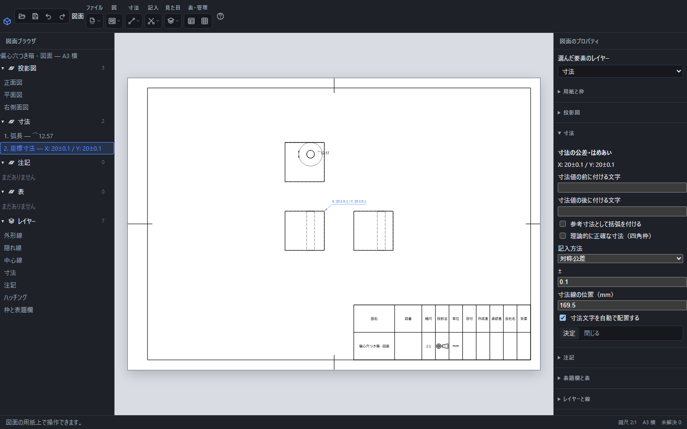

# 寸法の公差・はめあいを指定する

図面上の寸法文字、または左の「寸法」の行を選びます。右側の「寸法の公差・はめあい」で「記入方法」を選び、値を入力して「決定」を押します。

座標寸法を選び、「記入方法」を「対称公差」にして0.1を入力した例。XとYの両方に±0.1が付き、実寸20は変わりません。

## 記入方法

| 方法 | 入力 | 例 |
| --- | --- | --- |
| なし | 追加の値は不要 | 20 |
| 対称公差 | 0以上の許容差 | 20±0.1 |
| 上下の許容差 | 上側と下側の偏差 | 上側+0.1、下側−0.05 |
| はめあい | 用意された記号 | φ10H7 |

許容差には数値だけでなく、図面のパラメータを参照する式も入力できます。上下の許容差は、上側を下側より大きくします。対称公差へ負の値は使えません。式を評価できない場合は確定されません。

上下の許容差は通常の寸法では上下2段で示します。座標寸法ではX・Yの各成分へ同じ許容差を付け、どちらの成分に適用されるかを明示します。

## はめあい記号

呼び寸法1〜500mmの範囲で、H6・H7・H8・H9、g6・h6・h7・f7・e8、p6・n6・m6・k6・js6を選べます。大文字と小文字は別の記号です。呼び寸法が変わると、対応する許容差も引き直します。

「許容差を併記する」で、記号と上下偏差を一緒に表示できます。はめあいは長さ・直径の寸法へ使います。範囲外の寸法や未対応の記号は、数値を推定して埋めずに確定を断ります。

## 参考寸法と補足

同じ欄で、参考寸法の括弧、寸法値の前後の文字、寸法線と文字の位置を設定できます。「決定」でまとめて確定し、「元に戻す」1回で戻ります。編集中の文字を確定せず戻るときは「閉じる」です。

用紙全体に普通公差を記す場合は、右の「用紙と枠」の「普通公差の指定」を設定します。個々の寸法の許容差とは別の指定です。

[手動寸法](dimension.md)・[用紙と縮尺](drawing-scale.md)
