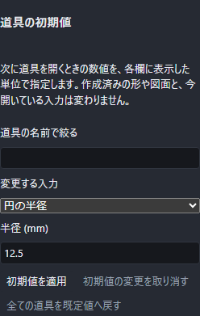
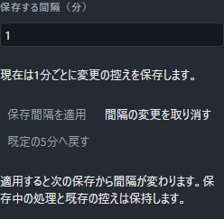

# 画面の見た目を変える

画面のいちばん上、右端にある歯車のボタンを押すと「表示設定」が開きます。ここで画面全体の配色と、文字やボタンの大きさを変えられます。

開いている間も、うしろで作図したり視点を動かしたりできます。閉じるときは Esc キーを押すか、設定の外側をクリックしてください。

## 配色を選ぶ(テーマ)

5 種類の中から選べます。見本を押すと、その場ですぐ切り替わります。アプリを開き直す必要はありません。

| 名前 | 見た目 |
|---|---|
| ダーク | 暗い下地に明るい文字。最初はこれです |
| ライト | 明るい下地に暗い文字 |
| ダークモダン | ダークと同じ暗さで、角の丸みを大きく、余白を広く、区画をうっすら浮かせます |
| ライトモダン | ライトと同じ明るさで、丸みと余白はダークモダンと同じです |
| モダン | 中間の明るさの灰色を下地にした配色。丸みと余白はモダンの 2 つと同じです |

見本は画面の縮図になっていて、上の帯・左右の区画・3D の表示部が、そのテーマの色でそのまま描かれています。いま使っているものは青い枠で囲まれます。

3D の表示部の中(方眼、XYZ の軸、かいた点や線、立体、指した色や選んだ色)も一緒に変わります。明るい配色では方眼と線が濃くなり、暗い配色では薄くなるので、どちらでも見やすさは変わりません。

キーボードだけでも選べます。Tab キーで見本まで進み、矢印キーで隣の見本へ移ると、移ったところで切り替わります。

## 大きさを変える(拡大率)

文字とボタンの大きさを 90% から 150% までの 5 段から選べます。押すとすぐに変わります。画面が小さくて字が読みにくいときは大きく、たくさん並べて見たいときは小さくしてください。

大きくすると、画面の上のボタンの並びが 2 段になることがあります。窓の横幅を広げると 1 段に戻ります。

## 道具の初期値を変える

「{{ui:settings.toolDefaults.title}}」では、新しく道具を開いたときに数値欄へ入る式を変えられます。検索で道具を絞り、一覧から入力段階を選んで値を直し、「{{ui:settings.toolDefaults.apply}}」を押してください。長さは mm、角度は度、個数は整数で指定します。`12.5` のような数のほか、`板厚 * 2` のような現在の部品のパラメータ式や、`rad(pi/2)` のような式も使えます。

点を置く道具には、絶対座標、相対座標、極座標ごとに別の初期値があります。たとえば絶対座標の X を変えても、相対座標の ΔX や極座標の距離は変わりません。

適用した値は、その後に新しく開く道具から使われます。すでに開いている道具は、開いたときの初期値を最後の入力段階まで保ちます。途中で選択肢を変えて新しい欄が現れたときも同じです。入力した値や、画面をクリックして決めた点を初期値で上書きすることはありません。すでに作った形、部品の再計算、Undo の履歴も変わりません。

画面表示を inch にしていても、この設定の長さは mm です。道具を開いた後に手入力する長さは、これまでどおり画面表示の単位で解釈されます。角度は度で、ラジアンを使うときは `rad(...)` と書きます。

「{{ui:settings.toolDefaults.cancel}}」は適用前の編集を捨てます。「{{ui:settings.toolDefaults.reset}}」は全項目を製品の初期値へ戻す準備をするので、続けて「{{ui:settings.toolDefaults.apply}}」を押してください。適用した内容は使っている端末に保存されます。

部品をひな形として保存すると、押し出し距離、穴径、R面取り半径、面取り距離、円の半径の5項目が式のままひな形へ入ります。ひな形から新しい部品を始めると、その5項目が端末の設定へ戻ります。ひな形のパラメータを使った式は、そのひな形の部品で計算できることを確認してから反映します。

板金では、板厚、内半径、K係数、フランジの長さと角度、開始・終了オフセット、曲げリリーフの位置・幅・深さの10項目を変えられます。新しい板金道具を開いたときだけ使います。既存の板金を編集するときは保存済みの式を保ちます。フランジと指定線曲げの内半径・K係数は、上書きを切っている間はこれまでどおり基板の値を継承し、上書きを新しく入れたときに初期値を使います。

板金の長さ欄は、初期値が入った段階ではその値の単位 mm を表示します。欄を手で書き換えると、現在選んでいる表示単位での入力へ切り替わります。式に `mm` や `in` を直接書けば、その単位を使います。

図面では、注記と記号の文字高、表面の粗さ、公差の値、溶接の大きさ、表の行の高さと文字高、線の太さ、寸法列の間隔を設定できます。紙上の長さはmm、粗さはμmです。図面を開いて設定する式には、その図面で定義したパラメータを使います。文字高などの書式は計算した数値で、粗さ・公差・溶接の大きさは元の式で入力欄へ入ります。

作成済みの注記、記号、表、レイヤーを編集する場合は保存済みの値を優先します。表の文字高を設定していない場合は、その図面やひな形の文字高を引き継ぎます。入力画面を開いた後に設定を変えても、入力中の値は変わりません。

## 選んだ内容の残りかた

選んだ配色と大きさ、道具の初期値は、**使っている端末に保存され**、次に開いたときも同じ設定で始まります。**部品のファイルには入りません**。ただし、ひな形へ保存する5項目は、ひな形から始めたときに同じ初期値を復元するため、ひな形の内容に含まれます。

図面の印刷や書き出しの見た目は、ここで選んだ配色の影響を受けません。

## 自動保存の間隔を変える

「表示設定」の下にある「{{ui:settings.autoSave.title}}」で、作業の控えを残す間隔を1～60分の整数で指定できます。最初は5分です。「{{ui:settings.autoSave.minutes}}」を入力して「{{ui:settings.autoSave.apply}}」を押してください。「現在は○分ごと」の表示で適用済みの間隔が分かります。

入力中はまだ間隔は変わりません。「{{ui:settings.autoSave.cancel}}」や、設定を閉じる操作で入力を取り消せます。「{{ui:settings.autoSave.defaults}}」は入力欄を5へ戻すので、変更する場合は続けて「{{ui:settings.autoSave.apply}}」を押します。0、小数、60を超える数、数字以外の文字は受け付けません。

適用すると、その時点から新しい間隔で次の自動保存を待ちます。既に始まっている保存と、前回の控えは残ります。同じ間隔を再通知したり、配色を変えたりしても、次の保存を先送りしません。変更がない文書は書き直しません。保存に失敗した場合も前回の控えは残り、次の周期に編集内容の保存を再試行します。

この間隔は端末に残り、アプリを開き直した後の部品・組立・図面に使います。部品の形、寸法、式や保存ファイルの内容は変わりません。設定の入力欄でF1を押すと、この説明が開きます。

拡大率を上げて設定が縦に長くなったときは、設定の中を上下にスクロールして入力欄とボタンへ移動できます。
