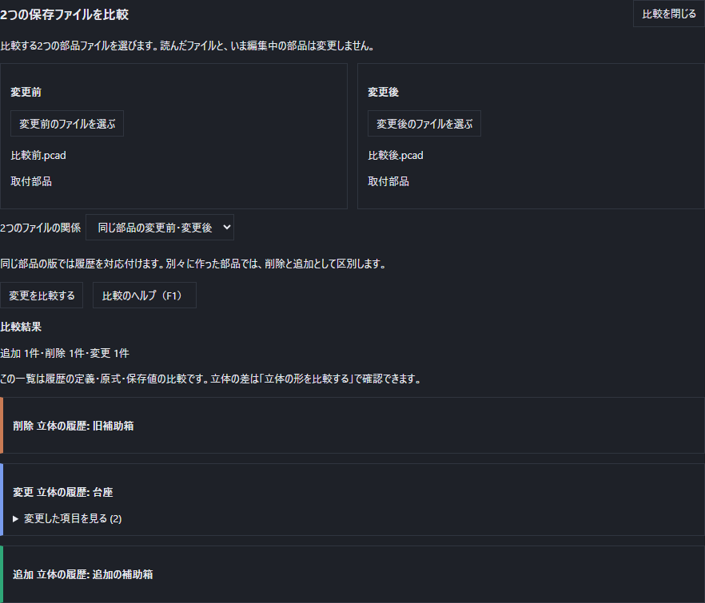
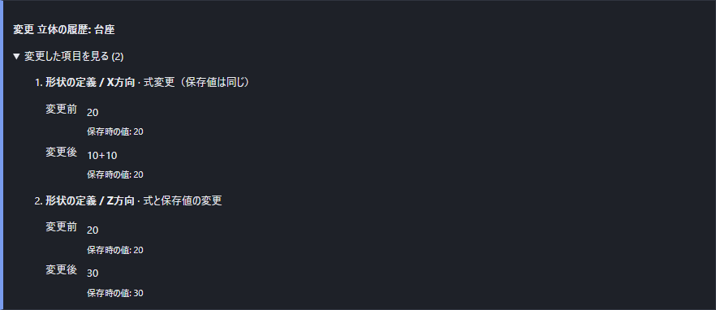
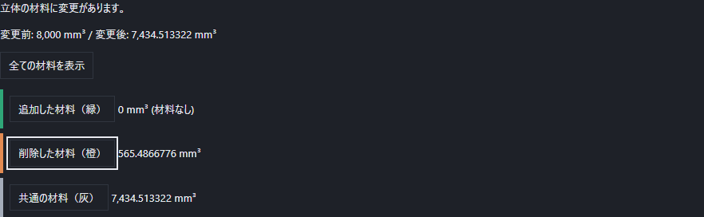
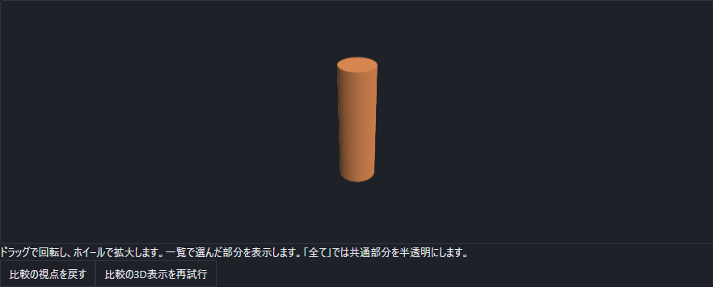

# 2つの保存ファイルの変更を比較する

変更前と変更後の部品を別々に保存してあるとき、追加した図形、消した図形、寸法や式、抑制、メモの変更を一覧で確認できます。比較中も、選んだファイルと現在編集中の文書は変更しません。

## 2つのファイルを選ぶ

1. 部品の「ファイルのほかの操作」から**{{ui:documentDiff.title}}**を選びます。
2. **{{ui:documentDiff.pick.before}}**で、変更する前の`.pcad`を選びます。
3. **{{ui:documentDiff.pick.after}}**で、変更した後の`.pcad`を選びます。表示されたファイル名と部品名を確認してください。
4. **{{ui:documentDiff.relationship}}**を選びます。同じ部品から保存した版なら**{{ui:documentDiff.versions}}**、別々に新規作成した部品なら**{{ui:documentDiff.unrelated}}**です。
5. **{{ui:documentDiff.compare}}**を押します。

同じ部品の版では、図形の種類と所属を含む識別子から履歴を対応付けます。名前が同じという理由だけで別の図形を結び付けません。別々の部品は変更前側の削除と変更後側の追加として表示します。ファイルを選び直した場合は、関係ももう一度選んでください。

## 変更を見る

「追加」「削除」「変更」の文字と色で種類を区別します。**{{ui:documentDiff.details}}**を開くと、対象の項目について変更前と変更後を並べて読めます。50件を超える場合はページを切り替えます。比較しきれない一部だけの結果を、すべて確認済みの結果として表示しません。

例えば、箱のX方向の式を`20`から`10+10`へ変更すると、保存時の値が同じ20でも式の変更として残ります。原式が同じで保存値だけが違う場合は、その違いを別の表示にします。丸めた表示文字の違いだけでは変更としません。構造化した数式の定義も比較します。

抑制、名前付き数値、構成、設計メモ、フォルダ、選択セット、下絵、外観なども比較します。新しい図形を途中へ追加しただけでは、後続のすべてを「順序変更」にしません。取り込んだ形状や画像の内容が変わったときも、添付の変更として残します。

この一覧は保存された定義と値の比較です。原式が等価か、同じ立体になったかを、保存値の一致だけで保証する表示ではありません。

## 立体の形を比較する

定義の変更一覧の下で**{{ui:materialDiff.start}}**を押すと、2つのファイルを独立して再計算し、追加・削除・共通の材料と体積を求めます。対象は閉じた立体です。開いた面を含む部品、形を再計算できない部品では理由を表示し、不完全な形を比較済みとして扱いません。両方に立体が無いときも、そのことを明示します。

モデルの座標を基準にします。離れた位置の部品を自動で重ねたり、同じ名前を理由に位置合わせしたりしません。重なった複数のボディは同じ材料としてまとめて比較するため、体積を二重に数えません。

「{{ui:materialDiff.region.added}}」「{{ui:materialDiff.region.removed}}」「{{ui:materialDiff.region.common}}」にはそれぞれの体積をmm³で表示します。一覧のボタンを押すと、その材料だけを3D表示します。「{{ui:materialDiff.all}}」は共通部分を半透明にし、追加・削除された部分と一緒に確認できます。色に加えて文字と数値でも種類を示します。

例えば20mm角の箱に直径6mmの貫通穴を1本追加すると、削除した材料は円柱になり、体積は`π×3²×20 ≈ 565.4867 mm³`です。箱の残りが共通の材料になります。

ドラッグで回転、ホイールで拡大できます。**{{ui:materialDiff.resetView}}**で見やすい初期の向きへ戻します。表示処理を開始できない場合も、計算済みの体積と一覧は残ります。**{{ui:materialDiff.retryDisplay}}**で3D表示だけをやり直せます。

計算が長いときは**{{ui:materialDiff.cancel}}**で終了できます。最長3分で終了し、部分的な結果を表示しません。比較の中止や計算の失敗でも、先に表示した定義の変更一覧、選択済みファイル、現在の文書は保持します。別のファイルの選択を確定したときや比較画面を閉じたときにも、実行中の形状比較を終了します。

## 取消とファイルの保全

ファイル選択を取り消しても、選び終えた側は保持します。壊れたファイルは理由を表示し、前に選んだ正常なファイルを置き換えません。処理中の**{{ui:documentDiff.cancel}}**は、その比較処理を止めます。選択済みのファイルから再実行できます。**{{ui:documentDiff.close}}**またはEscで比較画面を閉じます。

比較は文書の編集に加わらないので、「元に戻す」の回数を消費しません。上書き保存先と自動保存の文書も変更しません。元ファイルを直す操作はこの画面にはありません。F1または**{{ui:documentDiff.help}}**でこの説明を開けます。

## 大きさの上限と失敗した場合

2つの文書を同時に保持するため、比較用の入力は1ファイル32MiB以下、展開後は1項目32MiB・1ファイル合計64MiBまでです。通常の「開く」とは上限が異なります。定義の差分は10,000件まで、定義の比較は最長2分、形の比較は最長3分で終了します。形の比較は各ファイル1,024ボディまで、結果の三角形は全領域で200万枚までです。上限を超えたときは、入力を小さくした別の部品ファイルで確認してください。

読込みや比較の途中でエラーになったときは、理由を確認して再実行してください。
