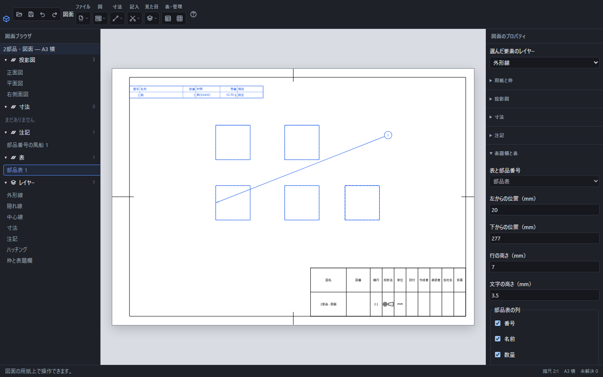

# 図面に部品表と部品番号を置く

組み立ての図面に、配置した部品から集計した一覧と部品番号を記入します。部品の図面では部品表を使えません。

同じ箱を2個置いた組図。部品表は数量2を集計し、表の行を選ぶと対応する箱と番号1の風船が青くなります。

## 部品表を配置する

1. 組み立てから作った図面で、上の「部品表」を押します。
2. 右側で、用紙の左・下からの位置、行の高さ、文字の高さをmmで入力します。
3. 「部品表の列」で必要な列を選びます。番号・名前・個数・材質・質量に加え、構成名も表示できます。
4. 「表を配置」を押します。

部品表の数値は元の組み立てから集計します。同じ形でも、構成が違う部品は区別します。材質や形が不足して質量を求められない場合は、0と表示しません。元の部品や組み立ての情報を修正してください。

## 列と行を整える

列名の横の矢印で列の順を変えます。列幅はmmで指定し、空欄では既定の幅を使います。「行の順番」で上から下・下から上を選びます。

「並べ替える項目」では番号・名前・個数・質量を選べます。「大きい順・逆順に並べる」で逆順にします。表示する行を並べ替えても、その部品に対応する風船番号は保ちます。

配置済みの表を選ぶと同じ欄で編集できます。「表を更新」で確定します。表が用紙内に収まらない場合は、画面下の理由に従って位置・列幅・文字の高さを調整してください。

## 部品番号の風船を置く

「表題欄と表」を開き、「部品番号の風船」を押します。図の部品の辺または面を選び、続けて番号を置く位置をクリックします。先に部品の辺を選んでから道具を押しても置けます。

辺を指す引出線の先端は矢印、面を指す先端は黒丸です。同じ部品の別の場所へ同じ番号を置くこともできます。番号を手入力して別の部品へ付け替える操作ではありません。番号は対応する部品の情報に追従します。

## 対応を確認する・移動する・削除する

部品表の行を押すと、対応する図の部品と風船を強調します。表や風船はドラッグで移動できます。風船は選択後の右側で位置を数値入力して「決定」することもできます。

「選んだ表・風船を削除」は明示的に選択した表や風船を削除します。表の行を押して対応表示された風船は、表と一緒には削除されません。追加・変更・移動・削除は「元に戻す」で戻せます。

編集を続けるときは.pcaddで保存します。配布するときは、元の部品が正しく読み込まれていることを確認してPDFなどへ書き出します。

[組み立ての部品表](bom.md)・[穴表と改訂欄](drawing-table.md)・[図面の保存と出力](drawing-export.md)
