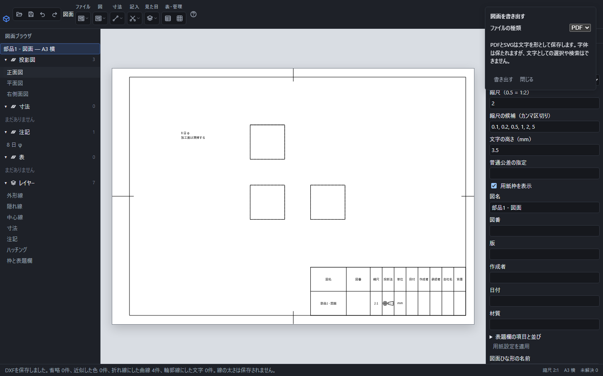

# 図面を保存・書き出し・印刷する

編集を続けるための保存は.pcadd、配布や印刷にはPDF・SVG・画像などを使います。PDFや画像へ書き出しても、編集できる図面の保存は行われません。

「ファイル」→「図面を書き出す」でPDFを選んだ画面。形式ごとの説明を読み、「書き出す」で保存先を指定します。

## 編集できる図面を保存する

上の保存ボタンまたはCtrl+Sで.pcaddを保存します。「ファイル」→「名前を付けて保存」、またはCtrl+Shift+Sで別のファイルへ保存します。図名や式を入力する欄に焦点があっても保存できます。

.pcaddには用紙・図・寸法・注記・表・参照する部品の情報を保存します。「開く」で選ぶと、元の情報から投影や表を作り直します。保存結果や失敗した理由は画面下に表示されます。

## 配布する形式を選ぶ

「ファイル」→「図面を書き出す」で形式を選び、「書き出す」を押します。SVGは「ファイル」→「SVGで書き出す」から保存します。

| 形式 | 用途と違い |
|---|---|
| PDF | 用紙の実寸を保ち、線と文字を拡大しても滑らかに表示できます。 |
| SVG | Web掲載や画像編集に使うベクトル画像です。 |
| PNG | 白い背景で図面を画像として貼り付けます。 |
| JPG | 白い背景の圧縮画像として保存します。 |
| DXF | 他のCADへ線・文字・レイヤーを渡します。R12形式です。 |

PDFとSVGの文字は輪郭で保存するため、同じ字体がなくても表示できますが、文字として検索・選択はできません。PNG/JPGは150・300・600dpiから選びます。大きすぎる画像は理由を表示して断るので、解像度を下げてください。

DXFは線幅を保存せず、色を近い基本色へ変換します。一部の曲線は折れ線です。寸法は線と文字として渡し、受け取るCADの編集可能な寸法要素にはしません。保存後に近似・省略の案内を確認してください。

幾何公差・データム・溶接記号と、それらが参照するサイズ寸法・理論的に正確な寸法の文字は、DXFでも字体に依存しない閉じた輪郭線として保存します。受け取るCADでは文字として編集できず、文字の内部は塗りつぶしません。塗りつぶした字体で配布・印刷する場合はPDFを使ってください。

## 印刷する

「ファイル」→「図面を印刷」を選びます。デスクトップ版では部数を1〜999の整数で指定できます。Web版では印刷画面側で部数を設定します。用紙・向き・100%倍率を印刷画面でも確認してください。

## 部品へ戻る

「ファイル」→「部品へ戻る」で図面を閉じます。未保存の変更がある場合は確認します。変更を残して編集を続ける場合はキャンセルしてください。書き出し先は部品の保存先とは別に扱います。
