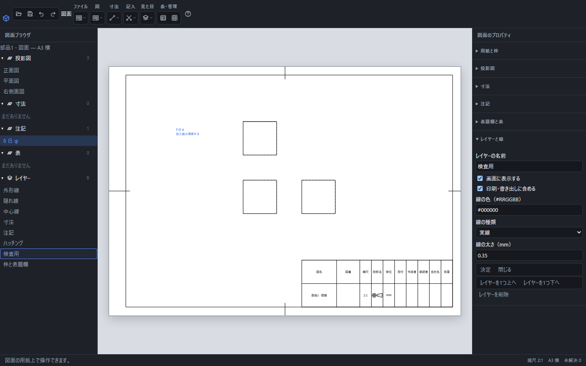

# レイヤーで色・線・表示・印刷を管理する

図面の線や寸法、注記、表はレイヤーに属します。既定では外形線・隠れ線・中心線・寸法・注記・ハッチング・枠と表題欄が用意されています。

検査用レイヤーを選んだ画面。右側の「画面に表示する」と「印刷・書き出しに含める」を個別に設定し、下の「決定」で適用します。

## レイヤーを設定する

左の「レイヤー」で名前を選ぶと、右の「レイヤーと線」に設定が開きます。名前、線の色、種類、太さを変えて「決定」を押します。色は#123456形式、太さはmm単位の正の数です。空の名前や重複した名前では確定できません。

「画面に表示する」と「印刷・書き出しに含める」は別々に設定できます。作業用の注記だけを配布用PDFから外したい場合は、画面表示を残し、印刷・書き出しを外します。

図そのもののレイヤーを非表示にすると、その図の中心線・隠れ線・ハッチも表示しません。中心線やハッチだけを変える場合は、それぞれの専用レイヤーを設定します。表示中の図の細い破断線は、図の一部として扱います。

## 要素を別のレイヤーへ移す

図・寸法・注記・表・風船を1つ選び、右の「選んだ要素のレイヤー」で移動先を選びます。移動先の設定が適用されます。個別に指定した色や線幅がある場合は、その指定が優先します。

## 追加・順序・削除

「見た目」→「レイヤー」で追加欄を開きます。選んだレイヤーは1つ上・下へ移動できます。削除時は含まれる要素数を確認し、要素と一緒に削除するか判断します。最後のレイヤーは削除できません。

追加、設定変更、所属変更、順序変更、削除は「元に戻す」で1操作ずつ戻せます。入力中の中止は「閉じる」またはEscです。
