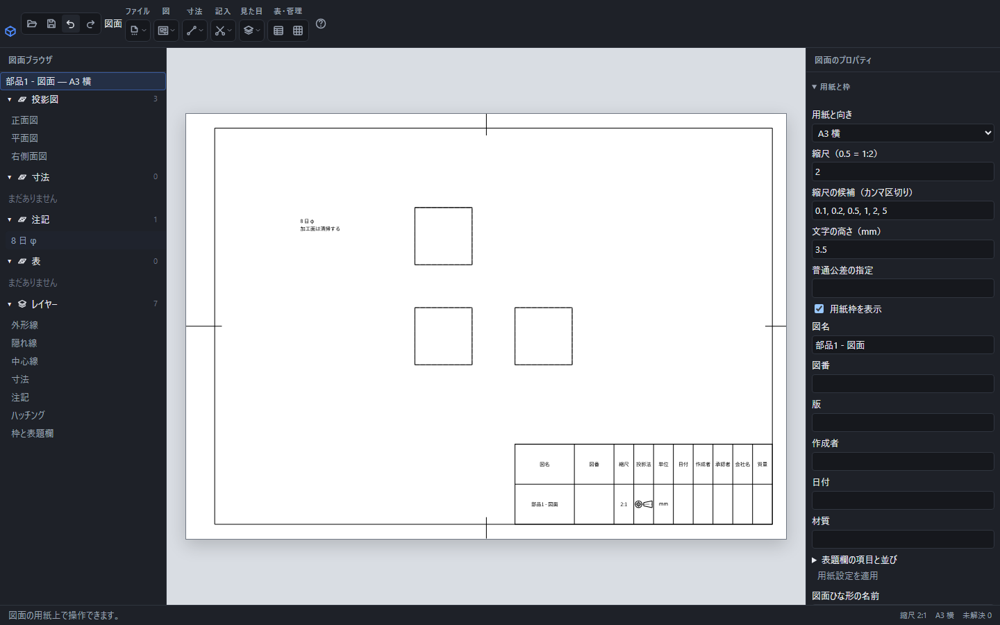

# 文字注記と引出線

図面へ自由な文章や補足説明を置けます。文字を変更しても部品の形は変わりません。形状から値が決まる加工注記は[表面性状と加工注記](surface-finish.md)で扱います。

「8 日 φ」と「加工面は清掃する」を2行の文字注記として置いた画面。改行と記号は保存して開き直しても残ります。

## 文章を置く

1. 「記入」→「文字注記」を選びます。
2. 用紙の置きたい位置をクリックします。
3. 「注記の文章」に文章を入力し、文字高さと位置を指定します。
4. 引出線を付ける場合は先端の位置を指定して「決定」を押します。

文字の高さと位置は用紙上のmmです。日本語と図面用の記号を使えます。改行も保持します。字体で表示できない文字がある場合は、表示された案内を確認してください。

## 編集と移動

左の「注記」の行、または用紙上の文字を選ぶと編集欄が開きます。文章・文字高さ・位置をまとめて変更できます。用紙上でドラッグして移動することもできます。「元に戻す」は追加・編集・移動を1操作ずつ戻します。

選んだ注記はDeleteで削除できます。編集中の文章を取り消す場合は「閉じる」またはEscを使います。文字を入力中のDeleteは文字を消す操作です。

## 配布する

.pcaddに保存すると、文章として再編集できます。PDF・SVGでは文字の形を保存するため、受け取る人に同じ字体がなくても表示できます。輪郭で保存された文字は文字検索できません。DXFでは開くCAD側の字体設定で見え方が変わります。
