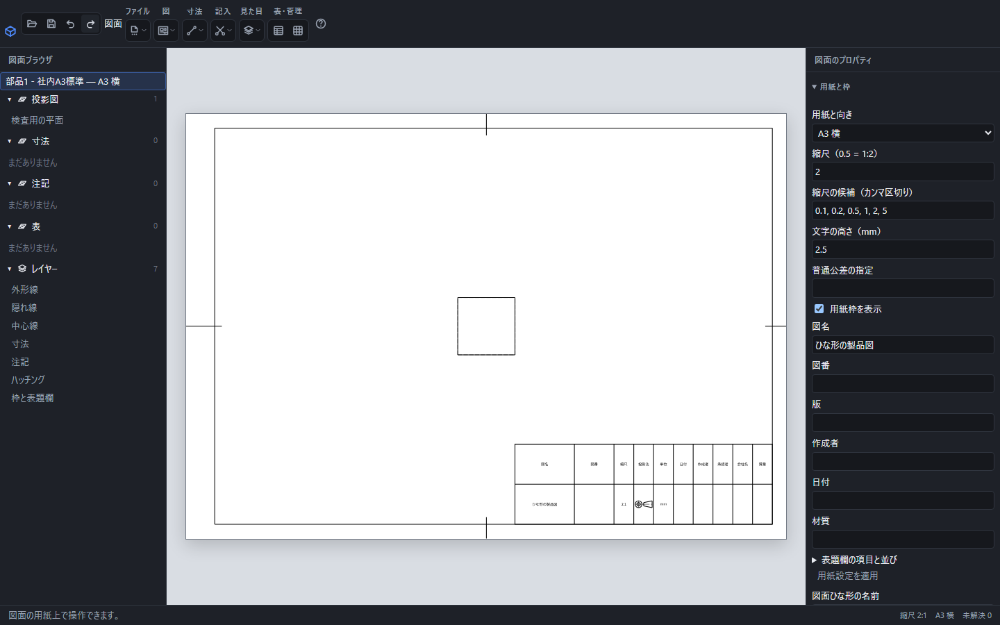

# 用紙サイズ・縮尺・用紙位置

図面には「実際の形の寸法」と「用紙上の長さ」があります。縮尺を変えても寸法の数値は実寸を表します。用紙の位置、文字高さ、線の太さは用紙上のmmです。

用紙設定と保存したひな形を適用した画面。用紙の縮尺2は2:1の拡大表示で、表題欄にも2:1を表示します。

## 用紙の設定

「見た目」→「用紙と枠」、または右側の同名の見出しから設定します。用紙サイズ・向き・縮尺・枠・普通公差・表題欄を編集し、「用紙設定を適用」を押します。変更はまとめて1回のUndo対象になります。

用紙上のX・Y位置は左下が原点です。図の位置は図の中心を表します。表は左下の位置など、欄に記載された基準に従います。図の中心を用紙の内枠の外へ置くことはできません。

## 縮尺の入力例

| 入力 | 比率 | 実寸20mmの表示 |
|---|---|---|
| 0.5 | 1:2 | 用紙上10mm |
| 1 | 1:1 | 用紙上20mm |
| 2 | 2:1 | 用紙上40mm |

図を選び「図の縮尺」に入力すると、その図だけに適用します。空欄なら用紙の設定を使います。詳細図には拡大する縮尺を明示します。0・負の数・解けない式は使えません。

画面下の縮尺は、図を1つ選ぶとその図の値、それ以外は用紙の値を示します。マウスを重ねると対象を確認できます。「—」は計算待ちです。隣に用紙サイズと、参照や指定を解決できない寸法・データム・幾何公差・溶接記号の合計件数が出ます。

## 印刷時に実寸を保つ

「ファイル」→「図面を印刷」を使い、印刷画面でも用紙サイズと向きを合わせます。倍率100%を選び、用紙に合わせる拡大縮小を解除します。プリンターごとの余白で端が出ない場合があるため、必要に応じてPDFを保存してから印刷します。

部品を大きく見たいだけの場合は図の縮尺を変えます。実際の寸法を変える場合は元の部品の式や寸法を編集してください。
