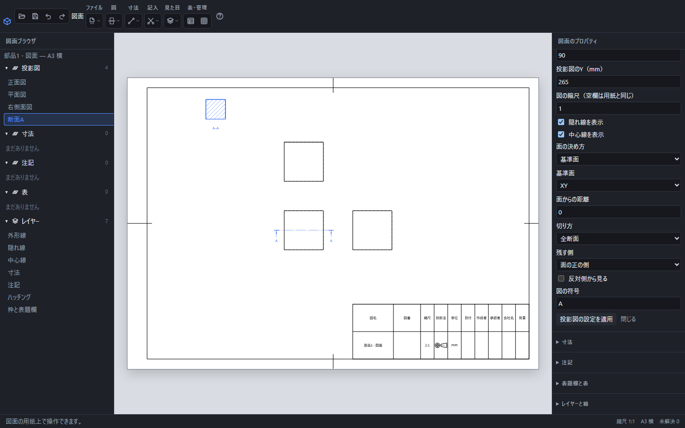

# 断面図で部品の内部を示す

断面図は指定した面で形を切り、残した形と切り口を表示します。切り口のハッチングは材料のある範囲に入り、穴の内部には入りません。元の部品の体積や形は変わりません。

XY基準面・距離0の全断面。左上のA–Aに切り口のハッチング、もとの正面図に切断線が表示されています。右側で残す側と符号を編集します。

## 全断面を作る

1. 図面の「図」→「断面図」を開きます。
2. 「面の決め方」を選びます。まず「基準面」でXY・XZ・YZを選び、「面からの距離」を入力すると分かりやすく指定できます。
3. 「切り方」を「全断面」にし、面の正の側または負の側を残します。
4. 図の名前・符号・用紙位置・縮尺を入力し、「投影図を追加」を押します。

切り口ができない位置では追加後の計算に理由が表示されます。面の距離を部品の内部へ変更してください。「反対側から見る」は見る向きを反転する設定です。残す側を変える設定とは別で、材料の裏側から見て隠れた切り口を透かして表示するものではありません。

## 面・3点・図上の線を使う

平らな面または3点を使う場合は、道具を開く前に図上で対象を選びます。複数選択にはShiftを使います。点が重なる・一直線に並ぶと、面の向きが決まりません。「図上の切断線」では、もとの図と線の2端点を指定します。端点の座標はその図の中心を基準にした実寸です。

## 切り方の違い

| 切り方 | 表示する範囲と入力 |
|---|---|
| 全断面 | 指定した面の手前を全体から取り除きます。 |
| 半断面 | 2点で境界線を指定し、その線の左側だけを切ります。 |
| 部分断面 | 多角形の内部だけ手前の材料を取り除きます。1行にX,Yを入力します。 |
| 回転断面 | 切り口の輪郭を示し、奥に残る形の隠れ線は示しません。 |
| 段付き断面 | 横位置と深さの折れ線で、段のある切断面を指定します。 |

半断面・部分断面の座標は切断面上の実寸です。段付き断面の2値は「横位置,深さ」で、横位置の小さい順に並べます。同じ横位置で深さを変えると段になります。通常の部分図の範囲指定とは座標の意味が異なります。

境界は最大256点です。部分断面では始点を末尾に繰り返さず、辺を交差・接触・折り返しさせない閉じた輪郭を指定します。凹形の輪郭は使えます。半断面の2点は離してください。

## 切断線と符号

図上の切断線を使うと、もとの図に一点鎖線、端や屈折部の太線、見る方向の矢印と符号を表示します。基準面などを使う場合は、切断面を真横から見る基本投影図に交線を示します。断面図には「A–A」のような見出しを付けます。図の符号や向きを変更すると線と見出しも追従し、PDF・SVG・画像にも同じ内容を書き出します。

## ハッチングと寸法

ハッチングの既定の間隔は用紙上で3mmです。拡大図でも線の間隔と太さを拡大しません。組図の部品は線の向きなどで見分けます。「ハッチング」レイヤーで色・太さ・表示・印刷を変えられます。

極端な縮尺や複雑な境界でハッチングを作れない場合は理由を表示します。縮尺や切断面の位置を調整して再計算してください。

切断でできた新しい辺を、切断前の別の辺として寸法参照にはしません。切り口の奥に隠れた元の面を選ぶこともありません。選択できない箇所では、もとの図や参照できる辺・点から寸法を付けます。

## 編集・戻す・保存

図の行を選び、面の距離や切り方などを変えて適用します。「元に戻す」1回で前の条件に戻せます。.pcaddで保存すると、面や境界の条件を保って開き直せます。[図を追加する](drawing-views.md)も参照してください。
