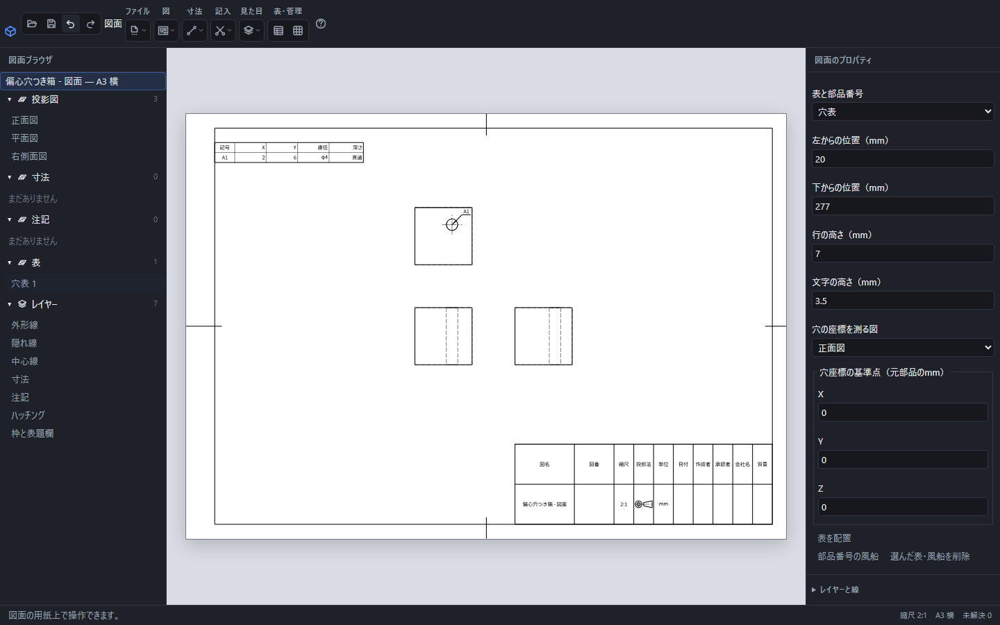

# 図面の穴表・改訂欄・表題欄を記入する

図面の上にある「表」、または右側の「表題欄と表」を開きます。表の位置と文字の高さは用紙上のmmで入力します。

直径4mmの貫通穴をA1として記入した画面。表のX=2、Y=6は基準点からの実寸で、図中のA1が同じ穴を指します。

## 穴表を配置する

部品の図面で「穴表」を選び、「穴の座標を測る図」と「穴座標の基準点」を指定して「表を配置」を押します。通常の部品図では、基準点のX・Y・Zは元の部品座標です。[板金展開図](sheet-metal-flat.md)では「展開面のmm」と表示され、展開後の座標を使います。表を用紙へ置く位置のX・Yとは別です。

通常の部品図では穴とねじ穴、板金展開図では円形の内周から、記号・X・Y・直径・深さをまとめます。X・Yは選んだ図の向きで測った実寸で、縮尺を変えても値は変わりません。同じ径をA1・A2、次の径をB1のように分類し、図中にも同じ記号と穴中心への引出線を付けます。貫通穴は「貫通」と表示します。

表を選んで基準点を変更すると、各穴の座標が新しい基準で再計算されます。穴の値は表へ手入力して変更せず、元の部品で穴の式や位置を編集します。

元の穴や面を特定できない場合は、理由を表示します。参照が壊れた表を含む図面の書き出しは確定されません。元の加工・参照する図・表の配置を修正してください。

## 改訂欄を記入する

「改訂欄」を選び、「改訂の行を追加」で必要な行を増やします。各行へ「改訂」「日付」「変更内容」「承認」を入力して「表を配置」を押します。「この改訂行を削除」は編集中の1行だけを除きます。

配置済みの表を選び、編集後に「表を更新」を押すと確定します。空の行は保存する表から除かれます。長い内容は列の幅で折り返し、「行の高さ」を超える場合は文字に合わせて行が高くなります。

## 表題欄と用紙の設定

表題欄は用紙の枠と一緒に表示します。右側の「用紙と枠」で図名・図番・日付・作成者などを入力します。尺度や投影法の表示も用紙の設定に対応します。普通公差は「普通公差の指定」で選びます。

表題欄を図の上へ独立して置く操作ではありません。配置を確認するときは[用紙と縮尺](drawing-scale.md)も参照してください。

## 移動・削除・保存

表をドラッグして移動するか、右側の用紙位置を編集して更新します。「選んだ表・風船を削除」で選択した表を削除します。配置・編集・移動・削除は「元に戻す」で戻せます。

表が用紙に収まらない場合は位置・列幅・文字の高さを見直します。編集用には.pcaddで保存し、配布用にはPDF・画像などを書き出してください。穴表は保存した参照から再計算し、改訂欄は記入した文章を保持します。

[部品表と部品番号](drawing-bom.md)・[レイヤーの表示と印刷](drawing-layer.md)・[保存・書き出し・印刷](drawing-export.md)
