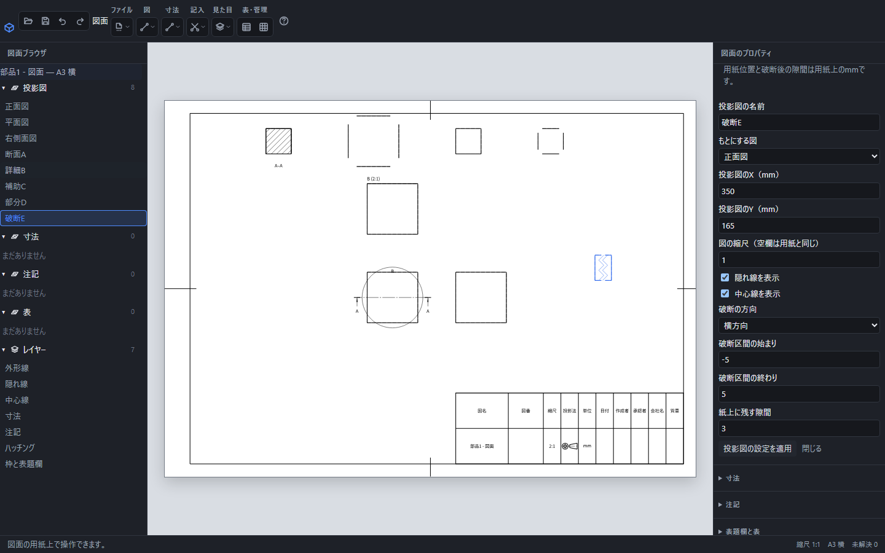

# 図を追加する・詳細図・補助投影図・部分図・破断図

部品や組立の形から、見る方向や表示範囲を変えた図を作ります。図面用の変更はもとの部品の形を変えません。図の名前を左の一覧で選ぶと、右側で作成条件を編集できます。

断面A・詳細B・補助C・部分D・破断Eを追加した画面。右側は破断Eの設定で、実寸の−5〜5mmを省き、用紙上に3mmの隙間を残しています。

## 基本の投影図を追加する

1. 図面を開き、上の「図」から「基準投影図」または「投影図を追加」を選びます。
2. もとの部品で保存した視点を選びます。正面・平面・右側面・等角のほか、名前を付けて保存した視点も使えます。
3. 図の名前と用紙上のX・Y位置を入力します。原点は用紙の左下、単位はmmです。
4. 縮尺を入力します。空欄は用紙と同じ縮尺です。「投影図を追加」を押します。

図面の投影は平行投影です。3D画面でのズーム倍率は図面の縮尺になりません。向きの登録は[名前を付けた視点](named-view.md)、縮尺の考え方は[用紙と縮尺](drawing-scale.md)で確認できます。

## 詳細図を作る

もとの図を選び、「図」→「詳細図」を開きます。「もとにする図」、円の中心・半径、図の符号、拡大する縮尺、用紙位置を指定して追加します。中心はもとの図の中心を基準とした実寸座標です。半径も実寸で、用紙上の長さではありません。

たとえば実寸の半径12mmを縮尺2で表示すると、表示範囲の半径は用紙上で24mmになります。外周だけの平らな面の内部を指定した場合、範囲内に描く辺がないことがあります。穴や段差など、拡大したい形を円内へ含めてください。

もとの図には範囲の円と符号、詳細図には「A (2:1)」のような見出しを表示します。円と符号の線幅・文字高さは用紙上で一定です。もとの図を動かすと範囲表示も追従します。詳細図を非表示にすると、対応する範囲円と符号も非表示になります。

## 補助投影図を作る

「図」→「補助投影図」で、もとの図と正面から見たい面を指定します。「基準面」「選択した平らな面」「選択した3点」「図上の切断線」から面の決め方を選べます。形状の面や3点を使う場合は、道具を開く前に図上で選択します。3点が一直線上にある場合は面を作れません。

もとの図の上方向と指定面の向きで上下を決めます。向きを決められない組み合わせは、表示される理由を確認し、別の基準面やもとの図を選びます。

## 部分図で範囲を絞る

「図」→「部分図」で円または多角形を指定します。多角形は1行に「X,Y」を1組ずつ入力し、3点以上で囲みます。座標はもとの図の中心を基準とした実寸です。範囲の外の形を削除する操作ではなく、その図で見せる範囲だけを変えます。

## 破断図で途中を省略する

「図」→「破断図」で、もとの図、横または縦の方向、区間の始まりと終わり、残す隙間を指定します。区間は実寸の座標、隙間は用紙上のmmです。省略した後も寸法の値は実際の部品寸法を表します。

たとえば幅20mmの図で−5〜5mmを省略し、隙間3mmを残すと、縮尺1では表示の幅が13mmになります。縮尺を変えても隙間は3mmです。始まりと終わりが逆、隙間が区間以上、区間が図の外などの指定は確定できません。

## 編集・取消・保存

図を紙面上で動かすには、左の一覧で図の名前を選び、その図の輪郭線をドラッグします。寸法の文字や記号の枠をつかむと、その記入の移動になるため、図の輪郭線をつかんでください。参照を付けた寸法、引出線付き注記、風船、データム、幾何公差、溶接記号も図と一緒に動きます。図に結び付いていない用紙上の注記や表はその位置に残ります。

ボタンを離すと移動を確定し、「元に戻す」1回で図と関連する記入が戻ります。ドラッグ中にEscを押すと中止します。紙枠の外へ図の原点を移した場合は確定できません。移動しても縮尺、実寸、入力した式、もとの部品の形は変わりません。

図を選ぶと「中心マークを個別に表示・非表示」で、円や円筒の中心線を一組ずつ切り替えられます。同心の円は一組で扱い、非表示にした組を再表示することもできます。図全体の「中心線を表示」がオフの間は、個別に選んだ組も見えません。個別の設定は保存とUndoの対象です。「記入」→「中心マーク」では選択した図の全組を再表示します。

左の一覧で図を選び、右の条件を変えて「投影図の設定を適用」を押します。確定した変更は「元に戻す」1回で戻ります。入力中に中止する場合は「閉じる」またはEscを使います。図をもとにする図自身へ変更するなど、循環する参照は作れません。

作成条件と式は.pcaddに保存されます。PDF・SVG・画像では、後から作成条件を編集できないため、[図面の保存と書き出し](drawing-export.md)に従って.pcaddも保存してください。
