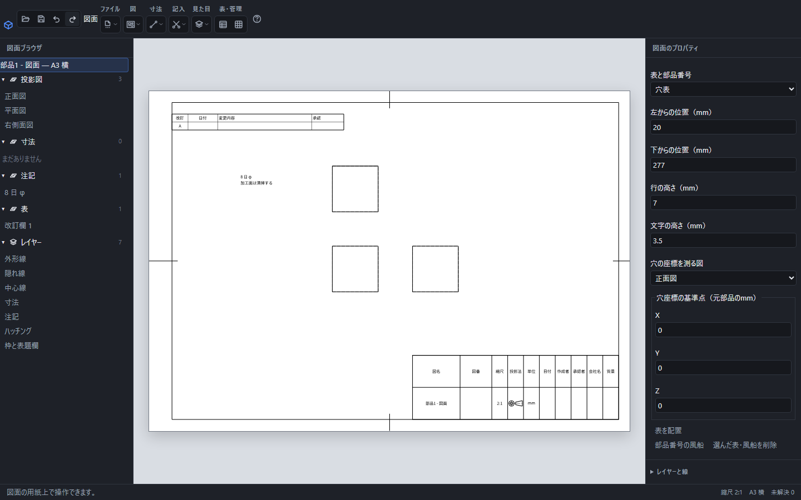
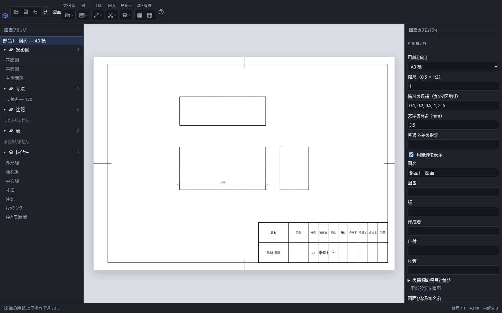
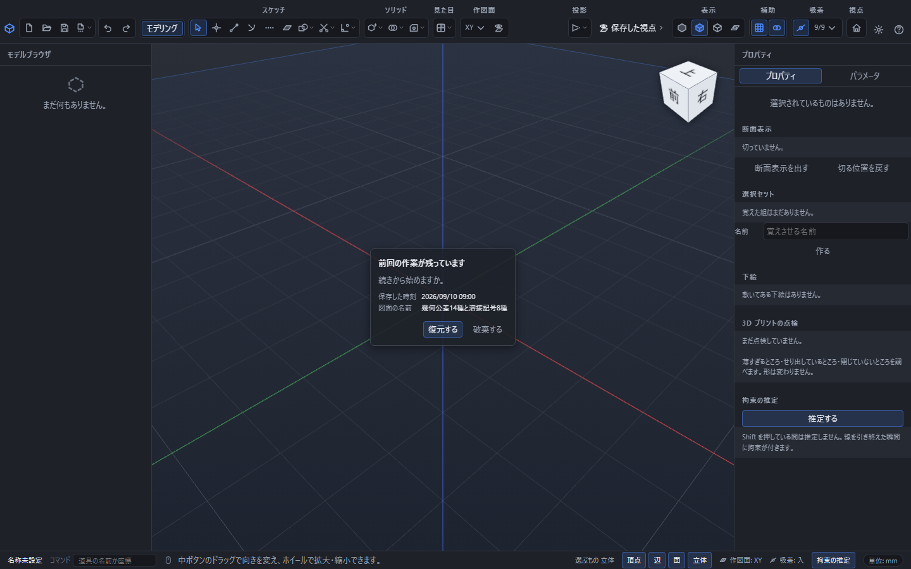
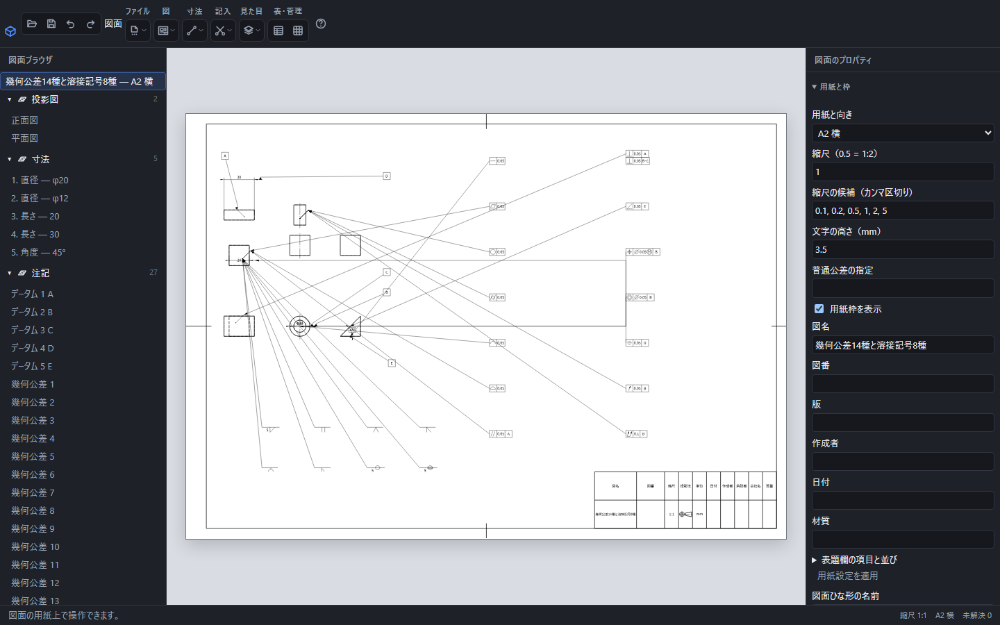

# 部品から図面を作る・注記する・書き出す

部品の形を図面にして、寸法や加工の指示を紙の上へ記入できます。PDFや画像を渡す相手は、PointerCADを持っていなくても内容を確認できます。

左の図面ブラウザは投影図・寸法・注記・表・レイヤーの5つの一覧です。この例には三面図、2行の注記、改訂欄を配置しています。

## 部品から始める

1. 部品を開き、立体が表示されたことを確認します。
2. 上の「ファイル」から「この部品から図面を作成」を選びます。
3. A3横の用紙に三面図が表示されます。投影の計算中は、画面下の案内で状況を確認できます。

## 寸法を入れる

投影された辺をクリックしてEnterを押すと、その辺の寸法を記入できます。寸法文字を選ぶと「寸法の公差・はめあい」が開きます。「記入方法」で公差の種類を選び、値を入力して「決定」を押します。

たとえば長さ20の辺に対称公差0.1を指定すると「20±0.1」になります。はめあいを指定すると、呼びと寸法に対応する許容差が表示されます。寸法文字をドラッグすると、表示位置を移せます。「元に戻す」で移動や値の変更を1操作ずつ戻せます。

寸法値そのものは形から決まります。「寸法値の前に付ける文字」「寸法値の後に付ける文字」で数量や補足を記入できます。「参考寸法として括弧を付ける」を入れると括弧で囲みます。「寸法線の位置」は用紙上のmmで指定し、「寸法文字を自動で配置する」を外すと文字の横・縦位置を入力できます。まとめて「決定」した変更は「元に戻す」1回で戻ります。

「自動寸法」は、投影図の寸法をまとめて配置します。既に置いた手動寸法の文字を避けて配置するため、先に必要な手動寸法を入れてから使うこともできます。

## 左の図面ブラウザから選ぶ

左側では「投影図」「寸法」「注記」「表」「レイヤー」に分けて図面の内容を表示します。見出しを押すと、その束を折りたためます。キーボードではTabで見出しに移り、Enterで開閉できます。折りたたんでも要素や現在の選択は消えません。

行を押すと、用紙上の対応する要素が青くなります。寸法・文章・表は用紙上で選んでも左の選択へ反映されます。Ctrlを押しながら行をクリックすると、選択を追加・解除できます。レイヤーを選ぶと、そのレイヤーに属する要素を強調します。この対応表示だけで各要素が削除対象へ追加されることはありません。

寸法の行には種類と現在の値が表示され、元の形が見つからないものには「!」が付きます。文字注記は文章の先頭、風船は部品番号で見分けられます。最上部の図名と用紙サイズの行を押すと、要素の選択を解除できます。

画面下の右側には縮尺・用紙・未解決の寸法と注記の合計件数が表示されます。図を1つ選ぶと、その図の縮尺を表示し、マウスを重ねると図名を確認できます。選択なしや複数図の選択では用紙全体の縮尺を表示します。「未解決 —」は現在の図面の確認待ちで、0件を意味しません。

## レイヤーの表示と印刷を分ける

右側の設定は用紙・図・寸法・注記・表・レイヤーの6つに分かれ、見出しで開閉できます。左の一覧や用紙から1つ選ぶと、その要素の設定が開きます。複数の要素を選んだ場合は、個別の設定を変えるために1つ選び直します。

図・寸法・注記・表・風船を1つ選ぶと、右の先頭の「選んだ要素のレイヤー」で所属先を変更できます。移動先の表示・出力・線の設定を引き継ぎ、「元に戻す」1回で元の所属へ戻せます。

左の「レイヤー」で名前を選ぶと、右に設定が表示されます。名前、色、線の種類、線の太さを指定して「決定」を押します。色は`#123456`のような6桁の形式、線の太さはmm単位の0より大きい数で入力します。空名や同じ名前、不正な太さは保存されず、下の帯に理由が表示されます。

「画面に表示する」と「印刷・書き出しに含める」は別々に設定できます。たとえば補助の注記を画面に残し、配布するPDFやSVGから除く場合は、表示を入れたまま印刷・書き出しだけを外します。

上の「見た目」から「レイヤー」を選ぶと新しいレイヤーを追加できます。選択中のレイヤーは「1つ上へ」「1つ下へ」で順序を変更できます。「レイヤーを削除」では含まれる要素数を確認してから削除します。最後の1つは削除できません。追加・設定・順序・削除は「元に戻す」で1操作ずつ戻せます。入力を中止するときは「閉じる」またはEscを押します。

## 加工の注記を付ける

投影図の面を選び、「記入」から「注記」を選びます。表面性状などの入力欄が開き、値を決めて「決定」を押すと記号が配置されます。注記の追加も「元に戻す」「やり直す」の対象になります。

配置した表面性状を選ぶと、右側で粗さの種類・値・除去加工の指定・文字高さ・位置を直せます。粗さの値には式も使えます。加工注記の呼びは元部品の穴やねじから決まり、ここでは高さと位置を編集します。元の面との引出線は保持します。

## 自由な文章を書く

1. 「記入」から「文字注記」を選び、用紙の置きたい場所をクリックします。
2. 「注記の文章」へ文章を入力します。改行して複数行にできます。
3. 文字の高さと横・縦の位置をmmで指定し、「決定」を押します。位置は用紙の左下が原点です。

「引出線を付ける」を入れると、先端の位置と「矢印」「黒丸」を指定できます。文字をドラッグしても引出線の先端は元の位置に残ります。

後から文字をクリックすると、文章や位置を編集できます。削除するときは注記を選んでDeleteを押します。編集・移動・削除は「元に戻す」で取り消せます。入力をやめるときは「閉じる」またはEscを押します。

## 元部品・組立の変更を図面へ反映する

元部品の幅を100から120へ変更して取り込み直した実画面です。A3横・縮尺1:1と寸法の配置を保ち、寸法値が120へ追従しています。

元の部品や組み立てを変更した場合は、変更後の.pcadまたは.pcadaを保存し、図面で「ファイル」→「元の部品・組立を取り込み直す」を選びます。選んだ元ファイルから図を作り直し、寸法、穴表、部品表、データム、公差、溶接記号の参照を更新します。用紙や記入の設定は保持します。更新は「元に戻す」1回で、元ファイルの内容と一緒に戻せます。

同じ名前の別部品へ勝手に対応付ける操作ではありません。元の辺や面を特定できない寸法・公差などは未解決の表示になります。更新後に値と対象を確認し、必要な参照を選び直してください。ファイル選択を取り消した場合や読み込みに失敗した場合は、現在の図面を保ちます。図面の保存先も変わりません。

## 前回の作業を復元する

起動直後に表示された図面の復元案内です。「図面の名前」と保存時刻を確認して「復元する」を押します。

保存していない図面の変更は、5分ごとに元部品・組立と一緒にこの端末へ控えを保存します。寸法、公差、データム、溶接記号の式と参照も含みます。画面を離れるときにも保存を試みますが、閉じる直前の書き込み完了は保証されないため、作業の区切りにはCtrl+Sで保存してください。

次回の起動で「前回の作業が残っています」と図面の名前が出たら、「復元する」を押します。復元直後は未保存の状態です。Ctrl+Sで保存が成功するまで元の控えを保持します。保存が失敗した場合は図面と控えを残すので、保存先を確認してもう一度保存してください。

読めない控えは理由を表示し、「控えを書き出す」から.pcaddとして取り出せます。「破棄する」は表示中の控えを削除します。他の端末へのバックアップではないため、重要な図面は別の場所にも手動保存してください。

控えから復元した実画面です。14種類の公差・5つのデータム・8種類の溶接記号と元部品を保持しています。復元後はCtrl+Sで保存します。

## ファイルへ書き出す

「ファイル」→「図面を書き出す」を選び、ファイルの種類を選んで「書き出す」を押します。「SVGで書き出す」からはSVGを直接保存できます。

| 種類 | 主な用途と保存される内容 |
|---|---|
| PDF | 用紙の実寸を保った配布・印刷用。線や文字は拡大しても滑らかな形として保存します。 |
| SVG | 図面を画像編集やWeb掲載で使うとき。文字の形を保ったベクトル画像です。 |
| PNG | 文書や画像編集へ貼り付けるとき。白い背景の画像として保存します。 |
| JPG | 写真と同じ形式で共有するとき。白い背景の圧縮画像として保存します。 |
| DXF | 他のCADへ線や文字を渡すとき。R12形式で保存します。 |

PDFとSVGの文字は輪郭として保存します。相手の端末に同じ字体が無くても形は保たれますが、文字としての検索・選択はできません。

PNGとJPGの解像度は150・300・600dpiから選びます。既定は300dpiです。解像度を上げると細部が鮮明になり、画像の大きさと作成時のメモリ使用量が増えます。画像が大きすぎるときは理由が表示されるので、解像度を下げてください。

DXFは線の太さを保存せず、色を近い基本色へ置き換えます。曲線の一部は細かい折れ線になります。表せない図形の省略数と、近似した色・曲線の件数を保存後に表示します。幾何公差・データム・溶接記号と関連するサイズ寸法・理論的に正確な寸法の文字は閉じた折れ線の輪郭として保存し、字体の置換による製作指示の欠落を防ぎます。輪郭の内側は塗りつぶしません。それ以外の文字の字体は、開くCADの設定に従います。

図面の書き出し先は、元の部品の保存先とは別です。図面を画像として保存しても、部品の「保存」がその画像へ上書きすることはありません。

「部品へ戻る」は現在の図面を閉じます。未保存の変更がある場合は破棄の確認が出ます。続けて編集する場合はキャンセルしてください。図面と「元に戻す」の履歴は残ります。PDF・画像への書き出しは、後から図面要素を編集するための保存にはなりません。

## 部品表と部品番号を置く

プロパティの「表題欄と表」の見出しを押すと、表と部品番号の設定が開きます。

組図では、プロパティの「表と部品番号」から「部品表」を選びます。用紙の左・下からの位置をmmで入力し、「表を配置」を押します。部品表は、組み立てに配置した部品から番号・名前・個数・材質・質量を集計します。構成名も列として追加できます。計算できない質量を0として表示することはありません。

「部品表の列」で表示する列を選び、矢印で左右の順序を変えます。列幅はmmで指定し、空欄なら既定の幅を使います。「行の順番」は上から下・下から上を選べます。「並べ替える項目」で番号・名前・個数・質量を選び、「大きい順・逆順に並べる」で逆順にできます。列の表示順と部品の番号は別で、並べ替えても対応する番号が別の部品へ移ることはありません。

「部品番号の風船」を押し、図の部品の辺または面を選んでから、風船を置く位置を押します。辺を指す先端は矢印、面を指す先端は黒丸になります。同じ部品の別の場所へ同じ番号を置けます。番号は現在の部品表へ追従します。

部品表の行を押すと、対応する図中の部品と風船を強調します。表や風船はドラッグで移動でき、確定した移動は「元に戻す」1回で戻ります。「選んだ表・風船を削除」は選択した表または風船だけを消します。部品表の行に対応して強調された風船は、部品表と一緒には消えません。

## 穴表を置く

部品の図面では「表と部品番号」で「穴表」を選び、「穴の座標を測る図」と「穴座標の基準点」を指定します。基準点のX・Y・Zは元の部品の座標で、mm単位です。用紙上の表の位置とは異なります。

「表を配置」を押すと、穴とねじ穴の中心から記号・X・Y・直径・深さをまとめます。同じ直径の穴はA1・A2、次の直径はB1のように区別します。貫通穴は深さの欄に「貫通」と表示します。図中にも同じ記号と穴中心への引出線が付きます。図の縮尺を変えても、穴表の座標・直径は部品の実寸です。

元の穴や面が見つからなくなった場合は、表を正しく表示できない理由が出ます。元の加工や参照する図を修正してください。表示できない表がある場合は、誤った情報を含む図面を書き出さず、参照先と配置の確認を案内します。

## 改訂欄を記入する

「表と部品番号」で「改訂欄」を選びます。「改訂の行を追加」で行を増やし、各行の「改訂」「日付」「変更内容」「承認」を入力して「表を配置」を押します。「この改訂行を削除」は編集中のその行を取り除きます。

配置後は表を選んで内容を直し、「表を更新」で確定します。「行の高さ」は行の最小の高さ、「文字の高さ」は文字の大きさで、いずれもmm単位です。長い内容は列幅に合わせて折り返します。用紙内に収まらない場合は、位置・幅・文字の高さを調整してください。追加・内容変更・削除は「元に戻す」で戻せます。

## 編集できる図面として保存する

図面を開いているときの「保存」は、図面用の`.pcadd`ファイルを保存します。用紙、図、寸法、注記、表の設定と、参照する部品・組み立ての情報を一緒に保存します。部品表や穴表の内容は元の情報から作り直すため、元の形を変更したあとも追従できます。

画面上部の「保存」またはCtrl+Sで保存し、「名前を付けて保存」またはCtrl+Shift+Sで別のファイルへ残せます。図名などの入力欄に焦点があっても保存できます。保存した結果や失敗した理由は画面下部に表示します。「開く」では部品・アセンブリ・図面のファイルを選べます。

PDFや画像への書き出しは、図面を編集できる形式での保存とは別です。後から表・寸法・注記を編集する場合は、`.pcadd`も保存してください。

## 用紙の実寸で印刷する

「ファイル」→「図面を印刷」を選ぶと、図面の用紙サイズと縦横の向きを指定して印刷画面を開きます。デスクトップ版は「部数」に1〜999の整数を指定できます。Web版では印刷画面で部数を指定します。

印刷画面で用紙サイズ・向き・倍率を確認してください。実寸を使う場合は倍率100%を選び、用紙へ合わせる拡大縮小を解除します。プリンターの印刷可能範囲によっては用紙の端を印刷できないことがあります。

Windowsでは、アプリから渡した設定よりプリンターの既定値が優先される場合があります。A3横の図面は、印刷画面の「その他の設定」で用紙をA3、向きを横に合わせてください。部数も印刷画面で確認します。別の用紙へ縮小せず正確な寸法で配布する場合は、「図面を書き出す」のPDFを使えます。

## 用紙の設定を変える

右側の「用紙」で、用紙サイズと向き、縮尺、文字の高さ、普通公差、用紙枠、図名・図番・版・作成者・日付・材質を編集できます。「用紙設定を適用」で確定します。確定した1回分をCtrl+Zで戻せます。

縮尺の0.5は1:2、2は2:1です。「縮尺の候補」は、0.5, 1, 2のようにカンマで区切ります。0や負の値、同じ候補の重複は確定できません。文字の高さの単位は紙上のmmです。既存の寸法・注記が持つ個別の文字高さは変わりません。

「表題欄の項目と並び」を開くと、項目名・固定の文字・幅の比率を編集できます。「1つ上へ」で並べ替え、行の削除や項目の追加もできます。固定の文字を空欄にすると、その項目の図面の値を表示します。

## 図面のひな形を保存して使う

右側の「用紙」で設定を整え、「図面ひな形の名前」を入力して「図面ひな形として保存」を押します。未確定の設定も、同じ検証を経て確定してから保存します。拡張子は.pcadtです。用紙・表題欄・普通公差・文字高さ・縮尺候補・レイヤーの設定を保存します。投影図・寸法・注記・表・風船・元の部品は含みません。

使うときは、3D画面で図面にしたい部品またはアセンブリを開き、「ファイル」→「図面ひな形から作成」で図面用の.pcadtを選びます。その部品・組立を参照する空の図面ができます。部品用のひな形は選べません。ひな形の保存は、編集している図面そのものの保存とは別です。作業を再開できるように残す場合は、図面も.pcaddとして保存してください。

## 保存した視点から投影図を追加する

右側の「図」で「元の部品で保存した視点」を選び、名前と紙上のX・Y位置を指定して「投影図を追加」を押します。元の部品に登録された正面・平面・右側面・等角と、利用者が名前を付けた視点を使えます。図面は平行投影です。3D画面の拡大率はコピーせず、用紙の縮尺か図ごとの縮尺を使います。

図を編集するときは、左側の一覧でその図の名前を押します。右側で位置・縮尺・隠れ線・中心線を変え、「投影図の設定を適用」を押します。「図の縮尺」を空欄にすると用紙の縮尺へ戻ります。別の図を追加するときは「別の投影図を追加」を押します。追加も変更もCtrl+Zで1回ずつ戻せます。

## 操作別の詳しい説明

- [長さ・角度・弧長・球・座標の寸法](dimension.md)
- [自動寸法](dimension-auto.md)
- [寸法線をまとめて整列する](dimension-arrange.md)
- [直列・並列・座標・累進の寸法](dimension-series.md)
- [公差・はめあい](dimension-tolerance.md)
- [文字の輪郭化](text-outline.md)
- [投影図・詳細図・補助投影図・部分図・破断図](drawing-views.md)
- [断面図とハッチング](drawing-section.md)
- [用紙と縮尺](drawing-scale.md)
- [文字注記](drawing-note.md)
- [幾何公差とデータム](gdt.md)
- [溶接記号](welding.md)
- [部品表と部品番号](drawing-bom.md)
- [穴表・改訂欄・表題欄](drawing-table.md)
- [レイヤーと表示・印刷](drawing-layer.md)
- [表面性状と加工注記](surface-finish.md)
- [保存・書き出し・印刷](drawing-export.md)
- [保存した視点と4分割表示](named-view.md)
