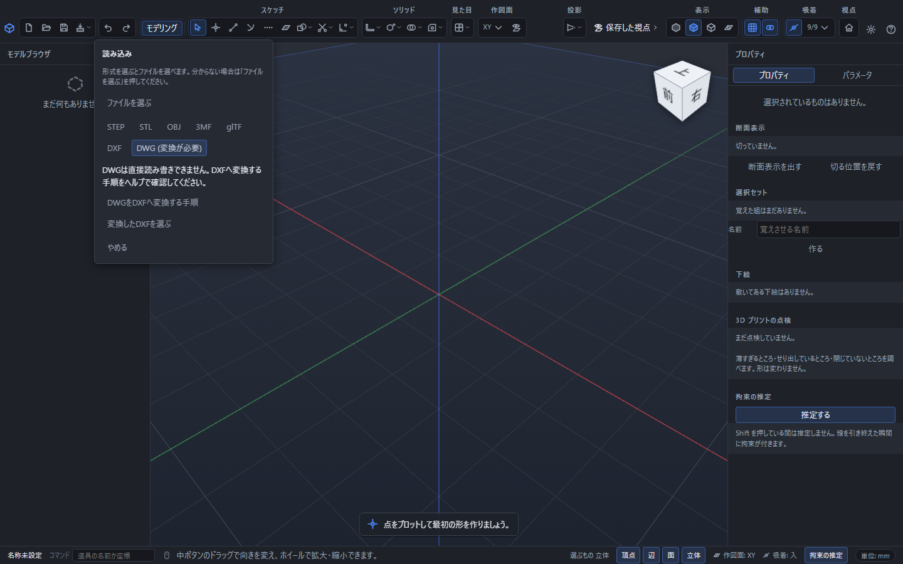

# DXF を読み書きする

DXF は、CAD どうしで平らな図形をやり取りするためのファイルです。ファイルの名前は `.dxf` で終わります。

## DXF を読み込む

いちばん上の**ファイル**を押して、一覧の中の**読み込む**を選びます。形式の**DXF**を押し、`.dxf` のファイルを選びます。**ファイルを選ぶ**から拡張子で自動判別することもできます。

**読み込んだ図形は、いま編集しているスケッチに入ります。** 立体にはなりません。取り込んだ後は、この中で描いた線とまったく同じように、伸ばしたり、条件を付けたり、押し出したりできます。

取り込む前に、どの面へ置くかを選べます。はじめは XY 面です。好きな向きの面を作ってあれば、その面も選べます([好きな向きの作業平面を作る](work-plane-custom.md))。

## 取り込める図形

点・線・円・円弧・楕円・なめらかな曲線・折れ線が取り込めます。折れ線は線と円弧に分かれて入ります。ブロックとして貼ってある図形は、中身が展開されて入ります。

**文字・寸法線・塗りつぶしは取り込みません。** 製作図を作成する[図面](drawing.md)とは別の、スケッチの図形としての読み込みです。

## DWGのファイルを持っているとき

読み込みの形式一覧で**DWG（変換が必要）**を選ぶと、ファイルを選ぶ前に案内が出ます。**DWGをDXFへ変換する手順**でこの章を開けます。PointerCADはDWGを直接読み書きしません。

1. [Open Design Alliance公式のODA DWG-DXF Converter](https://www.opendesign.com/guestfiles/oda_file_converter)を用意します。旧称はODA File Converterです。OSに合う配布物を選んでください。
2. 元のDWGを専用の入力フォルダーへコピーし、出力には別のフォルダーを指定します。入力のフィルターを `*.dwg` にします。
3. 出力の種類を**DXF（ASCII／テキスト形式）**にします。バイナリーDXFには対応していません。変換先の版も指定します。
4. 子フォルダーも変換するRecursive、読込時に点検・修復するAuditは必要な場合だけ選び、変換を実行します。入力フィルターに一致するファイルが処理されます。
5. PointerCADに戻り、**変換したDXFを選ぶ**を押します。単位を訊かれたら元の図面の単位を指定し、既知の寸法と図形の数を確認します。

逆にDWGを渡す場合は、PointerCADからDXFを書き出し、変換ソフトで入力フィルターを `*.dxf`、出力の種類をDWG、版を受け取り側の指定へ変更します。変換したDWGは受け取り側のCADで確認してください。拡張子を付け替えるだけでは変換できません。

変換しても、PointerCADで扱わない文字・寸法線・塗りつぶし・外部参照・専用オブジェクトまで再現できるとは限りません。スケッチの拘束・式・履歴もDWGへ渡りません。元のDWGは保存し、元のCADの表示と比較してください。上の手順は公式の公開資料（2026年9月11日確認）に基づきます。

## 単位

DXF には単位が書いてあることが多く、その場合はそのまま正しい大きさで入ります。インチで作られた図面も、そのままの寸法で開きます。

単位が書かれていないファイルでは、「このファイルの単位を選んでください。」と聞かれます。ミリメートルかインチを選んでください。

## 平らでない図形があったとき

DXF は平らな図形のためのものですが、高さのある図形が混じっていることがあります。そのときは平らにして取り込み、下の帯に「平面から外れた図形が n 個あります。平らにして取り込みます。」と 1 行出ます。取り込みは止まりません。

取り込めなかった図形があったときも、下の帯に件数が出ます。

## DXF に書き出す

いちばん上の**ファイル**を押して、一覧の中の**書き出す**を選ぶと、小さなパネルが浮かびます。**形式**の並びの右端にある **DXF** を押してから、いちばん下の**書き出す**を押してください。そのまま Enter を押しても書き出せます。

DXF を選ぶと、**対象**は「いま編集しているスケッチ」になります。立体を書き出すときの「すべての立体 / 選んだ立体」は選べません。なめらかさ・色・文字で書くの欄も出ません。DXF に入るのは平らな線だけで、どれも関わらないためです。大きさはミリメートルで書き出します。

**書き出すのは、いま編集しているスケッチの図形です。** 作図の補助に引いた線(構築線)は書き出しません。

スケッチに図形が 1 つも無いときは、押す前に「書き出せる図形がありません。スケッチに線や円を描いてから書き出してください。」と赤く出て、押せません。

平らでないスケッチは書き出せません。「この形は平らではないので DXF に書き出せません。」と出ます。平らな面の上で描き直してください。

## 書き出したファイルの中身

いちばん多くの CAD が読める古い形の DXF で書き出します。図形はすべて 1 枚の層に入ります。

楕円となめらかな曲線は、この形の DXF がそのままでは表せないので、細かい折れ線に直して書き出します。押す前のパネルにもその案内が 1 行出ます。書き出した後は、下の帯に「n 個の曲線は折れ線に近づけて書き出しました。」と出ます。形は目で見て分からないくらいには合っていますが、書き出したファイルを読み直すと曲線ではなく折れ線になります。

線分・円・円弧はそのままの形で書き出せるので、読み直しても線分・円・円弧のまま戻ります。

## 読めなかったとき

| 出る言葉 | 意味 |
|---|---|
| この DXF の形式には対応していません。 | 古すぎるか新しすぎる形、または文字ではない形の DXF です。 |
| ブロックの入れ子が深すぎます。 | ブロックの中にブロックが何段も入っています。元の CAD で分解してから書き出し直してください。 |
| ブロックの縦横で倍率が違う配置には対応していません。 | 縦と横で違う倍率に引き伸ばされた円や円弧があります。元の CAD で分解してから書き出し直してください。 |
