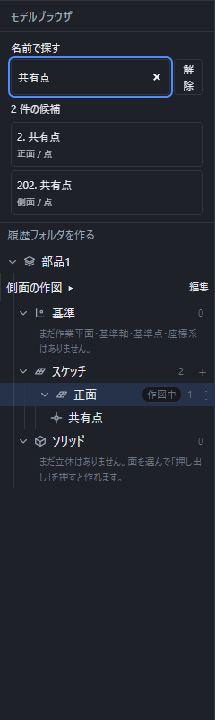
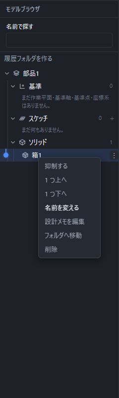

# 作ったものの一覧と、やり直し

左の「モデルブラウザ」に、作ったものが上から順に並びます。**上にあるものほど先に作ったもの**です。

## 一覧の並び

いちばん上が部品の名前です。その下が 3 つに分かれています。

| 節 | 中身 |
|---|---|
| 基準 | 自分で作った作業平面・基準軸・基準点・座標系([基準の軸・点・座標系を作る](reference-geometry.md))。作るまでは空です |
| スケッチ | かいた点・線分・円弧・矩形・円などの図形と、張った面 |
| ソリッド | 面から作った立体(押し出し・回転など)、置いた箱や円柱、穴・面取りなどの加工、組み合わせた立体(和・差・積) |

節の名前の右にある数字は、その中にいくつ入っているかです。節の名前をクリックすると中身を畳めます。部品の名前をクリックすれば全部畳めます。

## 選ぶ・見つける

モデルブラウザの「{{ui:nameSearch.label}}」で、名前やスケッチの所属から探せます。空白で区切った語は両方を含む項目を探します。全角・半角や、ひらがな・カタカナの違いを吸収します。

候補には名前だけでなく、所属と一覧内の番号を表示します。同じ名前の点が別のスケッチにある場合は、所属を確認して選んでください。検索中は文書や選択を変えません。候補を押すとその項目を選択し、畳まれたフォルダ・節・所属するスケッチを開いて、対象の行まで一覧を移動します。

入力欄から下矢印またはEnterで候補へ移動し、Tabで候補をたどれます。Escまたは「{{ui:nameSearch.clear}}」で検索を解除できます。非表示・抑制中・ほかの形に統合済みの項目も状態を付けて表示し、選んだだけでは表示状態を変えません。

行をクリックすると選べます。3D の絵の中で直接クリックしても選べます。

- 行に指を乗せると、3D の絵の中でその形が光ります。どれがどれかを探すときに使えます。
- Shift を押しながらクリックすると、選んだものを増やしたり減らしたりできます。立体を 2 つ選んで「和」「差」「積」を押すときに使います。
- 1 つだけ選ぶと、右の「プロパティ」にその中身が出ます。いくつも選んでいるときは数と種類だけが出ます。

## 数を書き換える

立体を 1 つ選ぶと、右に入れた値が出ます。**打ち込んだ式がそのまま出ます。**押し出しなら「距離」、回転なら「角度」、縫合なら「つなぎ目の許容量」です。欄を書き換えると、その場で形が変わります。

- 「向きを反転」「両側へ」のつまみも、あとから切り替えられます。
- 回転の「回転軸」は X・Y・Z から選び直せます。線分を軸にして作った立体は、軸にした線分の名前が出ます。
- 正しくない式にすると欄が赤くなります。赤いあいだは形は変わりません。直せば元どおり動きます。

**書き換えると、その立体を使って作った後のものも一緒に変わります。**たとえば押し出した立体を「差」で削っているとき、押し出しの距離を変えれば、削ったあとの形もそのまま追いかけて変わります。作り直す必要はありません。

いちばん下には、いまの形から計算した「体積」と「三角形の数」が出ます。ここは読むだけです。

## 名前を変える・一時的に消す・消す

行に指を乗せると、右端に「⋮」が出ます。押すと小さな一覧が開きます。行を右クリックしても同じ一覧が開きます。

キーボードではTabで「⋮」へ移り、EnterまたはSpaceで開けます。開くと最初の使える項目へ移ります。上下矢印で項目をたどり、Homeで先頭、Endで末尾へ移ります。使えない項目は飛ばします。EnterまたはSpaceで実行し、Escで閉じると元の行の「⋮」へ戻ります。

どの種類の行にも、次の項目があります。

| 項目 | すること |
|---|---|
| {{ui:featureTree.rename}} | その場で名前を打ち直せます。日本語の変換を終えてからEnterで決定、Escで取消。別の場所へ移ると決定します |
| {{ui:historyNote.edit}} | 設計の理由や注意を文章で残します |
| {{ui:historyFolder.moveTitle}} | 作成済みのフォルダへ移すか、フォルダから外します |
| {{ui:featureTree.delete}} | その項目を消します |

メモとフォルダの詳しい使い方は[履歴へ設計メモを残す](history-notes.md)を参照してください。行の種類によって、次の項目も出ます。

| 行の種類 | 追加の項目と条件 |
|---|---|
| スケッチ全体の親行 | {{ui:featureTree.addSketch}}。{{ui:featureTree.delete}}は最後の1本、または中の要素を立体が使っているときには使えません |
| スケッチ内の点 | {{ui:originCommand.action}}。位置が求められない場合は実行できず、理由を知らせます |
| スケッチ内の線・円・面など | 上の共通項目を使います。抑制や原点の設定は出ません |
| 基準 | {{ui:featureTree.hide}}／{{ui:featureTree.show}}、{{ui:timeline.moveUp}}、{{ui:timeline.moveDown}}。基準点には{{ui:originCommand.action}}も出ます |
| 立体 | {{ui:featureTree.suppress}}／{{ui:featureTree.unsuppress}}、{{ui:timeline.moveUp}}、{{ui:timeline.moveDown}} |

順序の移動は、先頭から上・末尾から下へ進む場合や、参照関係が成り立たなくなる場合には使えません。使えない項目に指を乗せると理由を読めます。順序と途中表示は[履歴を途中まで戻す](timeline.md)で説明しています。

**抑制**は、試しに外してみたいときに使います。抑制した行は字がうすくなり、「抑制中」の札が付きます。もう一度「抑制を解く」を押せば元どおりです。

**削除**は確認を出さずにすぐ消えます。間違えたときは「元に戻す」で戻せます。

立体を「和」「差」「積」で組み合わせると、もとの 2 つは 1 つにまとまります。まとまったものには「統合済み」の札が付き、単独では絵に出なくなります。

スケッチ内の点や線、基準、立体は、行を選んでDeleteキーを押しても消せます。

## 赤い印が出たら

計算できなかった行には赤い印が出ます。印に指を乗せると理由が読めます。

| よくある理由 | 直し方 |
|---|---|
| もとの面が見つからない | 使っていた面を消したときに出ます。元に戻すか、その立体を消します |
| 組み合わせる立体が無い | 組み合わせに使っていた立体を消したときに出ます。元に戻すか、その立体を消します |
| 厚みが出なかった | 距離や角度を確かめます。0 に近い数だと形になりません |

**赤い印が出てもアプリは止まりません。**ほかの形はそのまま使えますし、赤い行を選んで値を直せば、そのまま作り直されます。

## 元に戻す・やり直す

上の「元に戻す」(左向きの矢印)を押すと、直前の操作を取り消せます。「やり直す」(右向きの矢印)で、取り消した操作を戻せます。キーボードでは Ctrl+Z が「元に戻す」、Ctrl+Y が「やり直す」です。

- 数を打ち直したときは、打った 1 文字ずつではなく**一続きの書き換えがまとめて**戻ります。
- 見る向きを変えたことや、選んだことは戻す対象になりません。形が変わる操作だけが戻ります。
- 戻せるものが無いときは、ボタンが薄く表示されます。
