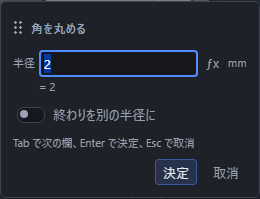
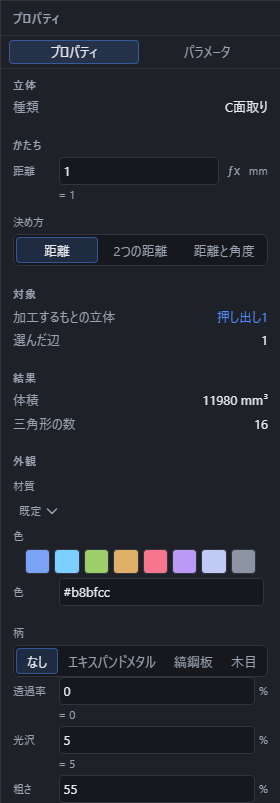

# 角を丸める・面を取る

立体の辺を丸めたり(R面取り)、斜めに切り落としたり(C面取り)します。

## R面取り(角を丸める)

1. 「選択」の道具のまま、丸めたい**辺**をクリックします(Shift を押しながらクリックすると、いくつも選べます)。
2. ツールバーの「ソリッド」区画で「加工」を押して一覧を開き、「R面取り」を押します。
3. 入力欄が出るので、「半径」を入れて Enter を押します。

   

辺を選ぶ前でも「R面取り」「C面取り」を押せます。対象が足りないときは、画面下の帯に選ぶものの案内が出ます。加工する辺をクリックし、複数なら Shift で追加して、「加工」の一覧からもう一度同じ道具を押すと入力欄が開きます。やめるときは Esc を押します。

### 頂点を選ぶと、その角に集まる辺がまとめて丸まる

辺の代わりに**頂点**をクリックして「R面取り」を押すと、その頂点に集まっているすべての辺が同じ半径で丸まります。角を丸ごと丸めたいときはこちらが簡単です。頂点を選ぶには、いったん道具を「頂点」に切り替えてください(キーボードの `1` でも切り替えられます)。

### 半径を場所によって変える

入力欄の「終わりを別の半径に」を入れると「終わりの半径」の欄が増えます。辺の始まりでは上の「半径」、辺の終わりでは「終わりの半径」になり、そのあいだはなめらかにつながります。太いところから細いところへ丸みを変えたいときに使います。

- どちらも 0 より大きい数です。
- 同じ数を入れると、一定の半径で丸めたのとまったく同じ形になります。
- つまみを切ると一定の半径へ戻り、欄も 1 つに戻ります。

あとから右の「プロパティ」でも切り替えられます。

## C面取り(面を取る)

1. 「選択」の道具のまま、面を取りたい**辺**をクリックします(いくつも選べます)。
2. ツールバーの「ソリッド」区画で「加工」を押して一覧を開き、「C面取り」を押します。
3. 入力欄が出るので、値を入れて Enter を押します。

### 3つの決め方

右の「プロパティ」の「決め方」で、切り落とし方を選べます。

| 決め方 | 意味 |
|---|---|
| 距離 | 辺から両側へ同じ距離だけ切り落とします |
| 2つの距離 | 辺から両側へ、それぞれ違う距離を指定して切り落とします |
| 距離と角度 | 片側は距離、もう片側は基準の面からの角度で指定します |

### 「基準の面を入れ替える」の意味

「2つの距離」と「距離と角度」では、辺に接する2枚の面のどちらを基準にするかで、切り落とされる向きが変わります。プロパティの「基準の面を入れ替える」を入にすると、基準にする面がもう一方へ入れ替わります。狙った向きと逆に切れてしまったときに、このつまみ1つで直せます(「距離」だけを使う等距離のときは、両側とも同じ量なのでこのつまみは効きません)。

## うまくいかないとき

「R面取り」「C面取り」を押しても何も起きないとき、または画面下の帯や作ったものの一覧に理由が出たときは、次を確かめてください。

| 出る文 | 直し方 |
|---|---|
| 辺が選ばれていません。 | 丸める・面を取る辺(または頂点)をクリックしてから、もう一度ボタンを押します |
| 丸める半径は 0 より大きい数にしてください。 | 半径の数字を見直します |
| 面取りの距離は 0 より大きい数にしてください。 | 距離の数字を見直します |
| 面取りの角度は 0 度より大きく 90 度より小さくしてください。 | 角度の数字を見直します |
| この辺には面取りできません。立体の外側の辺を選び直してください。 | 立体の内側や、隣り合う面が1枚しかない辺は選べません。別の辺を選び直します |
| 丸められませんでした。半径を小さくするか、辺を選び直してください。 | 半径を小さくして作り直すか、選ぶ辺を減らします |
| 丸められない辺が N 本ありました。半径を小さくしてください。 | 半径が大きすぎて丸め切れない辺があります。半径を小さくします |
| 丸めた結果が立体になりませんでした。半径を小さくしてください。 | 半径を小さくして作り直します |
