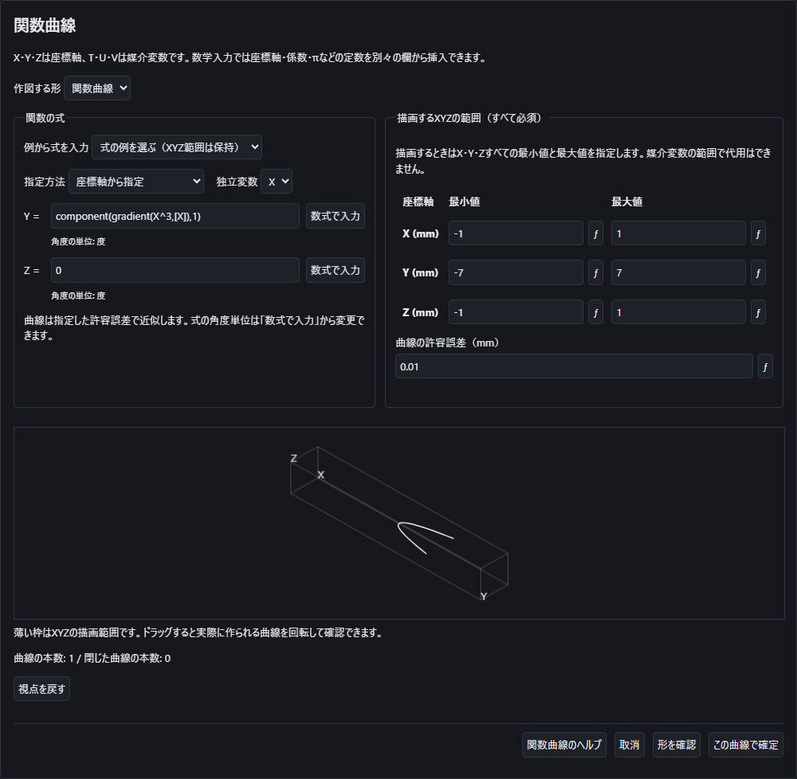
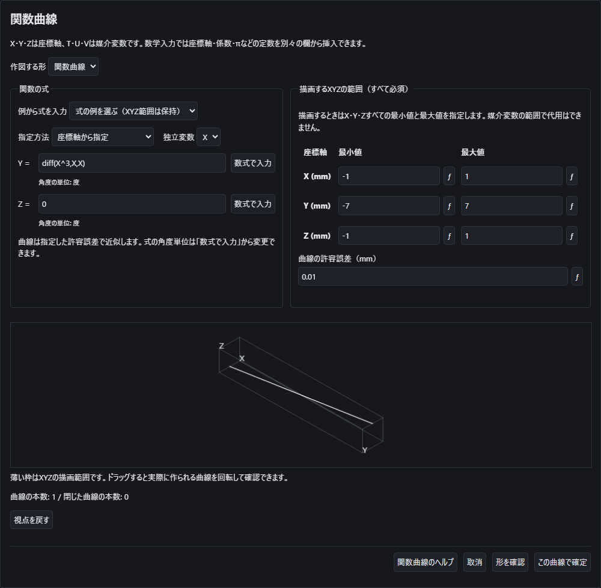
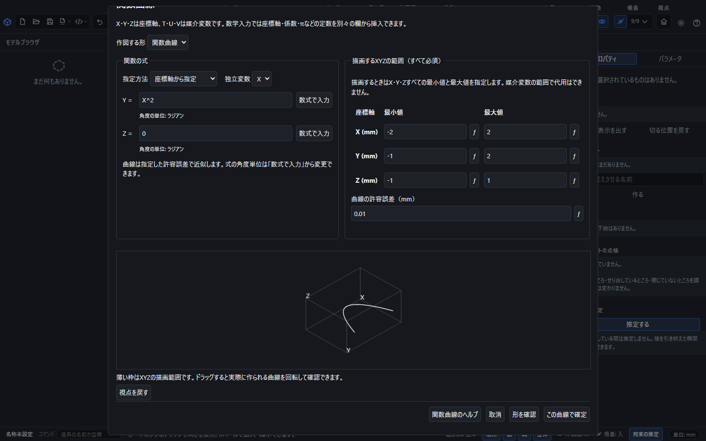
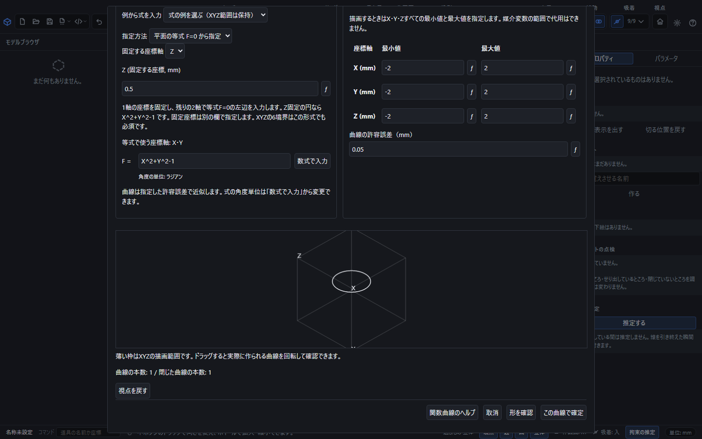
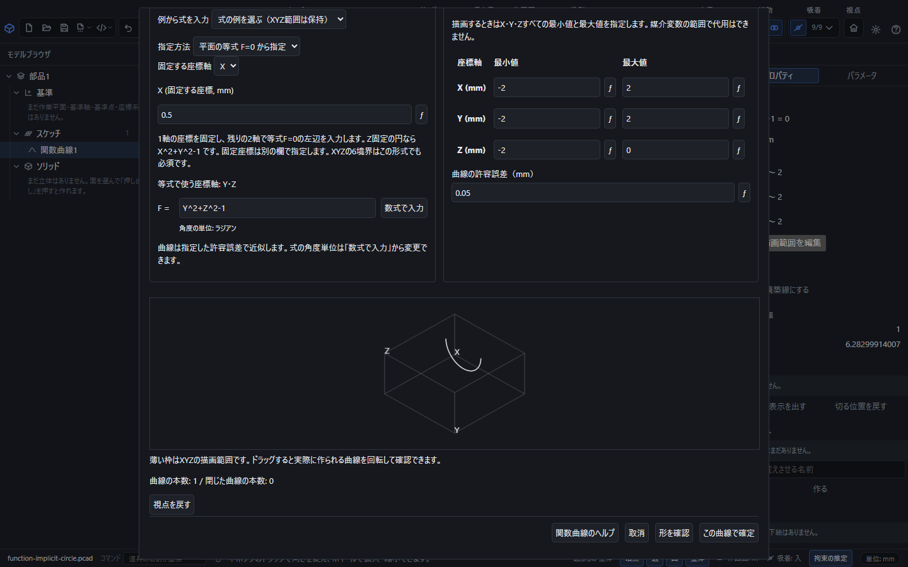
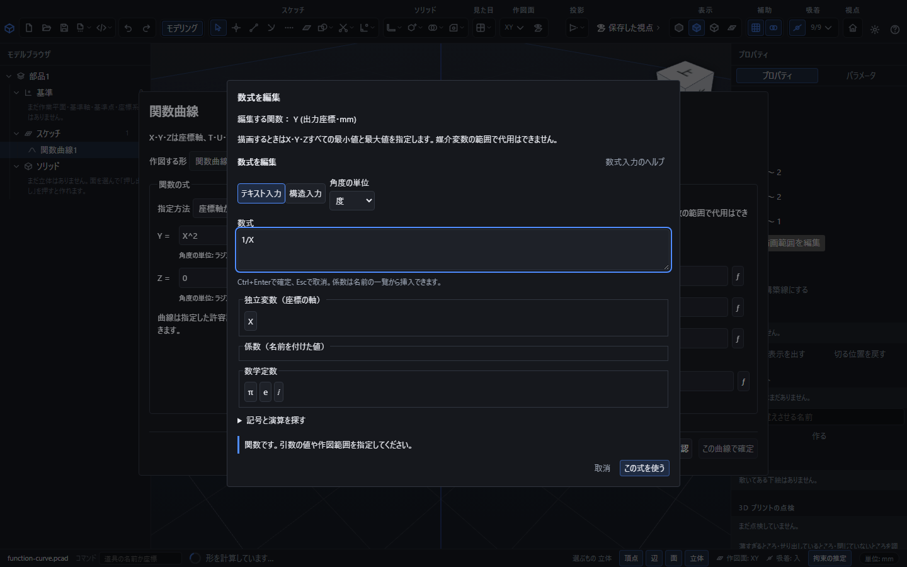
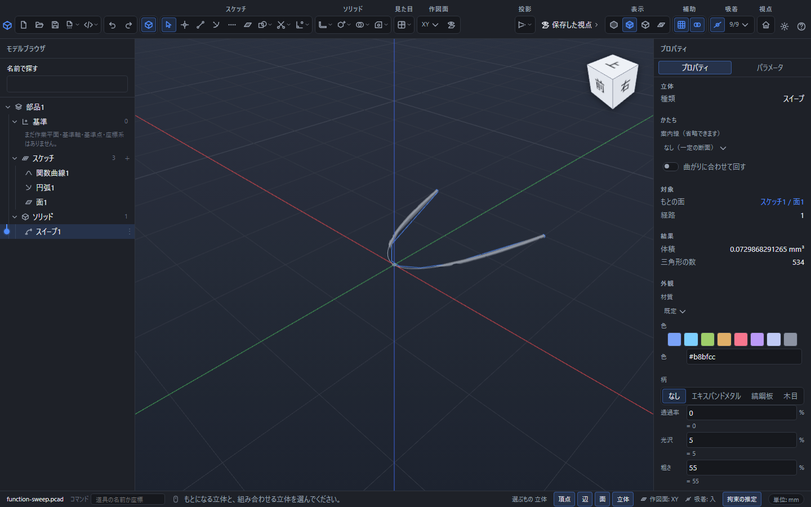
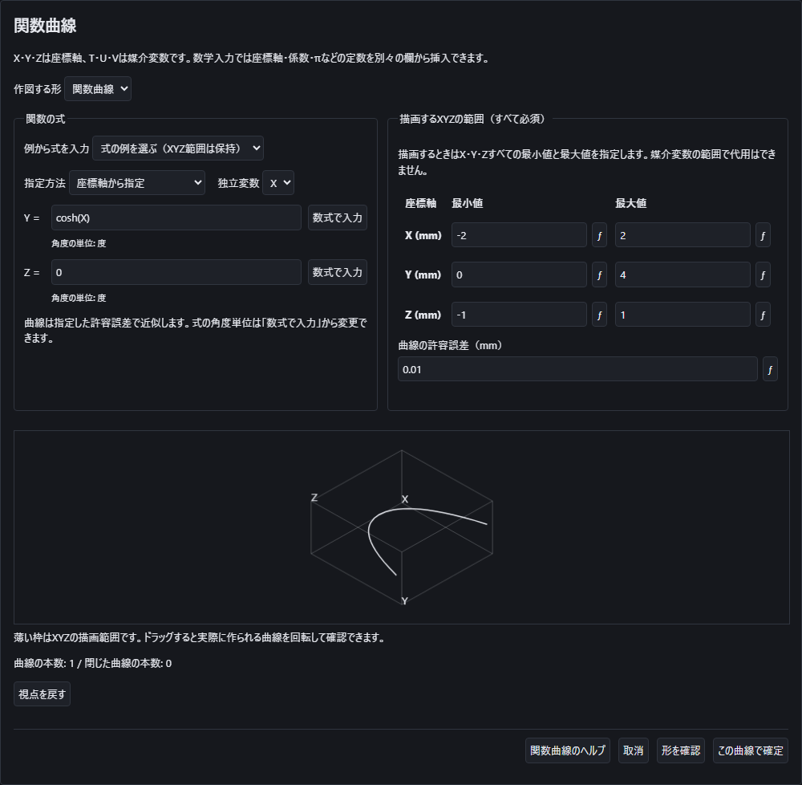

# 関数とXYZの範囲から曲線を作る

入力中の **F1** でこの説明を開けます。数式入力の画面内では数式専用の説明を開きます。ヘルプを閉じると、書きかけの式や範囲を続けて入力できます。

作成した平面内の等式に座標を指定して点を置く操作は、[関数上に座標を指定して点を作る](function-point.md)を参照してください。

「作図」→「関数作図」を開き、作図する形を「関数曲線」にすると、座標式・媒介変数の式・平面上の等式から曲線を作れます。X・Y・Zそれぞれの最小値と最大値を指定すると、その範囲内にある部分だけをCADの曲線として作成します。作図面や現在のカメラの範囲では代用しません。

## 導関数の曲線を作る

導関数の曲線を作る場合は、たとえばYの式に`diff(X^3,X,X)`を入力します。Xで2回微分したY=6Xを、指定したXYZ範囲内で作図します。保存する式は入力した`diff`のままです。角度・係数・成立しない位置の扱いは[導関数で曲線と曲面を作る](math-input.md#導関数で曲線と曲面を作る)を参照してください。

勾配の成分も使えます。Yの式を`component(gradient(X^3,[X]),1)`にすると、Xでの微分の成分3X²を曲線にします。`laplacian(X^3,[X])`なら二階微分6Xです。`component`の番号は1から始まり、変数は一覧の順序で扱います。詳しくは[直交座標のベクトル解析](math-input.md#直交座標のベクトル解析)を参照してください。

下の例はX=-1〜1、Y=-7〜7、Z=-1〜1です。「形を確認」で直線が1本表示されることを確かめ、「この曲線で確定」を押します。保存した文書を開き直しても、2回微分する元の式を再編集できます。

## 放物線を作る

1. 「作図」→「関数作図」を開き、「関数曲線」を選びます。
2. 指定方法を「座標軸から指定」、独立変数を「X」にします。
3. 「Y 関数の式」に `X^2`、「Z 関数の式」に `0` を入力します。
4. 下の表のとおり、XYZの6欄をすべて入力します。
5. 曲線の許容誤差を確認し、「形を確認」を押します。曲線は指定した許容誤差で近似します。
6. 確認画面をドラッグすると曲線を回転できます。薄い枠がXYZの描画範囲です。
7. 形と範囲を確認して「この曲線で確定」を押します。履歴に「関数曲線」が追加されます。

| 座標軸 | 最小値 | 最大値 |
|---|---:|---:|
| X（mm） | -2 | 2 |
| Y（mm） | -1 | 2 |
| Z（mm） | -1 | 1 |

この例ではY=2の境界で曲線が切れます。Z=0の平面上にある曲線でも、Zの最小値と最大値を別々に指定します。Zの両方に0を入力すると、幅がゼロの範囲になるため作図できません。

範囲はすべて有限な実数で、各軸とも最小値より最大値を大きくします。空欄、無限大、計算できない式、逆順の範囲では確定できません。範囲を変えると、以前の確認表示は消えます。もう一度「形を確認」を押してください。

## らせんを作る

指定方法を「媒介変数Tから指定」にすると、X・Y・Zの式とTの最小値・最大値を指定できます。既定の「度」では、次の式で2周のらせんを作れます。

- X = `cos(T)`
- Y = `sin(T)`
- Z = `T/360`
- Tの範囲 = `0` ～ `720`

XYZの範囲はTとは別に必須です。例えばX=-2～2、Y=-2～2、Z=0.2～0.8とすると、2周分のTを指定していても、Z=0.2～0.8の間だけが残ります。

## 平面上の等式から円や双曲線を作る

指定方法を「平面の等式 F=0 から指定」にすると、1軸の座標を固定し、残り2軸の等式から曲線を作れます。等式をY=f(X)などへ変形する必要はありません。

1. 「式の例」で「円の等式 X²+Y²−1=0（Z=0）」を選びます。Zを固定する形式になり、左辺 `X^2+Y^2-1` が入ります。
2. 固定するZ座標を `0.5` mmに変えます。等式の欄に使うのはX・Yです。固定する座標や、同名の係数は別の欄で指定します。
3. XYZの最小値と最大値を各軸とも-2～2 mm、許容誤差を `0.05` mmにして「形を確認」を押します。
4. 「曲線の本数: 1 / 閉じた曲線の本数: 1」と表示され、Z=0.5の円が枠内にあることを確認して確定します。

**固定軸にも描画範囲の最小値と最大値が必要です。** Z=0.5を固定しても、Zの範囲を省略できません。固定座標が範囲外なら曲線は作れません。式の例を選んでもXYZの6境界と許容誤差は変更しません。

保存してファイルを開き直し、関数曲線の「関数と描画範囲を編集」を押すと、原式・固定軸・固定座標・全XYZを再編集できます。例えば固定軸をX、固定座標を0.5 mm、左辺を `Y^2+Z^2-1` にし、Zの最大値を0 mmへ変えると、X=0.5の平面上に開いた半円だけが残ります。

固定軸を切り替えると「等式で使う座標軸」も変わります。「数式で入力」の座標軸も同じ指定に揃います。確定後はUndo1回で変更前の式・範囲・形へ戻せます。

双曲線の例 `X*Y-1` は、範囲内にある離れた2枝を別々の曲線として残します。孤立した点や複数の曲線が分岐する特異点など、長さのある曲線として確定できない場合は理由を表示します。

## 座標軸・係数・数学記号を区別する

各式の「数式で入力」を押すと、通常の座標・寸法と同じ数学入力画面が開きます。座標軸、媒介変数、係数、数学定数は別の挿入欄にあります。

- `X` は座標軸です。`coef("X")` はパラメータ表に作った「X」という名前の係数です。
- `pi`・`π`は円周率です。名前が「pi」の係数は `coef("pi")` で指定します。
- 三角関数の角度単位は新規入力では「度」が既定で、各式の下に表示します。各欄の「数式で入力」から数学入力画面を開き、「角度単位」で「ラジアン」に切り替えられます。式を直接書き換えた場合も、保存して開き直した場合も選んだ単位を保持します。切替時は式の意味が変わるため、円を1周するTの範囲も度なら `0` ～ `360`、ラジアンなら `0` ～ `2*pi` と指定してください。
- 掛け算には `*` または `×` を使います。`2X` のように省略すると、必要な区切りを案内します。

分数、累乗、絶対値などは数学パレットから入力できます。記号の意味と引数は[数式で入力する](math-input.md)を参照してください。

## 係数を動かして形を調整する

パラメータ表に「高さ」を作り、Yの式を `coef("高さ")*X` にすると、関数曲線を選んだプロパティに「関数の係数を動かす」が現れます。曲線で使う係数だけが並び、XYZの座標軸やπなどの定数は並びません。関数曲面でも同じ操作を使えます。

1. パラメータ表で「高さ」を2にし、関数曲線を選びます。
2. 「係数の最小値」を0、「係数の最大値」を4にします。この範囲はスライダーの範囲です。関数のXYZ描画範囲は別の指定で、その外側は引き続き描画しません。
3. 「係数の値: 高さ」のつまみを動かします。値と、その係数を使う曲線・曲面などの形が追従します。つまみに焦点を置き、方向キーでも変更できます。
4. つまみを離してから「元に戻す」を1回押すと、ドラッグ前の係数と形へ戻ります。途中で手を止めても、同じドラッグ中の変更は1回として扱います。次のドラッグは別の変更です。方向キーを押している間も同様です。

スライダーで動かすと、その**係数自身の式は表示した数値へ置き換わります**。例えば係数に `幅/2` を設定していた場合、その関係を保って編集するにはパラメータ表を使ってください。関数の式にある `coef("高さ")` などの参照は残ります。

最小値・最大値は有限な数値とし、最小値より最大値を大きく、現在の係数が入る範囲にします。不正な範囲ではつまみが無効になり、理由が表示されます。範囲の入力だけでは文書の係数は変わりません。調整した係数の値は部品へ保存されます。つまみの操作範囲は操作中の設定であり、開き直した際は現在値を含む範囲から始まります。

## 関数の曲線に沿って立体を作る

関数曲線を通常の「スイープ」の道筋として使えます。閉じた平面曲線は「面」の輪郭にも使えます。

1. 放物線の例を作成し、Yの範囲を−2〜5へ変更して確定します。Xは−2〜2、Zは−1〜1のままです。
2. 「作図」→「円」で中心を原点、半径を0.05mmとして円を作ります。
3. 円を選び、「面」を押してEnterで円の断面を作ります。
4. 「面1」を選び、Shiftを押しながら関数曲線を追加で選びます。
5. 「作る」→「スイープ」を開いて「決定」を押します。

断面を関数曲線に沿って動かした立体ができます。関数の原式と描画範囲は履歴に残り、保存後も編集できます。途中で途切れる曲線や、太さによって立体が自分自身と交差する条件では作成できません。理由を確認して、関数の範囲や断面の大きさを調整してください。

形が小さく見える場合は、中央の作図画面にマウスを置き、ホイールで拡大します。「ホーム視点」は向きと距離を既定へ戻す操作です。

## 保存、再編集、取消

双曲線関数も曲線へ使えます。例えばYに`cosh(X)`、Xの範囲を−2〜2、Yを0〜4、Zを−1〜1とすると、中央がY=1となる曲線を作れます。`sinh`・`cosh`・`tanh`と逆関数`asinh`・`acosh`・`atanh`は、度とラジアンを切り替えても同じ値です。

逆数の`csch`・`sech`・`coth`、その逆関数`acsch`・`asech`・`acoth`にも対応します。`acosh`は入力が1以上、`atanh`は−1より大きく1より小さい範囲です。`asech`は0より大きく1以下、`acoth`は絶対値が1より大きい範囲です。`csch`・`coth`・`acsch`では0を使えません。計算できない位置や離れた枝を勝手につなぎません。原式は保存後も残り、`cosh(X)`から`sech(X)`への編集も元に戻せます。

作った関数曲線は、通常の面張りやスイープの経路にも使えます。三次までの多項式では、式と描画範囲の条件を満たす場合に滑らかな曲線として加工します。ほかの式や境界で切れる部分では指定した許容誤差による近似を使います。範囲を広げたり精度を緩めたりする操作を、アプリが自動で行うことはありません。

作成後はツリーの関数曲線を選び、「関数と描画範囲を編集」を押します。保存した式、XYZ範囲、許容誤差を変更できます。パラメータ表の係数を変えると曲線も再計算されます。係数を改名した場合も参照が追従します。

保存するのは原式と範囲です。ファイルを開き直すと原式から再計算するため、以前の値を現在の形として使い回しません。「元に戻す」で1回の確定を取り消せます。入力中の「取消」や計算中の「計算を中止」では、その途中の曲線を文書へ追加しません。

`1/X`のように途中で発散する関数は、離れた枝を1本の線でつなぎません。指定範囲に曲線がない場合や、許容誤差・計算量の条件を満たせない場合は理由を表示し、確定を止めます。範囲を狭める、誤差の指定を見直す、式を修正するなどしてから再度確認してください。
