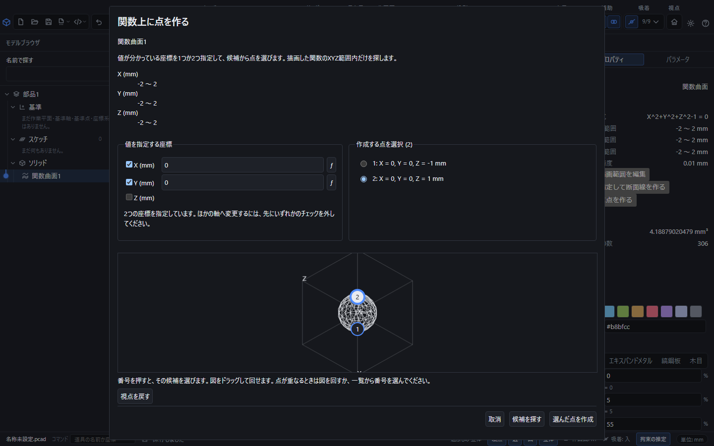
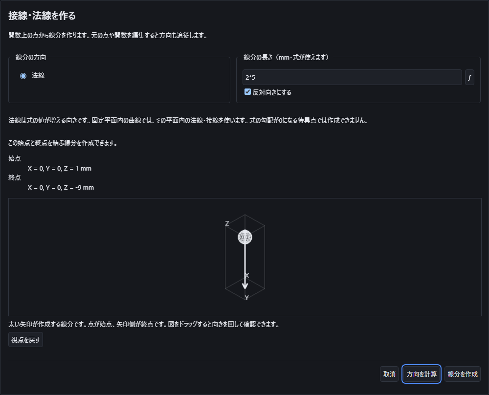
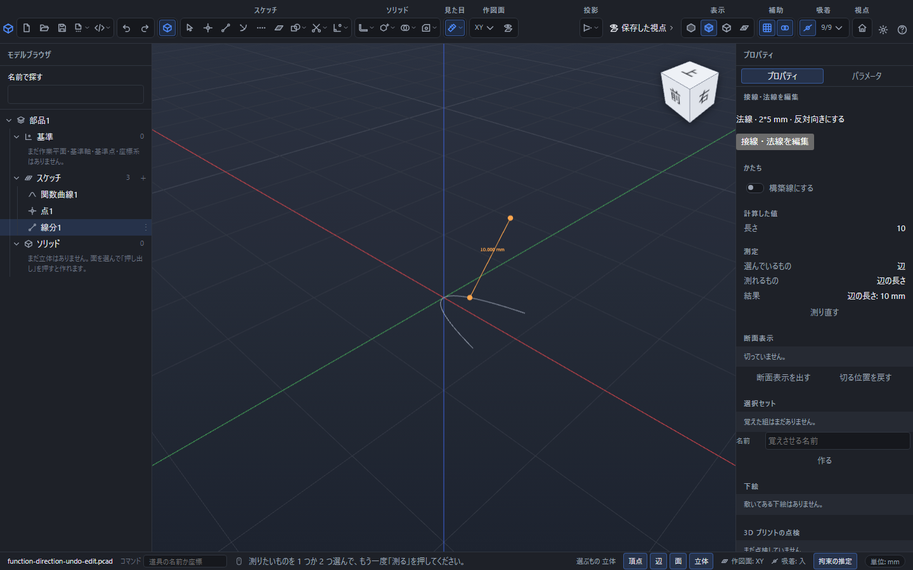

# 関数上に座標を指定して点を作る

作成済みの関数を選び、プロパティの「{{ui:functionPoint.title}}」から開きます。入力済みの関数式とXYZの描画範囲を使って、指定座標に一致する点を調べます。点の画面の入力中も **F1** でこの説明を開けます。ヘルプを閉じると、書きかけの座標を続けて入力できます。

## 元の関数と指定する座標

座標の曲線、媒介変数Tの曲線、平面内の等式、空間内の等式、座標の曲面、媒介変数U・Vの曲面を選べます。平面内の等式では、平面を決める固定座標を元の定義から引き継ぎます。

座標のチェックを入れると、その軸の値を指定できます。**X・Y・Zの欄はmm単位の座標**です。「数式で入力」では、係数を含む式や数学記号も使えます。係数は座標軸と区別して挿入してください。角度を含む新規の数式は度が既定で、数式入力の中でラジアンへ切り替えられます。

- 平面内の等式では、固定軸以外の座標を1つ指定します。たとえば `X² + Y² = 1`、固定Zが0なら、Xを0にしてYの候補を求めます。
- 空間内の等式では、通常は2つの座標を指定します。たとえば `X² + Y² + Z² = 1` でXとYを0にすると、Zが−1と1の2候補になります。
- `Z = X² + Y²` の座標曲面では、XとYを指定してZを求められます。ほかの軸の組合せを指定した場合は、複数候補になることがあります。
- `Y = X², Z = 0` の座標曲線では、Xを指定すると1点を求められます。Yを1と指定すれば、Xが−1と1の候補を調べられます。最初は元の関数の独立軸にチェックが入ります。
- 媒介変数の曲線でも、指定するのは実際のX・Y・Z座標です。Tの探索範囲は元の曲線から引き継ぎます。候補にはTの区間も表示され、同じXYZを通る別の枝を区別できます。Tの値を座標の単位mmと混同しないでください。
- 媒介変数U・Vの曲面では、通常はX・Y・Zのうち2座標を指定します。たとえば `X=U+V, Y=U−V, Z=U×V` にX=3、Y=1を指定すると、U=2、V=1、Z=2の点になります。候補には元のU・Vの区間を別に表示します。XYZの描画範囲に加え、元のU・Vの範囲も守ります。
- 1座標だけでも点が定まる場合があります。たとえば `X=V×cos(U), Y=V×sin(U), Z=V` ではZ=0から頂点が定まります。この場合、Uに勝手な値を与えず、元のU範囲が同じ点へ集まることを確認します。複数の異なる点が残る場合は、もう1座標を指定してください。

チェックを外した軸は、ここで値を固定せずに求める軸です。2つの座標を指定した後、ほかの軸へ変更するには、先にいずれかのチェックを外します。元の関数のXYZ範囲は点の探索にも適用されます。画面上の見えている範囲や拡大率では変わりません。

## 候補を確認して作る

1. 指定する座標にチェックを入れ、値を入力します。
2. 「{{ui:functionPoint.search}}」で探索します。入力が足りない場合や式が読めない場合は、表示された理由に従って直します。
3. 候補一覧の座標と、形状上の候補マークを確認します。一覧の選択肢またはマークを押して、使う点を選びます。
4. 選んだ点を確認して「{{ui:functionPoint.apply}}」を押します。探索が完了して1候補だけなら自動で選択されます。複数候補のときは自分で選択するまで作成できません。

複数の解があるときは、近い点や最初の点を自動で採用しません。計算できていない範囲が残る場合は、確認できた候補を表示しますが、まだ点の作成・変更はできません。元の関数のXYZ範囲を狭め、もう一度候補を探してください。候補がないことや一意であることを断定せず、その理由を表示します。解が範囲外なら元の関数の範囲と指定値を確認してください。

開発版の実画面です。右側で指定した座標と、下の候補一覧・図のマークを対応させて確認します。この例ではZ=1を選択しています。

## 再編集、追従、取消と保存

作成した点は、元の関数・指定した座標の式・選んだ解の条件を保持します。点を選び、プロパティの「{{ui:functionPoint.edit}}」から指定座標を編集できます。元の係数を変更すると再計算しますが、選んだ枝が消えた場合や追従を確認できない場合は、別の枝へ勝手に移しません。

1座標で定まる二次曲面の頂点も、変更の途中を含めて同じ1点を追える場合は追従します。途中で複数の点が残る、点が消える、元のU・Vの範囲を出る場合は、変更前の点を別の候補へ移さず理由を表示します。たとえば `X=U, Y=V, Z=(U−係数)²+V²` にZ=0を指定した頂点は、係数を変えるとU方向へ移動します。

`X=U, Y=V, Z=U⁴+V⁴`にもZ=0から1点を作れます。両方の偶数乗が同時に0になる位置を調べるためです。`Z=U²V²`ではU=0またはV=0の線全体が残るので、Z=0だけを指定して1点に決めることはできません。

作成や再編集はUndoで戻せます。画面を閉じて取り消した場合は点を追加しません。点を含む部品を保存して開き直しても、元の関数と選択条件を保持します。後続の線分の始点・終点などで、作成した点を参照できます。

## 点から接線・法線を作る

1. 作成した関数上の点を選び、プロパティの「{{ui:functionDirection.title}}」を押します。
2. 線分の方向と長さを指定します。長さはmm単位で、0より大きい式や係数を使えます。「{{ui:functionDirection.reverse}}」で向きを反転できます。
3. 「{{ui:functionDirection.preview}}」で始点と終点のXYZ、図の太い矢印を確認します。図をドラッグして別の向きから確認した後、「{{ui:functionDirection.apply}}」を押します。

曲線の接線は独立変数が増える方向です。曲線の法線は曲がる側へ向く主法線です。直線部分には一意な主法線がないため、そこでの法線作成は断ります。尖点や速度が0になる点でも、方向を勝手に補いません。

媒介曲面ではU方向・V方向の接線、または両方に垂直な法線を選べます。法線はU方向とV方向の外積の向きです。空間内の等式で作った曲面では、式の値が増える方向の法線を使います。固定平面内の等式で作った曲線の法線は、その平面内で式の値が増える方向です。

線分は元の点と関数への参照を保持し、元の点の指定座標や選択候補を変更すると始点と方向も再計算します。線分を選んで「{{ui:functionDirection.edit}}」を押すと、長さ・種類・向きを変更できます。保存して開き直した後も同じ参照を使います。作成と編集はそれぞれUndo1回で戻せます。起点が削除された、元の関数を計算できない、方向が一意でない場合は、以前の座標で代用せず理由を表示します。

この例では始点が(0,0,1)、終点が(0,0,−9)です。反転する前後で長さは10mmのまま、線の向きが変わります。

## 点の距離と接線・法線の寸法を測る

1. 関数上の点ともう1点を、Shiftを押しながら選びます。「見た目」→「測る」を押すと、2点間の距離が表示されます。相手には通常のスケッチの点や立体の頂点も選べます。
2. 接線・法線の線分を1本だけ選んで「測る」を押すと、その時点の長さを表示します。長さを10mmから6mmへ編集して測り直せば6mm、Undoで戻して測り直せば10mmになります。
3. 接線・法線などの直線を2本選ぶと、方向のなす角を測れます。通常の辺の測定と同じく、向きを反転しても変わらない0〜90度の小さい角を表示します。

値は画面上の寸法表示と右の「測定」に出ます。測定は関数や点の指定座標を変更せず、Undoの段も増やしません。元の形を変えると以前の測定値は消えるので、計算が完了してから測り直してください。閉じた輪郭や曲がった辺全体の長さを、その最初の線分だけの長さで代用することはありません。

作成した点は通常の吸着の対象にもなります。「吸着」とその種別の「端点」を入れて線分を描くと、関数上の点へ合わせられます。点や接線・法線の方向を変えるときは、それぞれの関数用の編集操作を使ってください。

[曲線の作成](function-curve.md)、[曲面の作成](function-surface.md)、[数式と係数の入力](math-input.md)も参照してください。
