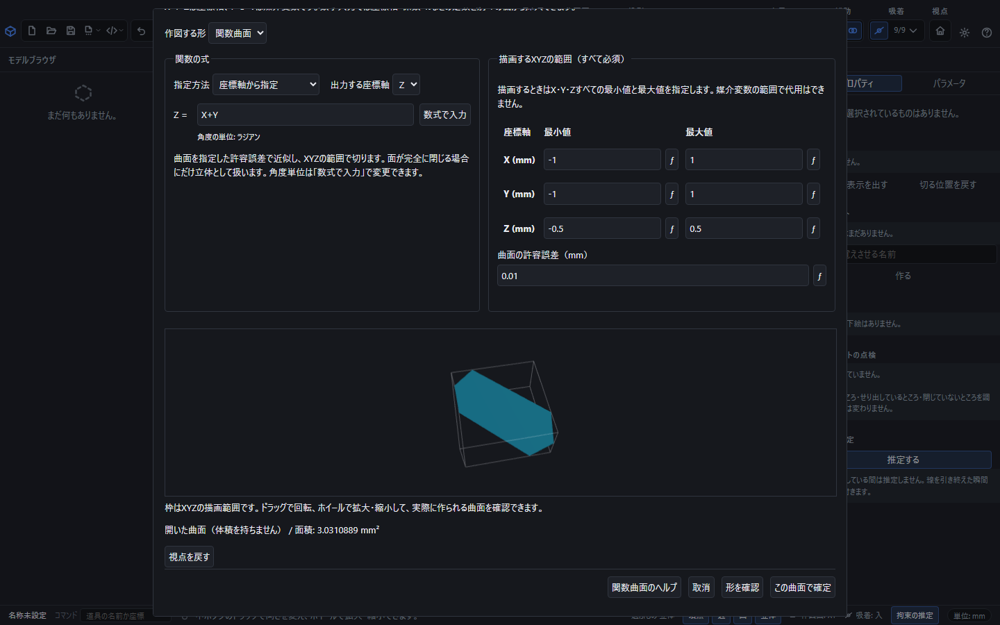
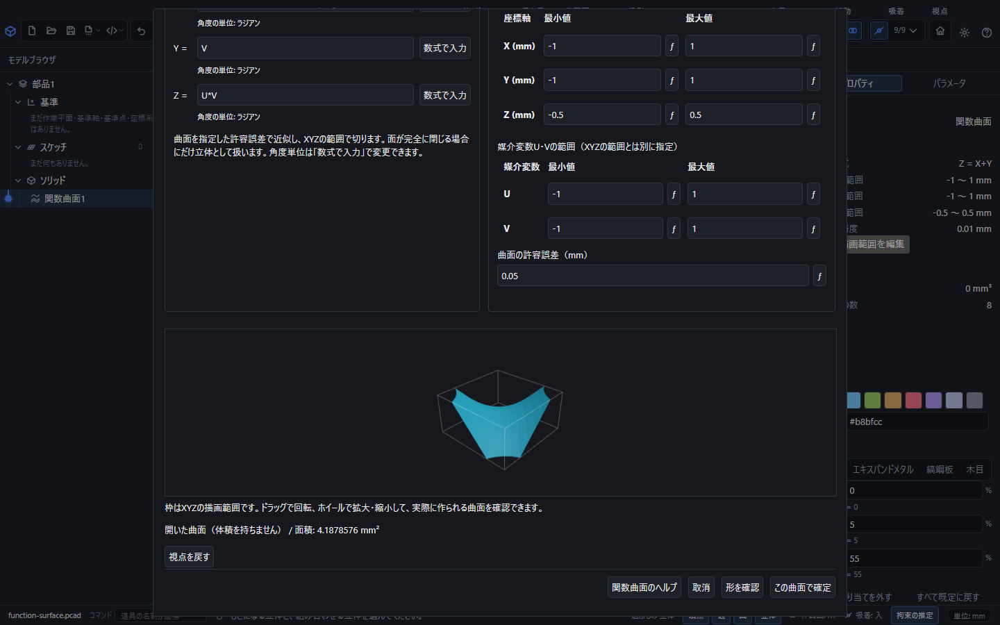
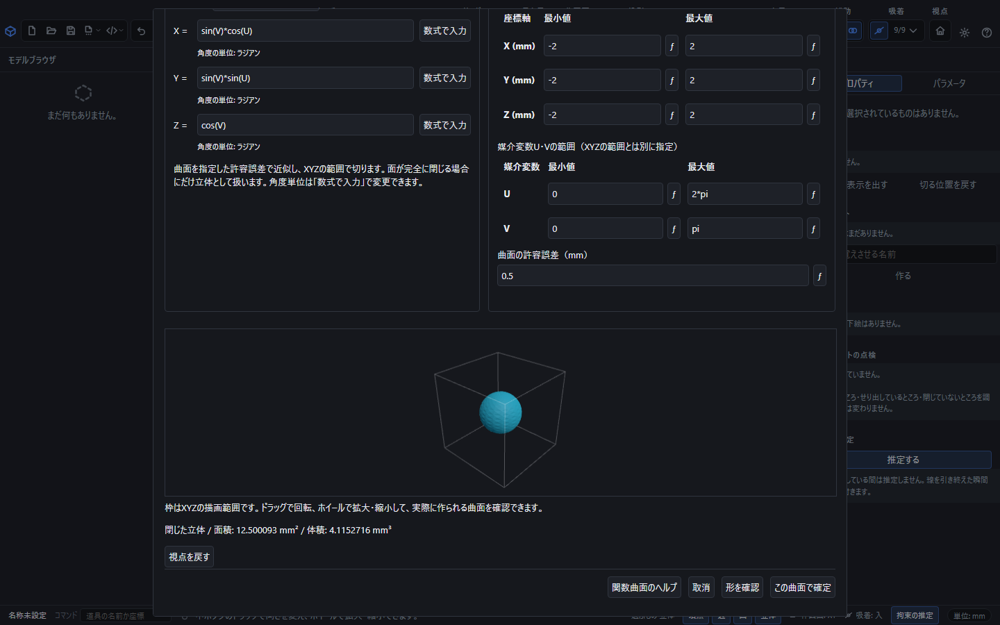
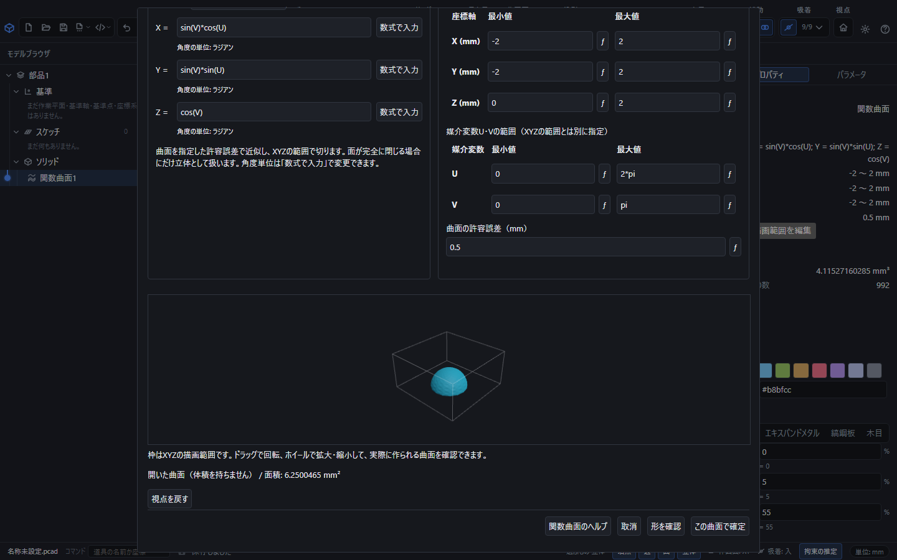
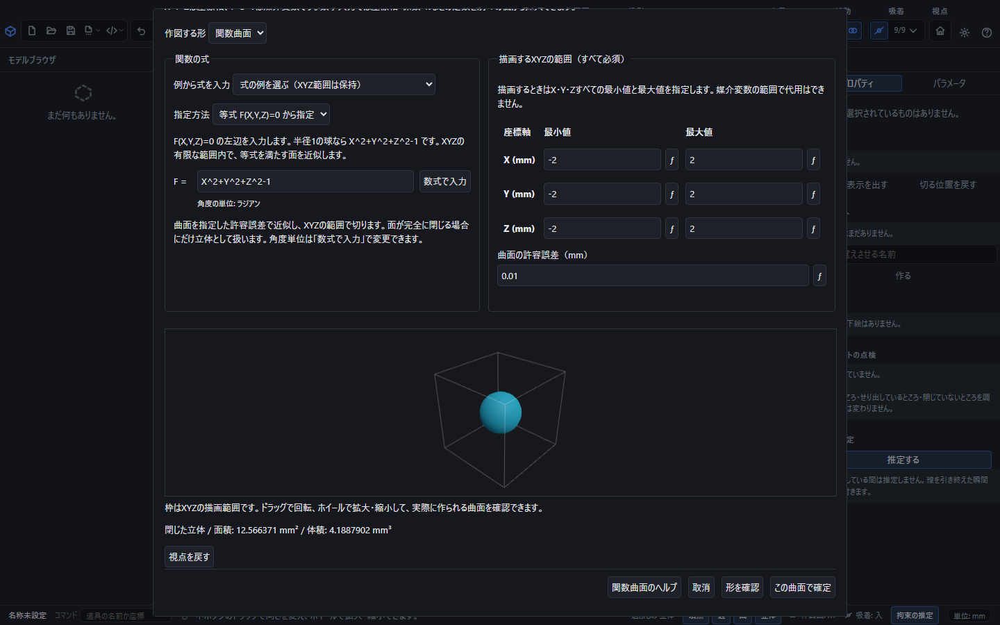
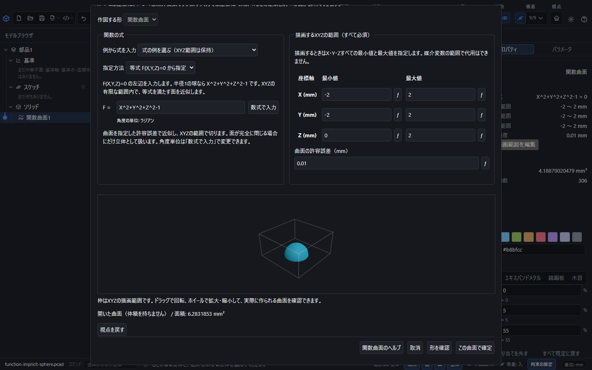
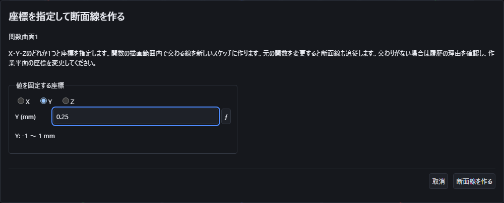

# 関数とXYZの範囲から曲面を作る

入力中の **F1** でこの説明を開けます。ヘルプを閉じると、書きかけの式やXYZの範囲を続けて入力できます。

座標曲面・媒介曲面・空間内の等式に座標を指定して点を置く操作は、[関数上に座標を指定して点を作る](function-point.md)を参照してください。

「作図」→「関数作図」を開き、作図する形を「関数曲面」にします。2つの座標から残りの座標を求める式、2つの媒介変数からXYZを求める式、またはXYZの等式で曲面を作成します。

## XYZの範囲で斜面を切り取る

1. 指定方法を「座標軸から指定」、出力する座標軸を「Z」にします。
2. 「Z 関数の式」に `X+Y` を入力します。
3. XYZの最小値と最大値をすべて指定します。X=-1～1、Y=-1～1、Z=-0.5～0.5とします。
4. 曲面の許容誤差を `0.01` mmにして「形を確認」を押します。
5. プレビューをドラッグして回転できます。ホイールで拡大・縮小でき、「視点を戻す」で初期の視点へ戻ります。
6. 枠の中の形を確認して「この曲面で確定」を押します。

この例の斜面はZ=-0.5とZ=0.5で切れます。枠の外側の形を隠しているだけではなく、保存後に再計算するCAD形状も同じ範囲で切れます。元の無限平面全体や、Zの値を境界へ押しつぶした面は作りません。

XYZの6欄は毎回必須です。すべて有限な値で、各軸とも最小値 < 最大値にします。空欄、無限大、ゼロ幅、逆順では確定できません。範囲・式・精度を変えると以前のプレビューを消し、再確認してから確定します。式が定義できない、範囲内に面がない、指定精度で計算できない場合も理由を表示します。

## 媒介変数U・Vを使う

「媒介変数U・Vから指定」を選ぶと、X・Y・Zそれぞれの式とU・Vの範囲を入力できます。例えば X=`U`、Y=`V`、Z=`U*V`、U=-1～1、V=-1～1で鞍状の面を作れます。

U・Vの範囲は無次元です。XYZの描画範囲とは別に必須で、どちらかを省略して他方で代用することはできません。例えばZ=-0.25～0.25に狭めると、U・Vの範囲を変えずにその高さの部分だけを残します。

「形を確認」の後は、プレビュー全体と面の種類・面積・確定ボタンが見える位置へ移動します。式や範囲を再編集するときは上へスクロールします。

出力座標の式には入力側の座標軸だけを使用します。Zを求める形式ではX・Y、Xを求める形式ではY・Zを使用できます。媒介変数形式ではU・Vを使用します。

## 球面・トーラスを例から作る

入力欄の「式の例」で球面やトーラスを選べます。例を選ぶと式とU・Vの範囲が入り、角度の単位は既定の「度」になります。球のUは `0` ～ `360`、Vは `0` ～ `180`、トーラスのU・Vはどちらも `0` ～ `360` です。**XYZの範囲と許容誤差は、入力した値を維持します。** 新しく開いた画面ではXYZは空欄のままなので、6境界を指定してください。

球面の例は半径1 mmです。XYZを各軸とも-2～2 mmにして「形を確認」を押すと、球の全体が範囲に収まります。周期の継ぎ目と両極を接続した閉面が有効な場合、プレビューに「閉じた立体」と面積・体積が表示されます。曲面は指定した許容誤差で近似します。許容誤差を小さくすると計算量が増えるため、必要な精度を指定してください。

同じ球面でZの最小値だけを0 mmにすると、下半分が切り取られます。この開いた半球には底面を追加しません。「開いた曲面（体積を持ちません）」と面積が表示されます。

継ぎ目の接続は対応できる式の厳密な一致から判定します。例えば1周の境界には、度なら `360`、ラジアンなら `2*pi` を使います。円周率を小数へ丸めた値や、近くにある別の面を同じ境界とみなして閉じることはありません。

## 等式F(X,Y,Z)=0から面を作る

「指定方法」を「等式 F(X,Y,Z)=0 から指定」にすると、1つの等式から曲面を作れます。X・Y・Zのどれかを他の2軸の式へ変形する必要はありません。

1. 「F =」の欄には、等式の左辺だけを入力します。半径1 mmの球なら `X^2+Y^2+Z^2-1` です。式の例からも入力できます。
2. XYZの最小値と最大値を各軸とも-2～2 mmにします。等式を選んでも6境界は必須です。媒介変数U・Vの欄は使用しません。
3. 許容誤差を0.01 mmとして「形を確認」を押します。下の実画面では半径1 mmの球が作られ、面積は約12.5664 mm²、体積は約4.18879 mm³になります。
4. 閉じた立体であることと体積を確認し、「この曲面で確定」を押します。

保存してファイルを開き直しても、等式・XYZ範囲・許容誤差から再計算されます。関数曲面の「関数と描画範囲を編集」でZの最小値を0 mmに変えると、範囲内の半球だけが残ります。開いた部分に底面は付きません。

球や軸方向のトーラスと同じ形になる等式では、解析的なCAD曲面を利用して細かい精度でも生成できます。それ以外の等式は指定精度で近似します。どちらの場合もXYZの範囲で切り取ります。

指定範囲に面がない場合、面のつながりを確認できない場合、指定精度で計算しきれない場合は理由を表示します。計算の途中までできた面を勝手に確定することはありません。許容誤差を変更した場合は、改めてプレビューを確認してください。

## 座標を固定して断面線を作る

曲面を選び、プロパティの **{{ui:functionSection.title}}** を押します。X・Y・Zのどれか1つを選び、その座標をmmで入力します。たとえば `Z = X + Y` の曲面でYを選び、`0.25`を入力すると、Y＝0.25の平面と交わる線を作ります。座標は元の関数に設定したXYZの範囲内に指定してください。

**{{ui:math.open}}** から数学記号や係数を使った座標も入力できます。角度は既定で度です。数式入力でラジアンへ切り替えることもできます。**{{ui:functionSection.apply}}** を押すと、座標を保持する作業平面と断面線のある新しいスケッチが作られます。作業平面は最初は非表示です。

断面線は元の曲面を参照しています。元の式や係数を変更すると再計算されます。切る位置を後から変えるときは、履歴の断面線を選び、**{{ui:functionSection.edit}}** を押します。元と同じX・Y・Zの座標で入力し、**{{ui:functionSection.update}}** を押すと、断面線を増やさず更新できます。作業平面と新しいスケッチの作成はUndo1回で一緒に取り消せます。

範囲内でも曲面と交わらない座標はあります。その場合は履歴に表示される理由を確認し、切る位置を変えてください。座標の確認中は **{{ui:functionPlot.stop}}** または **{{ui:math.cancel}}** で中止できます。

開発版の実画面です。切る軸をYにすると、座標欄の単位mmと、元の関数が許すYの範囲を確認できます。画面の見え方を動かしても、この座標範囲は変わりません。

## 数学記号・係数・角度単位

双曲線関数とその逆関数も使えます。例えばZに`asinh(X)+acosh(Y)`、Xの範囲を−1〜1、Yを1.1〜2、Zを−2〜3とすると、逆双曲線関数を組み合わせた開いた曲面を作れます。`acosh`の入力は1以上に限られ、この例では滑らかな部分を使うため1.1から始めています。双曲線関数の値は度とラジアンの切替では変わりません。保存するのは元の式と範囲です。

偏微分した曲面も作れます。Zの式に`diff(X^2+Y^2,X)`を入力すると、Yを固定してXで微分したZ=2Xを作図します。変数を続けて指定すると、その順で微分します。元の式が計算できない位置は穴のまま残し、式と範囲を保存します。詳しくは[導関数で曲線と曲面を作る](math-input.md#導関数で曲線と曲面を作る)を参照してください。

ヘッセ行列の成分も曲面に使えます。Zに`component(hessian(X^2*Y,[X,Y]),1,2)`を入力すると、X、Yの順で微分した2Xを作図します。最初の番号が行、次が列で、変数一覧の順序に対応します。勾配・発散・回転などの意味と成分の選び方は[直交座標のベクトル解析](math-input.md#直交座標のベクトル解析)を参照してください。

式の「数式で入力」で、座標軸、媒介変数、係数、数学定数を分けて挿入できます。`X` は座標、`coef("X")` は「X」という名前の係数、`pi`・`π` は円周率です。パラメータ表の係数を変更すると形も再計算されます。

角度単位は新規入力では「度」が既定です。各欄の「数式で入力」で数学入力画面を開き、「角度単位」から式ごとに「ラジアン」へ切り替えられます。直接書き換えた場合も保存・再編集後も選んだ単位は変わりません。切替時は媒介変数の範囲も選んだ単位に合わせて指定してください。境界値にも式を使用できます。記号や引数は[数式で入力する](math-input.md)を参照してください。

関数曲面を選んだプロパティの「関数の係数を動かす」では、式で使う係数の範囲を指定し、つまみや方向キーで形を調整できます。1回のドラッグはUndo1回で戻ります。動かす係数自身の式は数値に置き換わるため、係数間の式を保つ場合はパラメータ表から編集してください。XYZの描画範囲は変わりません。詳しくは[係数を動かして形を調整する](function-curve.md#係数を動かして形を調整する)を参照してください。

## 面と立体、保存と取消

開いた曲面は面積を持ちますが、体積は持ちません。完全に閉じた形だけを立体として扱います。XYZ境界で切ってできた開口を自動でふさぐことはしません。プレビューで「開いた曲面」「閉じた立体」などの種類と面積を確認できます。

保存するのは原式、係数の参照、XYZと媒介変数の範囲、角度単位、許容誤差です。開き直すと同じ入力から形を再計算します。ツリーの関数曲面を選び「関数と描画範囲を編集」で再編集できます。1回の確定を「元に戻す」1回で取り消せます。入力の取消や計算の中止では、途中の形を履歴へ追加しません。
