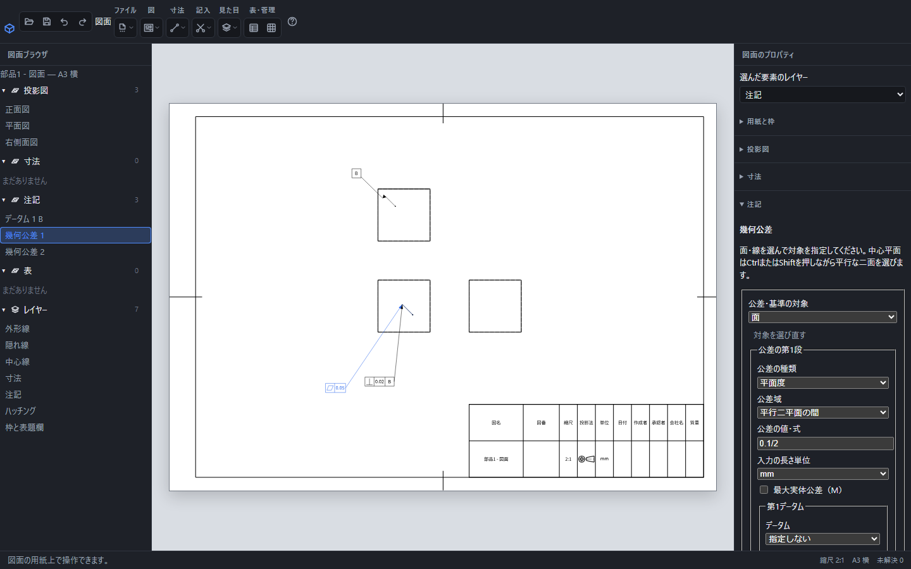
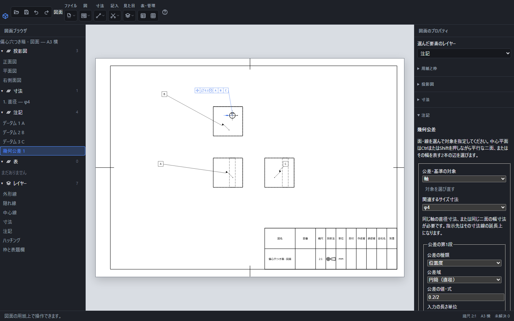
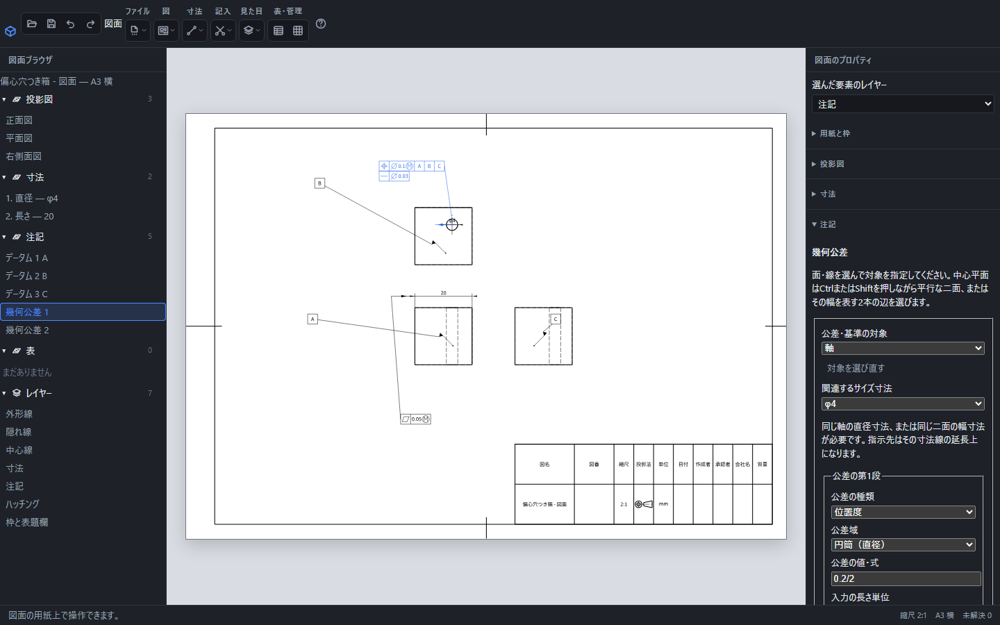
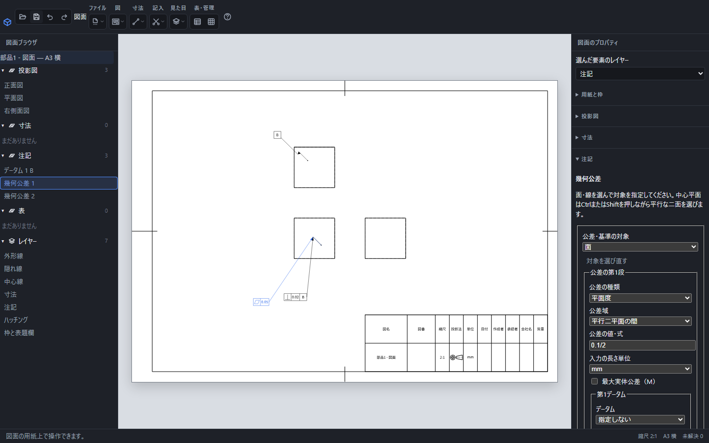

# 幾何公差とデータムを記入する

図面の「記入」からデータムと幾何公差を作成できます。数値・式、対象の面や軸、参照する基準を持つため、文字を並べた注記として扱う必要はありません。記入方法はJIS B0021:1998、データムはJIS B0022:1984、最大実体はJIS B0023:1996を対象としています。

## 平面度を記入する

1. 「記入」→「幾何公差」を押します。
2. 対象の面をクリックし、「公差・基準の対象」を面にします。
3. 「公差の種類」で「平面度」を選び、公差の値・式を入力します。`0.1/2`なら紙面には`0.05`と出ます。
4. 文字高と位置を指定し、「決定」を押します。位置を空欄にすると対象から横・縦へ20mm離れた位置に置きます。

平面度のように形そのものを指示する公差にはデータムを付けません。面への指示は面内の点と引出線、軸や中心平面への指示は関連付けたサイズ寸法線で示します。

## データムを作る

「記入」→「データム」を選び、基準とする面・線・軸・中心平面を指定します。基準名はA〜Zの1文字です。「決定」で紙面に三角と文字枠が付きます。

軸を指定するときは、その軸と同じ円の直径寸法を先に作ります。中心平面は同じ部品の平行な2面をCtrlまたはShiftで選び、その2面間の幅寸法を関連付けます。「関連するサイズ寸法」の候補が1つなら自動で選ばれます。

裏側の面が見えない場合は、幅を表す2本の投影辺をCtrlまたはShiftで選べます。辺が属する平行二面を実形状から一意に特定できる場合だけ、中心平面として指定します。同じ2本の辺に記入した幅寸法を関連付けてください。辺の所属が複数候補になる場合や、別の部品・別の図の辺を混ぜた場合は確定できません。

幅寸法は「寸法」→「長さ」を押し、最初の辺からCtrlまたはShiftを押したまま2本選びます。修飾キーなしで1本の辺を選ぶ操作は、その辺自体の長さを記入します。

左の「注記」からデータムの行を選ぶと改名・位置・対象を編集できます。名前をAからBへ変えると、そのデータムを参照する公差枠もBになります。

## 基準に対する直角度を記入する

1. 基準面にデータムAを作ります。
2. 別の面を選び、「記入」→「幾何公差」を開きます。
3. 種類を「直角度」、公差の値を`0.02`にします。
4. 「第1データム」でAを選び、「決定」を押します。

第1、第2、第3データムは優先順の異なる別々の欄です。同じデータムを同一段で繰り返したり、公差の対象そのものを基準にしたりする指定は決定できません。

## 位置度をA・B・Cの基準で記入する

1. 基準となる3つの面にデータムA、B、Cを作ります。
2. 穴の円に直径寸法を記入します。位置を定義する寸法も記入し、必要な寸法を「理論的に正確な寸法（四角枠）」にします。
3. 穴を選び、「記入」→「幾何公差」を開きます。「公差・基準の対象」で軸、「公差の種類」で位置度を選びます。
4. 「関連するサイズ寸法」に穴の直径寸法を選びます。公差域を円筒、公差の値・式を`0.1`にします。最大実体を指示する場合は「最大実体公差（M）」を選びます。
5. 第1データムをA、第2をB、第3をCにします。「理論的に正確な寸法の参照」で位置の寸法を選び、「決定」を押します。

枠には位置度の記号、直径記号付きの公差値、最大実体のM、A・B・Cが順に入ります。軸の指示は関連付けた直径寸法へつながります。入力中に赤い理由が出た場合は、対象とサイズ寸法、基準の組み合わせを見直してください。

## 選べる14種類

| 種類 | 対象と主な指定 |
| --- | --- |
| 真直度 | 線または軸の真っすぐさ。データムなし。 |
| 平面度 | 平面または中心平面の平らさ。データムなし。 |
| 真円度 | 円形の断面の丸さ。データムなし。 |
| 円筒度 | 円筒面の形。データムなし。 |
| 線の輪郭度 | 線・曲線の輪郭。必要に応じてデータムを指定。 |
| 面の輪郭度 | 面の輪郭。必要に応じてデータムを指定。 |
| 平行度 | 基準に対する平行な姿勢。 |
| 直角度 | 基準に対する直角の姿勢。 |
| 傾斜度 | 基準に対する所定角度の姿勢。理論的に正確な角度寸法も記入します。 |
| 位置度 | 軸または中心平面の位置。位置を定義する寸法とともに指定します。 |
| 同軸度 | データム軸に対する対象軸の位置。 |
| 対称度 | 基準に対する中心平面の位置。 |
| 円周振れ | データム軸の周りに回した断面の振れ。 |
| 全振れ | データム軸の周りに回した面全体の振れ。 |

「公差域」には選んだ種類に対応する候補が出ます。種類を変えると、平面には二平面、軸には円筒など、対象に合う初期候補へ切り替わります。円筒の公差域では値の前に直径記号が付きます。

## 理論的に正確な寸法

先に通常の寸法を作り、その寸法のプロパティで「理論的に正確な寸法（四角枠）」を選びます。数値が四角で囲まれます。この寸法には寸法公差・はめあい・参考寸法の括弧を併用できません。

幾何公差の入力欄にある「理論的に正確な寸法の参照」で、位置や角度を定義する寸法を関連付けます。指定した寸法を削除したり通常の寸法へ戻したりした場合は、公差枠の参照を修復してください。

失われたデータムとサイズ寸法は、選択欄に未解決と表示します。正しい候補を選び直してください。失われた基本寸法はチェックを外して参照を解除し、作り直した寸法を選べます。傾斜度には、解決できる理論的に正確な角度寸法の参照が必要です。

## 最大実体の指定

適用できる軸や中心平面では「最大実体公差（M）」を選べます。公差値の後ろに丸で囲まれたMを表示します。サイズ形体を持たない面・線や、真円度・円筒度・振れなどの適用できない種類には指定できません。

データム側の最大実体指定は、そのデータムの欄で個別に選びます。基準自体がサイズ形体である必要があります。公差の値は通常正の長さですが、適用可能な最大実体公差では0も入力できます。

## 共通データムと複数段

データムの欄で「共通データムのもう一方」にもう1つの基準を選ぶと、A-Bのように同じ欄に表示します。公称形状で同じ軸または同じ平面となる2基準を選んでください。優先順を付けたA、Bの別々の欄とは異なります。

「公差の段を追加」で最大8段まで公差枠を作れます。各段の種類、値、最大実体、データム、理論的に正確な寸法を独立して指定できます。「この段を削除」で段を除けます。最後の1段は削除できません。

この例では位置度の下に真直度を追加しています。右の中心平面の平面度は別の枠で、幅20の寸法を関連付けています。各段の基準の有無と最大実体は、その段の種類・対象に合わせて指定してください。

## 移動・複製・削除・対象の修復

用紙上の枠、または左の「注記」の行を選ぶと再編集できます。「対象を選び直す」で別の形体を指定できます。変更を反映するのは「決定」を押したときです。「閉じる」またはEscは作成・編集をやめます。

枠をドラッグして紙面上を移動できます。CtrlまたはShiftで複数選ぶとまとめて移動できます。「記入」→「公差・データムを複製」では選択した要素を複製します。基準と枠を一緒に複製した場合は、新しい基準名を付け、複製した枠が新しい基準を参照します。枠だけを複製した場合は元の基準を参照します。

選択してDeleteで削除できます。基準だけを消すと、それを参照する枠は未解決になります。Ctrl+Zで元に戻せます。作成・編集・複数選択の移動・複製・削除はそれぞれ1操作で戻ります。

## 元形状の更新と保存

元部品を変更して保存した後、図面の「ファイル」→「元の部品・組立を取り込み直す」で変更後のファイルを選びます。用紙や枠の設定を保ったまま図を作り直します。更新はCtrl+Zで元の形と一緒に取り消せます。

部品を更新しても対象の面・軸・配置を識別できれば参照が追従します。識別できない場合は赤い案内が出ます。案内の項目を選び、対象や基準を選び直してください。他の配置の同形状へ勝手に付け替えることはありません。

`.pcadd`には値の式、単位、基準の参照、位置を保存します。表示は現在のパラメータから再評価し、長さはmmで示します。配布するときは[図面の保存・出力](drawing-export.md)を使います。対象や指定が未解決の公差枠は、修復してから出力してください。

[溶接記号](welding.md)・[寸法公差とはめあい](dimension-tolerance.md)・[図面の作り方](drawing.md)

異常終了後の控えからも公差の式・基準・未解決の参照を復元できます。[図面の作り方](drawing.md)の「前回の作業を復元する」を参照してください。復元した図面はCtrl+Sで保存し、未解決の参照は出力前に修復します。

