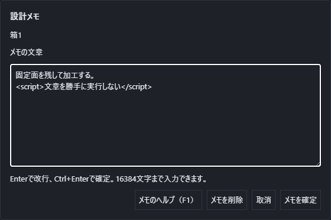
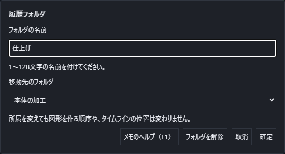

# 履歴へ設計メモを残す

形状の寸法を選んだ理由、加工時の注意、後で見直す条件を、作ったものごとに文章で残せます。数式としては計算せず、メモを変更しても形や履歴の順序は変わりません。

## メモを付ける・読み直す

1. 左の一覧で対象の行の「⋮」を押すか、行を右クリックします。
2. **{{ui:historyNote.edit}}**を選びます。上に出る対象の名前を確認してください。
3. 文章を入力し、**{{ui:historyNote.apply}}**を押します。Ctrl+Enterでも確定できます。

スケッチ内の点や線、スケッチそのもの、基準、立体の各段に付けられます。改行を使え、1件16,384文字まで入力できます。Enterだけなら文章の改行です。HTMLのような文字もそのまま文章として扱い、実行しません。

メモを付けた行には「メモ」の印が出ます。もう一度同じメニューを開くと文章を読み直し、修正できます。対象の名前や並びを変えても、その対象のメモは残ります。同じ名前の別の対象へ付け替わることはありません。

## 取消・削除・元に戻す

**{{ui:historyNote.cancel}}**またはEscで、入力する前のメモを保持して閉じます。メモを消すときは**{{ui:historyNote.delete}}**を押してください。空白だけを確定してもメモは消えます。

追加・修正・削除は、それぞれ「元に戻す」1回で戻せます。対象そのものを削除するとメモも一緒に消え、その削除を戻すと対象とメモが一緒に戻ります。立体の抑制や非表示ではメモを消しません。

## 保存する

メモを確定した後、部品を通常どおり保存します。`.pcad`を開き直しても文章が残ります。入力中にまだ確定していない文章は保存の対象になりません。組立に取り込んだ部品にも、その部品のメモを保持します。

「ひな形として保存」では、図形の履歴と一緒にメモも取り除きます。新しく作る図形に、元の図形の説明を引き継ぐことはありません。

文字数を超えたときは、本文を短くするまで確定できません。編集中に他の操作で同じメモが変わった場合は上書きせず知らせます。必要な文章を控えて取消し、メモを開き直してください。この画面でF1を押すと説明を開けます。

## フォルダにまとめる

左の一覧で**{{ui:historyFolder.create}}**を押し、名前と置き先を指定して**{{ui:historyFolder.apply}}**を押します。フォルダの中に別のフォルダを作ることもできます。名前は128文字まで、1文書1024フォルダ・入れ子32段までです。

図形の行のメニューから**{{ui:historyFolder.moveTitle}}**を選ぶと、作成済みのフォルダへ移せます。移動先には親からの経路を表示します。同じ親の下に同名フォルダがあるときは、ツリーと選択肢の両方へ番号を付けて区別します。フォルダから外すと、もとの種類の一覧へ戻ります。

フォルダ名を押すと中身を畳み、もう一度押すと開きます。フォルダを移しても、図形を作る順序とタイムラインの位置は変わりません。所属の変更だけでは形の再計算を行いません。

フォルダ横の**{{ui:historyFolder.edit}}**から、名前と親フォルダを変更できます。自分自身や自分の中のフォルダは移動先に選べません。**{{ui:historyFolder.remove}}**はフォルダだけを外し、中の図形や子フォルダを親へ戻します。図形を削除する操作ではありません。

作成・移動・名前変更・解除はそれぞれ「元に戻す」1回で取り消せます。保存して開き直しても、メモとフォルダの所属を保持します。開いたり畳んだりする表示は文書の編集履歴に加えません。ひな形には図形の履歴と同じくメモとフォルダを引き継ぎません。

メモや所属の対象が失われた壊れたファイルは、読込み時に理由を知らせて断ります。現在編集中の文書や元のファイルを変更せず、別の図形にメモを付け替えることもありません。

