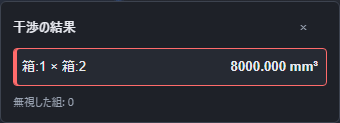

# 部品の干渉を調べる

上の **干渉を調べる** を押すと、表示中の部品どうしが食い込んでいないかを調べます。調べている間は画面下に進行中の案内が出ます。

終わると干渉している組の件数が画面下に出ます。右側には部品の組と食い込んだ体積が並び、選んだ組は画面で確かめられます。

非表示または抑制した部品は対象になりません。結果が不要になったら干渉の欄を閉じてください。

## うまくいかないとき

- **「干渉を調べるには、表示中で抑制していない部品が2個以上必要です。部品を配置するか、表示・抑制の設定を見直してください。」** … 対象になる部品が足りません。部品を追加するか、非表示・抑制の設定を見直してください。
- **「別の操作が進行中です。入力を確定するか取り消してから、もう一度操作してください。」** … 入力中の操作を終えてから、干渉を調べてください。
- **「形を計算しています。計算が終わってから、もう一度操作してください。」** … 計算が終わるまで待ってください。
- **「現在の形の計算が完了していません。完了を待ち、失敗している場合は履歴の原因を修正してから、もう一度操作してください。」** … 計算結果を待つか、履歴に表示された失敗の原因を直してください。
- **「干渉計算を準備しています。準備が終わってから、もう一度操作してください。」** … 準備が終わってから押し直してください。

結果の下には、干渉している組の件数のほかに「無視した組」と「測れなかった組」の件数も出ます。測れなかった組は、形の計算などの理由でその組の食い込みを調べられなかった数です。干渉の結果は組み立てには保存されないため、開き直した後や部品を動かした後にまた確かめたいときは、干渉を調べるを押し直してください。
