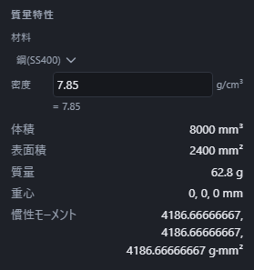

# 材料と重さを調べる

立体を 1 つ選んで「測る」を押すと、体積のほかに**重さ・重心・慣性モーメント**が出ます。右のプロパティの「質量特性」に並びます。

材料を選ぶと、その材料の密度で重さが計算し直されます。同じ形でも、鋼なら重く、アルミなら軽くなります。

## 調べ方

1. 下の帯の「選ぶもの」を「立体」にして(`4` キー)、立体をクリックします。
2. 「見た目」→「測る」を押します。
3. 右のプロパティに「質量特性」が出ます。

出るのは次の 5 つです。

| 欄 | 意味 |
|---|---|
| 体積 | 中身の詰まった量(mm³ または in³) |
| 表面積 | 外側の面の合計(mm² または in²) |
| 質量 | 体積 × 密度。1000g を超えると kg で出ます |
| 重心 | つり合いの取れる点の座標(mm または in) |
| 慣性モーメント | 重心を通る 3 本の軸まわりの回りにくさ(g·mm²) |

## 材料を選ぶ

「材料」の一覧から選びます。金属・樹脂・ガラス・ゴム・木材の 19 種類があります。

| 材料 | 密度 (g/cm³) |
|---|---|
| 鋼(SS400) | 7.85 |
| ステンレス(SUS304) | 7.93 |
| アルミ(A5052) | 2.68 |
| 黄銅 | 8.4 |
| 銅 | 8.96 |
| チタン | 4.51 |
| ABS 樹脂 | 1.05 |
| ポリカーボネート | 1.2 |
| ナイロン | 1.14 |
| アクリル | 1.19 |
| PLA(3D プリント) | 1.24 |
| ガラス | 2.5 |
| ゴム | 1.2 |
| 木材(ヒノキ / スギ / ナラ / ウォールナット / チーク / メープル) | 0.41〜0.68 |

**最初に選ばれている材料は、その立体の見た目から決まります。** 「見た目」でアルミの材質を付けた立体なら、材料も最初からアルミになっています。見た目を付けていない立体は鋼から始まります。

見た目と材料は別々に選べます。木目を付けた立体を鋼として計算することも、鋼に見える立体をアルミとして計算することもできます。

## 密度を自分で入れる

一覧に無い材料や、発泡材・中空の見立てで計算したいときは、「密度」の欄に直接書けます。単位は g/cm³ です。

計算式も書けます。`2.7*1` と書けば 2.7 として計算され、**打った式はそのまま欄に残ります**。あとから見返したときに、何をもとにした数字なのかが分かります。パラメータの名前も使えます。

密度には **0 より大きい有限の数**を入れます。`1/2` は 0.5 g/cm³ として使えますが、0・負の数・空欄・`1/0`・存在しない名前は使えません。不正な式は欄の近くに理由が出て、質量と慣性モーメントが「未計算」になります。材料の既定値に勝手に置き換わることはありません。体積・表面積・重心は残り、正しい密度に直すと質量と慣性モーメントも再表示されます。

材料を選び直すと、密度の欄はその材料の値に戻ります。自分で入れた式は上書きされるので、材料を決めてから密度を書き換えてください。

## 部品全体と立体ごと

いま出るのは**選んだ立体 1 つ**の値です。部品にいくつも立体があるときは、1 つずつ選んで測ります。全部を足した重さが知りたいときは、先に「合わせる」の「和」で 1 つの立体にまとめてから測ってください。

別の立体を選んだら「測る」を押し直してください。測り直すまでは新しく選んだ立体の質量を出しません。前の結果の対象名と体積は「測定」の節で見分けられます。

穴のあいた立体は、**穴の分をきちんと引いた**体積が出ます。中が空洞の立体も同じで、外側の見た目ではなく実際の中身の量で計算されます。

## 値の見方

- **重心**は世界の原点から測った座標です。左右対称な形なら、真ん中の値になります。
- **慣性モーメント**は 3 つ並んで出ます。重心を通る 3 本の軸(いちばん回りにくい向きから順)まわりの値です。回転する部品の設計で使います。
- 画面の数字は読みやすい桁数に丸めています。ミリメートル表示の重心は小数 6 桁まで、インチ表示の重心・面積・体積は小数 3 桁です。ミリメートル表示の面積・体積、質量・慣性モーメントは有効数字 12 桁です。表示の丸めで形や測定値そのものが変わることはありませんが、書き写した数字は表示桁数までの値です。
- [単位を切り替える](units.md)と、体積・表面積・重心の表示も切り替わります。重さは g・kg、密度は g/cm³、慣性モーメントは g·mm² のままです。

## 消えるとき

質量特性も測定と同じで、**形を変えるまで残ります**。Esc を押すか、形を変えると消えます。もう一度「測る」を押せば出し直せます。

色や材質を変えただけでは消えません。形が変わっていないので、体積も重心もそのまま正しいためです。

長さや角度の測り方は「[長さ・角度・面積を測る](measure.md)」を見てください。
