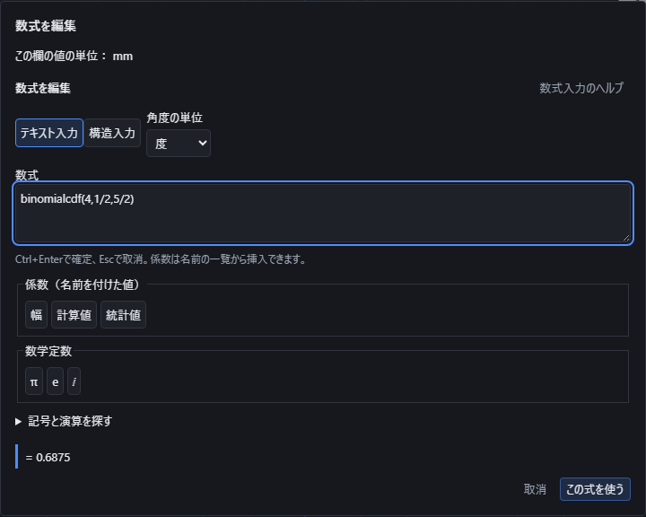
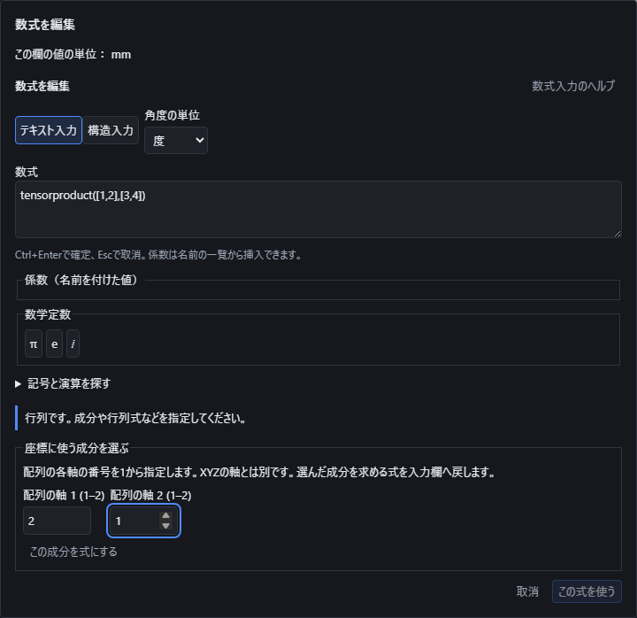

# 構造化した数式と係数を入力する

数式入力の画面内で **F1** を押すと、この説明を開きます。閉じると入力中の式に戻り、そのまま編集を続けられます。

パラメータ表、作図中の座標・寸法欄、プロパティの「数式で入力」から数式の編集画面を開きます。式の形と計算結果を確認して「この式を使う」を押します。パラメータやプロパティでは参照する形へ反映されます。作図中は入力欄の下書きが変わり、図形の決定で初めて履歴に残ります。取消では元の式を維持します。

## 入力方式と単位

「テキスト入力」では `sqrt(2)`、`5!`、`abs(-3)`、`log(8,2)`、`sum(i^2,i,1,10)` のように入力できます。「構造入力」では分数の分子・分母や指数を画面上で編集します。方式を切り替えても式の意味は維持します。

数式の編集画面に表示される「この欄の値の単位」を確認してください。長さのパラメータはmm、角度のパラメータは度です。三角関数の引数は、新規入力では「度」が既定です。「角度の単位」で任意に「ラジアン」へ切り替えられ、保存・再編集後も選んだ単位を保持します。例えば度なら `sin(30)`、ラジアンなら `sin(pi/6)` はどちらも0.5です。角度の寸法欄へラジアンの値を入れる場合は、`rad(pi/2)` のように書くと90度になります。

作図画面の長さ表示がinchでも、数式編集画面がmmと表示している欄の結果はmmです。寸法の単位と三角関数の角度単位は別に確認してください。

## パレットの例と引数の順序

「記号と演算を探す」を開き、「数学の分野」で統計や線形代数などに絞り込めます。「全ての分野」に戻すと全候補を表示します。分野と「名前・記号で検索」は組み合わせて使えます。パレットでは記号だけでなく意味を確認でき、下の入力例も参考にしてください。引数が複数ある関数は順序にも意味があります。

| 入力例（テキスト） | 結果・使い方 |
|---|---|
| `log(8,2)` | 真数8、底2の順で3。自然対数は`ln`、常用対数は`log10`を使います。 |
| `reciprocal(4)` | 逆数0.25。0の逆数は使えません。 |
| `5!!` | 二重階乗5×3×1=15。`(5!)!`とは別です。0!!と(-1)!!は1です。 |
| `permutations(5,3)` | 5個から3個を順に選ぶ場合の数60。2つとも0以上の整数を指定します。 |
| `clamp(8,1,5)` | 値8を下限1・上限5で制限して5。関数作図のXYZ範囲指定とは別の数値演算です。 |
| `atan2(1,-1)` | y、xの順で第2象限の方向。度なら135、ラジアンなら3π/4です。両方0には向きがありません。 |
| `arccot(-1)` | 度なら135。実数の主値は0〜180度の間です。逆数の`cot`とは異なります。 |
| `sech(0)` | 1。sinh/cosh/tanhやcoth/sech/cschは双曲線関数で、度／ラジアンの切替を適用しません。 |
| `component([[1,2],[3,4]],2,1)` | 行列、行番号、列番号の順で3。行と列の番号は1から始まります。 |
| `sum(i^2,i,1,3)` | 1²+2²+3²=14。添字iと係数i、虚数単位は別です。 |
| `integrate(t^2,t,0,3)` | 変数tについて0〜3の定積分で9。結果が未確定なら座標へ適用できません。 |

逆正割・逆余割は`arcsec`・`arccsc`、逆双曲線関数は`acoth`・`asech`・`acsch`も使えます。定義域の外で複素数になる場合は、結果の型を確認してください。0の対数、対数の底1、三角関数の極、範囲外の行列番号などは理由を表示します。

## 二項分布の確率を求める

同じ成功確率で互いに独立な試行を繰り返すとき、「統計」のパレットから二項分布の確率を選べます。引数の順序は**試行回数n、成功確率p、成功回数k（累積確率では上限x）**です。

| 入力例 | 意味と結果 |
|---|---|
| `binomialpmf(4,1/2,2)` | 4回中ちょうど2回成功する確率。6/16 = 0.375。 |
| `binomialcdf(4,1/2,2)` | 4回中2回以下、つまり0・1・2回成功する確率。11/16 = 0.6875。 |
| `binomialcdf(4,1/2,5/2)` | 2.5回以下なので2回以下と同じです。 |
| `1-binomialcdf(4,1/2,2)` | 2回を超えて成功する確率。5/16 = 0.3125。 |

nは0以上の整数、pは0以上1以下にしてください。整数・小数・分数に確定できる式や係数を使えます。ちょうどk回の確率は、kが整数でなければ0です。成功回数が負なら両方0、nを超えた場合は「ちょうど」が0、「以下」が1です。n=0は成功回数0、p=0は必ず0回成功、p=1は必ずn回成功として扱います。不正なnやpは、成功回数の範囲外であっても拒否します。

分数のまま計算して原式を保存します。0や1に直ちに確定する場合を除き、展開する試行回数は10,000回までです。それ以内でも正確な整数の桁数が計算上限に達した場合は理由を表示し、近似の確率へ置き換えません。確率を座標へ使う場合は、通常の数式と同じ「この式を使う」で確定します。

定義の参照先: [NIST 二項分布の確率と累積確率](https://www.itl.nist.gov/div898/handbook/eda/section3/eda366i.htm)。上限xが整数以外の場合とn=0・p=0・p=1は、上記の離散的な試行の意味で扱います。

## データから統計量を求める

「統計」のパレットでは母集団と標本を区別して選択します。データは`[1,2,3]`のような一覧で指定し、各値には整数・小数・分数に確定できる式や係数を使えます。1一覧は256個までです。πなど有理数に確定できないデータを使う統計、二項分布以外の確率分布、重回帰は現在この入口では扱えません。

| 入力例 | 結果・規約 |
|---|---|
| `mean([1,2,6])` | 算術平均3。 |
| `median([9,1,3,5])` | 昇順の中央2つを平均して4。奇数個なら中央の値です。 |
| `modes([1,1,2,2,3])` | 最頻値の一覧`[1,2]`。同率の値を全て残します。全て1回なら全てが同率です。 |
| `quantile([0,10,20,30],0.25)` | 分位点7.5。昇順の位置`(n−1)×割合`で隣接値を線形補間します。割合0と1は最小値と最大値です。 |
| `populationvariance([1,2,3])` | 母分散2/3。平均からの差の二乗の合計をnで割ります。 |
| `samplevariance([1,2,3])` | 標本分散1。n−1で割った母分散の不偏推定値で、2個以上必要です。 |
| `populationstandarddeviation([1,3])` | 母分散の平方根1。 |
| `samplestandarddeviation([1,3])` | 標本分散の平方根√2。標準偏差そのものの不偏推定値ではありません。 |
| `populationcovariance([1,2,3],[2,4,6])` | 母共分散4/3。対応するXとYの平均からの差の積をnで割ります。 |
| `samplecovariance([1,2,3],[2,4,6])` | 標本共分散2。n−1で割り、2組以上必要です。 |
| `correlation([1,2,3],[6,4,2])` | Pearson相関係数−1。 |
| `regressionslope([1,2,3],[3,5,7])` | Xの一覧、Yの一覧の順で、回帰直線`Y=aX+b`の傾きa=2。 |
| `regressionintercept([1,2,3],[3,5,7])` | 同じ切片付き最小二乗直線の切片b=1。 |
| `rsquared([1,2,3],[3,5,7])` | 切片付き単回帰の決定係数1。相関係数の二乗です。 |

空の一覧、個数の異なる組、0〜1を外れた分位点の割合は理由を表示して拒否します。Xが一定なら回帰の傾きは定まりません。相関と決定係数は、どちらかの一覧が一定でも定まりません。これらを0に置き換えて座標へ適用することはありません。

最頻値の一覧から座標へ1つを使う場合は、`component(modes([1,1,2,2,3]),2)`のように成分番号を明示してください。この例の結果は2です。入力方式を切り替えても、母/標本の区別、引数の順序、原式を維持します。

分位点の補間規約は[Rの公式資料のtype 7](https://stat.ethz.ch/R-manual/R-devel/library/stats/html/quantile.html)を使用しています。

## 連立一次式と行列から値を求める

行列は`[[2,1],[1,-1]]`のように行ごとに並べ、右辺は`[5,1]`のようなベクトルで指定します。「線形代数」のパレットで演算名・意味・例を確認できます。各成分には整数・小数・分数に確定できる式や係数を使えます。πなど有理数に確定できない成分や未決定の記号は、この6演算では扱えません。

| 入力例 | 結果・意味 |
|---|---|
| `linearsolve([[2,1],[1,-1]],[5,1])` | `2x+y=5`、`x−y=1`の解`[2,1]`。解が一つに決まる場合だけ返します。 |
| `rowreduce([[1,2,3],[2,4,6]])` | 簡約階段形`[[1,2,3],[0,0,0]]`。 |
| `nullspace([[1,2,3],[2,4,6]])` | `Ax=0`の独立な方向`[[-2,1,0],[-3,0,1]]`。零ベクトルしか解がなければ空の一覧です。 |
| `columnspace([[1,2,3],[2,4,6]])` | 元の行列から独立な列を選び、ベクトルの一覧`[[1,2]]`を返します。 |
| `rowspace([[1,2,3],[2,4,6]])` | 簡約した行列の零でない行`[[1,2,3]]`を返します。 |
| `linearsolutionspace([[1,2,3],[2,4,6]],[4,8])` | 特解と自由な方向`[[4,0,0],[-2,1,0],[-3,0,1]]`。全ての解は`[4,0,0]+s[-2,1,0]+t[-3,0,1]`で表せます。 |

最後の例のsとtには任意の実数を選べます。特解だけを唯一の解と見なさないでください。解がない連立一次式では「全ての解」は空集合を返し、「一意な解」は理由を示して確定を断ります。全ての解が1つなら特解1本だけを返します。行・列の空間が零空間なら、基底は空の一覧です。

座標に使う値は`component(linearsolve([[2,1],[1,-1]],[5,1]),1)`のように選びます。この例は第1成分の2です。基底の一覧は`component(nullspace([[1,2,3],[2,4,6]]),2,1)`で2本目の第1成分−3を選べます。番号は1から始まり、列空間の結果も「何本目の基底か、基底の何成分目か」の順です。複数の値を暗黙に1座標へ変換しません。

行数と列数は各256以内、成分数は全体で4096以内です。連立一次式では右辺を付けた後の大きさにも上限を適用します。計算回数や桁数が上限に達した場合は中止の理由を示し、途中の値を確定しません。

## 行列をQR分解する

「線形代数」から「QR分解の直交行列Q」「QR分解の上三角行列R」を選べます。入力した行列Aを、`A=QR`を満たす2つの行列へ分けます。Qは列どうしが直交し、各列の長さが1になる行列です。Rは対角線より下が0になる行列で、長方形の入力にも対応します。

| 入力例 | 結果 |
|---|---|
| `qrq([[3,0],[4,5]])` | Q=`[[3/5,-4/5],[4/5,3/5]]`。 |
| `qrr([[3,0],[4,5]])` | R=`[[5,4],[0,3]]`。 |
| `component(qrq([[3,0],[4,5]]),1,2)` | Qの1行2列から−4/5を座標に使います。 |

m行n列のAに対し、Qはm行m列、Rはm行n列です。列が従属する場合も、全ての列が0の場合も分解できます。Qが一意に決まらない場合は、入力の列を順に直交化し、足りない方向を座標軸から順に補います。ほかの計算ソフトとQやRの符号・補う方向が異なっても、`QᵀQ=I`と`QR=A`は維持します。

入力は16行・16列以内で、各成分には整数・小数・分数に確定できる式や係数を使います。平方根は式のまま保持し、微小な独立方向をしきい値で0へ置き換えません。未決定の記号やπなどの成分、計算回数・桁数の上限超過は理由を表示します。

QRの行列の関係と長方形の場合の形は[LAPACKの定義](https://netlib.org/lapack/explore-html/d0/da1/group__geqrf_gade26961283814bb4e62183d9133d8bf5.html)を参照できます。本アプリでは有理数の直交化と平方根の式を使います。

## 行交換を含めてLU分解する

「線形代数」から「LU分解の行交換P」「LU分解の下三角行列L」「LU分解の上三角行列U」を選びます。本アプリの規約は`PA=LU`です。行を入れ替えるPを省略して`A=LU`と扱わないでください。

| 入力例 | 結果 |
|---|---|
| `lup([[0,2],[3,4]])` | P=`[[0,1],[1,0]]`。入力の1行目と2行目を入れ替えます。 |
| `lul([[0,2],[3,4]])` | L=`[[1,0],[0,1]]`。対角線は1、上側は0です。 |
| `luu([[0,2],[3,4]])` | U=`[[3,4],[0,2]]`。対角線の下側は0です。 |

m行n列の入力に対し、PとLはm行m列、Uはm行n列です。特異な行列・零行列・長方形も扱います。計算順に最初の零でない候補を行交換に使用し、従属した列はそのまま保ちます。成分を1つ使う場合は、`component(luu([[0,2],[3,4]]),1,2)`のように行・列を指定します。この例の値は4です。

入力は16行・16列以内、成分は整数・小数・分数に確定できる式や係数です。有理数のまま計算し、桁数や計算回数の上限へ達したら途中の結果を使わず理由を表示します。

## 特性多項式の係数を取り出す

「線形代数」の「特性多項式の係数」で、`det(tI−A)`の係数を高い次数から並べます。tはここでは多項式の形式的な変数で、作図軸や係数の名前へ置き換えません。

`characteristiccoefficients([[1,2],[3,4]])`の結果は`[1,-5,-2]`で、`t²−5t−2`を表します。n行n列の入力からn+1個を返し、先頭は常に1です。`component(characteristiccoefficients([[1,2],[3,4]]),3)`は定数項−2を選びます。重根・零根・複素根を持つ場合にも係数を保ちます。この操作だけで固有値・固有ベクトルを求めたことにはなりません。

入力は16行・16列以内の正方行列で、各成分は整数・小数・分数に確定できる式や係数です。計算回数や桁数の上限に達した場合は、途中の係数を返さず中止の理由を表示します。

## 固有値を選ぶ

「線形代数」の「固有値（2次・三角行列）」に正方行列を入れると、固有値をリストで返します。例えば`eigenvalues([[2,1],[1,2]])`は`[3,1]`です。`component(eigenvalues([[2,1],[1,2]]),1)`で先頭の3を選び、座標や寸法に使えます。

現在の作業版は、有理数に確定する成分の2行・2列の行列と、16次以内の上三角・下三角行列に対応します。三角行列は対角の順、ほかの2次行列は平方根の主値を足す根、引く根の順です。重複した固有値も個数を保ちます。指定した固有値に対応する独立な固有ベクトルは、後述の「固有空間」で求められます。一般の高次行列の固有値を全て求める操作は、まだ未対応です。

`eigenvalues([[0,-1],[1,0]])`の固有値はⅈと−ⅈです。そのまま実数の座標には適用できません。`im(component(eigenvalues([[0,-1],[1,0]]),1))`のように虚部を選んだ場合だけ1を座標へ使えます。平方根が無理数になる場合も、表示の小数で元の式を置き換えません。

## 特異値を選ぶ

「線形代数」の「特異値（小行列・直交する行や列）」は、非負の特異値を大きい順に返します。`singularvalues([[3,0],[0,-4]])`は`[4,3]`で、負の成分も特異値では非負になります。m行n列の行列から小さい側の個数を返し、`singularvalues([[3,4]])`と`singularvalues([[3],[4]])`はどちらも`[5]`です。成分は`component(singularvalues([[3,0],[0,-4]]),2)`で選べます。

現在の作業版では16行・16列以内で、行数または列数が2以下の行列、あるいは小さい側の行・列が互いに直交する行列に対応します。零の特異値を消さず、非零の微小値も零へ丸めません。この操作は特異値の一覧を返します。同じ対応範囲でU・Σ・Vも求める場合は、次の操作を使います。

## 特異値分解の3つの行列を使う

「線形代数」から「特異値分解の左の基底」「特異値分解の対角行列」「特異値分解の右の基底」を選べます。式はそれぞれ`svdu(A)`、`svds(A)`、`svdv(A)`で、`A=UΣVᵀ`のU、Σ、Vを返します。右側で返すのは転置する前のVです。

Uは元の行数と同じ大きさの正方行列、Vは列数と同じ大きさの正方行列で、それぞれの列は長さ1で互いに直交します。Σは元の行列と同じ行数・列数で、非負の特異値を対角に大きい順で並べ、ほかの成分は0です。零行列や従属する行・列も扱い、足りない方向を補います。重複特異値に対応する基底や列の符号は数学的に一意ではありませんが、対応する列どうしで元の行列に戻る組を返します。

`svdu([[3,0],[4,0]])`の1行1列は0.6、`svds([[3,0],[4,0]])`の1行1列は5です。結果の「座標に使う成分を選ぶ」で行と列を指定し、再計算後に「この式を使う」を押してください。式と成分番号が保存され、行列を直したときに選んだ成分も変わります。

現在は整数・小数・分数で定まる16行・16列以内の行列で、片側2成分以内、または小さい側の行・列が互いに直交する場合に対応します。一般の高次行列、記号成分、複素成分の分解は未対応と表示します。計算中は有理数と二次代数数のまま独立性を判断し、長さを揃える平方根も式で保持します。小さな特異値を勝手に0にしません。

## 固有値を指定して基底を求める

「線形代数」の「固有値を指定した基底」で、行列と固有値λを別々に指定できます。`eigenspace([[2,1],[0,2]],2)`の結果`[[1,0]]`は、固有値2の独立な方向が1つであることを表します。固有値が重複していても、同じ方向を水増ししません。基底は1行に1つのベクトルを並べ、自由な成分番号の順です。長さを1へ揃える処理は行いません。

`eigenspace([[1,1],[1,0]],(1+sqrt(5))/2)`では平方根を式のまま保持します。`eigenspace([[0,-1],[1,0]],i)`は複素数の基底です。結果の成分を選び、`Im(tensorelement(eigenspace([[0,-1],[1,0]],i),[1,1]))`とすれば、明示的に虚部1を座標や係数へ使えます。複素数を直接座標へ変換することはできません。

行列は16行・16列以内の正方行列で、整数・小数・分数の成分を指定してください。λは有理数または一つの平方根で表せる二次代数数に対応します。固有値ではない数を指定した場合は基底が空になります。複数の独立な平方根や一般の記号を含む場合は、未対応と案内し、近似して別の値を返しません。

## 整数の商・約数・素数・合同

「基本」のパレットから整数の商・余り、次の素数、素因数分解、約数、トーシェントを使えます。「集合・論理」には素数の判定・整除・合同の条件があります。

整数の商と余りは`a=bq+r`、`0≤r<|b|`を満たす規約です。`integerquotient(-7,3)=-3`、`integerremainder(-7,3)=2`です。割る数や法に0は指定できません。小数を整数へ丸めることはありません。

`primefactors(360)`は`[[2,3],[3,2],[5,1]]`を返し、2³×3²×5を表します。`component(primefactors(360),2,2)`なら2番目の素因数の指数2を座標として使えます。`divisors(36)`の一覧は`[1,2,3,4,6,9,12,18,36]`です。`eulertotient(36)`は36と互いに素な正整数の個数12を返します。

`isprime(13)`、`divides(4,20)`、`congruentmodulo(-1,5,3)`はいずれも真です。これらの真偽を座標へ直接変えることはありません。`which(isprime(13),5,true,0)`のように、条件が真の場合の値5を明示してください。`nextprime(97)`は97より大きい最初の素数101です。

4096ビットを超える入力や、探索の回数が上限に達する場合は、結果を確定せず中止します。約数は256個までです。未確認の大きな数を素数と決めつけたり、素因数分解や約数の一部だけを確定した結果として返したりしません。

## テンソルの軸と成分を指定する

「線形代数」のパレットで、テンソル積・成分ごとの積・縮約・軸の並べ替え・成分の選択を検索できます。配列は各軸の長さを揃え、添字と軸番号は **1から** 数えます。

| 入力 | 結果と意味 |
|---|---|
| `tensorelement(tensorproduct([1,2],[3,4]),[2,1])` | 2番目と1番目の成分の積で、座標値6になります |
| `tensorcontract([[1,2],[3,4]],1,2)` | 第1軸と第2軸の同じ添字を足して、1+4=5になります |
| `tensorpermute([[1,2,3],[4,5,6]],[2,1])` | 行と列を入れ替え、3行2列になります |
| `tensorshape([[[1,2]],[[3,4]]])` | 各軸の成分数`[2,1,2]`を返します。行列の階数rankとは別の値です |
| `hadamardproduct([2,3],[4,5])` | 同じ位置だけを掛け、`[8,15]`を返します |
| `kroneckerdelta(2,2)` | 添字が等しいので1です。異なる整数なら0です |
| `levicivita([1,3,2])` | 3次元の奇置換なので−1です。添字が重複すれば0です |

テキストでは`[1,2] ⊗ [3,4]`がテンソル積、`[1,2] ⊙ [3,4]`が成分ごとの積です。構造入力ではそれぞれ\otimes、\odotを使えます。どちらも行列積や3次元の外積×とは別の演算です。

縮約は、成分数が同じ異なる2軸を指定します。添字を繰り返すだけでは和を取りません。軸の並べ替えには全ての軸番号を重複なく指定し、成分の取り出しには全ての軸の添字を指定してください。

配列全体を座標1つへ適用することはできません。結果の下の「座標に使う成分を選ぶ」で、配列の各軸の番号を1から入力し、「この成分を式にする」を押します。全ての番号を指定するまでボタンは押せません。配列の軸は描画するXYZの軸とは別です。元の式と番号を保った`tensorElement(配列,[添字...])`が入力欄へ入り、再計算後に座標へ適用できます。複素成分はRe・Im・absなどで実数へ帰着した場合に座標へ使えます。添字の小数を整数へ丸めたり、配列の先頭成分だけを黙って採用したりしません。

例えば、テンソル積の2行1列を点のX座標に使うには、次の順に操作します。

1. スケッチの「点」を選び、X座標の「数式で入力」を開きます。
2. テキスト入力へ`tensorproduct([1,2],[3,4])`を入れます。結果は`[[3,4],[6,8]]`です。配列のままでは「この式を使う」は押せません。
3. 「座標に使う成分を選ぶ」で1つ目の軸に2、2つ目の軸に1を入れ、「この成分を式にする」を押します。この例では1つ目が行、2つ目が列です。
4. 入力欄へ成分を選ぶ式が入り、計算結果が6になったことを確認して「この式を使う」を押します。
5. 点の入力へ戻り、Y・Z座標を指定して「決定」を押します。元の配列の式と成分番号を保った点が作られます。点の決定前に取り消した場合は、新しい点を追加しません。

範囲外の番号や未入力の軸がある間は、成分を式にできません。成分の式を作った後も元の配列全体を入力し直せば、別の成分を選び直せます。

配列は8軸までです。入力や結果の式が大きすぎる場合は、計算を分ける案内が出ます。保存・再編集・Undoでは、式と指定した添字を保持します。

## 係数と数学記号を区別する

名前を付けた値は「係数」の一覧から挿入してください。テキストでは `coef("幅")` の形でも指定できます。数学定数のπ・e・虚数単位ⅈは「数学定数」から挿入します。係数iと、総和・積分の中だけに使う変数iも別のものとして扱います。

係数自身の式を編集しているときは、その係数と、その係数に依存する値を挿入候補に出しません。循環参照を作らずに式を直せます。他の係数が計算できない場合には、先にその係数の式を修正してください。

## 結果を確認して適用する

長さなどの欄へ適用できるのは有限な実数が1つに決まる式です。複素数なら実部・虚部・絶対値、ベクトルや行列なら成分などを明示してください。複数の解、未決定の記号、誤差の上限が確認できない数値計算は、そのまま1つの座標へ変換しません。

有限区間の定積分では、厳密な値が求まらない場合に数値積分の結果を表示することがあります。例えばラジアンの`integrate(sin(t^2),t,0,1)`は約0.3102683017です。近似値には`≈`を付け、推定誤差を表示します。推定誤差は数学的に保証した上限ではありません。この状態では「この式を使う」で座標・寸法へ適用できません。

数値積分は、式から区間内の連続性を確認できる場合だけ行います。極や定義域の境界を調べ切れない式、無限区間、計算予算を超える式は、未確定または中止の理由を表示します。例えば`integrate(1/t,t,-1,1)`を、極を無視した主値0として採用しません。

Ctrl+Enterでも適用でき、Escで取消できます。日本語入力の変換中のEnterでは適用しません。計算中に文書を切り替えたりUndoしたりした場合は、古い計算結果を適用しません。

ばねなどで複数段の入力中に係数を変更した場合、前の段で受け取った値はそのまま確定しません。「前の入力へ戻る」から該当欄を修正してください。未確定の径を既定値に置き換えることはありません。

## 保存と改名

原式、入力方式、角度の単位を部品ファイルに保存します。係数の改名は、その係数を参照する数式と保存済みの各構成にも反映され、Undo1回で戻せます。未選択の構成にだけ参照がある係数も、参照を解消するまで削除できません。

## 入力方式と角度の説明

テキスト入力と数式の形での入力、度・ラジアン、記号の分類と検索には操作の説明があります。マウスを置くかTabで移動して確認します。入力方式は式の意味が保たれることを確かめてから切り替えます。角度の選択は三角関数の入力と角度を返す関数の結果に使います。配列の成分を使う時は各軸の番号を1から指定し、XYZの座標軸と混同しないよう欄にも案内を添えています。
