# 構造化した数式と係数を入力する

数式入力の画面内で **F1** を押すと、この説明を開きます。閉じると入力中の式に戻り、そのまま編集を続けられます。

パラメータ表、作図中の座標・寸法欄、プロパティの「数式で入力」から数式の編集画面を開きます。式の形と計算結果を確認して「この式を使う」を押します。パラメータやプロパティでは参照する形へ反映されます。作図中は入力欄の下書きが変わり、図形の決定で初めて履歴に残ります。取消では元の式を維持します。

## 記号に値を指定する

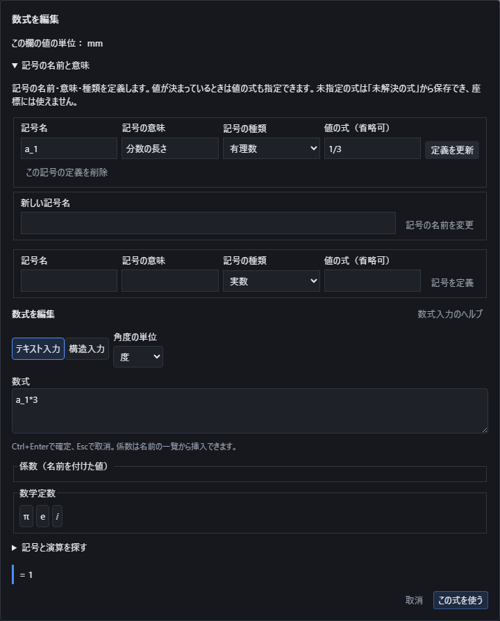

「記号の名前と意味」を開き、名前・意味・種類と「値の式（省略可）」を指定します。値の式には通常のテキスト入力を使います。例えば種類を「有理数」、名前を`a_1`、値を`1/3`にすると、上の式`a_1*3`は1になります。値の角度は上の式の度・ラジアン設定と同じです。

値の式は、数字・定数・演算・式の中だけの変数を使って決めてください。係数、X/Y/ZやT/U/V、別の自由記号への参照は使えません。値の式を空欄にすると未指定になり、種類だけから0や適当な値を補うことはありません。

| 記号の種類 | 値の式の例 | 上の式での使い方 |
|---|---|---|
| 有理数 | `1/3` | `a_1*3`で1 |
| 複素数 | `3+4*i` | `abs(a_1)`で5 |
| 真・偽 | `true` | `which(a_1,4,true,7)`で4 |
| 集合 | `set(1,2)` | `which(element(2,a_1),4,true,7)`で4 |
| ベクトル | `[1,2,3]` | `component(a_1,2)`で2 |
| 行列 | `[[1,2],[3,4]]` | `component(a_1,2,1)`で3 |
| 写像 | `mapping(2*x+1,x,ℝ,ℝ)` | `mapat(inversemap(a_1),9)`で4 |

「整数」に1/3、「自然数」に−1など種類と合わない値は使えません。整数・有理数であることを確認できない場合も未解決のままにします。真偽・集合・複素数・写像をそのまま座標へ変えず、場合分けや成分、実数の値を求める演算を明示してください。「その他の記号」の曖昧な積を構造入力へ変換するときは、数なのかベクトルなのか種類を指定します。

値の元の式は名前や意味と一緒に保存されます。保存した係数を開き直し、「定義を更新」で値だけを変えると、その係数を使う点にも反映されます。「元に戻す」で値と点を戻せます。関数の式から使う場合も、確定した実数の係数を経由して参照できます。

## 写像・合成・逆写像

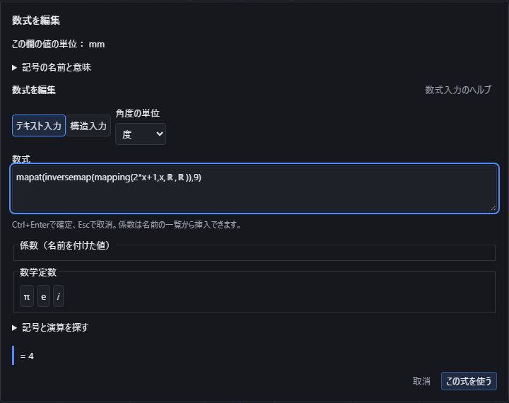

「集合・論理」の「写像を定義」で、式・変数・定義域・出力先の集合を指定できます。例えば `mapping(2*x+1,x,ℝ,ℝ)` は、実数を入力し、実数へ移す写像です。宣言した範囲の全ての入力で式が成立し、結果が出力先に含まれることを確認します。`mapping(x/x,x,ℝ,ℝ)` は0で定義できないため使えません。計算途中で `x/x` が1に整理されても、この制約は残ります。

写像そのものは座標ではありません。「写像の値」で入力する値を指定します。`mapat(mapping(2*x+1,x,ℝ,ℝ),4)` の結果は9です。有限の実数になった結果だけを、名前を付けた数値や点の座標に使えます。式と集合、変数の名前は保存され、開き直した後も編集できます。

| 操作 | 入力例と意味 |
|---|---|
| 合成 | `composemaps(mapping(x+1,x,ℝ,ℝ),mapping(2*x,x,ℝ,ℝ))` は後ろを先に計算します。3を入れると7です。後ろの出力先が前の定義域に含まれる必要があります。 |
| 逆写像 | `mapat(inversemap(mapping(2*x+1,x,ℝ,ℝ)),9)` は4です。逆写像は逆数ではありません。出力先の全ての値を、それぞれ一つの入力へ戻せる場合に作ります。 |
| 像 | `mapimage(mapping(x^2,x,ℝ,ℝ),set(-2,3))` は4と9の集合です。指定した入力が移る先を求めます。 |
| 逆像 | `mappreimage(mapping(x^2,x,ℝ,ℝ),set(4))` は−2と2の集合です。一対一の写像でなくても、指定した出力へ移る入力を求められます。 |

`x^2` の逆写像では元の入力範囲が重要です。`mapping(x^2,x,interval(0,∞),interval(0,∞))` なら9の逆は3です。全実数を入力にすると−3も同じ9へ移るため、一つの逆写像とは扱いません。開いた端点は入力に含まれず、範囲外の値や対応先のない値も拒否します。

有限集合、実数の区間、確認できる合成などを計算します。複雑な式や集合で、範囲全体での成立・全ての像・逆の一意性を確認できない場合は未解決として原式を残します。いくつかの点だけを調べて範囲全体を確認したことにしたり、不完全な答えを空集合に置き換えたりはしません。

## ±・∓で複数の答えの候補を扱う

`plusminus(a,b)`（±）・`minusplus(a,b)`（∓）、または`1±2`・`1∓2`のように書くと、符号ごとの答えを候補として扱います。1つの引数だけの`±2`は`2`と`−2`、`∓2`は`−2`と`2`の候補です。構造入力では`\pm`・`\mp`に対応します。

| 入力例 | 候補 |
|---|---|
| `1±2` | 3、−1 |
| `1∓2` | −1、3 |
| `1±(2±3)` | 6、0、−4、2 |

`±`・`∓`は式の中に複数書けて、それぞれ独立に符号を選びます。`1±(2±3)`は2個の±から4通りの候補になります。候補は最大32個（符号5個分）までで、それを超える式は理由を示して確定を止めます。

候補のままでは「座標や成分に使う前に候補を選び、±・∓を選んだ符号に置き換えてください。」と案内されます。`+`・`−`のどちらかへ書き換えた式だけを「この式を使う」で座標・成分・係数へ適用できます。0を掛けても、候補を1つの値に変えることはありません。元の式と係数の参照を保存し、開き直しや係数の変更で候補を再計算します。

## 絶対値の読み方と集合の要素数

`|x|`・`abs(x)`は対象の型によって読み方が変わります。実数・複素数では絶対値（大きさ）、ベクトルでは長さ、有限集合では要素数（同じ値は1つと数えます）です。例えば`|-3|`は3、`|3+4*i|`は5、`|[3,4]|`は5、`abs([1,2,2])`は3、`|{1,2,3}|`は3、`abs({1,1,2})`は2、`|∅|`は0です。

正方行列では行列式とノルムの2つの候補になります。`|[[1,2],[3,4]]|`の候補は−2（行列式）と√30（ノルム）です。座標に使うには、`det([[1,2],[3,4]])`または全成分を並べた`norm([1,2,3,4])`のように候補の1つへ書き換えます。

正方でない行列は行列式にできず、計算する前に理由を示して断ります。「正方行列でない行列の |A| は行列式にできません。全成分の2乗の和の平方根（ノルム）を使う場合は、全成分を並べた norm([…]) と書いてください。」

無限集合（区間・数の集合など）の要素数も、数える前に理由を示して断ります。「無限集合（区間・数の集合など）の要素数は数えられません。要素を並べた有限集合 {…} を指定してください。区間の長さを使う場合は、上端−下端を書いてください。」

要素数だけを求める`cardinality(x)`も使えます。`cardinality({1,2,3})`は3、`cardinality(set())`は0、`|intersection(ℤ,interval(0,3))|`は4です。

## 複素数の関数と主値

`complex(実部,虚部)` または `a+b*i` で複素数を指定します。指数、三角関数・双曲線関数とその逆関数、対数、平方根、累乗を使えます。複素数のまま座標へ適用せず、`re`（実部）・`im`（虚部）・`abs`（絶対値）・`arg`（偏角）で必要な値を指定してください。

例えば `re(exp(i*pi))` は−1、`im(sqrt(3+4*i))` は1です。度を指定した `re(asin(2))` は90、ラジアンではπ/2になります。度・ラジアンは三角関数とその逆関数、偏角に適用します。指数・対数・双曲線関数の意味は変えません。

複素対数は偏角が−πより大きくπ以下の主値です。負の実数は上側の値を使い、`ln(-1)` はiπです。平方根は実部が非負の主値を使い、負の実数の平方根は正の虚部です。一般の累乗はこの対数を使う主値です。実数の奇数根を求める `root(-8,3)` は−2で、複素数の主値を求める累乗とは区別します。

逆関数は主値を返します。例えば `asin(2)` の虚部は負、`asin(-2)` の虚部は正です。境界の両側で値が違う場合、入力された虚部の符号を保ちます。成立しない `ln(0)`・`atan(i)`・`atan(-i)`・`atanh(1)`・`atanh(-1)`・0割りは理由を表示します。0倍や一覧からの成分選択で元の不成立を消すことはできません。

結果は有効40桁で表示します。入力の実部と虚部の桁差が大きすぎる場合や、計算時間の上限を超えた場合は理由を表示します。元の式・複素数の指定・角度は表示を切り替えたり、保存して開き直したりしても保持します。

## 複素数の共役・偏角と極形式cis

`conjugate(z)`（別名`conj`）は実部を保ち、虚部の符号だけを反転します。`re(conjugate(3+4*i))`は3、`im(conjugate(3+4*i))`は−4です。共役を2回適用すると元の値に戻り、絶対値は変えません。実数の共役は虚部0のまま元の実部を保ちます。

`arg(z)`は偏角で、度・ラジアンの設定に従います。度では`arg(1+i)`が45、`arg(-1-i)`が−135です。ラジアンでは`arg(i)`がπ/2です。主値は−180度より大きく180度以下（ラジアンでは−πより大きくπ以下）です。`arg(0)`は複素数の0でも実数の0でも定義できず、0倍や成分選択で不成立を消しません。

`cis(θ)`は`cos(θ)+i・sin(θ)`で、常に絶対値1の複素数になり、度・ラジアンの設定に従います。`r*cis(θ)`は極形式`r・e^(iθ)`と一致します。例えば度で`5*cis(37)`の実部・虚部は、ラジアンで`5*exp(i*(37*pi/180))`と同じ値になります。

| 入力例 | 結果 |
|---|---|
| `re(conjugate(3+4*i))` | 3 |
| `im(conjugate(3+4*i))` | −4 |
| `arg(1+i)`（度） | 45 |
| `arg(i)`（ラジアン） | π/2 |
| `re(cis(0))`、`im(cis(0))` | 1、0 |

## ゼータ関数の値と微分を求める

`zeta(s)` はゼータ関数の値を求めます。sが1より大きいときは `1 + 1/2^s + 1/3^s + …` の和です。それ以外の実数では、この和をそのまま足す方法ではなく、同じ関数を広げた値を求めます。構造入力では「記号と演算を探す」の「関数」で「ゼータ」を検索します。

- `zeta(2)` はπ²/6、約 `1.6449340668` です。`zeta(4)` はπ⁴/90、約 `1.0823232337` です。
- `zeta(0)` は−0.5、負の偶数 `zeta(-2)`・`zeta(-4)` などは0です。0に近い値を一律に0へ置き換えることはしません。
- 引数1では発散します。`zeta(1)` や `0*zeta(1)` は使えず、理由を表示します。
- `zetaderivative(1,2)` は引数2での一階微分です。`derivativeat(zeta(x),x,2)` と同じ約 `-0.9375482543` になります。`zetaderivative` の次数は0〜17の整数で、0なら元の値です。

今回の数値計算は実数の−32から128までです。この範囲は計算上の制限で、範囲外で数学的に存在しないという意味ではありません。複素数の引数は未対応の理由を表示します。関数自体には角度の単位を掛けず、引数にある三角関数には指定した度・ラジアンを適用します。

元の式を名前付き数値や点の座標に使い、保存して開き直した後も再編集できます。編集をUndoすると、参照する点も元の値へ戻ります。関数作図では発散する1をまたいで線をつなぎません。精度や計算時間を確保できない場合は、未確認の値を確定せず理由を表示します。

## 楕円積分の種類と角度を選ぶ

構造入力では「記号と演算を探す」の「関数」で「楕円積分」を検索します。母数は `m=k²` です。資料に `k` が書かれている場合、その値をそのまま母数へ入力しないでください。

| 入力 | 引数の順序 | 度を指定した例 |
|---|---|---|
| `elliptick(m)` | 完全第1種、母数m | `elliptick(0)` はπ/2 |
| `elliptice(m)` | 完全第2種、母数m | `elliptice(1)` は1 |
| `ellipticf(phi,m)` | 不完全第1種、角度phi・母数m | `ellipticf(90,0)` はπ/2 |
| `ellipticeinc(phi,m)` | 不完全第2種、角度phi・母数m | `ellipticeinc(270,1)` は3 |
| `ellipticpi(n,m)` | 完全第3種、係数n・母数m | `ellipticpi(0,0)` はπ/2 |
| `ellipticpiinc(n,phi,m)` | 不完全第3種、係数n・角度phi・母数m | `ellipticpiinc(0,90,0)` はπ/2 |

度・ラジアンは角度phiだけに適用します。母数mや係数nは角度ではありません。角度が一周を越えても、積分した分を保持します。負の角度では積分の向きも保持します。

完全第1種はmが1未満、完全第2種はmが1以下で計算できます。完全第3種ではmとnを1未満にします。不完全形は0から指定角度までの全範囲を確認し、途中の発散や実数でない範囲を飛び越しません。例えば `elliptick(1)`、`ellipticpi(1,0.5)`、度を指定した `ellipticf(180,2)` は使えません。複素数の引数は未対応の理由を表示します。

`elliptick(0.5)` は約 `1.8540746773`、`elliptice(0.5)` は約 `1.3506438810` です。元の式を名前付き数値や点の座標に使い、保存して開き直した後も再編集できます。関数作図の `diff` でも母数0を含む微分を扱います。値が有限でも微分できない境界は線でつながず、計算の精度や時間を確保できない場合も理由を表示します。

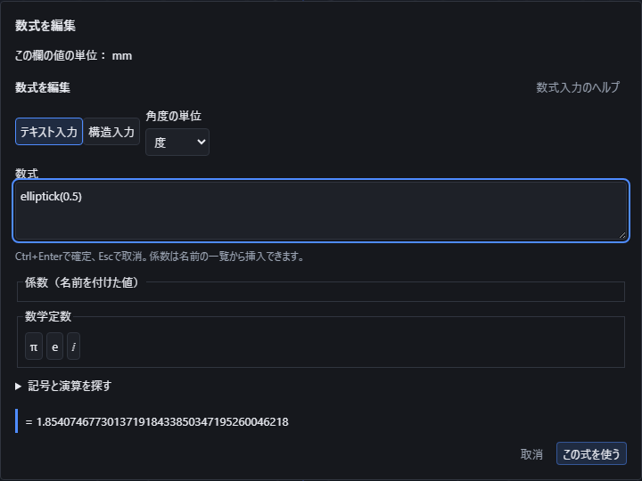

## Airy関数の値と傾きを求める

`airyai(x)` と `airybi(x)` は、曲がり方が `x` とその場所の値の積になる二つのAiry関数です。`airyaiprime(x)` と `airybiprime(x)` はそれぞれの傾きを求めます。構造入力では「記号と演算を探す」の「関数」から「Airy」で探せます。

- `airyai(1)` は約 `0.1352924163`、`airybi(1)` は約 `1.207423595` です。
- `airyaiprime(1)` は約 `-0.1591474413`、`airybiprime(1)` は約 `0.9324359334` です。
- 原点でも値と傾きを計算できます。`derivativeat(airyai(x),x,0,2)` は `0` です。
- 今回の数値計算は実数の `-32` から `32` までです。これは計算上の範囲であり、範囲外で関数が数学的に存在しないという意味ではありません。複素数の引数は未対応の理由を表示します。

関数自体に角度の単位は掛かりません。引数に `sin` などを入れた場合は、その部分に選んだ角度の単位が適用されます。元の式を保って名前付きの数値や点の座標へ使用でき、保存して開き直した後も再編集できます。作図では負の入力の途中にある山や谷を含めて値の範囲を確認します。

## Lambert Wの二つの実数の答えを選ぶ

`w*exp(w)=x` を満たす値を求めるには、`lambertw(枝,x)` と入力します。構造入力では「記号と演算を探す」の「関数」から「Lambert W」を選べます。

- 枝を `0` にすると、`-1/e` 以上の実数を入力でき、答えは `-1` 以上になります。`lambertw(0,1)` は約 `0.5671432904`、`lambertw(0,0)` は `0` です。
- 枝を `-1` にすると、`-1/e` 以上で `0` 未満の実数を入力でき、答えは `-1` 以下になります。`lambertw(-1,-0.1)` は約 `-3.577152064` です。
- `-1/e` では、どちらの枝でも答えは `-1` です。それより小さい入力、枝 `-1` での `0`、枝 `0` と `-1` 以外の指定は使えません。

負の入力では二つの答えが存在する場合があります。たとえば `lambertw(0,-0.1)` は約 `-0.1118325592` です。目的に合う枝を選んでください。式を保存して開き直した場合も、枝の指定を含む元の式を保持します。数式自体には角度の単位は掛かりませんが、引数に `sin` などを含める場合は、保存した度・ラジアンの指定を使います。

値は名前を付けた数値や作図の式に使えます。`diff(lambertw(0,X),X)` は原点でも計算でき、傾きは `1` です。二つの答えが合流する `-1/e` での微分、成立しない場所をまたぐ作図、複素数の枝はこの実数入力の対象外です。成立しない入力は理由が表示され、「この式を使う」は押せません。

## Bessel関数を数値や作図に使う

「関数」の候補から **Bessel J・Y・I・K** を選べます。入力は`besselj(n,x)`、`bessely(n,x)`、`besseli(n,x)`、`besselk(n,x)`で、**整数の次数n、実数の引数x**の順です。次数は−128〜128、引数の絶対値は128以下です。YとKは正の引数だけを使い、0と負の引数は受け付けません。一般の非整数次数と複素引数にはまだ対応していません。

| 入力例 | 結果の目安 |
|---|---|
| `besselj(0,1)` | 0.7651976866 |
| `bessely(0,1)` | 0.0882569642 |
| `besseli(0,1)` | 1.2660658778 |
| `besselk(0,1)` | 0.4210244382 |
| `besselj(0,0)`、`besseli(0,0)` | 1 |
| `derivativeat(besselj(0,x),x,0,2)` | 原点での2階微分は−0.5 |

Bessel関数自体に角度の単位は掛かりません。例えば引数へ`sin(30)`を書くと、その三角関数には選んだ角度単位が適用されます。次数と引数を含む元の式は、入力方式の切替と保存・再編集でも保持します。

関数の作図では`besselj(0,X)`などを使えます。点の傾きと曲がりも同じ式から求め、Y・Kの原点をまたいで線や面をつなぎません。極端に小さく座標で表現できない非零の値を0として置き換えることもありません。微分した結果の次数が対応範囲を超えた場合や、成立条件・精度を確認できない場合は理由を表示して止めます。一般の次数まで計算できるという意味ではありません。

## 入力方式と単位

「テキスト入力」では `sqrt(2)`、`5!`、`abs(-3)`、`log(8,2)`、`sum(i^2,i,1,10)` のように入力できます。「構造入力」では分数の分子・分母や指数を画面上で編集します。方式を切り替えても式の意味は維持します。

数式の編集画面に表示される「この欄の値の単位」を確認してください。長さのパラメータはmm、角度のパラメータは度です。三角関数の引数は、新規入力では「度」が既定です。「角度の単位」で任意に「ラジアン」へ切り替えられ、保存・再編集後も選んだ単位を保持します。例えば度なら `sin(30)`、ラジアンなら `sin(pi/6)` はどちらも0.5です。角度の寸法欄へラジアンの値を入れる場合は、`rad(pi/2)` のように書くと90度になります。

作図画面の長さ表示がinchでも、数式編集画面がmmと表示している欄の結果はmmです。寸法の単位と三角関数の角度単位は別に確認してください。

## 計算の準備と取消

式によっては、最初の計算で「{{ui:math.preparingExact}}」と表示されます。必要な計算部を読み込んでいる間の表示です。準備が済むと「{{ui:math.calculating}}」に変わります。入力した数式を計算用のサーバーへ送ることはありません。

準備中や計算中でも、入力を変更したり「取消」を押したりできます。その場合は古い計算を中止し、遅れて得られた結果を新しい式へ適用しません。時間内に結果を確認できなければ理由を表示し、途中の値を使いません。入力した式や角度単位を確認し、必要なら式を小さく分けて確認してください。

例えば`rank([[sqrt(2),1],[2,sqrt(2)]])`は1です。2行目が1行目の√2倍なので、独立な行は1本です。平方根を先に小数へ丸めて階数を増やすことはありません。この式に`sin(30)`を足すと、角度の単位が度なら1.5、ラジアンなら別の値になります。保存後も原式と選んだ角度単位を保持します。

## パレットの例と引数の順序

「記号と演算を探す」を開き、「数学の分野」で統計や線形代数などに絞り込めます。「全ての分野」に戻すと全候補を表示します。分野と「名前・記号で検索」は組み合わせて使えます。パレットでは記号だけでなく意味を確認でき、下の入力例も参考にしてください。引数が複数ある関数は順序にも意味があります。

| 入力例（テキスト） | 結果・使い方 |
|---|---|
| `log(8,2)` | 真数8、底2の順で3。自然対数は`ln`、常用対数は`log10`を使います。 |
| `reciprocal(4)` | 逆数0.25。0の逆数は使えません。 |
| `5!!` | 二重階乗5×3×1=15。`(5!)!`とは別です。0!!と(-1)!!は1です。 |
| `permutations(5,3)` | 5個から3個を順に選ぶ場合の数60。2つとも0以上の整数を指定します。 |
| `clamp(8,1,5)` | 値8を下限1・上限5で制限して5。関数作図のXYZ範囲指定とは別の数値演算です。 |
| `atan2(1,-1)` | y、xの順で第2象限の方向。度なら135、ラジアンなら3π/4です。両方0には向きがありません。 |
| `arccot(-1)` | 度なら135。実数の主値は0〜180度の間です。逆数の`cot`とは異なります。 |
| `sech(0)` | 1。sinh/cosh/tanhやcoth/sech/cschは双曲線関数で、度／ラジアンの切替を適用しません。 |
| `component([[1,2],[3,4]],2,1)` | 行列、行番号、列番号の順で3。行と列の番号は1から始まります。 |
| `sum(i^2,i,1,3)` | 1²+2²+3²=14。添字iと係数i、虚数単位は別です。 |
| `integrate(t^2,t,0,3)` | 変数tについて0〜3の定積分で9。結果が未確定なら座標へ適用できません。 |

逆正割・逆余割は`arcsec`・`arccsc`、逆双曲線関数は`acoth`・`asech`・`acsch`も使えます。定義域の外で複素数になる場合は、結果の型を確認してください。0の対数、対数の底1、三角関数の極、範囲外の行列番号などは理由を表示します。

## 初等関数と整数演算をさらに使う

「基本」「関数」のパレットには、次の初等関数と整数演算もあります。度・ラジアンの設定は`arccos`・`arctan`・`cot`・`sec`・`csc`に適用し、双曲線関数とその逆関数・`exp`・`log2`には適用しません。

| 入力例 | 結果・使い方 |
|---|---|
| `arccos(0.5)` | 度なら60。逆正弦`arcsin`・逆正接`arctan`と同じ扱いです。 |
| `arctan(1)` | 度なら45。 |
| `cot(45)` | 1。`tan`の逆数とは別に定義される関数です。 |
| `sec(60)` | 2。`cos`の逆数です。 |
| `csc(30)` | 2。`sin`の逆数です。 |
| `cosh(0)`、`tanh(ln(3))` | 1、0.8。双曲線関数は度・ラジアンの影響を受けません。 |
| `arsinh(0)`、`arcosh(1)`、`artanh(0.8)` | 0、0、ln(3)（約1.0986）。逆双曲線関数です。 |
| `exp(1)` | e（約2.71828）。`ln`の逆関数です。 |
| `log2(8)` | 3。底2の対数です。 |
| `floor(2.7)`、`ceil(2.1)` | 2、3。切り捨て・切り上げです。 |
| `round(2.6)` | 3。ちょうど半分になる値は偶数側へ丸めます。 |
| `sgn(-5)` | −1。符号を−1・0・1で返します。 |
| `min(3,5)`、`max(3,5)` | 3、5。 |
| `binomial(5,2)` | 10。二項係数（組合せの数）です。 |
| `gcd(24,18)`、`lcm(4,6)` | 6、12。最大公約数・最小公倍数です。 |
| `mod(7,3)` | 1。 |

`0^0`と負の指数の0乗はこの規約では定義せず、理由を表示します。0を掛けても、この不成立を消しません。

## 循環小数・百分率・比を入力する

小数点の後で無限に繰り返す数字は、丸括弧で囲むと循環小数として厳密な分数の値になります。全角の数字・小数点・括弧（`０．１（６）`）でも書けます。構造入力では、小数点の直後の数字に上線を付けると同じ意味になります。

| 入力例 | 同じ意味の分数 |
|---|---|
| `0.1(6)` | 1/6 |
| `0.(3)` | 1/3 |
| `1.(142857)` | 8/7 |
| `0.(9)` | 1 |

構造入力の`0.1\overline{6}`・`0.\bar{3}`は、それぞれ通常入力の`0.1(6)`・`0.(3)`と同じ式です。丸めずに分数として厳密に計算するため、`0.1(6)*6`はちょうど1になります。関数作図の式でも使え、表記を切り替えると分数（`\frac{1}{6}`など）で表示します。小数点の直後ではない上線や、上線の中に数字以外を含む場合は、従来どおり共役のままです（例`0.5\overline{3+4\mathrm{i}}`は0.5と共役の積）。逆に構造入力で丸括弧を使った`0.1(6)`は循環小数にならず、掛け算0.1×6のままです。整数部分・小数部分・繰り返す数字を合わせた桁数には上限があり、超えると「循環小数の桁が多すぎます。整数部分・小数部分・繰り返す数字を合わせて2048桁までにしてください。」、括弧の中に数字以外を含む場合は「循環小数は、小数点の後で繰り返す数字だけを括弧で囲んで指定してください（例 0.1(6)＝1/6、0.(3)＝1/3）。」と表示します。

百分率は通常入力で`50%`、構造入力で`50\%`のように書き、どちらも100で割った値になります。`50%`は1/2、`12.5%*8`はちょうど1、`200%`は2です。関数作図の式でも使え、表記を切り替えると`\frac{50}{100}`のような分数で表示します。LaTeXの注釈記号として扱われる、`\`の付かない裸の`%`は使えません。

比`a:b`は比の値a÷bとして計算します。全角の`１：２`や`∶`も同じ意味です。前後の演算より弱く結び、`(1+2):3`と`1+2:3`はどちらも1、`2*3:4`は3/2、`1:2+3`は1/5です。小数・循環小数・百分率も項に使え、`0.5:1.5`は1/3、`0.(3):2`は1/6、`50%:2`は1/4です。比例式`a:b=c:d`は2つの比の値を比べ、`1:2=2:4`は真、`1:2=2:3`は偽です。関数作図の式でも使えます。0で割る比（`1:0`）は使えません。

| 断られる入力 | 理由 |
|---|---|
| `1:2:3`、`1:30:00` | 比は a:b のように2つの項で指定してください。3つ以上の項の比や時刻（例 1:30:00）には対応していません。 |
| `12:05`、`05:1` | 比の項に先頭が0の数（例 12:05 の 05）は使えません。時刻には対応していないため、比は0を付けない数で指定してください。 |
| `[1:2]`、`{x:x>0}` | 一覧や集合の要素にそのまま書いた「:」は、範囲・区間や集合の条件（例 {x:x>0}）と区別できません。比の値は (1:2) のように括弧で囲み、区間は interval(a,b) で指定してください。 |
| `x:=1` | 「:=」による定義はこの式では使えません。比は a:b、等式は a=b で指定してください。 |

丸括弧で囲めば、一覧・集合・行列の要素や関数の引数の中でも比を使えます。例えば`[(1:2),3]`は`[1/2,3]`です。構造入力の`\:`（空白）や`\colon`（関数の対応の記号）は、比にはならず従来どおりの意味のままです。

## 二項分布の確率を求める

同じ成功確率で互いに独立な試行を繰り返すとき、「統計」のパレットから二項分布の確率を選べます。引数の順序は**試行回数n、成功確率p、成功回数k（累積確率では上限x）**です。

| 入力例 | 意味と結果 |
|---|---|
| `binomialpmf(4,1/2,2)` | 4回中ちょうど2回成功する確率。6/16 = 0.375。 |
| `binomialcdf(4,1/2,2)` | 4回中2回以下、つまり0・1・2回成功する確率。11/16 = 0.6875。 |
| `binomialcdf(4,1/2,5/2)` | 2.5回以下なので2回以下と同じです。 |
| `1-binomialcdf(4,1/2,2)` | 2回を超えて成功する確率。5/16 = 0.3125。 |

nは0以上の整数、pは0以上1以下にしてください。整数・小数・分数に確定できる式や係数を使えます。ちょうどk回の確率は、kが整数でなければ0です。成功回数が負なら両方0、nを超えた場合は「ちょうど」が0、「以下」が1です。n=0は成功回数0、p=0は必ず0回成功、p=1は必ずn回成功として扱います。不正なnやpは、成功回数の範囲外であっても拒否します。

分数のまま計算して原式を保存します。0や1に直ちに確定する場合を除き、展開する試行回数は10,000回までです。それ以内でも正確な整数の桁数が計算上限に達した場合は理由を表示し、近似の確率へ置き換えません。確率を座標へ使う場合は、通常の数式と同じ「この式を使う」で確定します。

定義の参照先: [NIST 二項分布の確率と累積確率](https://www.itl.nist.gov/div898/handbook/eda/section3/eda366i.htm)。上限xが整数以外の場合とn=0・p=0・p=1は、上記の離散的な試行の意味で扱います。

## 一様分布・指数分布・ポアソン分布を使う

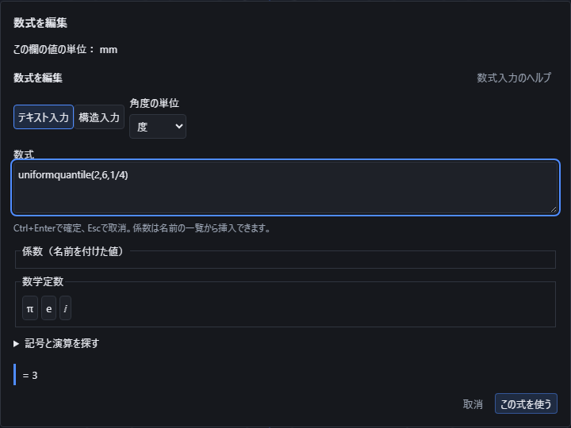

「統計」のパレットから、分布と求める値を選びます。`pdf`は連続した分布の**密度**、`pmf`は指定した回数になる**確率**、`cdf`は指定した値以下になる**累積確率**です。`quantile`は指定した累積確率に対応する**分位点**です。密度は一点の確率ではなく、1を超える場合もあります。

| 入力例 | 意味と結果 |
|---|---|
| `uniformpdf(2,6,3)` | 下端2、上端6、位置3での一様分布の密度0.25。 |
| `uniformcdf(2,6,3)` | 同じ一様分布で3以下になる確率0.25。 |
| `uniformquantile(2,6,1/4)` | 同じ一様分布の下から25%に当たる位置3。 |
| `exponentialpdf(2,1)` | 発生率2、位置1での指数分布の密度。約0.2706705665。 |
| `exponentialcdf(2,1)` | 同じ指数分布で1以下になる確率。約0.8646647168。 |
| `exponentialquantile(2,3/4)` | 同じ指数分布の下から75%に当たる位置。約0.6931471806。 |
| `poissonpmf(2,3)` | 平均2回のポアソン分布で、ちょうど3回になる確率。約0.1804470443。 |
| `poissoncdf(2,2)` | 同じ分布で2回以下になる確率。約0.6766764162。 |

一様分布は、下端、上端、位置または確率の順です。下端を上端より小さくします。範囲外の密度は0、両端の密度は1÷区間長です。累積確率は下端以下で0、上端以上で1です。分位点には0以上1以下の確率を使えます。

指数分布は、**発生率、位置または確率**の順です。発生率は正の値で、平均は発生率の逆数です。平均を第1引数へ入れないでください。位置の範囲は0以上で、負の位置では密度と累積確率を0とします。有限な分位点の確率は0以上1未満です。確率1を有限の位置に置き換えることはありません。

ポアソン分布は、平均回数、回数または上限の順です。平均0は必ず0回になる分布として扱います。ちょうどの回数が負または整数でない場合は確率0です。累積確率の上限が2.9なら2回以下と同じです。平均回数が負の場合など、分布の条件が不正なら範囲外の入力でも拒否します。

今回の分布の条件と位置には、整数・小数・分数に確定できる式や係数を使えます。角度の単位には影響されません。ポアソン分布の展開は10,000回までで、それ以内でも桁数の上限に達すれば途中の値を採用せず理由を表示します。元の式を保存し、開き直しや係数変更で再計算できます。

定義の参照先: [NIST 一様分布](https://itl.nist.gov/div898/handbook/eda/section3/eda3662.htm)、[NIST 指数分布](https://itl.nist.gov/div898/handbook/eda/section3/eda3667.htm)、[NIST ポアソン分布](https://itl.nist.gov/div898/handbook/eda/section3/eda366j.htm)。指数分布は上記の発生率の規約で入力し、平均0のポアソン分布は上記の集中した分布として扱います。

## 確率表の期待値・分散と条件付き確率を求める

「統計」の**確率表の期待値**、**確率表の分散**、**条件付き確率**を使います。テキストでは次のように入力します。

| 入力例 | 意味と結果 |
|---|---|
| `expectation([0,4],[1/4,3/4])` | 値0の確率が1/4、値4の確率が3/4のとき、期待値は3です。 |
| `probabilityvariance([0,4],[1/4,3/4])` | 同じ確率表で、期待値からのずれの二乗の期待値は3です。 |
| `conditionalprobability(1/4,1/2)` | 「AとBの同時確率」が1/4、「条件Bの確率」が1/2なら、BのもとでのAの確率は1/2です。 |

期待値と分散では、**値の一覧、対応する確率の一覧**の順です。両方を同じ個数、1〜256個で指定します。各確率は0以上1以下で、合計を正確に1にしてください。合計をアプリ側で勝手に1へ直すことはありません。3等分なら`[1/3,1/3,1/3]`を使い、合計が1にならない丸めた小数で代用しないでください。同じ値を別々の行へ分けても、それぞれの確率を足した意味を保ちます。確率0の行でも、値の式が0除算などで成立しなければ拒否します。

条件付き確率では、**同時確率、条件の確率**の順で指定します。条件の確率は0より大きく1以下、同時確率は0以上で条件の確率以下にします。条件の確率0で割ったり、AとBが独立だと推測して同時確率を作ったりはしません。

整数・小数・分数に確定できる値や係数を使えます。確率表の分散は標本分散の補正をしません。観測した値の一覧から標本・母集団の統計量を求める操作とは入力の意味が異なります。元の式を保存し、開き直し・再編集・取り消しでも値と意味を保持します。

定義の参照先: [UC Berkeley 確率の講義資料](https://www.stat.berkeley.edu/users/aldous/134/gravner.pdf)、[UC Berkeley 条件付き分布の講義](https://www.stat.berkeley.edu/~ani/s200af18/Lec_08_30.html)。

## 正規分布の確率と位置を求める

「統計」の**正規分布の密度**、**正規分布の累積確率**、**正規分布の分位点**を使います。最初の2項目は、平均と標準偏差です。分散ではなく、0より大きい標準偏差を指定してください。

| 入力例 | 意味と結果 |
|---|---|
| `normalpdf(0,1,0)` | 平均0、標準偏差1で、位置0の確率密度は約0.3989422804です。1点そのものの確率ではありません。 |
| `normalcdf(0,1,0)` | 同じ分布で位置0以下になる累積確率は1/2です。 |
| `normalquantile(3,2,0.975)` | 平均3、標準偏差2で、下側から97.5%になる位置は約6.919927969です。 |

分位点の確率は0より大きく1より小さい値を指定します。端の0と1は有限な位置を持たないため採用しません。整数・小数・分数に確定できる平均、標準偏差、位置、確率と係数が使えます。度・ラジアンの設定は結果に影響しません。元の式を保存し、開き直し、条件の編集、取り消しで値と意味を保ちます。

小さい下側確率は直接計算します。例えば標準正規分布で8より上になる確率には、対称性を使って`normalcdf(0,1,-8)`を入力できます。1に極めて近い累積確率から1を引く方法は丸めの影響を受けます。位置を求める入力`normalquantile(0,1,1-1e-100)`では、1との差を保って計算します。計算回数や数値の範囲の上限に達した場合、または座標で非零の値を表せない場合は、理由を表示して式の確定を止めます。

定義と計算法の参照先: [NIST 正規分布](https://itl.nist.gov/div898/handbook/eda/section3/eda3661.htm)、[NIST DLMF の級数](https://dlmf.nist.gov/7.6)、[NIST DLMF の連分数](https://dlmf.nist.gov/7.9)。

## 指定した確率になる最小の回数を求める

「統計」の**二項分布の分位点**と**ポアソン分布の分位点**は、累積確率が指定した下側確率以上になる最小の非負整数回を求めます。隣り合う回数の間を補間せず、境界の等号を含みます。

| 入力例 | 意味と結果 |
|---|---|
| `binomialquantile(4,1/2,11/16)` | 4回の試行・成功確率1/2で、累積確率11/16以上になる最小の回数は2です。 |
| `binomialquantile(4,1/2,11/16+1e-100)` | 確率をわずかに増やすと3回です。差を丸めて2回にはしません。 |
| `poissonquantile(2,3/4)` | 平均2回で、累積確率75%以上になる最小の回数は3です。 |
| `poissonquantile(2,99/100)` | 同じ平均で累積確率99%以上になる最小の回数は6です。 |

二項分布の引数は**試行回数n・成功確率p・下側確率q**の順で、nは0以上の整数、pとqは0以上1以下です。ポアソン分布は**平均回数・下側確率q**の順で、平均は0以上です。両方式でq=0は0回とする規約です。試行回数0、成功確率0、またはポアソンの平均0では必ず0回です。平均が正のポアソン分布にはq=1の有限な答えがないため理由を表示します。

整数・小数・分数に確定できる条件や係数を使えます。二項分布の境界は分数のまま比較し、ポアソン分布は確率の上下限から答えを確定します。判定できない値を近い整数で代用しません。通常計算の試行回数・平均回数、ポアソンの答えの検索範囲は10,000までです。厳密な桁数・計算時間の上限に達した場合も、途中の答えを使わず理由を表示します。計算を要さず確定する端点はこの検索範囲と区別します。

元の式を保存して開き直し、確率を変えると点も追従します。取り消すと元の値へ戻ります。度・ラジアンの設定は答えに影響しません。

定義の参照先: [R 二項分布](https://stat.ethz.ch/R-manual/R-devel/library/stats/html/Binomial.html)、[R ポアソン分布](https://stat.ethz.ch/R-manual/R-devel/library/stats/html/Poisson.html)。

## Gamma・Beta分布の確率と位置を求める

「統計」の**Gamma分布**と**Beta分布**には、それぞれ密度・累積確率・分位点があります。密度は1点そのものの確率ではありません。累積確率は指定した位置以下になる確率、分位点は指定した確率になる位置です。

| 入力例 | 意味と結果 |
|---|---|
| `gammapdf(2,1,1)` | 形状2・尺度1で、位置1の密度は約0.3678794412です。 |
| `gammacdf(2,1,1)` | 同じ条件で位置1以下になる確率は約0.2642411177です。 |
| `gammaquantile(1,2,0.5)` | 形状1・尺度2で、累積確率50%になる位置は約1.386294361です。 |
| `betapdf(2,2,0.5)` | 形状2・2で、位置0.5の密度は1.5です。 |
| `betacdf(2,3,0.5)` | 形状2・3で、位置0.5以下になる確率は0.6875です。 |
| `betaquantile(2,2,0.5)` | 形状2・2で、累積確率50%になる位置は0.5です。 |

Gammaは**形状・尺度・位置または確率**の順です。形状と尺度を0より大きくしてください。率を使う指定とは異なり、尺度を2倍にすると分位点も2倍になります。位置は0以上が分布の範囲で、負の位置の密度と累積確率は0です。分位点の確率は0以上1未満とし、確率0の位置は0、確率1には有限な位置がありません。

Betaは**形状a・形状b・位置または確率**の順で、2つの形状を0より大きくします。位置の範囲は0〜1です。範囲外の密度は0、累積確率は左で0、右で1となります。分位点には0と1も指定でき、それぞれ位置0と1になります。端点の密度は形状によって変わり、無限大になる場合は有限な座標へ採用できない理由を表示します。

整数・小数・分数に確定できる条件と係数を使えます。度・ラジアンは結果に影響しません。元の式を保存し、開き直し、条件の変更、取り消しに引き継ぎます。例えば`gammaquantile(1,2,1-1e-1000)`は、1との差を先に失わずに計算します。Betaで端に極めて近い位置の有効な桁を保てない場合、計算回数・数値範囲の上限に達した場合、非零の結果を座標で表せない場合は、0や端点で代用せず理由を表示します。計算後の数値は既存の計算と同じ有効40桁に揃えます。形状とBetaの形状の和の数値計算は2万まで、Gamma累積の形状移動は1万回まで、各級数は32,768項までです。

参照先: [NIST Gamma分布](https://www.itl.nist.gov/div898/handbook/eda/section3/eda366b.htm)、[NIST Beta分布](https://itl.nist.gov/div898/handbook/eda/section3/eda366h.htm)、[NIST DLMF 不完全Gamma](https://dlmf.nist.gov/8.9)、[NIST DLMF 不完全Beta](https://dlmf.nist.gov/8.17)。

## χ²・t・F分布の確率と位置を求める

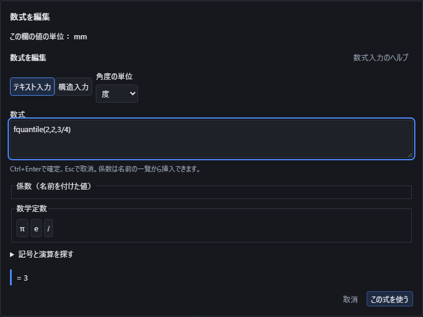

「統計」の**χ²分布**、**t分布**、**F分布**には、密度・累積確率・分位点があります。密度は1点そのものの確率ではありません。累積確率は指定位置以下になる確率、分位点は指定した下側確率になる位置です。

| 入力例 | 意味と結果 |
|---|---|
| `chisquarepdf(2,2)` | 自由度2のχ²分布で、位置2の密度は約0.1839397206です。 |
| `chisquarecdf(2,2)` | 同じ条件で位置2以下の確率は約0.6321205588です。 |
| `chisquarequantile(2,0.5)` | 自由度2で累積確率50%になる位置は約1.386294361です。 |
| `tpdf(1,0)` | 自由度1のt分布で、位置0の密度は約0.3183098862です。 |
| `tcdf(1,1)` | 同じ分布で位置1以下の確率は0.75です。 |
| `tquantile(1,0.75)` | 自由度1で累積確率75%になる位置は1です。 |
| `fpdf(2,2,1)` | 分子・分母の自由度2・2で、位置1の密度は0.25です。 |
| `fcdf(2,2,1)` | 同じ条件で位置1以下の確率は0.5です。 |
| `fquantile(2,2,0.75)` | 同じ自由度で累積確率75%になる位置は3です。 |

χ²とtは**自由度・位置または確率**の順です。Fは**分子自由度・分母自由度・位置または確率**の順で、自由度の順番を交換すると異なる分布になります。自由度は0より大きくしてください。整数・小数・分数に確定できる条件と係数を使用できます。

χ²とFの位置の範囲は0以上で、負の位置の密度と累積確率は0です。位置0の密度は自由度によって異なり、無限大になる場合は座標へ使えない理由を表示します。χ²とFの分位点の確率は0以上1未満です。tの分位点は0より大きく1より小さい確率を指定します。tの位置には負の値も使え、確率50%の位置は0です。

度・ラジアンの設定は結果に影響しません。元の式を保存して開き直し、自由度や確率を変更すると点の値も追従し、取り消すと元へ戻ります。確率の1との差や中央値との差は先に消さず計算します。例えば`tquantile(1,1/2+1e-100)`は0で代用しません。計算回数・時間・保持できる桁の上限に達した場合、無限大になる場合、非零の結果を座標で表せない場合は理由を表示し、途中の値を採用しません。

参照先: [NIST χ²分布](https://itl.nist.gov/div898/handbook/eda/section3/eda3666.htm)、[NIST t分布](https://itl.nist.gov/div898/handbook/eda/section3/eda3664.htm)、[NIST F分布](https://itl.nist.gov/div898/handbook/eda/section3/eda3665.htm)。

## データから統計量を求める

「統計」のパレットでは母集団と標本を区別して選択します。データは`[1,2,3]`のような一覧で指定し、各値には整数・小数・分数に確定できる式や係数を使えます。1一覧は256個までです。πなど有理数に確定できないデータを使う統計、上記以外の確率分布、重回帰は現在この入口では扱えません。

| 入力例 | 結果・規約 |
|---|---|
| `mean([1,2,6])` | 算術平均3。 |
| `median([9,1,3,5])` | 昇順の中央2つを平均して4。奇数個なら中央の値です。 |
| `modes([1,1,2,2,3])` | 最頻値の一覧`[1,2]`。同率の値を全て残します。全て1回なら全てが同率です。 |
| `quantile([0,10,20,30],0.25)` | 分位点7.5。昇順の位置`(n−1)×割合`で隣接値を線形補間します。割合0と1は最小値と最大値です。 |
| `populationvariance([1,2,3])` | 母分散2/3。平均からの差の二乗の合計をnで割ります。 |
| `samplevariance([1,2,3])` | 標本分散1。n−1で割った母分散の不偏推定値で、2個以上必要です。 |
| `populationstandarddeviation([1,3])` | 母分散の平方根1。 |
| `samplestandarddeviation([1,3])` | 標本分散の平方根√2。標準偏差そのものの不偏推定値ではありません。 |
| `populationcovariance([1,2,3],[2,4,6])` | 母共分散4/3。対応するXとYの平均からの差の積をnで割ります。 |
| `samplecovariance([1,2,3],[2,4,6])` | 標本共分散2。n−1で割り、2組以上必要です。 |
| `correlation([1,2,3],[6,4,2])` | Pearson相関係数−1。 |
| `regressionslope([1,2,3],[3,5,7])` | Xの一覧、Yの一覧の順で、回帰直線`Y=aX+b`の傾きa=2。 |
| `regressionintercept([1,2,3],[3,5,7])` | 同じ切片付き最小二乗直線の切片b=1。 |
| `rsquared([1,2,3],[3,5,7])` | 切片付き単回帰の決定係数1。相関係数の二乗です。 |

空の一覧、個数の異なる組、0〜1を外れた分位点の割合は理由を表示して拒否します。Xが一定なら回帰の傾きは定まりません。相関と決定係数は、どちらかの一覧が一定でも定まりません。これらを0に置き換えて座標へ適用することはありません。

最頻値の一覧から座標へ1つを使う場合は、`component(modes([1,1,2,2,3]),2)`のように成分番号を明示してください。この例の結果は2です。入力方式を切り替えても、母/標本の区別、引数の順序、原式を維持します。

分位点の補間規約は[Rの公式資料のtype 7](https://stat.ethz.ch/R-manual/R-devel/library/stats/html/quantile.html)を使用しています。

## ベクトルの内積・外積・ノルムと射影

`dot(u,v)`（`⟨u,v⟩`・`u·v`も同じ意味）は同じ次元の実ベクトルの内積です。`dot([1,2,3],[4,5,6])`は32、`⟨[1,2,3],[4,5,6]⟩`も同じ32です。次元が違う場合や複素数を含む場合は理由を表示します。

`cross(u,v)`は3次元のベクトルどうしの外積で、結果もベクトルです。3次元以外の入力は理由を表示します。例えば`cross([1,0,0],[0,1,0])`と`[0,0,2]`との内積`cross([1,0,0],[0,1,0])·[0,0,2]`は2になります。

`norm(v)`は既定でユークリッドノルム（2ノルム）です。`norm(v,p)`のpには1以上の有限な実数、または`∞`（最大の絶対成分）を指定できます。ノルムは複素数の成分も扱います。

| 入力例 | 結果 |
|---|---|
| `norm([3,4])` | 5 |
| `norm([-3,4],1)` | 7 |
| `norm([-3,4],∞)` | 4 |
| `norm([3+4*i,12])` | 13 |

`projection(u,v)`はvの方向にuを近づけたベクトルで、`u−projection(u,v)`はvと直交します。`projection([1,2],[3,4])`は`[33/25,44/25]`です。vが零ベクトルの場合、次元が違う場合、複素数を含む場合は理由を表示します。

いずれも保存した元の式を開き直して再計算し、係数を変えれば結果も追従します。

## 計算した結果から成分を選び、選ばれない成分も確認する

`transpose`・`projection`・`identitymatrix`・`inverse`・`cross`など、ベクトルや行列を返す演算の結果からも、`component`・`tensorelement`で成分を選んで座標や係数に使えます。番号は1から始まります。

| 入力例 | 結果 |
|---|---|
| `component(transpose([[1,2],[3,4]]),1,2)` | 3 |
| `component(projection([1,2],[3,4]),1)` | 33/25 |
| `component(identitymatrix(3),2,2)` | 1 |
| `tensorelement(inverse([[2,0],[0,4]]),[1,1])` | 0.5 |
| `component(cross([1,0,0],[0,1,0]),3)` | 1 |

各軸の範囲外の番号を指定すると、計算する前に理由を示して断ります。

| 入力例 | 断る理由 |
|---|---|
| `component(cross([1,0,0],[0,1,0]),4)` | 成分の番号は各軸の範囲内の整数で指定してください。 |
| `tensorelement(identitymatrix(3),[4,1])` | 各軸に1つずつ、1から成分数までの添字を指定してください。 |

成分を1つ選ぶときも、選ばなかった他の成分をすべて確認します。どれか1つでも有限の値として確認できなければ、選んだ成分の値によらず式全体を理由付きで断ります。0を掛けても、選ばれない成分の不成立は消えません。

| 入力例 | 結果 |
|---|---|
| `component([7,1/(pi-pi)],1)` | 断る（選ばれない0による割り算） |
| `component([7,sqrt(-1)],1)` | 7（選ばれないiは有限の値なので断らない） |
| `component([7,1/norm([0,0])],1)` | 断る |
| `component([7,integrate(1/t,t,0,1)],1)` | 断る（発散） |

## 単位行列・零行列と転置・随伴・逆・trace・det・rank

`identitymatrix(n)`はn行n列の単位行列、`zeromatrix(n)`はn行n列、`zeromatrix(n,m)`はn行m列の零行列です。nとmは1以上16以下の整数です。`identitymatrix(3)*A`はAと同じ行列になります。

| 入力例 | 結果 |
|---|---|
| `component(identitymatrix(3),2,2)` | 1 |
| `component(zeromatrix(2,3),2,3)` | 0 |
| `trace(identitymatrix(3))` | 3 |

`transpose(A)`は行と列を入れ替え、長方形の行列にも使えます。`conjugatetranspose(A)`（随伴行列）は転置に加えて各成分を複素共役にします。例えば`[[i,1],[1,2]]`は、転置の1行1列がiのままでも、随伴では−iになります。

`inverse(A)`は正方行列の逆行列で、行列式が0の特異な行列や値が未確定な記号を含む行列は理由を表示します。`trace(A)`（対角成分の和）と`det(A)`（行列式）も正方行列が必要ですが、値が未確定な記号を含んでいても式として結果を保ちます。`rank(A)`は長方形の行列にも使え、独立な行・列の本数を返します。

| 入力例 | 結果 |
|---|---|
| `component(transpose([[1,2,3],[4,5,6]]),2,1)` | 2 |
| `component(inverse([[2,0],[0,4]]),2,2)` | 0.25 |

いずれも16行・16列以内で、整数・小数・分数に加え、平方根などの代数的な数や複素数を成分に使えます。保存して開き直しても元の式を保ち、係数を変えれば結果も追従します。

## 連立一次式と行列から値を求める

行列は`[[2,1],[1,-1]]`のように行ごとに並べ、右辺は`[5,1]`のようなベクトルで指定します。「線形代数」のパレットで演算名・意味・例を確認できます。各成分には整数・小数・分数に確定できる式や係数を使えます。平方根やⅈを含む代数的な数の成分は、同梱の計算部で式のまま扱います。πなどの超越数や値が未決定の記号は、この6演算ではまだ扱えません。

| 入力例 | 結果・意味 |
|---|---|
| `linearsolve([[2,1],[1,-1]],[5,1])` | `2x+y=5`、`x−y=1`の解`[2,1]`。解が一つに決まる場合だけ返します。 |
| `rowreduce([[1,2,3],[2,4,6]])` | 簡約階段形`[[1,2,3],[0,0,0]]`。 |
| `nullspace([[1,2,3],[2,4,6]])` | `Ax=0`の独立な方向`[[-2,1,0],[-3,0,1]]`。零ベクトルしか解がなければ空の一覧です。 |
| `columnspace([[1,2,3],[2,4,6]])` | 元の行列から独立な列を選び、ベクトルの一覧`[[1,2]]`を返します。 |
| `rowspace([[1,2,3],[2,4,6]])` | 簡約した行列の零でない行`[[1,2,3]]`を返します。 |
| `linearsolutionspace([[1,2,3],[2,4,6]],[4,8])` | 特解と自由な方向`[[4,0,0],[-2,1,0],[-3,0,1]]`。全ての解は`[4,0,0]+s[-2,1,0]+t[-3,0,1]`で表せます。 |

最後の例のsとtには任意の実数を選べます。特解だけを唯一の解と見なさないでください。解がない連立一次式では「全ての解」は空集合を返し、「一意な解」は理由を示して確定を断ります。全ての解が1つなら特解1本だけを返します。行・列の空間が零空間なら、基底は空の一覧です。

座標に使う値は`component(linearsolve([[2,1],[1,-1]],[5,1]),1)`のように選びます。この例は第1成分の2です。基底の一覧は`component(nullspace([[1,2,3],[2,4,6]]),2,1)`で2本目の第1成分−3を選べます。番号は1から始まり、列空間の結果も「何本目の基底か、基底の何成分目か」の順です。複数の値を暗黙に1座標へ変換しません。

例えば`linearsolve([[sqrt(2),1],[1,sqrt(2)]],[2*sqrt(2)+3,2+3*sqrt(2)])`の解は`[2,3]`です。元の式へ代入すると、どちらの行も右辺と一致します。`[[sqrt(2),1],[2,sqrt(2)]]`では2行目が1行目の√2倍なので、独立な条件は1本です。「一意な解」で勝手に一つの値を選ばず、「全ての解」で特解と自由な方向を確認してください。成分の指定は、計算後に存在する基底の本数でも確認します。

整数・小数・分数だけの行列は、行数と列数が各256以内、成分数が全体で4096以内です。連立一次式では右辺を付けた後の大きさにも上限を適用します。平方根などを含む行列は16行・16列以内で、右辺は16成分以内です。初回の計算部の準備や計算が続く間は進み具合を表示し、中止できます。計算回数・桁数・待ち時間が上限に達した場合は理由を示し、途中の値を確定しません。

## 行列をQR分解する

「線形代数」から「QR分解の直交行列Q」「QR分解の上三角行列R」を選べます。入力した行列Aを、`A=QR`を満たす2つの行列へ分けます。Qは列どうしが直交し、各列の長さが1になる行列です。Rは対角線より下が0になる行列で、長方形の入力にも対応します。

| 入力例 | 結果 |
|---|---|
| `qrq([[3,0],[4,5]])` | Q=`[[3/5,-4/5],[4/5,3/5]]`。 |
| `qrr([[3,0],[4,5]])` | R=`[[5,4],[0,3]]`。 |
| `component(qrq([[3,0],[4,5]]),1,2)` | Qの1行2列から−4/5を座標に使います。 |

m行n列のAに対し、Qはm行m列、Rはm行n列です。列が従属する場合も、全ての列が0の場合も分解できます。Qが一意に決まらない場合は、入力の列を順に直交化し、足りない方向を座標軸から順に補います。ほかの計算ソフトとQやRの符号・補う方向が異なっても、`QᵀQ=I`と`QR=A`は維持します。

入力は16行・16列以内です。整数・小数・分数に加え、平方根などの代数的な数や複素数を成分に使えます。平方根は式のまま保持し、微小な独立方向をしきい値で0へ置き換えません。複素数では転置と複素共役を組み合わせたQᴴについて`QᴴQ=I`と`QR=A`を満たします。未決定の記号やπなどの成分、計算回数・桁数・待ち時間の上限超過は理由を表示します。

QRの行列の関係と長方形の場合の形は[LAPACKの定義](https://netlib.org/lapack/explore-html/d0/da1/group__geqrf_gade26961283814bb4e62183d9133d8bf5.html)を参照できます。本アプリでは正確な数のまま直交化し、長さを揃える平方根も式で保持します。

## 行交換を含めてLU分解する

「線形代数」から「LU分解の行交換P」「LU分解の下三角行列L」「LU分解の上三角行列U」を選びます。本アプリの規約は`PA=LU`です。行を入れ替えるPを省略して`A=LU`と扱わないでください。

| 入力例 | 結果 |
|---|---|
| `lup([[0,2],[3,4]])` | P=`[[0,1],[1,0]]`。入力の1行目と2行目を入れ替えます。 |
| `lul([[0,2],[3,4]])` | L=`[[1,0],[0,1]]`。対角線は1、上側は0です。 |
| `luu([[0,2],[3,4]])` | U=`[[3,4],[0,2]]`。対角線の下側は0です。 |

m行n列の入力に対し、PとLはm行m列、Uはm行n列です。特異な行列・零行列・長方形も扱います。計算順に最初の零でない候補を行交換に使用し、従属した列はそのまま保ちます。成分を1つ使う場合は、`component(luu([[0,2],[3,4]]),1,2)`のように行・列を指定します。この例の値は4です。

入力は16行・16列以内で、整数・小数・分数に加え、平方根などの代数的な数や複素数を成分に使えます。正確な数のまま計算し、桁数・計算回数・待ち時間の上限へ達したら途中の結果を使わず理由を表示します。

## 特性多項式の係数を取り出す

「線形代数」の「特性多項式の係数」で、`det(tI−A)`の係数を高い次数から並べます。tはここでは多項式の形式的な変数で、作図軸や係数の名前へ置き換えません。

`characteristiccoefficients([[1,2],[3,4]])`の結果は`[1,-5,-2]`で、`t²−5t−2`を表します。n行n列の入力からn+1個を返し、先頭は常に1です。`component(characteristiccoefficients([[1,2],[3,4]]),3)`は定数項−2を選びます。重根・零根・複素根を持つ場合にも係数を保ちます。この操作だけで固有値・固有ベクトルを求めたことにはなりません。

入力は16行・16列以内の正方行列です。各成分には整数・小数・分数に加え、平方根などの代数的な数や複素数を使えます。計算回数・桁数・待ち時間の上限に達した場合は、途中の係数を返さず中止の理由を表示します。

## 固有値を選ぶ

「線形代数」の「固有値」に正方行列を入れると、固有値をリストで返します。例えば`eigenvalues([[2,1],[1,2]])`は`[3,1]`です。`component(eigenvalues([[2,1],[1,2]]),1)`で先頭の3を選び、座標や寸法に使えます。

有理数に確定する成分の2行・2列の行列と、16次以内の上三角・下三角行列は、従来の順序で結果を返します。三角行列は対角の順、ほかの2次行列は平方根の主値を足す根、引く根の順です。重複した固有値も個数を保ちます。指定した固有値に対応する独立な固有ベクトルは、後述の「固有空間」で求められます。それ以外の16行・16列以内の正方行列も、成分が平方根などの代数的な数や複素数に確定し、全ての根を正確な式として求められる場合に対応します。追加計算部でも三角行列は対角の順、その他の2次行列は平方根の主値を足す根、引く根の順を保ちます。一般の高次行列は固定した計算部が返す順であり、数値の大小順を意味しません。全ての根を表せない場合は未対応の理由を表示し、途中の一覧や近似値へ置き換えません。

`eigenvalues([[0,-1],[1,0]])`の固有値はⅈと−ⅈです。そのまま実数の座標には適用できません。`im(component(eigenvalues([[0,-1],[1,0]]),1))`のように虚部を選んだ場合だけ1を座標へ使えます。平方根が無理数になる場合も、表示の小数で元の式を置き換えません。

## 特異値を選ぶ

「線形代数」の「特異値」は、非負の特異値を大きい順に返します。`singularvalues([[3,0],[0,-4]])`は`[4,3]`で、負の成分も特異値では非負になります。m行n列の行列から小さい側の個数を返し、`singularvalues([[3,4]])`と`singularvalues([[3],[4]])`はどちらも`[5]`です。成分は`component(singularvalues([[3,0],[0,-4]]),2)`で選べます。

16行・16列以内の行列に対応します。平方根などの代数的な数や複素数を成分に使えます。全ての特異値と大小関係を正確に確定できない場合は、部分的な一覧を返さず理由を表示します。零の特異値を消さず、非零の微小値も零へ丸めません。この操作は特異値の一覧を返します。同じ対応範囲でU・Σ・Vも求める場合は、次の操作を使います。

## 特異値分解の3つの行列を使う

「線形代数」から「特異値分解の左の基底」「特異値分解の対角行列」「特異値分解の右の基底」を選べます。式はそれぞれ`svdu(A)`、`svds(A)`、`svdv(A)`で、`A=UΣVᴴ`のU、Σ、Vを返します。Vᴴは転置と複素共役を組み合わせたもので、実数の行列ではVᵀと同じです。右側で返すのは転置・複素共役を行う前のVです。

Uは元の行数と同じ大きさの正方行列、Vは列数と同じ大きさの正方行列で、それぞれの列は長さ1で互いに直交します。Σは元の行列と同じ行数・列数で、非負の特異値を対角に大きい順で並べ、ほかの成分は0です。零行列や従属する行・列も扱い、足りない方向を補います。重複特異値に対応する基底や列の符号は数学的に一意ではありませんが、対応する列どうしで元の行列に戻る組を返します。

`svdu([[3,0],[4,0]])`の1行1列は0.6、`svds([[3,0],[4,0]])`の1行1列は5です。結果の「座標に使う成分を選ぶ」で行と列を指定し、再計算後に「この式を使う」を押してください。式と成分番号が保存され、行列を直したときに選んだ成分も変わります。

16行・16列以内で、整数・小数・分数に加え、平方根などの代数的な数や複素数を成分に使えます。計算中は正確な数のまま独立性を判断し、長さを揃える平方根も式で保持します。小さな特異値を勝手に0にしません。未決定の記号、全ての根や大小関係を正確に確定できない場合、桁数・計算時間の上限に達した場合は、途中の分解を返さず理由を表示します。

## 固有値を指定して基底を求める

「線形代数」の「固有値を指定した基底」で、行列と固有値λを別々に指定できます。`eigenspace([[2,1],[0,2]],2)`の結果`[[1,0]]`は、固有値2の独立な方向が1つであることを表します。固有値が重複していても、同じ方向を水増ししません。基底は1行に1つのベクトルを並べ、自由な成分番号の順です。長さを1へ揃える処理は行いません。

`eigenspace([[1,1],[1,0]],(1+sqrt(5))/2)`では平方根を式のまま保持します。`eigenspace([[0,-1],[1,0]],i)`は複素数の基底です。結果の成分を選び、`Im(tensorelement(eigenspace([[0,-1],[1,0]],i),[1,1]))`とすれば、明示的に虚部1を座標や係数へ使えます。複素数は直接座標に使えません。

行列は16行・16列以内の正方行列です。成分とλには整数・小数・分数に加え、複数の平方根などの代数的な数や複素数を使えます。例えば`eigenspace([[sqrt(2),1],[0,sqrt(2)]],sqrt(2))`は基底`[[1,0]]`を返します。固有値ではない数を指定した場合は基底が空になります。未決定の記号やπなどを含む場合は未対応と案内し、近似して別の値を返しません。

## 一定の間隔で足す・掛ける

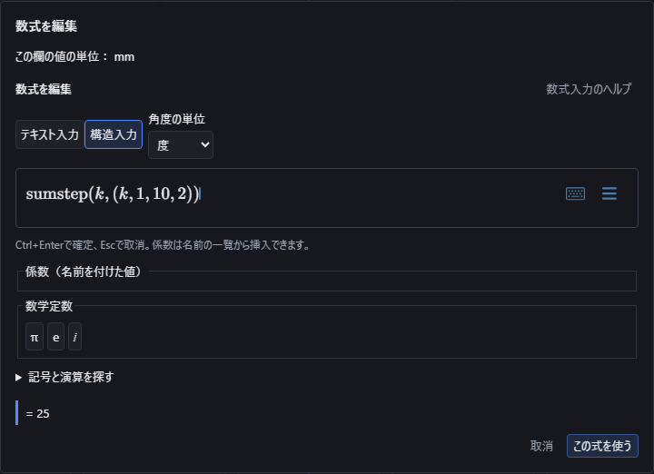

`sum(式,添字,下端,上端,刻み幅)`で、下端から一定の間隔で並ぶ値を足せます。`product`は同じ値を掛けます。刻み幅を省略すると1です。例えば`sum(k,k,1,10,2)`は1+3+5+7+9で25、`product(k,k,1,10,2)`は1×3×5×7×9で945になります。上端を越える値は含めません。

下端と上端は整数、刻み幅は1以上の整数にします。負の整数を含む範囲も使えます。例えば`sum(k,k,-5,5,3)`は−5−2+1+4で−2です。下端が上端より大きい場合は対象がないため、和は0、積は1です。刻み幅に0、負数、小数を入れると理由を表示し、座標や係数へ適用できません。

総和・総積の添字はその式の中だけで使います。入れ子の例`sum(sum(j,j,1,i,2),i,2,8,3)`は、外側のiが2、5、8のときの内側の和を足し、26になります。画面の係数と同じ名前でも、添字によって係数を書き換えることはありません。

刻み幅がある式を構造入力へ切り替えると、和は`sumstep`、積は`productstep`と、丸括弧内の「添字、下端、上端、刻み幅」で表示します。通常のΣやΠの上下だけでは刻み幅が読み落とされるためです。例えば`sumstep(k,(k,1,10,2))`が上の25の式に対応します。テキスト入力へ戻しても元の刻み幅を保持します。適用すると元の式が文書へ保存され、開き直した後の編集と「元に戻す」も使えます。

## 無限に続く和・積

上端に`∞`を入れると、無限に続く和や積を指定できます。例えば`sum((1/2)^k,k,0,∞)`は1+1/2+1/4+…で2です。`sum(1/k^2,k,1,∞)`はπ²/6、`product(4*k^2/(4*k^2-1),k,1,∞)`はπ/2になります。成立する式は、元の式を保持したまま座標や係数へ使えます。

途中の項が成立することと、無限に続けた先が有限の値に収まることを確認します。`sum(1/k,k,1,∞)`や`sum((-1)^k,k,0,∞)`は収束しないため、理由を表示して適用を断ります。`sum(1/(k-3)^2,k,1,∞)`はk=3で0による割り算になるため使えません。外側から0を掛けても、内側の不成立を隠して座標へ適用することはできません。

無限積は、各項が成立して0ではなく、有限で0ではない値へ収束する場合に扱います。例えば`product(1-1/k^2,k,1,∞)`は最初の項が0なので使えませんが、下端を2にした`product(1-1/k^2,k,2,∞)`は1/2です。

無限の上端と刻み幅は併用できます。`sum((1/2)^k,k,0,∞,2)`はk=0、2、4、…の項だけを足し、4/3になります。1以外の刻み幅には有限の下端が必要です。成立条件や収束を確定できない式は未確定と表示し、途中で打ち切った数値を厳密な答えとして適用しません。構造入力への切替、保存後の再編集、取り消しでも無限の上端と元の式を保持します。

## 左右から近づける極限

`limit(式,変数,近づける値)`で、変数を指定した値へ近づけた時の答えを求めます。方向を省略すると左右の両方を調べ、一致する場合だけ答えを使えます。例えば`limit((t^2-1)/(t-1),t,1)`は2です。t=1そのものでは割り算できませんが、1に近づけると2に近づきます。

片側だけを調べる場合は4番目に方向を入れます。**−1は左側（小さい値）から、1は右側（大きい値）から**です。`limit(abs(t)/t,t,0,-1)`は−1、最後を1にすると1です。方向を省略するか0を入れると両側を調べるため、この例では答えが一致せず適用できません。構造入力では近づける値の右上の−・＋が方向を表します。方向なしと0はどちらも両側なので、構造入力では符号を付けません。

角度の単位も答えへ反映します。`limit(sin(t)/t,t,0)`は、度ではπ/180、ラジアンでは1です。`limit(1/t,t,∞)`は0、度での`limit(atan(t),t,-∞)`は−90です。無限へ近づける場合は4番目の方向を省略してください。

左右の答えが異なる式、`limit(sin(1/t),t,0)`のように振動が残る式、無限に増えて有限な値に収まらない式は座標へ適用できません。近づける途中の成立条件を確認し切れない式も未確定とし、値を推測して使うことはありません。適用した式には元の入力と角度の単位を保存し、表示切替・保存後の再編集でも近づける方向を保持します。

## 整数の商・約数・素数・合同

「基本」のパレットから整数の商・余り、次の素数、素因数分解、約数、トーシェントを使えます。「集合・論理」には素数の判定・整除・合同の条件があります。

整数の商と余りは`a=bq+r`、`0≤r<|b|`を満たす規約です。`integerquotient(-7,3)=-3`、`integerremainder(-7,3)=2`です。割る数や法に0は指定できません。小数を整数へ丸めることはありません。

`primefactors(360)`は`[[2,3],[3,2],[5,1]]`を返し、2³×3²×5を表します。`component(primefactors(360),2,2)`なら2番目の素因数の指数2を座標として使えます。`divisors(36)`の一覧は`[1,2,3,4,6,9,12,18,36]`です。`eulertotient(36)`は36と互いに素な正整数の個数12を返します。

`isprime(13)`、`divides(4,20)`、`congruentmodulo(-1,5,3)`はいずれも真です。これらの真偽を座標へ直接変えることはありません。`which(isprime(13),5,true,0)`のように、条件が真の場合の値5を明示してください。`nextprime(97)`は97より大きい最初の素数101です。

4096ビットを超える入力や、探索の回数が上限に達する場合は、結果を確定せず中止します。約数は256個までです。未確認の大きな数を素数と決めつけたり、素因数分解や約数の一部だけを確定した結果として返したりしません。

## テンソルの軸と成分を指定する

「線形代数」のパレットで、テンソル積・成分ごとの積・縮約・軸の並べ替え・成分の選択を検索できます。配列は各軸の長さを揃え、添字と軸番号は **1から** 数えます。

| 入力 | 結果と意味 |
|---|---|
| `tensorelement(tensorproduct([1,2],[3,4]),[2,1])` | 2番目と1番目の成分の積で、座標値6になります |
| `tensorcontract([[1,2],[3,4]],1,2)` | 第1軸と第2軸の同じ添字を足して、1+4=5になります |
| `tensorpermute([[1,2,3],[4,5,6]],[2,1])` | 行と列を入れ替え、3行2列になります |
| `tensorshape([[[1,2]],[[3,4]]])` | 各軸の成分数`[2,1,2]`を返します。行列の階数rankとは別の値です |
| `hadamardproduct([2,3],[4,5])` | 同じ位置だけを掛け、`[8,15]`を返します |
| `kroneckerdelta(2,2)` | 添字が等しいので1です。異なる整数なら0です |
| `levicivita([1,3,2])` | 3次元の奇置換なので−1です。添字が重複すれば0です |

テキストでは`[1,2] ⊗ [3,4]`がテンソル積、`[1,2] ⊙ [3,4]`が成分ごとの積です。構造入力ではそれぞれ\otimes、\odotを使えます。どちらも行列積や3次元の外積×とは別の演算です。

縮約は、成分数が同じ異なる2軸を指定します。添字を繰り返すだけでは和を取りません。軸の並べ替えには全ての軸番号を重複なく指定し、成分の取り出しには全ての軸の添字を指定してください。

配列全体を座標1つへ適用することはできません。結果の下の「座標に使う成分を選ぶ」で、配列の各軸の番号を1から入力し、「この成分を式にする」を押します。全ての番号を指定するまでボタンは押せません。配列の軸は描画するXYZの軸とは別です。元の式と番号を保った`tensorElement(配列,[添字...])`が入力欄へ入り、再計算後に座標へ適用できます。複素成分はRe・Im・absなどで実数へ帰着した場合に座標へ使えます。添字の小数を整数へ丸めたり、配列の先頭成分だけを黙って採用したりしません。

例えば、テンソル積の2行1列を点のX座標に使うには、次の順に操作します。

1. スケッチの「点」を選び、X座標の「数式で入力」を開きます。
2. テキスト入力へ`tensorproduct([1,2],[3,4])`を入れます。結果は`[[3,4],[6,8]]`です。配列のままでは「この式を使う」は押せません。
3. 「座標に使う成分を選ぶ」で1つ目の軸に2、2つ目の軸に1を入れ、「この成分を式にする」を押します。この例では1つ目が行、2つ目が列です。
4. 入力欄へ成分を選ぶ式が入り、計算結果が6になったことを確認して「この式を使う」を押します。
5. 点の入力へ戻り、Y・Z座標を指定して「決定」を押します。元の配列の式と成分番号を保った点が作られます。点の決定前に取り消した場合は、新しい点を追加しません。

範囲外の番号や未入力の軸がある間は、成分を式にできません。成分の式を作った後も元の配列全体を入力し直せば、別の成分を選び直せます。

配列は8軸までです。入力や結果の式が大きすぎる場合は、計算を分ける案内が出ます。保存・再編集・Undoでは、式と指定した添字を保持します。

## 係数と数学記号を区別する

名前を付けた値は「係数」の一覧から挿入してください。テキストでは `coef("幅")` の形でも指定できます。数学定数のπ・e・虚数単位ⅈは「数学定数」から挿入します。係数iと、総和・積分の中だけに使う変数iも別のものとして扱います。

係数自身の式を編集しているときは、その係数と、その係数に依存する値を挿入候補に出しません。循環参照を作らずに式を直せます。他の係数が計算できない場合には、先にその係数の式を修正してください。

## 結果を確認して適用する

長さなどの欄へ適用できるのは有限な実数が1つに決まる式です。複素数なら実部・虚部・絶対値、ベクトルや行列なら成分などを明示してください。複数の解、未決定の記号、誤差の上限が確認できない数値計算は、そのまま1つの座標へ変換しません。

有限区間の定積分では、厳密な値が求まらない場合に数値積分の結果を表示することがあります。例えばラジアンの`integrate(sin(t^2),t,0,1)`は約0.3102683017です。近似値には`≈`を付け、推定誤差を表示します。推定誤差は数学的に保証した上限ではありません。この状態では「この式を使う」で座標・寸法へ適用できません。

数値積分は、式から区間内の連続性を確認できる場合だけ行います。端点で式が定義できない場合や無限区間でも、積分が収束することと厳密な答えを確認できれば、その答えを使えます。条件や答えを確かめ切れない場合は未確定、計算時間や量の上限に達した場合は中止の理由を表示します。

#### 端点や途中に注意が必要な積分

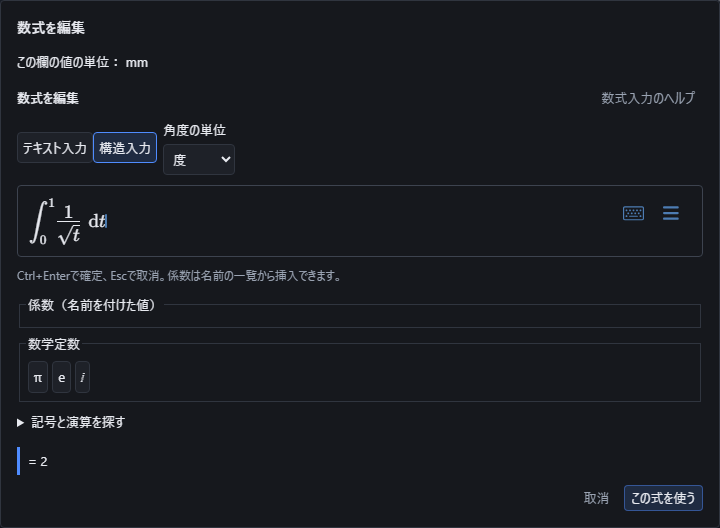

図では、積分する範囲の0と1、元の式、答え2を同じ欄で確認できます。「この式を使う」で係数や座標へ適用します。

| 入力例 | 答えと注意点 |
| --- | --- |
| `integrate(1/sqrt(t),t,0,1)` | 端点0で元の式を直接計算できませんが、積分の答えは2です。 |
| `integrate(ln(t),t,0,1)` | 端点0で対数を直接計算できませんが、積分の答えは−1です。 |
| `integrate((t^2-1)/(t-1),t,0,2)` | 途中のt=1で元の式を直接計算できませんが、その点の両側を含めた積分の答えは4です。上下端を逆にすると−4です。 |
| `integrate(1/(1+t^2),t,-∞,∞)` | 負と正の無限大までの積分で、答えはπです。 |
| `integrate(integrate(t*exp(-u),u,0,∞),t,1,2)` | 内側をu、外側をtで積分します。内側はt、全体は1.5です。外側の上下端を逆にすると−1.5です。 |
| `integrate(1/t,t,-1,1)` | 0の両側で発散します。「収束しません」と表示し、座標に使えません。 |

途中で発散する積分を、左右の発散を打ち消す「主値」に自動で置き換えません。外側で0を掛けたり、同じ積分どうしを引いたりしても、不成立の積分を有効な座標にはできません。式が定義できない点がある場合は、範囲とその点の両側で積分が収まるかどうかを区別します。

入れ子の積分は内側から条件を確認します。外側の変数によって内側の範囲や収束が変わり、その条件を確かめ切れないときは未確定になります。例えば`integrate(0*integrate(t*exp(u),u,0,∞),t,1,2)`を答え0として適用することはできません。

Ctrl+Enterでも適用でき、Escで取消できます。日本語入力の変換中のEnterでは適用しません。計算中に文書を切り替えたりUndoしたりした場合は、古い計算結果を適用しません。

ばねなどで複数段の入力中に係数を変更した場合、前の段で受け取った値はそのまま確定しません。「前の入力へ戻る」から該当欄を修正してください。未確定の径を既定値に置き換えることはありません。

#### 不定積分（原始関数）

範囲を付けずに`integrate(式,変数)`と書くと、不定積分（原始関数）を求めます。構造入力でも、上端・下端の無い積分の形（`\int t^2\,\mathrm{d}t`）で入力できます。

結果は「原始関数: 1/3 * t^3 + C」のように積分定数Cを添えて表示します。積分の変数の名前がCのときは、積分定数をKと表示します。表示するのは、微分すると元の式に戻ることを確認した原始関数だけです。

積分定数は値が1つに決まらないため、この結果は座標・寸法・成分・係数の数値には使えず、「この式を使う」は押せません。数値が必要なときは、範囲を付けた定積分にしてください（例`integrate(t^2,t,0,3)`は9）。

| 入力例 | 答えと注意点 |
| --- | --- |
| `integrate(t^2,t)` | 原始関数: 1/3 * t^3 + C |
| `integrate(0,t)` | 原始関数: 0 + C |
| `integrate(1/t,t)` | 原始関数: ln(t) + C。実数の範囲でtが負のときはtの絶対値の自然対数+Cと同じ意味で、違いは積分定数に含まれます。 |
| `integrate(sin(sin(t)),t)` | 式で表せる原始関数が見つからないため、値が決まらないまま表示します。 |

式の一部に書いた不定積分（例`2*integrate(t^2,t)`）は、今は値が決まらないまま表示します。

関数作図の式には使えません。「不定積分は積分定数が定まらない関数の集まりのため、関数の式には使えません。原始関数を式で書き、積分定数を決めてください（例 integrate(X^2,X) の代わりに X^3/3+1）。」と表示します。

## 構造入力でのキーボード操作

構造入力で「\」に続けて命令の名前を打っている間は、Enterで命令を確定し、Escで命令の入力だけを終えます（数式の画面は閉じません）。式の最初や最後でTab・Shift+Tab・→・←を押すと、文字入力と同じく前後の部品へ移ります。

「\」に続けて命令の名前を打つと、候補の一覧が数式の画面の上に出ます。↑・↓で候補を選んでEnterで確定するほか、一覧の候補を押しても入れられます。√（`\sqrt`）や分数（`\frac`）のように中に式を入れる命令を入れると、入力位置が最初の空欄（√の中、分数では分子）へ移り、続けて打った数字や文字はその空欄に入ります。π（`\pi`）のように中に何も入れない命令では、続けて打った文字は命令の後ろに続きます。（Escで命令の入力を終えた場合も、引数のある命令は最初の空欄へ入ります。）

## 直交座標のベクトル解析

関数作図の式では、変数一覧を明示して勾配・発散・回転などを使えます。変数はその作図にあるX・Y・ZまたはT・U・Vから1〜3個を選び、重複せず順序を指定します。この順序を直交座標の基底として扱います。円柱座標・球座標の尺度を推測して補うことはありません。円柱座標・球座標で計算するときは、座標系の名前を指定します（「勾配・発散・回転・ラプラシアンの座標系を選ぶ」を参照）。

| 入力する式 | 結果と作図での使い方 |
|---|---|
| `gradient(X^2+Y^2,[X,Y])` | 勾配は[2X,2Y]です。`component(gradient(X^2+Y^2,[X,Y]),1)`で最初の成分2Xを使います。`grad`も同じ意味です。 |
| `divergence([X^2,Y^2],[X,Y])` | 発散は2X+2Yです。成分数と変数の数を同じにします。`div`も同じ意味です。 |
| `curl([-Y,X,0],[X,Y,Z])` | 回転は[0,0,2]です。成分と変数は各3個必要で、指定した順序の右手系で符号を決めます。3変数を使う陰関数等の式で成分を取り出せます。 |
| `laplacian(X^2+Y^2,[X,Y])` | 各変数による二階微分の和で、答えは4です。入力する式は一つの数値を表す式です。 |
| `jacobian([X^2*Y,Y^2],[X,Y])` | 行は入力の成分、列は微分する変数です。`component(jacobian([X^2*Y,Y^2],[X,Y]),1,2)`はX²です。 |
| `hessian(X^2*Y,[X,Y])` | 行と列の変数で順に微分します。`component(hessian(X^2*Y,[X,Y]),1,2)`は2Xです。 |

成分番号は1から始まります。勾配・回転の結果はベクトル、ヤコビ行列・ヘッセ行列の結果は行列です。そのまま一つの座標の値にはせず、`component`で使う成分を選びます。ヤコビ行列の入力は1〜16個の成分を持つ一覧です。係数は微分中に固定し、係数を編集した場合は同じ原式から計算し直します。三角関数を微分したときの度・ラジアンの係数も保持します。

元の式や途中の微分が成立しない位置を、成分選択や0の掛け算で隠しません。例えば`component(gradient(X^2+abs(Y),[X,Y]),1)`でも、勾配全体が存在しないY=0はつなぎません。保存するのは入力した原式・変数の順序・角度の単位です。作成後も式を再編集でき、「元に戻す」で編集前へ戻せます。この入力方法は関数作図用です。通常の座標欄で任意の位置の値を求める操作、曲線座標系の解析、線・面・体積の積分とは区別します。

`gradient`・`divergence`・`curl`・`laplacian`は`∇`（構造入力では`\nabla`）でも書けます。`∇_[X,Y,Z]f`が勾配、`∇_[X,Y,Z]·F`が発散、`∇_[X,Y,Z]×F`が回転、`∇_[X,Y,Z]^{2}f`（`∇²`とも書けます）がラプラシアンです。

| 入力する式 | 同じ意味の式 |
|---|---|
| `∇(X^2+3*Y^2+Z^3)`（一覧を省略。作図の軸X・Y・Zを補う） | `gradient(X^2+3*Y^2+Z^3,[X,Y,Z])` |
| `∇_[Y,X](X^2+3*Y^2)` | `gradient(X^2+3*Y^2,[Y,X])`（変数の順序が変わる） |
| `∇·[X^2,X*Y,Z^3]` | `divergence([X^2,X*Y,Z^3],[X,Y,Z])` |
| `∇×[-Y,X,0]` | `curl([-Y,X,0],[X,Y,Z])` |
| `∇²(X^2*Y+Z^3)`（構造入力`\nabla^{2}`） | `laplacian(X^2*Y+Z^3,[X,Y,Z])` |

変数の一覧`_[...]`を省略できるのは、X・Y・Zを軸とする関数作図の式だけです。それ以外（T・U・Vを使う媒介変数の作図や、関数作図以外の入力）で一覧を省略すると、次の理由で断ります。「∇ の後に微分する変数の一覧を ∇_[x,y,z] のように指定してください（構造入力では \nabla_{[x,y,z]}）。一覧を省略できるのは、X・Y・Z の軸を変数にする関数作図の式だけです。」

## 勾配・発散・回転・ラプラシアンの座標系を選ぶ

`gradient`・`divergence`・`curl`・`laplacian`と、指定した位置で調べる`gradientat`・`divergenceat`・`curlat`・`laplacianat`には、直交座標以外の座標系を追加の引数で指定できます。`cartesian`（直交、番号0、既定）・`cylindrical`（円柱r,θ,z、番号1）・`spherical`（球r,θ,φ・θは極角、番号2）のいずれかを、名前でも番号でも指定できます。構造入力では`\text{cylindrical}`・`\mathrm{cylindrical}`のように書きます。番号で入力しても、表示や保存では名前になります。

関数作図の式では、変数一覧の後にもう1つ座標系を加えます。

| 入力する式 | 番号での同じ意味の式 |
|---|---|
| `divergence([X,0,0],[X,Y,Z],cartesian)` | `divergence([X,0,0],[X,Y,Z],0)` |
| `gradient(X^2*Z,[X,Y,Z],cylindrical)` | `gradient(X^2*Z,[X,Y,Z],1)` |
| `curl([0,X,0],[X,Y,Z],cylindrical)` | `curl([0,X,0],[X,Y,Z],1)` |
| `laplacian(X^2,[X,Y,Z],spherical)` | `laplacian(X^2,[X,Y,Z],2)` |

例えば座標(X,Y,Z)=(2,1,0)で、`laplacian(X^2,[X,Y,Z],cylindrical)`は4、`laplacian(X^2,[X,Y,Z],spherical)`は6です。

「[指定した位置の勾配や行列を座標に使う](math-input.md#指定した位置の勾配や行列を座標に使う)」の`gradientat`・`divergenceat`・`curlat`・`laplacianat`では、評価点と座標系を組にした`[[評価点],座標系]`を評価点の位置に指定します。例えば`laplacianat(r^2,[r,t,p],[[2,1,0],cylindrical])`は4、`laplacianat(r^2,[r,t,p],[[2,1,0],spherical])`は6、`component(curlat([0,r,0],[r,t,p],[[2,1,0],cylindrical]),3)`は2です。座標系を省いた従来どおりの評価点だけの指定は、直交座標のままです。

ヤコビ行列・ヘッセ行列（`jacobian`・`jacobianat`・`hessian`・`hessianat`）には座標系を指定できません。`cartesian`・`cylindrical`・`spherical`という名前は、この座標系の引数の位置でだけこの意味を持ちます。それ以外の場所で使うと、値の決まっていない記号として扱います。同じ名前の記号を宣言していれば、宣言した意味を優先します。

| 断られる入力 | 理由 |
|---|---|
| `gradient(X^2,[X,Y,Z],polar)` | 記号「polar」の意味を指定してください。 |
| `jacobianat(r,[r,t,p],[[1,1,1],cylindrical])` | 座標系の指定は勾配・発散・回転・ラプラシアンで使用してください。 |
| `gradientat(r,[r,t,p],[[1,1,1],3])` | 座標系は cartesian（直交）・cylindrical（円柱 r,θ,z）・spherical（球 r,θ,φ・θは極角）のいずれか、または番号 0・1・2 で指定してください。 |

## 曲線に沿って量を積分する

`lineintegral(量,[座標変数],[曲線の座標式],媒介変数,下限,上限)`は、曲線の長さに沿って量を積分します。量を1にすると曲線の長さです。`circulation([ベクトルの成分],[座標変数],[曲線の座標式],媒介変数,下限,上限)`は、力などのベクトルと曲線の進む向きを使って仕事を求めます。

| 入力例 | 答えと意味 |
| --- | --- |
| `lineintegral(1,[x,y],[3*t,4*t],t,0,1)` | 3対4の傾きで進む直線の長さ5です。上下限を逆にしても長さは5です。 |
| `lineintegral(x,[x,y],[3*t,4*t],t,0,1)` | 長さに沿ってxの値を積分し、7.5です。 |
| `circulation([2*x,2*y],[x,y],[t,t^2],t,0,1)` | 曲線を進む仕事は2です。上下限を逆にすると−2です。 |
| `lineintegral(1,[x,y],[cos(t),sin(t)],t,0,360)` | 角度が「度」なら半径1の円周2πです。「ラジアン」で一周にする場合は上限を`2*pi`にします。 |
| `lineintegral(1/sqrt(x),[x],[t],t,0,1)` | 端点で量を直接計算できませんが、積分の答えは2です。 |

座標は直交座標の1〜3成分です。座標変数は重複させず、曲線の座標式と同じ順序・個数で指定します。媒介変数は1個です。これらは式の中だけの名前で、同じ名前の係数を使うときは`coef("名前")`と書きます。範囲には有限な端点や`∞`・`-∞`を指定できますが、結果が有限の実数と確認できる場合だけ座標や寸法へ適用できます。

曲線の座標式が範囲内で定義できない場合は、途切れを勝手につなぎません。積分する量が孤立した点で定義できない場合は、その点の両側で積分がそれぞれ収束することを確認します。`lineintegral(1/x,[x],[t],t,-1,1)`は左右の発散を打ち消して0にはせず、確定を拒否します。成分の選択や0の掛け算で元の式の不成立を隠すこともできません。曲線の滑らかさや答えを確認できない場合は未確定として残します。

入力した量・曲線・範囲・角度の単位を保存し、開き直して再編集できます。積分の答えを係数にして点へ使った場合も、式や範囲の変更が点へ反映され、「元に戻す」で戻せます。CADの辺を選んで自動で積分する操作(CAD形状を直接指定する積分)には対応しておらず、一般の曲線座標、面積分と体積積分はこの入力とは別です。図形の測定値から作った係数は、他の係数と同じようにこの積分の量・座標式・範囲に使えます(「[図形の測定値を数式で使う](math-input.md#図形の測定値を数式で使う)」参照)。

## 面や体積に沿って量を積分する

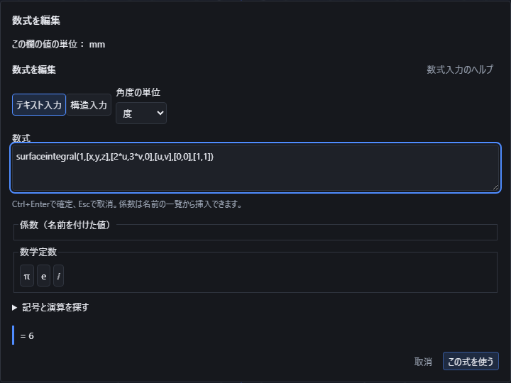

数式入力を開き、テキスト入力で量・座標の名前・座標式・媒介変数・上下限を順に指定します。媒介変数は座標式を動かすための名前です。面では2個、体積では3個を使います。結果が有限な実数と確認できると、「この式を使う」で係数や座標へ適用できます。

| 入力 | 意味 |
| --- | --- |
| `surfaceintegral(量,[x,y,z],[座標式],[u,v],[下限],[上限])` | 面積に沿って量を積分します。量を1にすると面積です。 |
| `fluxintegral([場の3成分],[x,y,z],[座標式],[u,v],[下限],[上限])` | 面の向きを考慮した流束を求めます。 |
| `volumeintegral(量,[x,y,z],[座標式],[u,v,w],[下限],[上限])` | 体積に沿って量を積分します。量を1にすると体積です。 |

例えば`surfaceintegral(1,[x,y,z],[2*u,3*v,0],[u,v],[0,0],[1,1])`は、幅2・高さ3の平面の面積6です。`volumeintegral(1,[x,y,z],[-2*u,3*v,4*w],[u,v,w],[0,0,0],[1,1,1])`は体積24です。座標の向きを反転しても面積と体積の重みは正のままです。積分する量そのものが負なら答えが負になることはあります。

流束の例`fluxintegral([0,0,4],[x,y,z],[2*u,3*v,0],[u,v],[0,0],[1,1])`は24です。最初の媒介変数へ進む方向と、次の媒介変数へ進む方向から、面の向きを決めます。座標式を`[2*v,3*u,0]`に替えると向きが反転して−24です。1つの媒介変数の上下限を逆にしても流束の符号が反転します。面積・体積の積分は上下限を逆にしても同じ範囲の量になります。

範囲は有限な数値で指定する長方形・直方体です。座標と媒介変数はそれぞれの一覧内で重複させず、座標式と変数一覧の順序を揃えます。同名の係数は`coef("名前")`で区別します。三角関数には画面で選んだ度・ラジアンが適用されます。半径1の球面は、ラジアンで座標式`[sin(u)*cos(v),sin(u)*sin(v),cos(u)]`、範囲`[0,0]`から`[pi,2*pi]`とすると面積4πです。

元の座標式と量が範囲全体で定義できることを確認します。0で割る式を掛け算の0や成分選択で隠しても成功にはしません。座標式の滑らかさを確認できない折れ目、未確認の特異点、無限の範囲は確定できません。球の極など、座標式の微分は有限で面積の重みだけが0になる場所は扱えます。同じ面・体積を何度も覆う座標式では、その回数だけ数えます。CADの面や立体を一つ選択して測る操作ではありません。

入力した原式、変数の順序、範囲、角度の単位を保存し、開き直して編集できます。量・座標式・範囲の変更は利用先の座標にも反映され、「元に戻す」で戻せます。一般の形の領域、特異点のある面積分・体積積分、CAD形状を直接指定する積分には対応していません。図形の測定値から作った係数は、他の係数と同じようにこの積分の量・座標式・範囲に使えます(「[図形の測定値を数式で使う](math-input.md#図形の測定値を数式で使う)」参照)。

## 閉じた曲線・曲面で積分する

`closedlineintegral`・`closedcirculation`（記号`∮`）と`closedsurfaceintegral`・`closedfluxintegral`（記号`∯`）は、「[曲線に沿って量を積分する](math-input.md#曲線に沿って量を積分する)」「[面や体積に沿って量を積分する](math-input.md#面や体積に沿って量を積分する)」と同じ引数・同じ順序を使い、曲線や曲面が閉じていることを確かめてから、それぞれ`lineintegral`・`circulation`・`surfaceintegral`・`fluxintegral`と同じ計算をします。構造入力では`\oint\left(…\right)`・`\oiint\left(…\right)`と書きます。

`∮(場,[座標変数],[曲線の座標式],媒介変数,下限,上限)`は、場をベクトル`[…]`で指定すると`closedcirculation`、それ以外は`closedlineintegral`として読みます。`∯(場,[x,y,z],[曲面の座標式],[u,v],[下限],[上限])`も同様に、場がベクトルなら`closedfluxintegral`、そうでなければ`closedsurfaceintegral`として読みます。

| 入力例 | 答えと意味 |
| --- | --- |
| `closedlineintegral(1,[x,y],[cos(t),sin(t)],t,0,360)` | 単位円の円周2π（角度は度）。 |
| `∮([-y,x],[x,y],[cos(t),sin(t)],t,0,360)` | 単位円を1周する仕事（循環）は2π。 |
| `closedsurfaceintegral(1,[x,y,z],[sin(u)*cos(v),sin(u)*sin(v),cos(u)],[u,v],[0,0],[180,360])` | 単位球の表面積4π。 |
| `∯([x,y,z],[x,y,z],[sin(u)*cos(v),sin(u)*sin(v),cos(u)],[u,v],[0,0],[180,360])` | 単位球からの流束4π。 |

閉じているかどうかは、角度の単位と代入した係数の値で決まる厳密な範囲だけで判定します。曲線は媒介変数の下限・上限で始点と終点が一致すること、曲面は媒介変数の長方形の向かい合う辺が一致するか1点につぶれることを、特殊角・周期・逆三角関数を含む厳密な値で確かめてから計算し、値が近いだけでは閉じているとみなしません。閉じていない場合や閉じているかどうかを確かめられない場合は、開いた積分（`lineintegral`・`circulation`・`surfaceintegral`・`fluxintegral`）へ置き換えずに理由を表示して断ります。

| 状況 | 理由 |
| --- | --- |
| 曲線の始点と終点が一致しない | 曲線の始点と終点が一致しないため、閉じた曲線の積分（∮）として計算できません。始点と終点が同じ点になる媒介変数の範囲を指定するか、閉じていない曲線には lineintegral・circulation を使ってください。 |
| 曲線が閉じることを厳密に確かめられない | 曲線の始点と終点が一致することを厳密に確かめられないため、閉じた曲線の積分（∮）として計算しません。値が近いだけでは閉じているとみなしません。始点と終点の座標が厳密な値になる範囲（例 cos(t)・sin(t) なら t を 0〜360 度または 0〜2π）で指定してください。 |
| 曲面の媒介変数の長方形の辺が一致せず、1点にもつぶれない | 曲面の媒介変数の長方形で、向かい合う辺が一致せず、1点にもつぶれないため、閉じた曲面の積分（∯）として計算できません。閉じていない曲面には surfaceintegral・fluxintegral を使ってください。 |
| 曲面が閉じることを厳密に確かめられない | 曲面の媒介変数の長方形で、向かい合う辺が一致すること、または1点につぶれることを厳密に確かめられないため、閉じた曲面の積分（∯）として計算しません。値が近いだけでは閉じているとみなしません。辺の座標が厳密な値になる範囲（例 球なら 0〜180 度と 0〜360 度）で指定してください。 |
| 引数の一覧の無い`∮`・`∯`、閉じた体積分`∰`（構造入力`\oiiint`） | 「∮」「∯」は、∮(場,[x,y],[曲線の座標式],t,下限,上限)・∯(場,[x,y,z],[曲面の座標式],[u,v],[下限],[上限]) のように引数の一覧を続けて指定してください。曲線や曲面が閉じていることを確かめてから計算します（closedcirculation・closedlineintegral・closedfluxintegral・closedsurfaceintegral と同じ）。閉じた体積分「∰」には対応していません。体積の積分は volumeintegral で指定してください。 |

範囲が有限でない場合や、範囲の端で曲線・曲面の座標が定まらない場合も、開いた積分と同様に理由を表示して断ります。入力した原式・変数の順序・角度の単位は保存して再編集でき、係数を変えると同じ原式から閉じているかどうかを判定し直します。

## 指定した位置の勾配や行列を座標に使う

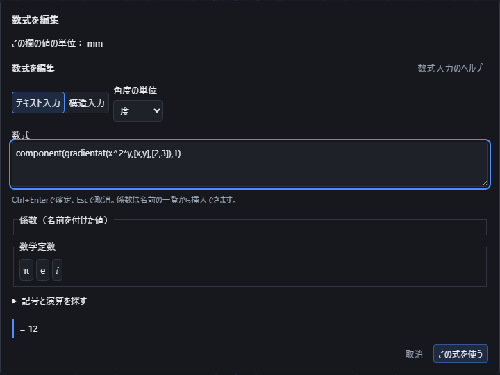

通常の座標欄や係数では、`gradientat(式,[変数一覧],[評価点])`のように、調べる位置も明示します。変数と位置は同じ順序・個数で、変数は重複しない1〜3個、位置は有限の実数です。変数はこの式の中だけの名前で、同名の係数を使う場合は`coef("名前")`で区別します。先に微分し、その後で指定位置の値を求めます。

| 入力例 | 答え |
|---|---|
| `component(gradientat(x^2*y,[x,y],[2,3]),1)` | 勾配[12,4]の最初の成分12を座標に使います。 |
| `divergenceat([x*y,x^2],[x,y],[2,3])` | 発散は3です。 |
| `component(curlat([-y,x,0],[x,y,z],[2,3,4]),3)` | 指定順序の右手系で、回転[0,0,2]の3番目の成分2です。 |
| `laplacianat(x^2*y,[x,y],[2,3])` | 二階微分の和は6です。 |
| `component(jacobianat([x*y,x^2],[x,y],[2,3]),2,1)` | 成分が行、変数が列です。2行1列の答えは4です。 |
| `component(hessianat(x^2*y,[x,y],[2,3]),1,2)` | 行・列の変数による二階微分で、答えは4です。 |

勾配や行列そのものは一つの座標にはできません。使う成分を1から始まる番号で選びます。評価点を変えて再計算でき、保存して開き直しても原式・変数の並び・評価点・角度単位を保ちます。係数にこの式を使って点を作れば、係数の再編集で点も追従し、「元に戻す」で編集前へ戻せます。

計算前に元の式の全成分と、その点の周りで微分が成立する条件を調べます。例えば`component(jacobianat([x,y/y],[x,y],[2,0]),1,1)`は、選ばない成分のy/yが0で成立しないため使えません。0を掛けてもこの不成立を消しません。`abs(x)`や`sqrt(x)`の境界など、周りの成立条件を確認できない式には確定値を出しません。特殊な相殺で微分が存在する式でも、証明できないものは未確定として残します。曲線座標系の尺度や、線・面・体積積分をこの入力から推測することはありません。

## 導関数で曲線と曲面を作る

関数作図の式では`diff(式,変数)`で導関数を使えます。微分する変数は、その作図で使うX・Y・ZまたはT・U・Vから指定します。係数は固定して微分し、係数の値を編集したら同じ原式から作り直します。

| 関数の式 | 意味 |
|---|---|
| `diff(X^3,X,X)` | Xで2回微分した6Xを作図します。 |
| `diff(X^2+Y^2,X)` | Yを固定してXで微分した2Xを曲面の式に使います。 |
| `diff(sin(T),T)` | 度ならπ/180×cos(T)、ラジアンならcos(T)です。 |
| `diff(coef("倍率")*X^2,X)` | 係数「倍率」を固定して2×倍率×Xを作図します。 |

変数は1回ずつ順に指定し、1つの`diff`では15回までです。四則、冪根、三角・逆三角、双曲線・逆双曲線、指数・対数などの実数の式を扱います。元の式や途中の導関数が成立しない位置は残します。たとえば`diff(X/X,X)`でもX=0の穴を埋めず、`diff(abs(X),X)`では尖ったX=0をつなぎません。境界で別途の極限が必要な式や、未対応の演算の微分は、答えを確認できるまで確定できません。全ての数式を自動で作図できるという意味ではありません。

微分した後もXYZの有限な描画範囲と許容誤差が必要です。保存するのは`diff`を含む元の式で、保存再開・再編集・「元に戻す」でも保持します。詳しい操作は[曲線](function-curve.md)・[曲面](function-surface.md)を参照してください。

## d/dx・∂/∂xで微分する

構造入力の`\frac{d}{dx}`・`\frac{\partial}{\partial x}`は、関数作図のX・Y・Z・T・U・Vの変数か、微分方程式（odesolve・pde）の独立変数について微分します。既存の`diff(式,変数)`と同じ導関数を表し、新しい変数を作りません。

| 構造入力の式 | 意味 |
|---|---|
| `\frac{d}{dT}(T+2)^3` | `diff((T+2)^3,T)`と同じです。T=0で12、T=1で27です。 |
| `\frac{\partial}{\partial X}(X^2*Y)` | `diff(X^2*Y,X)`と同じです。(X,Y,Z)=(2,3,4)で12です。 |
| `\frac{\partial}{\partial X}\frac{\partial}{\partial Y}(X^2*Y^3)` | Yで微分してからXで微分し、(2,3,4)で108です。 |

関数作図の変数でも微分方程式の独立変数でもない名前を指定すると、理由を表示して断ります。微分する変数「x」には、関数作図の変数（X・Y・Z・T・U・V）か微分方程式の独立変数を指定してください。d/dx・∂/∂x は新しい変数を作りません。指定した位置での微分の値は derivativeat(式,変数,位置,回数) で求めます。案内どおり、`x`の位置2での微分は`derivativeat(x^3,x,2)`で12を求められます。

## 関数作図で場合分けする

関数作図の式では`which(条件1,式1,条件2,式2,…,true,既定の式)`で場合分けできます。条件は先に成り立ったものから選び、選ばれた式だけを計算します。例えば`which(X<0,X^2,true,X+3)`は、X=−2で4（X²側）、X=2で5（X+3側）になります。`and`・`or`・`not`も条件に使えます。

条件が1つも成り立たない範囲や、選ばれた式自体が定義できない範囲は、その部分の線や面を作りません。例えば`which(X<=-1,-2,X>=1,3)`は、X≤−1で値−2、X≥1で値3の、離れた2本の線になり、−1と1の間には線をつなぎません。既定の`true`の式を省略した`which(X<0,X^2)`では、X≥0の範囲に線がありません。

| 関数の式 | X=−2の値 | X=2の値 |
|---|---|---|
| `which(X<0,X^2,true,X+3)` | 4 | 5 |

`diff`と組み合わせた`diff(which(X<0,X^2,true,X^3),X)`のように、選ばれた枝の中では導関数も計算します。条件の境界では傾きを求められません。`1/X`のような極を挟む場合分けも、それぞれ別の曲線として作図し、橋を架けません。

## 条件が成り立つ範囲だけで曲線・曲面を作る

`which(条件,式)`は、条件が成り立つ範囲だけに曲線・曲面を作ります。例えば円の内側だけの面は`which(X^2+Y^2<1,X^2-Y^2)`です。値が跳ぶ境界をまたいで曲線・曲面をつなぎません。

根号の中の式を条件が守っていると確かめられるときは、条件の境界まで曲線・曲面を作ります。例えば半円は`which(X^2<1,sqrt(1-X^2))`、半球は`which(X^2+Y^2<1,sqrt(1-X^2-Y^2))`です。

条件は、根号の中の式を比べる形で書きます。`1-X^2-Y^2>0`や`X^2+Y^2<=1`でもかまいません。根号の中を正の数で何倍かした形や、正の数を足した形も守られます。

根号が2つ以上あるときは、`and`でそれぞれの条件を並べます（例 `which(and(X^2<1,X>-1),sqrt(1-X^2)+sqrt(X+1))`）。範囲の条件で指定した場合も同じです。

境界の近くは、指定した精度で確かめられる範囲まで細かく分けて作ります。省いた境界のすぐ外側の誤差は、表示する精度（誤差の上限）に含めます。精度を細かくするほど、境界近くの三角形の数は増えます。

条件・範囲・精度を確かめられない場合は近似せず、理由を示して作成を止めます。「条件を満たす範囲の境界を指定した精度で確かめられないため、形を作れません。等式だけで成り立つ条件になっていないか、条件・範囲・精度を見直してください。」

縁で面が垂直に立つ半球やドームは、精度を細かくすると計算量が急に増えます。作れるのは、精度が半径の10分の1程度より粗い場合です。それより細かいと「指定した精度で面を計算しきれませんでした。範囲や精度を見直してください。」と表示されます。

細かい精度の半球やドームは、空間の等式（例 `X^2+Y^2+Z^2=100`、Zの範囲を0から）で作ると、指定した精度の球面になります。

| 断られる例 | 内容 |
|---|---|
| `which(X^2+Y^2=1,0.5)` | 等式だけで成り立つ条件（面積・長さを持たない細い枝） |
| `which(X^2<1,sqrt(X^2-1))` | 条件の内側で根号の中が負になり、境界（X=±1）の近くで指定した精度を確かめられない式 |

条件が根号の中を守らない式（例 `which(X^2<1,sqrt(0.5-X^2))`）は、式が定義できない部分で作成を止め、「指定した精度で曲線を計算しきれませんでした。範囲や精度を見直してください。」と表示します。条件を`X^2<0.5`にしてください。

## 指定した位置で微分する

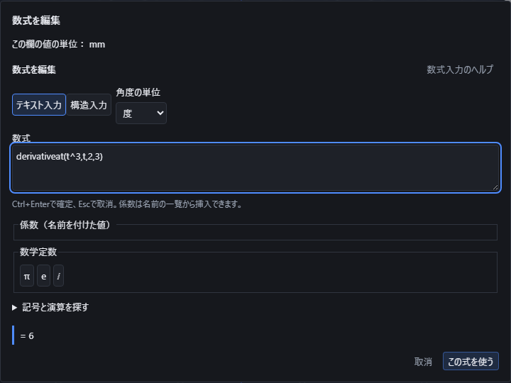

図では`derivativeat(t^3,t,2,3)`の元の式と答え6を確認しています。3つ目の引数が調べる位置、4つ目が微分する回数です。

テキスト入力の`derivativeat(式,変数,位置,回数)`で、指定した位置の微分の値を求めます。回数を省略すると1回です。回数は1〜15の整数、位置は有限な実数を指定します。まず式を微分し、それから位置の値を代入する意味です。

| 入力例 | 答えと意味 |
| --- | --- |
| `derivativeat(t^3,t,2)` | t=2での傾きは12です。 |
| `derivativeat(t^3,t,2,3)` | 3回微分した値は6です。 |
| `derivativeat(ln(t),t,2)` | 答えは1/2です。 |
| `derivativeat(sin(t),t,0)` | 度ではπ/180、ラジアンでは1です。角度の単位も保存します。 |
| `derivativeat(derivativeat(x^2*y,x,2),y,3)` | 内側はx、外側はyについて微分し、答えは4です。 |

尖った点では、左右から求めた傾きが一致しないため値を適用できません。`derivativeat(abs(t),t,0)`がその例です。元の式がその位置で定義できない`derivativeat(t/t,t,0)`や、実数の範囲で片側しかない`derivativeat(sqrt(t),t,0)`も座標に使えません。不成立の微分の外側で0を掛けても、有効な答え0にはしません。

計算結果が有限な実数になったら「この式を使う」で係数や座標へ適用します。構造入力へ切り替えても、微分する変数・位置・回数を保持します。計算の成立を確かめ切れない式は未確定のまま表示します。この指定位置の微分と、変数を残した導関数の式や一般の微分方程式の計算は別です。

## 指定した位置と増分から全微分を求める

`totaldifferentialat(Function(式,変数1,変数2,…),[位置1,位置2,…],[増分1,増分2,…])`は、指定した位置での全微分`Σᵢ ∂f/∂xᵢ(位置)×増分ᵢ`を求めます。変数は`Function`に書いた宣言順に対応し、位置・増分もその順で指定します。変数は1〜3個です。

例えば`x²y`で変数の順を`(x,y)`にした`totaldifferentialat(Function(x^2*y,x,y),[2,3],[1/10,1/5])`は2ですが、変数の順を`(y,x)`にして同じ位置・別の増分を渡す`totaldifferentialat(Function(x^2*y,y,x),[3,2],[1/10,1/5])`は2.8になります。宣言した変数の順序を取り違えると別の値になります。

| 入力例 | 結果 |
|---|---|
| `totaldifferentialat(Function(x^3,x),[2],[-1/4])` | −3 |
| `totaldifferentialat(Function(7,x,y),[2,3],[10,-20])` | 0（定数関数は増分によらず0） |
| `totaldifferentialat(Function(x^2,x),[2],[1])` | 4 |

全微分は接線・接平面による近似で、実際の差（有限差分）とは異なります。例えば上の`Function(x^2,x)`をx=2からx=3まで実際に動かした差は5ですが、全微分の値は4です。

位置や増分に複素数・無限大・0で割る式は使えず、理由を表示します。関数の途中に定義できない点がある場合（`x/x`のx=0など）も、その点では確定しません。度・ラジアンの設定は関数の中の三角関数に適用されます。構造入力でも同じ式を書け、掛け算を含む式もそのまま読み取ります。求めた値は名前付き数値や座標に使え、保存して開き直しても元の式・変数の順序を保ちます。ただし、この入力はXYZを使う関数作図の中では計算できません。

全微分は勾配と増分の内積と同じ値です。例えば`totaldifferentialat(Function(x^2+y^2,x,y),[1,2],[1/10,1/5])`は1で、`dot(gradientat(x^2+y^2,[x,y],[1,2]),[1/10,1/5])`と同じ値になります。

## 保存と改名

原式、入力方式、角度の単位を部品ファイルに保存します。係数の改名は、その係数を参照する数式と保存済みの各構成にも反映され、Undo1回で戻せます。未選択の構成にだけ参照がある係数も、参照を解消するまで削除できません。

## 入力方式と角度の説明

テキスト入力と数式の形での入力、度・ラジアン、記号の分類と検索には操作の説明があります。マウスを置くかTabで移動して確認します。入力方式は式の意味が保たれることを確かめてから切り替えます。角度の選択は三角関数の入力と角度を返す関数の結果に使います。配列の成分を使う時は各軸の番号を1から指定し、XYZの座標軸と混同しないよう欄にも案内を添えています。

## 分布を宣言して事象と確率変数を計算する

図では`randomexpectation(x,[x],normaldistribution(3,2))`の元の式と答え3を確認しています。分布の指定も式の一部として保存します。

確率変数の名前と分布を、求めたい式と一緒に指定します。例えば`probability(x>0,[x],normaldistribution(0,1))`は、平均0・標準偏差1の正規分布でxが0より大きい確率を求め、答えは1/2です。`[x]`の名前はこの式の中だけで使い、同じ名前の文書の係数とは区別します。

- `givenprobability(x>2,x>1,[x],uniformdistribution(0,4))`は「x>1という条件でx>2になる確率」です。P(A|B)のAとBを別々の引数に保ち、絶対値へ置き換えません。条件の確率が0のときは決定しません。
- `randomexpectation(x,[x],normaldistribution(3,2))`は期待値3、`randomvariance(x,[x],normaldistribution(3,2))`は分散4を求めます。
- `randomcovariance(x,2*x,[x],normaldistribution(1,3))`は共分散18、`randomcorrelation(x,-2*x,[x],uniformdistribution(-1,1))`は相関-1です。分散0の値に相関は定義しません。
- `independentevents(A,B,[x],分布)`は二つの事象の独立を確認します。`independentvariables(f,g,[x],分布)`は二つの値の独立を確認します。成立すれば「真（成立）」、成立しなければ「偽（不成立）」と表示します。共分散が0というだけでは独立にせず、証明できない関係は未確定のままです。真偽の答えを数値0や1の座標へ置き換えることはありません。

複数変数を独立とする場合は`independentdistributions([normaldistribution(0,1),normaldistribution(0,1)])`のように明示します。依存する変数には`jointfinitedistribution([[0,0],[2,2]],[1/4,3/4])`のように、同時に起きる値の組と確率を記します。確率の合計は正確に1が必要で、自動で比率を直しません。一変数の有限表は`finitedistribution([0,2],[1/4,3/4])`です。

独立な変数でも、同じ変数を含む二つの事象が独立になるとは限りません。連続分布の複数変数にまたがり、事象どうしで変数が重なる条件は、現在は未確定として扱います。確率を単純に掛けたり足したりして決定しません。

分布には`normaldistribution(平均,標準偏差)`、`uniformdistribution(下限,上限)`、`exponentialdistribution(率)`、`gammadistribution(形状,尺度)`、`betadistribution(形状1,形状2)`、`chisquaredistribution(自由度)`、`tdistribution(自由度)`、`fdistribution(自由度1,自由度2)`、`binomialdistribution(試行回数,成功確率)`、`poissondistribution(平均回数)`が使えます。有限表は256行、独立な有限表の組は全組合せ4096通りまでです。

元の式の0除算や未定義の部分は、式の整理で消えても採用しません。計算が収束しないとき、独立性や式の成立を確定できないときも座標へ適用できません。乱数で近似した値へ勝手に置き換えることはありません。分布・条件・元の式は文書に保存され、編集と取り消しでも保持されます。

### 数列の値・差分・漸化式

「数列・総和・総積」の候補から、数列の指定項、指定した項での差分、漸化式の指定項を選べます。式はそのまま保存され、係数を変えた場合も同じ式から計算し直します。

| 入力 | 意味と結果 |
|---|---|
| `sequencevalue(n^2,n,5)` | 数列n²の添字5の値。結果は25です。 |
| `differenceat(n^2,n,4,1,2)` | 添字4から間隔2の前方差分。6²−4²=20です。 |
| `differenceat(n^3,n,3,3,2)` | 間隔2で3回差分を取り、48になります。 |
| `recurrencevalue(a+b,[n,a,b],0,[0,1],10)` | a₀=0、a₁=1、aₙ₊₂=aₙ+aₙ₊₁の添字10の値、55です。 |
| `recurrencevalue(a*a,[n,a],0,[2],3)` | a₀=2、aₙ₊₁=aₙ²の添字3の値、256です。 |

漸化式の変数一覧は添字を最初に書き、その後に古い順の項を並べます。初期値も同じ順序で、項の変数と同じ個数を指定します。初期添字は0に限りません。初期添字より前の値を逆向きに推測することはありません。変数名と同名の係数は、`coef("名前")`で区別します。

差分の回数は0以上64以下の整数、間隔は正の整数です。0回は指定項そのものです。間隔で割る微分とは区別します。漸化式は初期値16個以内、続けて求める項は4,096個以内です。式や途中の数が大きすぎる場合、成立を確認できない場合、計算途中に0による割り算が出る場合は、途中の値を答えにせず理由を表示します。

#### 数列の項を合計・乗算する

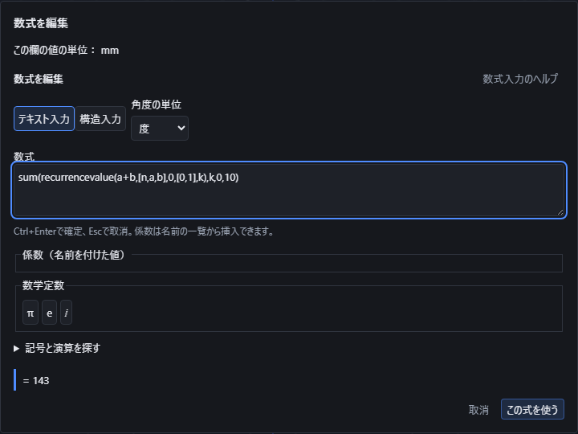

`sum(recurrencevalue(a+b,[n,a,b],0,[0,1],k),k,0,10)`は、先ほどの漸化式の添字0から10までを足し、143を求めます。初期値を`[1,1]`へ変えると232になります。`product(sequencevalue(n+1,n,k),k,1,4)`は2×3×4×5で120です。元の式を保存し、開き直して編集でき、取り消すと元の式と座標へ戻ります。

数列本文では階乗、組合せ・順列、最大公約数・最小公倍数、整数の商と余り、次の素数、因数・約数の成分などを使えます。`sequencevalue(n!,n,5)`は120、`differenceat(floor(n/2),n,3,1,1)`は1です。通常の入力と同じく、`integerremainder`の余りは非負、通常の`mod`は除数と同じ符号を使います。`round`でちょうど半分になる値は偶数側へ丸めます。

範囲を入れ子にする場合、内側の範囲から外側の添字を参照できます。刻み幅は正の整数です。空の和は0、空の積は1ですが、途中で積が0になっても残りの項の不成立を隠しません。各範囲4,096項と計算全体の有限な上限があり、超過したら途中の値を採用しません。数列を含む無限範囲は、収束を確認できない場合に任意の項数で打ち切って答えにすることはありません。

### Taylor展開・Maclaurin展開

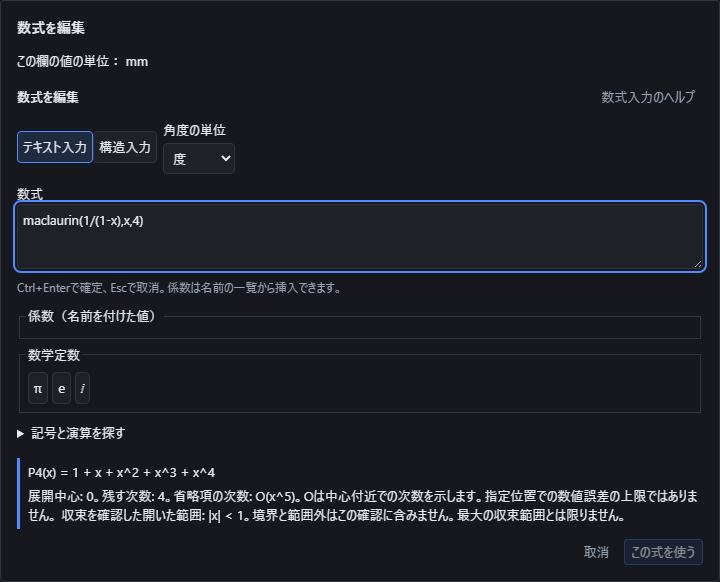

式を展開中心のまわりのべきの和として表示します。数式入力を開き、「記号と演算を探す」からTaylor展開またはMaclaurin展開を選びます。`taylor(式,変数,中心,次数)`、中心0なら`maclaurin(式,変数,次数)`です。残す次数は0〜12の整数です。

`maclaurin(1/(1-x),x,4)`は`1 + x + x^2 + x^3 + x^4`を表示し、省略項の次数を`O(x^5)`と示します。これは中心付近での次数であり、指定位置での数値誤差の上限ではありません。無限級数の収束を確認できた範囲は`|x| < 1`です。境界や範囲外まで収束を保証しません。

`taylor(1/x,x,1,3)`は中心1の展開です。中心を変えると係数も変わります。`taylor(x^3,x,2,4)`では元の多項式と正確に一致し、省略項は0と表示します。三角関数は現在の度・ラジアンの選択を保持するので、度での展開係数にはπ/180が入ります。

式の整理で分母が消えても、元の式で定まらない点を展開中心にはできません。`taylor((x-1)/(x-1),x,1,3)`や`taylor(abs(x),x,0,3)`は成功値を返しません。収束範囲を確認できない展開は「未確認」と表示します。有限個の係数が求まることと、無限級数が収束することは別です。確認した収束範囲は十分な範囲であり、必ずしも最大ではありません。

展開は数値ではないため、座標・数値の欄の「この式を使う」は無効です。打ち切った多項式を元の関数の数値に置き換えることはありません。入力方式を切り替えて結果を確認し、「取消」で元の入力へ戻れます。指定位置の誤差上限を保証して近似値を使う操作と、単独の展開を文書に保存する操作は、現在の数値欄の対応範囲には含まれません。

展開結果の確認に不要な全項の展開は行いません。例えば`taylor((1+x)^1000000,x,0,3)`は先頭の4係数を求めます。中心・次数・元の式の途中で整数が大きくなりすぎる計算は、値を作る前に上限の案内で止めます。0倍で消える部分にも同じ制限があり、止まった後は式を直して再び計算できます。

### 展開の係数を座標に使う

数式入力の「記号と演算を探す」から「展開の係数を選ぶ」を選びます。`seriescoefficient(展開式,選ぶ次数)`の順に指定します。0は定数項で、残した次数までの整数を選べます。

`seriescoefficient(taylor(x^3,x,2,4),1)`は、中心2の展開で`(x-2)`に掛かる係数12を取り出します。中心を3へ変えると27になります。`seriescoefficient(maclaurin(exp(x),x,4),3)`は3次の係数1/6です。選択した実数の係数は「この式を使う」で名前を付けた数値や座標に利用できます。元の関数の近似値を作る操作ではありません。

保存するのは、元の展開式・中心・残す次数・選択した次数を含む入力です。開き直して中心や式を編集すると、参照する点の座標も変わります。取り消すと元の式と座標へ戻ります。使った名前付きの数値と、現在の度・ラジアンの指定も保持します。複素数の係数を座標に使う場合は、実部などを明示的に選んでください。

選ぶ次数が範囲外の場合や元の展開が成立しない場合は採用できません。例えば中心0の`abs(x)`は、定数項だけを選んでも、外側で0倍しても成功値にはしません。計算量の上限で止まったときは入力を直して再計算できます。数値として採用する前に、通常の座標と同じ精度・範囲の確認を通します。

### Legendre多項式を数値や関数に使う

数式入力の「記号と演算を探す」で「Legendre多項式」を選びます。`legendre(次数,引数)`の順に入力します。次数は0〜128の整数です。標準の多項式で、引数1の値はどの次数でも1、0次は1、1次は引数そのものです。

`legendre(3,2)`は17です。次数を2へ変えると5.5になります。「この式を使う」で名前を付けた数値や座標に使用できます。元の次数と引数を含む式を保存し、開き直して編集すると、それを参照する点も変わります。取り消すと元の式と座標へ戻ります。

関数作図では`legendre(4,X)`のように変数を使えます。多項式を正確な分数の係数へ変換し、通常の関数と同じ値・微分・精度の確認へ渡します。度・ラジアンの選択は引数の中の三角関数へ適用され、多項式自体の引数を角度に変換しません。例えば度での`legendre(2,cos(60))`は−0.125です。

複素数の引数も使えますが、座標へ適用するには実部や虚部を明示的に選びます。`im(legendre(3,i))`は−4です。負の次数や整数でない次数は採用できません。0次でも元の引数が成立する必要があり、`legendre(0,1/0)`は1として扱いません。式が複雑すぎる場合は上限を案内します。一般の整数でない次数や、別の添字を持つLegendre関数はこの入力の対応範囲には含まれません。

### Gamma関数と微分した関数を数値や作図に使う

**Gamma関数** は `gamma(x)` と入力します。正の整数では1つ小さい整数の階乗になり、`gamma(5)` は24、`gamma(6)` は120です。半整数や負の非整数も扱い、`gamma(0.5)` は約1.7724538509、`gamma(-0.5)` は約−3.5449077018になります。名前を付けた数値や座標へ使い、保存して開き直した後も元の式を編集できます。

**Gammaの微分関数 polygamma** は `polygamma(n,x)` と、次数・引数の順で指定します。0階はGammaの微分をGamma自身で割った値、1階以降はそれをさらに微分した関数です。次数は0〜17の整数で、`polygamma(1,1)` は約1.6449340668になります。`gamma` 自体の微分と同じ関数ではありません。Gammaを微分したい場合は、作図の式で `diff(gamma(X),X)`、指定位置の微分では `derivativeat(gamma(x),x,1)` のように入力します。

0と負の整数では計算できません。例えば `gamma(0)`、`gamma(-2)`、`polygamma(1,-1)` は理由を表示し、座標へ使いません。`0*gamma(0)` や `component([7,gamma(-2)],1)` のように書いても、元の計算できない式を消して成功にはしません。次数の小数を整数へ丸めたり、非常に大きい・小さい結果を無限大や0で代用したりしません。引数は−19999〜20000の有限の実数が対象ですが、その範囲でも数値や誤差を確定できない場合は使用できません。複素引数の数値計算は未対応です。

作図では `gamma(X)` や `polygamma(0,X)` を使えます。計算する範囲に0や負の整数が含まれる場合、そこをつないだ線や面を作りません。微分の次数が対応上限を超える場合は、理由を示して作成を断ります。角度の単位はGamma自体には掛からず、引数の中の `sin` などへ作用します。

`taylor(gamma(x),x,1,3)` では、1のまわりの3次までの式と、確認した収束範囲を表示します。Gammaは計算できない点を持つため、全ての場所へ使える展開とは扱いません。元の式を0倍しても、元の式の計算できない場所を消しません。複雑な合成の収束範囲を証明できない場合は未確認のまま表示します。打ち切った展開を元の関数の正確な値として座標へは渡しません。

### 誤差関数の小さい値を数値や関数に使う

「関数」の候補にある **誤差関数 erf** と **相補誤差関数 erfc** は実数の引数を1つ指定します。`erf(0)` は0、`erfc(0)` は1です。`erf(1)` は約0.8427007929497149、`erfc(1)` は約0.1572992070502851になります。名前を付けた数値や座標へ使い、保存して開き直した後も元の式を編集できます。

`erfc(x)` は数学的には `1-erf(x)` ですが、小さい値が必要なときは直接 `erfc(x)` を指定してください。例えば `erfc(10)` は約2.088487583762545×10⁻⁴⁵で、先に1へ丸めた `erf(10)` を引くと失われる値です。`erf(1e-100)` のような中央の小さな値も直接計算します。結果を座標の数値として表現できない場合は、0で置き換えず理由を表示します。

関数作図では `erf(X)` や `erfc(X)`、`diff(erf(X),X)` のように使えます。計算する区間と微分を使って分割を決め、元の式にある穴をつなぎません。角度の単位は誤差関数自体には作用せず、引数の中に書いた `sin` などへ作用します。

実数の引数の絶対値は500000までです。真偽値・一覧・無限大、0で割る式を拒否します。有限な値と確認できない式や、必要な精度で答えを確定できない場合も理由を表示します。

### 複素数の誤差関数を使う

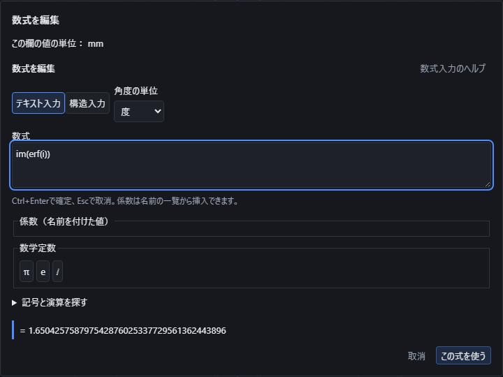

`erf(1+i)` や `erfc(i)` のように複素数も指定できます。この計算の範囲は、実部と虚部がそれぞれ−8〜8です。答えが複素数のままでは座標に使えません。`re(erf(1+i))` で実部、`im(erf(i))` で虚部を選びます。後者は約1.650425758797543になります。`im(erfc(i))` はその負の値です。実部と虚部の片側が小さい場合も勝手に0へ置き換えません。

複素数の四則や `sqrt(-1)` のような式も引数にできます。`derivativeat(erf(x+i),x,0)` では実数の変数xに沿う微分を求め、答えは約3.067252585527484です。保存と表示切替では元の式を保持します。`0*erf(1/(i-i))` のように0を掛けても、元の割り算の不成立を消しません。範囲を超える引数や計算を確定できない場合には値を返しません。複素数を使う関数作図全般の対応を意味するものではありません。

### Beta関数を数値や作図に使う

**Beta関数** は `beta(a,b)` と入力します。二つの引数には正の実数を指定します。`beta(1,4)` は0.25、`beta(2,3)` は1/12、`beta(0.5,0.5)` は円周率になります。名前を付けた数値と座標に使い、保存して開き直しても元の式を編集できます。引数の順序を入れ替えても値は同じです。

0、負の数、複素数は対象外です。`0*beta(0,1)` や `component([7,beta(1,-0.5)],1)` でも、元の計算できない入力を消して成功にはしません。二つの引数の和は20000以下です。和を丸めてからこの上限を確認せず、`beta(20000,1e-100)` も上限超過として断ります。結果は有効40桁に揃え、座標で表せないほど大きい・小さい値や誤差を確定できない場合は理由を表示します。

作図の式では `beta(X,Y)` と、その一階・二階の微分を使えます。`diff(beta(X,Y),X,Y)` は二つの変数で順に微分します。0や負の引数をまたぐ範囲をつないだ線や面にはしません。角度の単位はBeta自体には掛からず、引数の中の `sin` などへ作用します。

`derivativeat(beta(x,1),x,1)` は−1です。`taylor(beta(x,1),x,1,3)` では1のまわりの3次までの式を表示します。確認できた収束範囲と打ち切り次数を区別し、打ち切った式を元の関数の正確な値として座標へ渡しません。元の式を0倍しても、元の正の入力条件を消しません。複雑な合成で収束範囲を証明できない場合は未確認のまま表示します。

定義の参照先: [NIST DLMF Beta関数](https://dlmf.nist.gov/5.12#E1)。

## 数値の並びを離散フーリエ変換する

`dft([1,2,3,4])` は、元の順番を保った4個の数値から周波数ごとの成分を求めます。結果は `[10,-2+2i,-2,-2-2i]` です。`fft` も同じ結果を返します。最初の要素が周波数0で、`component(...,1)` で取り出せます。配列の全体や複素数をそのまま座標にはできません。例えば `im(component(fft([1,2,3,4]),2))` は2となり、座標や名前付き数値に使えます。

正変換は `Σ x[j] exp(-2πijk/N)`、逆変換は `Σ X[k] exp(+2πijk/N)/N` です。jとkは0からN−1、Nは要素数です。`idft(dft(...))` と `ifft(fft(...))` で元の並びへ戻ります。この位相の規約は入力画面の度・ラジアンの選択で変わりません。ただし、配列内に書いた `sin(30)` などは保存した角度の単位に従います。

DFT／IDFTは1〜64要素、FFT／IFFTは1、2、4、8、16、32、64、128、256要素を扱います。FFTで3要素などを指定した場合は拒否し、勝手に0を追加しません。入力は有限な実数または複素数です。空の配列、二次元の表、成立しない割り算を含む配列は使えません。実行用の上限を超えた場合は結果の一部分を返さず中止します。

元の式と変換方式を保存します。名前付き数値の式を変更すると、それを使う座標も変わり、「元に戻す」で式と座標が戻ります。連続的なFourier変換・Laplace変換とは別の操作です。

## 連続変換の式と成立範囲を確認する

「方程式」の候補から変換を選び、変換する式・元の変数・変換後の変数を指定します。例えば `laplace(exp(-x),x,s)` は `1/(s+1)` と、その式を使える `re(s)>-1` の範囲を表示します。変換後の式だけでは座標に適用できません。`transformat(laplace(exp(-x),x,s),1)` のように値を指定すると0.5になり、名前付き数値と座標に使えます。範囲の境界の−1を指定した場合は適用できません。

| 入力 | 変換の規約 |
| --- | --- |
| `fourier(f,x,k)` | xの全実数にわたり `f(x) exp(-2πixk)` を積分します。kは実数です。 |
| `inversefourier(F,k,x)` | kの全実数にわたり `F(k) exp(+2πikx)` を積分します。追加の割り算はありません。 |
| `laplace(f,x,s)` | xが0から無限大までの片側変換で、`f(x) exp(-sx)` を積分します。 |
| `inverselaplace(F,s,t)` | 片側Laplace変換の逆変換です。正の時刻tで確認できた式と範囲を返します。 |
| `ztransform(f,n,z)` | nが0から始まる数列の `Σ f(n) z^(-n)` と、確認できた成立範囲を返します。 |

例えば `transformat(fourier(exp(-pi*x^2),x,k),0)` は1、`transformat(inverselaplace(1/s,s,t),1)` は1、`transformat(ztransform((1/2)^n,n,z),1)` は2です。最後の変換は `abs(z)>1/2` の範囲で使えます。LaplaceとZ変換の指定値は複素数でも構いませんが、答えが複素数なら `re(...)` または `im(...)` で実数の成分を選んでから座標へ適用します。

変換の符号と正規化は度・ラジアンの選択で変わりません。元の式に書いた `sin` などは保存した角度単位に従います。二つの変数には異なる名前を使い、変換後の変数を元の式へ混ぜません。名前付き数値は計算前に現在の値へ置き換えられ、保存には元の入力を残します。

成立範囲は確認できた範囲を表示します。収束範囲のすべてを常に求められるとは限りません。正確な式や成立条件が未確認の場合は未解決として表示し、推測した値を座標に使いません。逆Laplaceの時刻0の跳びや、デルタ関数のように通常の数値として扱えない結果は対象外です。元の式が0で割る場合や、数列の途中に計算できない項がある場合は、外側で0を掛けても成功に変えません。

座標に使った変換の式を保存して開き直し、指定する値を1から3へ変更すれば、最初の例は0.5から0.25へ変わります。「元に戻す」で元の式と座標へ戻せます。計算量の上限や中止では途中の式を完成した答えとして返しません。フーリエ級数や一般の微分方程式を解く操作は、この変換入力とは別です。

## フーリエ級数の係数と部分和を使う

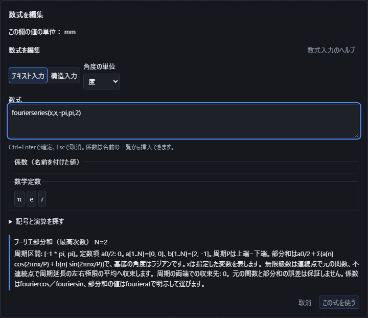

数式入力の「級数」から「フーリエ級数」を選び、式、変数、周期区間の下端、上端、最高次数の順で入力します。例は `fourierseries(x,x,-pi,pi,2)` です。下端と上端は有限の実数で、下端を小さくします。最高次数は0〜12の整数です。0なら定数項だけになります。ゼロの係数も次数に含めます。

画面には定数項 `a0/2`、余弦係数 `a[1..N]`、正弦係数 `b[1..N]` と周期区間が出ます。周期Pは「上端−下端」で、部分和は `a0/2 + Σ{a[n] cos(2πnx/P) + b[n] sin(2πnx/P)}` です。ここでxは指定した変数です。この正弦・余弦の角度はラジアンで固定し、元の式の中のsinなどには保存した角度設定を適用します。

例えば `fourierseries(x,x,-pi,pi,2)` の定数項と余弦係数は0、正弦係数は順に2、−1です。`fouriercos(級数,次数)` で余弦係数、`fouriersin(級数,次数)` で正弦係数を選びます。次数0の余弦係数は定数項の2倍のa0、正弦係数は0です。指定した最高次数を超える係数は選べません。

部分和の値を使う場合は `fourierat(fourierseries(x,x,-pi,pi,2),pi/2)` と入力します。結果は2です。これは有限の部分和の正確な値で、元の関数xの値π/2とは異なります。元の関数に対する近似誤差は保証しません。区間外にも同じ周期で部分和を評価します。級数の一覧をそのまま座標には適用せず、係数や部分和の値を明示して選びます。

無限級数の収束を確認できた場合は、連続点で元の関数、不連続点で周期延長した左右極限の平均へ収束することを表示します。周期の両端での収束先も示します。上記のxの例では端点の収束先は0で、端点での元の値±πとは区別します。収束を確認できない場合は「未確認」と表示し、部分和が元の関数に近づくと断定しません。

途中で発散する式や成立条件を決められない式は、係数を一つだけ選んでも無理に計算しません。定義した係数へ部分和の式を入れ、その係数を点の座標へ使えます。保存して開き直しても元の式、区間、次数と角度設定が残ります。係数の元の式を編集すると点の位置が変わり、「元に戻す」で編集前へ戻せます。

## 方程式・不等式の解を選んで使う

数式入力の「方程式」から「方程式・不等式の解」を選び、式、未知数、範囲を指定します。`solve(x^2=1,x,ℝ)` は実数の解−1と1の集合を表示します。`ℝ` は実数全体、`ℂ` は複素数全体です。範囲を区切る場合は `interval(-1,1)`、下端を含めない場合は `interval(open(-1),1)` とします。不等式には実数の範囲を指定します。

`solve(1/x>0,x,ℝ)` の解は0より大きい範囲で、0を含みません。式を整理しても元の分母が0になる点は除きます。例えば `solve(x/x=1,x,ℝ)` では、0以外の実数が解です。「解はありません」と「まだ解を確定できません」は別の結果です。未解決の式を0倍して、解が求まったことにはできません。

有限個の解を座標へ使うには、`solution(solve(x^2=4,x,ℝ),2)` のように解の番号を明示します。この例は2です。番号は1から、実部が小さい順、実部が同じなら虚部が小さい順です。`im(solution(solve(x^2=-1,x,ℂ),1))` は−1になります。区間、無限個、解なし、未解決の結果から番号で値を選ぶことはできません。元の式のsinなどには保存した度・ラジアンの指定を使います。

`polynomialroots((x-1)^2*(x+2),x,ℂ)` は、多項式を0にする根と同じ根が重なる回数を2列で返します。この例は−2が1回、1が2回です。`component(polynomialroots((x-1)^2*(x+2),x,ℂ),2,2)` なら2行2列の重複度2を使えます。次数は16までです。全ての根を正確な式で確認できない場合や、恒等的に0の多項式は未解決として残します。

入力した式と範囲、選んだ解の番号は保存して開き直しても保持します。名前付き数値へ入れて点の座標から参照すれば、元の方程式の編集で点が追従し、「元に戻す」で編集前へ戻せます。現在、一部の無限解や周期的な不等式、微分方程式には未対応の範囲が残ります。数値で解を探す場合は後述の専用操作を使います。未対応を解なしと表示しません。

## 複数の方程式の解と自由な値を使う

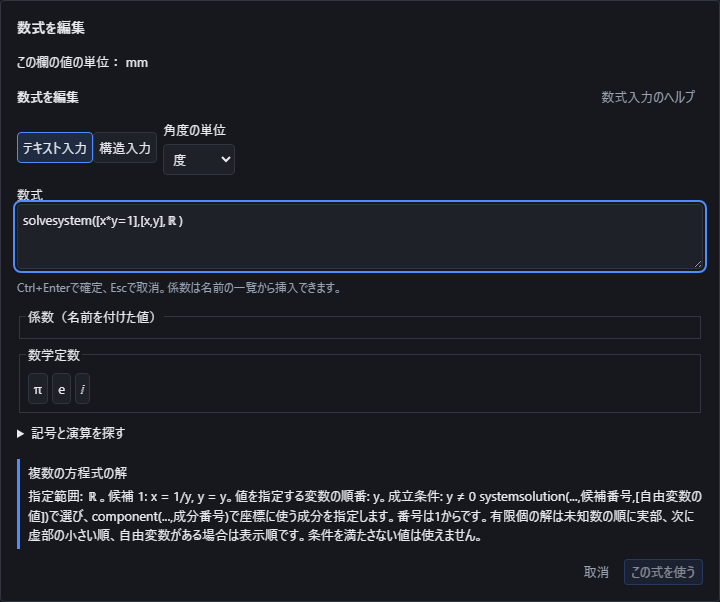

上の画面では、x×y=1を満たす答えと、yには0を指定できない条件を確認しています。

数式入力の「方程式」から「複数の方程式」を選びます。`solvesystem([x+y=3,x-y=1],[x,y],ℝ)` のように、式の一覧、未知数の一覧、実数または複素数の範囲を順に指定します。この例はx=2、y=1です。未知数の順番を`[y,x]`に変えると、答えの成分もy、xの順になります。

`solvesystem([x+y=2],[x,y],ℝ)` はx=2−y、y=yと表示し、yを自由に決められることを示します。yを勝手に0にはしません。「複数式の解を選ぶ」で `systemsolution(solvesystem([x+y=2],[x,y],ℝ),1,[3])` とすれば、候補1にy=3を指定した答え[-1,3]になります。自由に決める変数がない候補には空の一覧`[]`を指定します。番号は1からで、有限個の答えは未知数の順に実部、次に虚部の小さい順、自由な変数がある答えは表示順です。

`solvesystem([x*y=1],[x,y],ℝ)` の答えはx=1/y、y=yですが、y≠0という条件があります。0を指定すると使えません。元の式で分母が0になる値は、約分や0倍で見えなくなっても除外します。矛盾する式は「解なし」、完全な答えを確認できない式は「未確定」と区別します。

答えを座標へ使うには `component(systemsolution(solvesystem([x+y=5],[x,y],ℝ),1,[3]),1)` のように、使う成分を選びます。この例は2です。名前付き数値として保存し、点の座標から参照できます。保存して開き直しても元の方程式・未知数の順番・範囲・候補番号・自由な変数の指定値を保持します。指定値を3から2へ変えると答えは3になり、「元に戻す」で式と座標を戻せます。

現在の複数式の入口は、未知数8個・方程式16個まで、次数16以下の多項式と分数式が対象です。解は厳密に表せる範囲に限り、三角関数等を含む一般の複数式や、表せない無限解は未確定とします。これは数値で根を探す操作や微分方程式の計算とは別です。自由な値の指定不足・範囲外・未確定の結果は座標へ適用できません。

## 微分方程式の条件と解候補を確認する

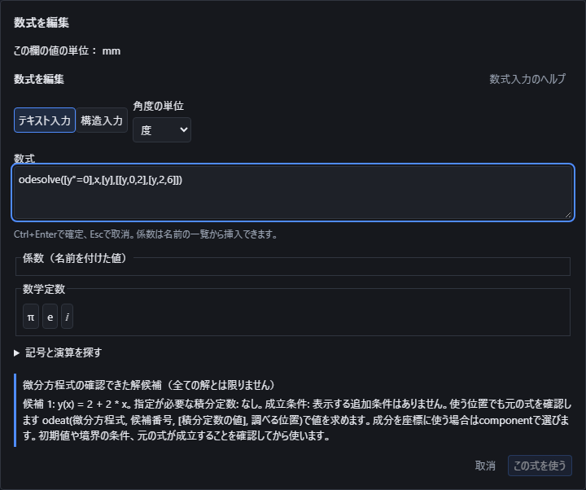

数式入力の「方程式」にある「微分方程式の解候補」を選びます。`odesolve([diff(y,x)=2],x,[y],[[y,0,3]])`は、yのxによる微分が2、x=0でy=3という条件を指定します。式の一覧、独立変数、求める関数の一覧、条件の一覧の順です。この例の解候補はy=2x+3です。元の方程式と条件へ戻して確認できた候補を表示しますが、全ての解を見つけたとは限りません。

`diff(y,x,x)`は二階の微分です。`odesolve([diff(y,x,x)=-y],x,[y],[[y,0,0],[diff(y,x),0,1]])`のように、最初の位置での値と傾きを指定できます。`odesolve([diff(y,x,x)=0],x,[y],[[y,0,2],[y,2,6]])`は、二つの異なる位置での値を指定し、y=2x+2を求めます。条件はそれぞれ`[関数またはその微分, 位置, 値]`の形で書きます。矛盾した条件は使えません。

複数の式を同時に解くには`odesolve([diff(y,x)=z,diff(z,x)=-y],x,[y,z],[[y,0,0],[z,0,1]])`のように指定します。返す関数は指定した一覧の順です。現在は一つの独立変数と四つまでの関数、八階までの微分を扱います。解を明示でき、元の式と条件を満たすことを確認できた場合に候補を返します。計算できない式を「解なし」とは扱いません。

「微分方程式の値を選ぶ」で、候補番号、積分定数の値の一覧、調べる位置を指定します。例えば`component(odeat(odesolve([diff(y,x,x)=0],x,[y],[[y,0,2],[y,2,6]]),1,[],1),1)`は、1番の候補のx=1でのyを選ぶので4です。条件で定数が決まっていれば`[]`を指定します。条件が足りない場合は表示された積分定数を全て指定し、勝手に0で補いません。

求めた値を名前付き数値へ適用すると、元の方程式と条件、候補番号、定数と位置を保存します。開き直して条件を編集でき、端の値を6から10へ変えると上の例は6になり、参照する点の座標も変わります。「元に戻す」で元の式と座標へ戻せます。元の式で0を割る場所は、約分や0倍で見えなくなっていても使えません。使う位置の値が有限な実数であることを確認します。

### 解候補から曲線を作る

「作図」の関数作図では、調べる位置にXやTを指定して解候補の曲線を描けます。例えばYの式を`component(odeat(odesolve([diff(y,x)=2*x],x,[y],[[y,0,1]]),1,[],X),1)`とすると、Y=1+X²の曲線です。XYZの範囲を全て入力し、「確認」してから作成します。元の式や条件で使えない位置は、式を整理すると見えなくなる場合もつなぎません。解候補や定数が確定しない場合は、理由を表示して作成を止めます。

作成した曲線から点と接線・法線を作れます。この例でX=1の点は(1,2,0)です。保存して開き直しても元の微分方程式と初期条件を保持し、初期値を1から2へ変更すると点は(1,3,0)へ移ります。「元に戻す」で元の式と形へ戻せます。直線から曲率で決まる法線を求めるなど、方向が一意に定まらない場合は作成しません。

## 数値で解を探し、区間を確認する

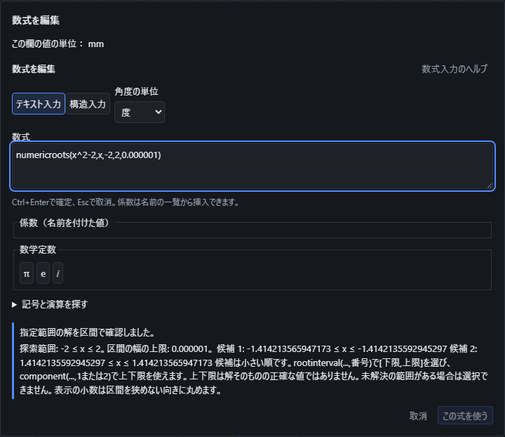

数式入力の「方程式」にある「数値で解を探す」を選びます。`numericroots(x^2-2,x,-2,2,0.000001)` は、式が0になるxを−2から2まで探します。最後の数値は、答えを囲む区間の幅の上限です。正の有限な数を指定し、探索範囲の下端は上端より小さくします。この例では−√2と√2を囲む二つの区間が表示されます。

答えは小さい順に番号を付けて表示します。「指定範囲の解を区間で確認しました」と「指定した範囲に解はありません」、「判定できない範囲が残っています」を区別します。例えば範囲全体で0になる式や分母が0になる場所、重なる解の周りでは、判断できない範囲を残す場合があります。未解決の範囲があるのに、答えがないと判断しません。下端や上端の丸めによって範囲内か確認できない場合も、その理由を表示します。

`rootinterval(numericroots(x^2-2,x,0,3,0.000001),1)` は、1番の答えを囲む `[下限,上限]` を取り出します。`component(...,1)` は下限、`component(...,2)` は上限です。**上下限は答えそのものの正確な値ではありません。** 区間の真ん中を自動で正確な答えとして使うこともありません。表示の小数は区間を狭めない向きへ丸めます。未解決の範囲が残っている場合は区間を選択できません。

上下限の用途を明示して座標に使えます。例えば `ceil(component(rootinterval(numericroots(x^2-2,x,0,3,0.000001),1),2))` は、正の解の上限を整数へ切り上げて2にします。元の式をx²−5へ変更すると3になります。これは√2や√5を正確な整数として扱う操作ではありません。平方根などの正確な式が必要な場合は、前述の方程式の解を選ぶ操作を使います。

名前付き数値へ適用して保存し、開き直しても、元の式・未知数・探索範囲・区間幅の指定・選んだ番号と上下限を保持します。式を変更すれば参照する点の座標も変わり、「元に戻す」で式と座標を戻せます。三角関数には選んだ度・ラジアンを使います。計算量の上限や中止に達した場合は途中の一覧を完成した答えとして返しません。指定した細かさを端末で表せない場合や、式の連続性などを確認できない場合も未確定のまま扱います。

## 解けていない式と条件を保存する

「パラメータ」タブの「未解決の式を追加」を押すと、解けていない偏微分方程式と条件を入力できます。例えば`pde([diff(u,t)=diff(u,x,x)],[x,t],[u],[[u,[0,t],3]])`は、uのtによる微分とxによる二階微分が等しい式と、x=0でu=3という条件です。式の一覧、独立変数の一覧、求める関数の一覧、条件の一覧の順で指定します。一般の偏微分方程式の解を求める機能ではありません。

「式と条件を保存」を押すと、元の式・条件・未解決の状態を文書に保存します。数値の0や代わりの図形を作らず、名前付き数値の一覧にも追加しません。数値や通常の計算式をこの入口へ入力した場合は保存できません。入力方式の切替でも同じ式と条件を保ちます。

通常の「保存」でファイルに書き出し、開き直した後に「式と条件を編集」から条件を変更できます。「取消」は変更前の式を保持します。確定した編集や「この式を削除」は「元に戻す」で戻せます。式が名前付き数値を参照している場合は、その数値の名前を変えても参照先を保ちます。保存形式は版16となり、古いアプリがこの項目を捨てて開くことを防ぎます。

### 微分を短い記号で入力する

`odesolve([dy/dx=y],x,[y],[[y,0,2]])` のように、指定した関数 `y` を変数 `x` で微分する式は `dy/dx` と書けます。`y′`（または `y'`）は1回、`y″`（または `y''`）は2回の微分です。例えば `odesolve([y″=-y],x,[y],[[y,0,0],[y′,0,1]])` は関数の値と1回微分した値を初期条件に指定します。

短い記号は、`odesolve` または `pde` の引数で指定した関数・変数の範囲内で読み取ります。変数が複数ある場合は `diff(u,x)` のように微分する変数を明示します。構造入力の偏微分の分数でも変数を指定できます。`dy` や `dx` 自体を名前として指定した場合は、その名前を勝手に分割しません。入力した元の式は保存と再編集で保持され、表示方式を切り替えても微分の意味は変わりません。

構造入力では`\dot{y}`・`\ddot{y}`（表示はẏ・ÿ）も使え、独立変数についての1回微分・2回微分をそれぞれ表します。初期条件にも使えます。例えば`odesolve([\ddot{y}=6*t],t,[y],[[y,0,0],[\dot{y},0,1]])`はÿ=6t、y(0)=0、ẏ(0)=1を解いた`y=t³+t`で、`y(2)`は10です。

`y′`・`y″`・`dy/dx`・`\dot{y}`・`\ddot{y}`は、`odesolve`・`pde`の外で使うと理由を表示して断ります。

| 記法 | 微分方程式の外で使ったときの理由 |
|---|---|
| `y′`・`y″` | 「y′」「y″」の短い微分の表記は、微分方程式（odesolve・pde）の中だけで使えます。それ以外の式では diff(式,変数) か derivativeat(式,変数,位置,回数) を使ってください。 |
| `dy/dx` | 「dy/dx」の分数の微分の表記は、微分方程式（odesolve・pde）の中だけで使えます。それ以外の式では diff(式,変数) か derivativeat(式,変数,位置,回数) を使ってください。 |
| `\dot{y}`・`\ddot{y}` | 「ẏ」「ÿ」のドット表記（\dot・\ddot）は、微分方程式（odesolve）の中で独立変数についての微分としてだけ使えます。それ以外の式では diff(式,変数) か derivativeat(式,変数,位置,回数) を使ってください。 |

## 集合の関係と直積を調べる

集合の関係は`notelement(x,A)`（∉）・`subset(A,B)`（⊂、真部分集合）・`subsetequal(A,B)`（⊆）・`superset(A,B)`（⊃）・`supersetequal(A,B)`（⊇）で調べます。構造入力や記号での入力では`∉`・`⊂`・`⊆`・`⊃`・`⊇`も使えます。判定できない場合は真偽どちらにもせず「未確定」のまま残します。

| 入力例 | 結果 |
|---|---|
| `notelement(3,set(1,2))` | 真（成立） |
| `subset(set(1),set(1,2))` | 真（成立） |
| `subset(set(1,2),set(2,1,1))` | 偽（不成立）（同じ集合なので真部分集合ではない） |
| `subsetequal(set(1,2),set(2,1,1))` | 真（成立） |
| `subset(ℕ,ℤ)` | 真（成立） |

`complement(A,U)`（補集合。`∁(A,U)`も同じ意味）は、母集合Uの中でAに含まれない要素の集合です。Uを省略できず、AがUに含まれない場合は理由を表示します。`complement(set(2),set(1,2,3))`は`{1,3}`です。

`setminus(A,B)`（集合の差）にも同じ考え方を使います。要素ごとに等しいかどうかを証明できた場合だけ含めたり除いたりし、証明できない要素が1つでもあれば、その要素を「別の値」とはみなさず、集合の差・補集合全体を未確定のまま返します。例えば`k`の値が決まっていないとき、`setminus(set(1,k),set(k))`はk=1なら空集合、k≠1なら`{1}`になるため、どちらとも決めつけず未確定のままです。`complement(A,U)`も同じ判定を使い、Uの要素に未知の記号があって証明できない場合は未確定にします。

`cartesianproduct(A,B,…)`は2〜16個の集合から順序付きの組を作ります。`cartesianproduct(set(1,2),set(3,4))`は`{(1,3),(1,4),(2,3),(2,4)}`です。因子の順序と組の入れ子を保ち、空集合を因子に含む場合は空集合になります。2つの集合には`×`も使えますが、3つ以上を`×`で続けて書くと2つずつ組にした入れ子になり、`cartesianproduct`をまとめて指定した組とは異なる形になります。

判定できない所属・包含は真偽へ変換せず未確定のままにします。元の式は保存され、開き直しても判定を保ちます。

## 近似等号と集合の全称・存在を判定する

`approxequal(a,b,許容差)`（≈）は`|a−b|`が許容差以下かを調べます。許容差は0以上の有限な実数で、必ず指定してください（省略した2引数の形は理由を表示して拒否します）。複素数の差には絶対値を使います。

| 入力例 | 結果 |
|---|---|
| `approxequal(0.3,0.2,0.1)` | 真（成立）（差0.1が許容差0.1以下） |
| `approxequal(1,1,0)` | 真（成立） |
| `approxequal(3+4*i,0,5)` | 真（成立） |
| `approxequal(1,1)` | 理由を表示して拒否 |

`forall(x,A,条件)`（∀）はAのすべての要素で条件が真か、`exists(x,A,条件)`（∃）は条件が真になる要素があるかを、列挙できる有限集合で調べます。空集合では∀は常に真（成立）、∃は常に偽（不成立）です。実数全体`ℝ`や自然数`ℕ`のような無限集合は列挙できないため、「未確定」のまま残します。

構造入力では`\operatorname{forall}\left(x,A,条件\right)`・`\operatorname{exists}\left(x,A,条件\right)`でも同じ判定をします。「記号と演算を探す」の「集合・論理」から「全称量化」「存在量化」を選んでも挿入できます。

| 入力例 | 結果 |
|---|---|
| `forall(x,{1,2,3},x>0)` | 真（成立） |
| `exists(x,{0,1,3},x^2==4)` | 偽（不成立） |
| `forall(x,∅,false)` | 真（成立） |
| `forall(x,ℝ,x==x)` | 未確定 |

条件が一部の要素で成立しても、ほかの要素で計算できない場合は真とはしません。`exists(x,{0,1},1/(x-1)==-1)`は、x=0で条件が成立してもx=1で0による割り算になるため、理由を表示して拒否します。判定できた真偽は`which`の条件にも使えます。

`≈`・`∀`・`∃`だけを条件にした`which`の場合分けも判定し、選ばれない枝は計算しません。

| 入力例 | 結果 |
|---|---|
| `which(approxequal(0.3,0.2,0.1),1,true,2)` | 1（差0.1が許容差0.1以下） |
| `which(approxequal(1,2,0.5),1,true,2)` | 2（差1が許容差0.5を超える） |
| `which(forall(x,{1,2,3},x>0),1,true,2)` | 1 |
| `which(approxequal(0.3,0.2,0.1),7,true,1/0)` | 7（選ばれない0による割り算は計算しない） |

## 集合の上限・下限と最大値・最小値

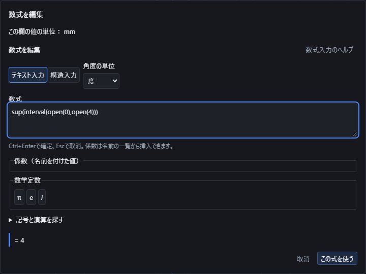

「記号と演算を探す」の「集合・論理」から「集合の上限」「集合の下限」「集合の最大値」「集合の最小値」を選べます。式を直接入力しても同じ計算ができます。

- `sup(interval(open(0),open(1)))` は、0より大きく1より小さい数の集合の上限1を求めます。1自体はこの集合に含まれません。
- `setmax(interval(0,open(1)))` は、最大値が存在しないと表示します。上限が1でも、1を含まない集合の最大値を1にはしません。
- `inf(interval(open(0),open(1)))` の下限は0です。`setmin(interval(0,open(1)))` では0を含むため最小値も0です。
- `setmax(set(1,3,2))` は3、`setmin(set(1,3,2))` は1です。和集合は`union`、共通部分は`intersection`、差集合は`setminus`で指定できます。

上限・下限の計算は、大小を比較できる実数の集合が対象です。複素数を含む集合には実数の大小関係を当てはめません。条件が決まらず答えを確認できない場合は未確定のまま表示します。

自然数の集合`ℕ`は0を含みます。`sup(ℕ)`は`+∞`、`inf(ℤ)`は`−∞`と表示します。これは有限の上限・下限がないことを示す表示で、座標や普通の数値としては適用できません。無限の上下限を別の演算へ入れて数値の代わりに使うこともできません。

空集合`∅`については、このアプリでは上限・下限・最大値・最小値を定義しません。空集合と、空ではないが最大値・最小値が存在しない集合を区別して表示します。

有限の結果は「この式を使う」で名前付き数値や座標へ適用できます。例えば名前付き数値「集合の上限」を`sup(interval(open(0),open(4)))`にすると値は4です。点の座標に`coef("集合の上限")`を使い、元の上端を6へ変えると点も6へ移ります。保存後に開き直しても元の式と開いた端点を保持し、編集を取り消すと元の値へ戻ります。

## 上極限・下極限

「記号と演算を探す」の「微積分」から「上極限」「下極限」を選べます。値が一つへ近づかず振動するときも、上側と下側の極限を分けて調べます。通常の極限が存在するという意味ではありません。

- `limsup(sin(1/t),t,0)` は1、`liminf(sin(1/t),t,0)` は−1です。`limit(sin(1/t),t,0)` は通常の極限がないと表示します。
- `limsup(sin(t)+cos(t),t,∞)` は√2です。足し合わせる二つの波の関係を保ち、それぞれの最大値を単純に足した2とはしません。
- `limsup(abs(t)/t,t,0)` は1、`liminf(abs(t)/t,t,0)` は−1です。4番目に−1を指定すると左側、1なら右側、0または省略なら両側から調べます。
- 整数の数列は `limsup((-1)^n,n,∞,0,ℤ)` と書くと1、`liminf((-1)^n,n,∞,0,ℕ)` は−1です。5番目の範囲を省略すると実数として扱い、名前がnだからという理由で整数とはみなしません。自然数の範囲ℕは0を含み、+∞への接近だけに使えます。

無限遠は`∞`または`−∞`で指定します。無限遠への接近と整数列には左右の方向を重ねて指定しません。角度は現在選んでいる度・ラジアンの設定に従います。

`limsup(1/t,t,0)` は+∞、`liminf(1/t,t,0)` は−∞と表示します。無限大は表示専用で、座標や名前付き数値へは適用できません。別の演算で無限大を消したり逆数にしたりして数値へ変えることもできません。

元の式が接近する範囲で使えるかを確認し、計算を確定できない式は未確定のまま示します。有限個の点を調べただけで振動の上下限を断定しません。複素数の範囲、整数列の有限点への接近、分母の穴が繰り返し現れる未確認の式などを、確認済みの実数の答えへ置き換えません。

有限の答えは名前付き数値と点の座標へ使えます。元の式、上極限と下極限の区別、方向と数の範囲を保存し、開き直して編集できます。構造入力とテキスト入力を切り替えても条件を保持し、編集の取り消しで前の式と値へ戻ります。

## 記号の名前と意味を保存する

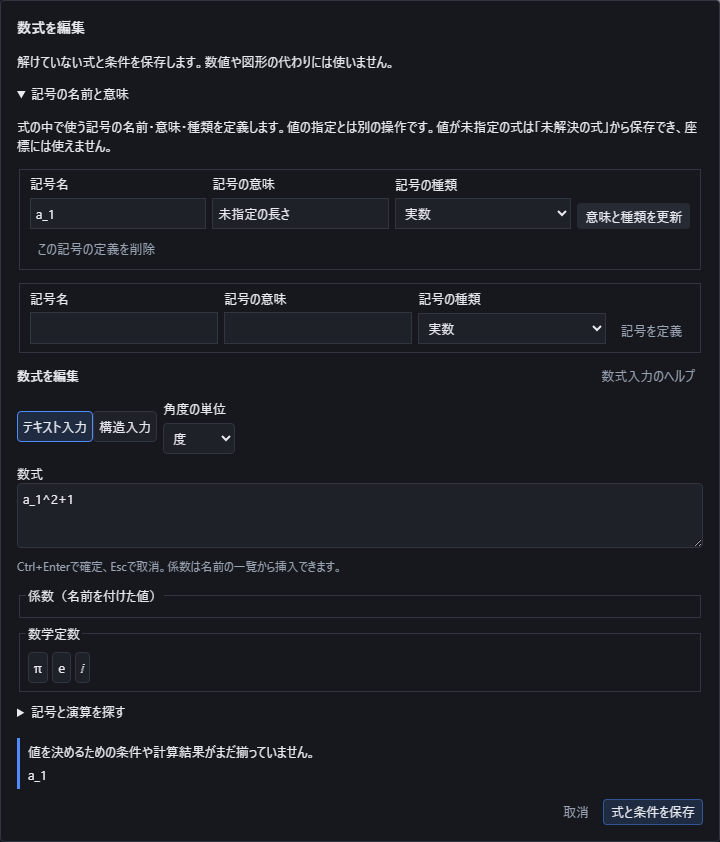

「記号の名前と意味」を開くと、式に使う記号を定義できます。「記号名」「記号の意味」「記号の種類」を入力して「記号を定義」を押します。例えば名前を`a_1`、意味を「未指定の長さ」、種類を「実数」とすると、`a_1^2+1`をその記号の式として保持できます。名前には文字・数字・下線を使い、数字で始めません。πなどの定数や軸X・Y・Z、作図変数T・U・Vの意味を上書きする名前は使えません。

**名前と種類を定義しても、数値を指定したことにはなりません。** 値が未指定の式は座標や名前付き数値へ適用できません。保存したい場合は「パラメータ」タブの「未解決の式を追加」から入力し、「式と条件を保存」を押します。元の式と記号の名前・意味・種類をまとめて保存します。未知の記号を0や既存の定数へ置き換えることはありません。

実数・複素数・整数・自然数・有理数、真偽・集合・ベクトル・行列・写像・その他の記号を区別できます。自然数は0を含みます。種類に合わない演算は修正が必要です。例えば集合の記号を`sin`や普通の数の足し算に使うことはできません。ベクトルや写像の記号を定義しただけで、その成分や対応する値が決まることもありません。

保存後に開き直し、「式と条件を編集」から「定義を更新」で説明や種類を変更できます。「この記号の定義を削除」で定義を除いた場合、その記号を使う式も修正してください。「取消」は文書を変更せず、保存した編集は「元に戻す」で戻せます。テキスト入力と構造入力を切り替えても、記号の名前と意味を保持します。

## 記号の名前を変更する

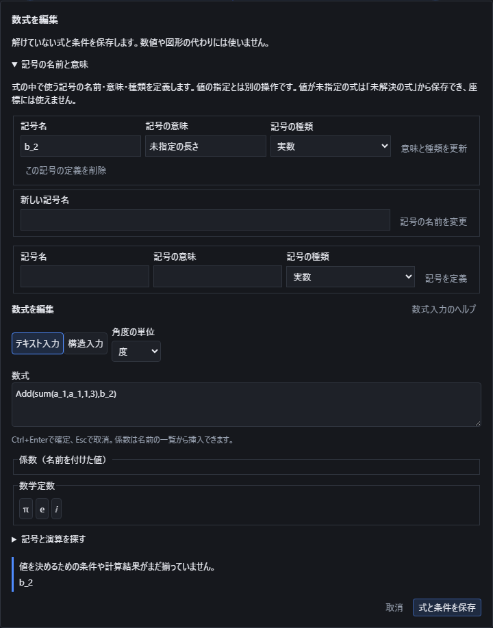

式の準備が完了したら、「記号の名前と意味」にある「新しい記号名」を入力し、「記号の名前を変更」を押します。式で参照する同じ記号だけを更新し、意味と種類を保ちます。例えば`sum(a_1,a_1,1,3)+a_1`の自由記号を`b_2`へ変えると、総和の中の`a_1`はそのまま、総和の外側だけが`b_2`になります。同名の係数も別の参照なので変更しません。

ほかの定義との重複、定数や座標軸の予約名、積分・総和などの変数と混同する名前には変更できません。変更を拒否した場合は元の式を保持します。「式と条件を保存」で文書へ反映し、保存した変更はUndoで戻せます。「取消」では改名を文書へ反映しません。改名は数値を指定する操作ではないため、未指定の値を座標として利用できるようにはなりません。

## 図形の測定値を数式で使う

「見た目」の一覧にある「{{ui:toolbar.look.mathGeometry}}」は、選んだ点・辺・面・立体から座標・長さ・面積・体積・角度などを求め、名前を付けて部品に保存する道具です。名前を付けた測定値は、係数(パラメータ)の式の中で使えるようになり、形を計算し直すたびに測り直されます。

### できる測定と単位

頂点・辺・面・立体の選び方は「[測る](measure.md)」と同じで、下の帯の「選ぶもの」で何を選ぶかを切り替えます。

| 測る量 | 選ぶもの | 単位 | 例 |
| --- | --- | --- | --- |
| X座標・Y座標・Z座標 | 点1つ(スケッチの点、または立体の頂点)。基準の[座標系](reference-geometry.md)を追加で選ぶと、その座標系を基準にした成分になります | mm | — |
| 2点の距離 | 点2つ | mm | — |
| 最短距離 | 立体・面・辺・頂点の組み合わせ | mm | — |
| 長さ | まっすぐな辺・線分、円弧など1本 | mm | — |
| 輪郭の長さ | 線分と円弧だけでできた輪郭1つ(1つのスケッチの要素全体) | mm | — |
| 面積 | 面1枚、または立体1つ(立体を選ぶと表面積の合計) | mm² | 20×30×40の箱の立体を選ぶと5200 |
| 体積 | 立体1つ | mm³ | 20×30×40の箱で24000 |
| 2直線の角度 | まっすぐな辺・線分2本(0〜90度、どちらから測っても同じ) | 度／ラジアン | — |
| 2平面の角度 | 平らな面2枚(0〜90度) | 度／ラジアン | — |
| 直線と平面の角度 | まっすぐな辺・線分1本と平らな面1枚(0〜90度) | 度／ラジアン | — |
| 3点の角度 | 点3つ(2番目に選んだ点が頂点、0〜180度) | 度／ラジアン | (3,0,0)・(0,0,0)・(0,4,0)の順で選ぶと90度。1番目と3番目の距離は5 |
| 平行・垂直 | 直線どうし・平面どうし・直線と平面 | はい／いいえ | — |
| 半径 | スケッチの円弧、または立体の円形の辺 | mm | — |
| 中心角 | スケッチの円弧、または立体の円形の辺 | 度／ラジアン | 半径10・0〜90度分の円弧なら中心角90度、長さは約15.708mm |
| 合同・相似 | 線分どうし、円弧・円どうし、辺数が同じ閉じた多角形どうし(1つのスケッチの要素全体) | はい／いいえ | 長さ5の線分どうしは合同。長さの違う線分どうしも相似 |

丸い辺・面も測れます。円形の辺の中心角は90度や180度で折り返さず、1周を超えて測ることもあります(たとえば0度から270度回した円弧の中心角は270度のままです)。まっすぐな辺・線分には半径・中心角はありません。楕円や自由曲線を含む輪郭の長さ、平面でない面(円柱面・円錐面など)の角度・平行・垂直・合同・相似は求められません。

### 「測る」との違い

{{ui:mathGeometry.hint.vsMeasure}}

| | {{ui:toolbar.measure.title}} | {{ui:toolbar.look.mathGeometry}} |
| --- | --- | --- |
| 保存 | しない(その場だけ表示) | 名前・参照先・比べる幅を部品に保存する |
| 形を変えたとき | Escを押すか形を変えると消える | 消えずに測り直す(値そのものは保存しない) |
| 数式で使えるか | 使えない | 係数にすれば式の中で使える |

「測る」の使い方は「[長さ・角度・面積を測る](measure.md)」を参照してください。

### 道具の出し方と操作の順番

ツールバーの「見た目」の一覧を開くと、「{{ui:toolbar.measure.title}}」の次に「{{ui:toolbar.look.mathGeometry}}」があります。押すと道具が有効になり、右のプロパティ区画は自動で「プロパティ」タブに切り替わって先頭に一覧が出ます(道具が有効な間は「測定」「材料と重さ」の節は隠れます)。

測りたいものを先に選んでから道具を押しても、道具を先に押してから測りたいものを選んでもかまいません。道具を先に押した場合は、画面下の状態欄が次に選ぶものを案内します。

一覧の「{{ui:mathGeometry.quantityLabel}}」で量を選び、「{{ui:mathGeometry.add}}」を押すと一覧に追加されます(Undo1回で取り消せます)。もう一度「{{ui:toolbar.look.mathGeometry}}」を押すか、一覧の「{{ui:mathGeometry.closeTool}}」を押すと道具を終えて選択の道具に戻ります(選んでいた対象は保たれます)。

### 名前の変更・選び直し・角度の単位・削除

一覧の行の「{{ui:mathGeometry.nameLabel}}」欄を書き直してEnterを押すか欄の外を押すと、名前が変わります。この名前を使っている係数の式の表示も一緒に更新されます。Undo1回で前の名前に戻ります。

新しい対象を選んでから「{{ui:mathGeometry.reselect}}」を押すと、参照先だけを選び直せます。名前と比べる幅はそのまま保たれます。今選んでいるものが同じ種類・同じ単位の量を測れないときは押せません。

角度を測る行は「{{ui:mathGeometry.unit.degree}}」「{{ui:mathGeometry.unit.radian}}」を切り替えられます。Undo1回で戻せます。

行の「{{ui:mathGeometry.delete}}」を押すと削除します(Undo1回)。ただし係数の式でまだ使われている測定値は削除できず、使っている係数の名前を示して断られます。先にその式を直してから削除してください。

### 比べる幅を変える

既定の比べる幅は、長さ0.000001mm・角度0.000001ラジアンです。{{ui:mathGeometry.toleranceNote}}

一覧の行から「{{ui:mathGeometry.tolerance.edit}}」を開くと、「{{ui:mathGeometry.tolerance.linearLabel}}」と「{{ui:mathGeometry.tolerance.angularLabel}}」の2つの欄が出ます。数値だけでなく式でも入力できます。長さは0より大きい有限の数、角度は0度より大きく45度より小さい数だけ受け付けます。「{{ui:mathGeometry.tolerance.apply}}」で確定し(Undo1回)、「{{ui:mathGeometry.tolerance.reset}}」で既定値に戻せます。比べる幅は測定値ごとに別々に持ち、表示単位をinchに変えても長さの幅はmmのまま、角度の幅は度のまま変わりません。

比べる幅を変えると、平行・垂直や合同・相似の判定結果が変わることがあります。たとえば2本の直線が0.5度だけ傾いている場合、既定の幅(角度0.000001ラジアン)では平行と判定されませんが、幅を1度まで広げると平行と判定されます。

### この値の係数を作る

値が決まっている行では「{{ui:mathGeometry.createParameter}}」を押せます。測定値の名前に「{{ui:mathGeometry.createParameter.nameSuffix}}」を付けた名前(たとえば測定値「箱1体積」なら「箱1体積の値」)で、式が`coef("測定値の名前")`の係数がパラメータの一覧に追加され、1行の知らせが出ます。Undo1回で取り消せます。

値がまだ決まっていない行、平行・垂直・合同・相似のようにはい・いいえで答える行、係数と同じ名前がすでにある場合、測定値の名前が係数の名前として使えない場合は、理由が示されて押せません。

作った係数はパラメータの一覧で「{{ui:mathGeometry.derived}}」の印が付きます({{ui:mathGeometry.derivedTooltip}})。その係数を使って計算した別の係数にも同じ印が付きます。形を計算し直している間は値の代わりに「{{ui:mathGeometry.status.pending}}」と表示され、古い値は使いません。

作った係数を式で使うには、「数式で入力」を開き、パレットの「{{ui:mathGeometry.palette.group}}」の一覧から選びます。選ぶと`coef("名前")`が入力されます。寸法などふつうの数値欄では、他の係数と同じように名前をそのまま書けます。

{{ui:mathGeometry.appearance.refused}}

### 係数の式で使える計算

図形の測定値をそのまま使う係数、またはその係数を使って計算する別の係数の式では、値がわずかに変わっても結果が連続に変わる計算だけを使えます。

使える計算は、四則演算、べき乗・平方根・累乗根、絶対値、最小値・最大値、指数・対数、三角関数・双曲線関数とその逆関数、2引数のarctan、逆数、範囲を挟むclamp、成分の取り出し・ノルム・内積・外積、かっこによるまとめです。

使えないのは、切り捨て・切り上げ・四捨五入、比較(より大きい・より小さいなど)、条件による場合分け、Σ・Π・積分・微分・極限のように範囲や式をまとめて扱う計算、方程式や集合の演算です。使うと、使えない計算の名前を挙げて断られます。この制限は、係数の式だけでなく、関数作図(曲線・曲面・点)の式で図形由来の係数を使う場合にも同じように適用されます。

平行・垂直・合同・相似のようなはい・いいえの答えは、係数の式の中では使えません。

### 測る順序と循環

図形の測定値を係数にして使えるのは、測った形より後ろにある形だけです。履歴の中で、測る形は使う形より前になければなりません。逆順に使おうとすると、どちらを後ろへ動かせばよいかを示して断られます。

測る→係数を決める→その係数で形を作る→また測る、という連なりは最大8段まで使えます。それを超えると、上限の段数を示して断られます。

測った形が、その測定値から作った係数を使って(直接または他の係数を経由して)作られている場合は循環になり、係数を計算できません。理由には、循環している係数の名前と、測る形の名前が示されます。

同じスケッチの中の線を測り、その値の係数を同じスケッチの別の要素(たとえば関数で作る曲線)に使うと、スケッチの中の要素どうしは強く結び付いているために循環と判定されることがあります。測る形は、使う形とは別のスケッチに置いてください。

### 値が表示されないとき

一覧の値の代わりに、次の理由が表示されることがあります。

| 表示 | 起こっていること |
| --- | --- |
| {{ui:mathGeometry.status.computing}} | 形を計算している最中です |
| {{ui:mathGeometry.status.cancelled}} | 計算を中止しました |
| {{ui:mathGeometry.status.timeline}} | 履歴の途中を表示しています |
| {{ui:mathGeometry.status.notEvaluated}} | 形の計算ができませんでした |
| {{ui:mathGeometry.reason.missing-reference}} | 選んでいた点・辺・面・立体が、形を変えたときに無くなりました |
| {{ui:mathGeometry.reason.failed-geometry}} | 参照先を含む形を計算できませんでした |
| {{ui:mathGeometry.reason.unsupported}} | 選んだ組み合わせからはこの量を求められません |
| {{ui:mathGeometry.reason.invalid-request}} | 定義の内容に誤りがあります |
| {{ui:mathGeometry.reason.ambiguous-reference}} | 形が変わり、前と同じ場所を1つに決められません |

「{{ui:mathGeometry.reason.unsupported}}」には、たとえば「楕円や自由曲線を含む輪郭の長さには対応していません。」「平面でない面からは角度・平行・垂直を求められません。」のように、理由が続けて表示されます。

立体の頂点を参照した測定値は、形を変えて頂点の並びが変わると「{{ui:mathGeometry.reason.missing-reference}}」または「{{ui:mathGeometry.reason.ambiguous-reference}}」になることがあります。そのときは「{{ui:mathGeometry.reselect}}」で選び直してください。

### 保存されるものとF1

保存されるのは、名前・参照先・比べる幅(測る量の定義)だけです。値そのものは保存されません。ファイルを開き直す、または部品を計算し直すたびに、保存された定義から測り直します。

道具が有効な間はF1でこの節を開けます。

### 積分にこの値を使う

「[曲線に沿って量を積分する](math-input.md#曲線に沿って量を積分する)」「[面や体積に沿って量を積分する](math-input.md#面や体積に沿って量を積分する)」といった有限範囲の積分は、CADの辺・面・立体を直接指定して積分することには対応していません。積分する曲線の座標式や、面・体積の範囲は数式として入力します。

そのかわり、図形の測定値から作った係数を、積分の量・座標式・媒介変数の範囲にそのまま使えます。他の係数を使うときと同じように`coef("名前")`と書きます。たとえば辺の長さを測った値から作った係数を積分の上限に使えば、形の寸法を変えるたびに積分の範囲も一緒に変わります。
