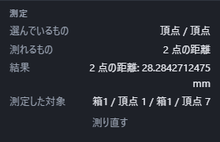

# 長さ・角度・面積を測る

画面にあるものを選んで「測る」を押すと、その場に線と数字が出ます。上の「見た目」の区画にあるボタンを押すと一覧が開き、2 行目に「測る」があります。

**何を測るかは、選んだものが決めます。** 種類を先に選ぶ必要はありません。点を 2 つ選べば距離、面を 2 枚選べば距離か角度、面を 1 枚だけ選べば面積、というように、選んだものから自動で決まります。

## 測り方

1. 測りたいものをクリックします。2 つ目は Shift を押しながらクリックします。
2. 「見た目」→「測る」を押します。
3. 画面に線と数字が出ます。右のプロパティの「測定」にも同じ値が出ます。

もう一度「測る」を押すと測り直します。選び直してから押せば、新しい値になります。

**測るのに形は変わりません。** 何度測っても部品はそのままで、「元に戻す」に段も増えません。

## 選べるもの

下の帯の「選ぶもの」で、クリックしたときに何が選ばれるかが変わります。`1` で頂点、`2` で辺、`3` で面、`4` で立体です。**「測る」を押しても「選ぶもの」は切り替わりません**ので、測りたいものに合わせて先に切り替えてからクリックしてください。

`4`(立体)にしてあるときは、立体のどこを押しても**その立体そのもの**が選ばれます。重さや体積を調べるときはこれを使ってください。

| 選んだもの | 出る値 |
|---|---|
| 頂点を 2 つ | 2 点の距離 |
| 面を 2 枚(向かい合う) | 面と面の距離、なす角 |
| 面を 2 枚(交わる) | なす角 |
| 辺を 2 本 | なす角、いちばん近いところの距離 |
| 頂点と面 | 点から面までの距離 |
| 立体を 2 つ | いちばん近いところの距離(隙間) |
| 面を 1 枚 | 面積 |
| 辺を 1 本 | 長さ |
| 立体を 1 つ | 体積(重さは「[材料と重さを調べる](mass-properties.md)」へ) |

かいた点や直線の線分も測れます。「選ぶもの」が辺や立体の場合、かいた図形を選ぶにはツリーの名前を使えます。

| かいた図形の選び方 | 出る値 |
|---|---|
| 点を 2 つ | 2 点の距離。通常の点も、関数上の点も使えます |
| 点を 1 つと立体の頂点を 1 つ | 2 点の距離 |
| 直線の線分を 1 本 | 両端の距離(長さ) |
| 直線の線分を 2 本 | なす角。関数の接線・法線として作った線分も使えます |

たとえば `(0, 0, 0)` と `(25.4, 0, 0)` の点なら距離は 25.4 mm、同じ両端の線分を 1 本選んでも長さは 25.4 mm です。X 方向と Y 方向の線分を 2 本選ぶと 90 度です。点と立体の頂点の組み合わせも、両方の位置から距離を測ります。

かいた円弧・スプライン・複数の線からなる輪郭全体、かいた点と立体の面、かいた線分と立体の辺の組み合わせは、この「測る」では扱いません。点の位置や線分がまだ計算中のときも、計算が終わるまで待ってください。

丸い面や丸まった辺も測れます。円筒の側面を 1 枚選べばその面積が出ますし、丸い辺を選べば 1 周の長さが出ます。

## 角度の測り方

面や辺のなす角は、**0 度から 90 度まで**で出ます。面には表と裏がありますが、どちらから見ても同じ角度になるようにしてあるためです。向かい合う 2 枚の面は 0 度、直角に交わる 2 枚は 90 度になります。

角度を測ると、画面には角の頂から 2 本の線とそのあいだの弧が出ます。辺どうしのときは、2 本が共有している角がそのまま弧の中心になります。

## 結果はいつまで残るか

**測った結果は、部品の形を変えるまで残ります。** 他のものを選び直しても、視点を回しても消えません。じっくり読んだり、他の場所と見比べたりできます。

右の「選んでいるもの」は現在の選択、「測定した対象」は結果を測ったときの名前です。選択を変えただけでは結果は切り替わりません。「測り直す」を押すと、選んだ対象の結果になります。測定を待っている間は、右の「測定を取り消す」でも取り消せます。

消えるのは次のときです。

- **Esc を押したとき。** すぐに消したいときはこれがいちばん早い方法です。
- **形を変えたとき。** 押し出しの距離を書き換える、穴をあける、元に戻す、など。測った値がもう正しくないので消えます。
- **新しい部品を始めたとき、別のファイルを開いたとき。**

色や材質を変えただけでは消えません。形は 1 ミリも動いていないので、測った値はそのまま正しいためです。

## 出る数字について

画面に出る札は小数 3 桁までです。右のプロパティの「測定」は、ミリメートル表示の長さ・面積・体積が有効数字 12 桁、角度が小数 2 桁、インチ表示の長さ・面積・体積が小数 3 桁です。どちらも表示用に丸めた数なので、札と右欄では末尾の桁が違うことがあります。

- 長さは表示単位に応じて mm または in です。右欄のミリメートル表示では 1000mm 以上を m で出します。
- 角度は度。
- 面積は mm² または in²、体積は mm³ または in³ です。

測る前でも測った後でも、下の帯で[単位を切り替え](units.md)られます。右欄と画面の札が同時に切り替わり、25.4 mm は 1.000 in と表示されます。測った形や距離そのものは変わりません。

## 測れないとき

下の帯に理由が出ます。

| 出る文 | 直し方 |
|---|---|
| 測りたいものを 1 つか 2 つ選んでください。 | 何も選ばずに押しました |
| 測れるのは 2 つまでです。選ぶものを減らしてください。 | 3 つ以上選んでいます |
| 距離を測るには 2 つ選んでください。 | 点を 1 つだけ選びました。もう 1 点選ぶと距離が出ます |
| 測れるのは立体と、その面・辺・頂点です。 | かいた円弧・複合輪郭など、上の表にない対象や組み合わせです。点・直線の線分、または立体の対象を選び直してください |
| この組み合わせでは測れません。 | 点と辺、面と辺のような組み合わせです。表のどれかに直してください |
| 選んだものが見つかりません。形が変わったため、選び直してください。 | 前に選んだ面が、形を変えたときに無くなりました |
| 測れませんでした。もう一度お試しください。 | 形の計算がまだ終わっていないことがあります。少し待ってもう一度押してください |

## 数式で使う値は「図形の測定値」で名前を付ける

ここでの「測る」は、その場で見るだけで保存しません。数式(係数の式)で使う値は、「見た目」の一覧にある別の道具「図形の測定値」で名前を付けます。名前を付けた値は部品に保存され、形を計算し直すたびに測り直します。詳しくは「[図形の測定値を数式で使う](math-input.md#図形の測定値を数式で使う)」を参照してください。
