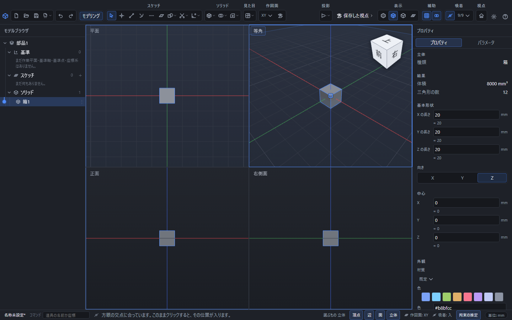

# 視点に名前を付けて保存する・4分割で見る

3D画面の向きに名前を付けて保存し、後から同じ視点に戻せます。保存した視点は図面の投影方向にも使えます。

4分割表示の実画面。平面・等角・正面・右側面を同時に表示し、選択した箱はすべての区画で青く示されます。

## 視点を保存する

1. 部品または組立を、保存したい向きへ回して位置を調整します。
2. 上の「保存した視点」を開きます。
3. 視点の名前を入力し、「今の視点を保存」を押します。

空の名前や同じ名前は使えません。正面・平面・右側面・等角の既定の視点に加え、作業に必要な方向を登録できます。

## 呼び出し・改名・削除

一覧から視点を選び「この視点へ」を押します。名前を書き換えて「名前を変更」を押すと改名できます。不要な視点は削除できます。視点を消しても立体は消えません。保存ファイルへ残すには部品または組立も保存してください。

## 4方向を同時に見る

「保存した視点」→「4分割で見る」で、平面・等角・正面・右側面の4画面を表示します。各画面で部品の形を選べます。「1画面に戻す」で通常表示へ戻ります。図面の用紙へ4枚の図を追加する操作とは別です。

## 図面に使う

図面の「図」から投影図を追加するとき、元の部品で保存した視点を選べます。方向を引き継ぎますが、用紙の大きさは図面の縮尺で決めます。[図を追加する](drawing-views.md)と[用紙と縮尺](drawing-scale.md)も参照してください。
