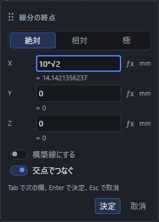
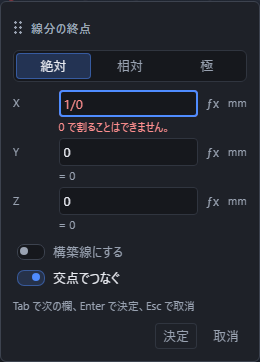

# 数値と式の入れ方

長さや角度を入れる欄では、数字のかわりに**式**を書けます。書いた式はそのまま残るので、後から開いて直せます。

## 入力の窓を動かす

点や線分の座標、加工の寸法などを入れる窓は、上の見出しをドラッグして動かせます。見出しの点の印がつまみです。マウスの左ボタンのほか、指やペンでもつかんで動かせます。入力欄やボタンを押しても窓は動きません。

数式、関数、組み立て、図面の注記などの浮いた入力の窓も、同じように見出しから動かせます。窓が大きくなったときや画面を小さくしたときは、見出しと入力欄が画面内に収まるように位置が調整されます。高さが足りないときは窓の中をスクロールできます。

その場の数値入力では、移動しても入力中の欄に焦点が残り、Tab で欄を移る、Enter で決める、Esc でやめる操作はそのまま使えます。移動した位置は窓を開いている間だけ保ち、閉じてから開き直すと、クリックした場所の近くなど元の位置に戻ります。

## 使える書き方

| 書きたいこと | 書き方 | 例 |
|---|---|---|
| 足す・引く・かける・わる | `+` `-` `*` `/` | `10+5` `100/3` |
| かっこ | `(` `)` | `(10+5)*2` |
| 累乗 | `^` | `2^10` |
| 平方根 | `sqrt( )` または `√` | `sqrt(2)` `√2` |
| 立方根 | `cbrt( )` | `cbrt(8)` |
| n 乗根 | `root(数, n)` | `root(27,3)` |
| 絶対値 | `abs( )` | `abs(0-5)` |
| 分数 | `/` | `3/4` |
| 円周率 | `pi` または `π` | `pi*10` |
| 自然対数の底 | `e` | `e^2` |

全角のまま(`１＋２`、`（`、`×`、`÷`)打っても、そのまま計算できます。

## 角度の書き方

角度の欄は**度**で読みます。`90` と書けば 90 度です。ラジアンで書きたいときは `rad( )` で包みます。`rad(pi/2)` は 90 度と同じです。

## 欄の使い方

入力欄は、道具を選ぶと 3D の表示の中央に浮かんで出ます。表示の中の置きたい場所をクリックすると、その位置の座標が欄に入り、欄もクリックした場所の近くへ移ります。出ている間も画面を回したり拡大したりできます。

| やりたいこと | 操作 |
|---|---|
| 次の欄へ移る | Tab キー(最後の欄で押すと先頭へ戻ります) |
| 前の欄へ戻る | Shift + Tab キー |
| そのまま決める | Enter キー、または「決定」 |
| やめる | Esc キー、または「取消」 |
| 位置の決め方を変える | 「絶対」「相対」「極」を押す(Alt+1、Alt+2、Alt+3) |

欄には最初から値が入っています。そのままでよければ Enter を押すだけで決まります。欄へ移ると中の文字がすべて選ばれるので、打ち始めれば上書きになります。

欄の右側の `mm` や `°` は、その欄が何の単位で読まれるかを示します。

## 正しく書けているかの見かた

式が正しければ、欄の下に計算した値が `= 15` のように薄く出ます。正しくないときは欄と文字が赤くなり、下に理由(たとえば「0 で割ることはできません。」)が出ます。理由が出ている間は決めても作られず、直すところへ印が移ります。

## 位置の決め方

| 決め方 | 意味 | 入れるもの |
|---|---|---|
| 絶対 | 原点からの位置 | X、Y、Z |
| 相対 | 基準の点からのずれ | ΔX、ΔY、ΔZ |
| 極 | 基準の点からの距離と向き | 距離、角度、仰角 |

「相対」と「極」の基準は、直前に作った点です。決め方を変えると入れるものの意味が変わるので、欄は最初の値に戻ります。

## 続けてかくとき

続けてかく設定のときは、決めたあとも入力欄が開いたままになり、直前の点を基準にして次の入力へ進みます。やめるときは Esc キーを押します。
