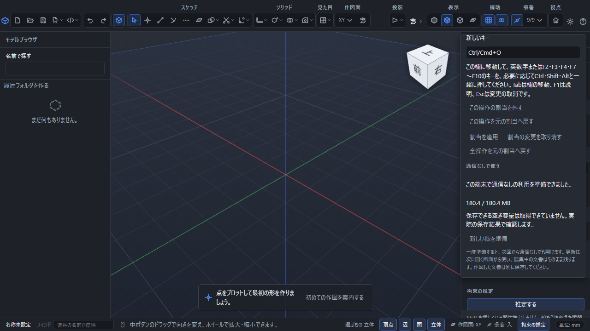

# 通信なしで使う準備と更新

Web版は、通信できる間にアプリと計算部、説明書を端末へ保存しておくと、同じブラウザーで通信なしでも開けます。作図した部品・組立・図面のファイルは、この準備とは別に保存してください。

## 最初に準備する

1. 通信できる状態で、通常のWeb版を開きます。
2. 画面右上の歯車から設定を開き、「{{ui:offline.title}}」を探します。
3. 「{{ui:offline.prepare}}」を押します。ファイル数と取得した量が表示されます。
4. 「{{ui:offline.ready}}」という表示になるまで待ちます。取得の途中で通信を切らないでください。
5. 作業中の文書を保存し、通信を切って同じWeb版の場所を新しい画面で開きます。保存した文書は「開く」から選び直せます。

設定を閉じても準備は続きます。進み具合を見るときは設定を開き直してください。「{{ui:offline.cancel}}」を押すと今回の取得を取り消せます。以前に準備できた版と、編集中の文書は残ります。

保存先は、このブラウザーがWeb版のために管理する端末内の領域です。別のブラウザー、別の利用者、別の端末には引き継がれません。ブラウザーのサイトデータを消した場合や、ブラウザーが空き容量確保のため保存内容を削除した場合は、再び通信できる状態で準備してください。作図ファイルを別に保存しておけば、この保存領域が消えてもファイルから開き直せます。

## 通信なしで説明書を読む

アプリ内ではF1で説明を開き、目次、検索、前後の章で読み進められます。Web版と同じ場所にある説明書も準備に含まれます。説明書の目次から読み始め、「次の章」で続けてください。全巻のPDFも同じ版の内容を保存します。

## 新しい版へ切り替える

通信をつなぎ、設定の「{{ui:offline.update}}」を押します。準備完了後に新しく開く画面から、準備できた版を使います。既に開いている画面を強制的に読み直したり、編集中の文書を別の版へ置き換えたりしません。

新しい版の準備に失敗しても、以前の準備済みの版を消しません。古い画面を閉じる前に文書を保存してください。使われなくなった古い版は後で片付けられます。旧版の画面や計算がまだ動いている間は、その版に必要なファイルを残します。

## 準備できないとき

| 表示・状態 | 次にすること |
|---|---|
| 必要なファイルを取得できない、内容が一致しない | 通信を確認してから準備をやり直します。途中までの取得を準備完了として使いません |
| 端末へ保存できない | 端末の空き容量とブラウザーの保存設定を確認します。表示される空き容量は目安で、保存成功を保証する値ではありません |
| 別の画面で準備中 | その画面で完了または取消を確認し、その後にやり直します |
| 保存内容が見つからない、壊れている | 通信をつなぎ直し、準備をやり直します。編集中の文書は先に保存します |
| この環境で利用できない | 通常の対応ブラウザーで正式なWeb版の場所を開きます。保存が制限された閲覧モードでは準備できない場合があります |

[文書の保存と開き方](save-and-open.md)・[ヘルプの読み方](help-reader.md)・[表示設定](display-settings.md)
