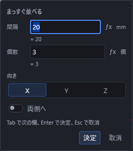
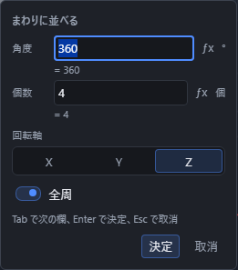

# 同じ加工を並べる

立体にあけた穴・ねじ穴を、同じ形のまま複数並べます(パターン)。

## 手順(直線パターン)

1. 「選択」の道具のまま、並べたい**穴**(またはねじ穴)をクリックします。
2. ツールバーの「ソリッド」区画で「加工」を押して一覧を開き、「直線パターン」を押します。
3. 入力欄が出るので、「間隔」と「個数」を入れて Enter を押します。

穴かねじ穴を選ぶまでは「直線パターン」のボタンは薄いままで押せません。

### 向き

入力欄(または右の「プロパティ」)の「向き」で、並べる方向を X・Y・Z のいずれか、またはスケッチでかいた線分から選べます。

### 「両側へ」は個数が奇数のときだけ

入力欄の「両側へ」のつまみを入にすると、もとの穴の位置を真ん中にして両側に並びます。この使い方ができるのは、個数が奇数のときだけです。偶数個のまま「両側へ」を使おうとすると、もとの位置に穴が来なくなるため、作ったものの一覧に理由が表示されます。個数を奇数にするか、「両側へ」を切にしてください。

## 手順(円形パターン)

1. 「選択」の道具のまま、並べたい**穴**(またはねじ穴)をクリックします。
2. ツールバーの「ソリッド」区画で「加工」を押して一覧を開き、「円形パターン」を押します。
3. 入力欄が出るので、「角度」と「個数」を入れて Enter を押します。

円形パターンは、選んだ**軸**(X・Y・Z、またはスケッチの線分)のまわりに穴を並べます。入力欄の「角度」の欄は常に出ています。「全周」のつまみを入にすると、角度の欄に入れた値は使われず、360度を個数で均等に割った角度で並びます。切にすると、角度の欄に入れた角度の範囲に等間隔で並びます。

## 並べられるのは穴とねじ穴だけ

パターンで並べられるのは、穴とねじ穴だけです。R面取り・C面取りは対象になりません(面取りは、辺を複数選んでから面取りの道具を押せば一度にできます)。

## 作ったあとに向き・間隔・個数を直す

パターンを作ったあとでも、右の「プロパティ」で向き(または軸)・間隔(または角度)・個数・両側へ(または全周)を直せます。プロパティの「並べる穴」を押すと、もとの穴を選び直せます。

## うまくいかないとき

「直線パターン」「円形パターン」を押しても何も起きないとき、または画面下の帯や作ったものの一覧に理由が出たときは、次を確かめてください。

| 出る文 | 直し方 |
|---|---|
| 並べる穴が選ばれていません。 | 並べたい穴かねじ穴をクリックしてから、もう一度ボタンを押します |
| 並べられるのは穴とねじ穴だけです。 | 選んでいるものを、穴かねじ穴に選び直します |
| 並べる個数は 2 以上 100 以下の整数にしてください。 | 個数の数字を見直します |
| 両側へ並べるときは、個数を奇数にしてください。 | 個数を奇数にするか、「両側へ」を切にします |
| 並べる間隔は 0 より大きい数にしてください。 | 間隔の数字を見直します |
| 並べる角度は 0 より大きく 360 以下にしてください。 | 角度の数字を見直します |
| 並べる向きにする線分が見つかりません。スケッチで線分をかいてから選び直してください。 | 向き(または軸)に選んだ線分を作り直すか、選び直します |
