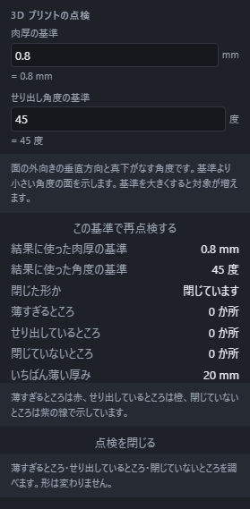

# 3D プリントの前に点検する

作った立体が 3D プリンタでうまく出るかどうかを、書き出す前に調べられます。**形は変わりません。** 調べるだけです。

## 点検のしかた

1. 点検したい立体を選びます。何も選ばなければ、画面にあるものぜんぶを点検します。
2. ツールバーの「見た目」から**「3D プリントの点検」**を押します。
3. 少し待つと、問題のあるところに色が付き、右の「プロパティ」の**「3D プリントの点検」**の節に結果が出ます。

結果の「点検を閉じる」を押すと、**元の色に戻ります。** 点検中にもう一度ツールバーの入口を押すか、右の「点検を中止する」を押すと、途中までの結果を残して中止します。

## 基準を変えて点検する

右の「3D プリントの点検」に、**肉厚の基準**と**せり出し角度の基準**の入力欄があります。最初は **0.8 mm・45 度**です。初回の点検前にも入力できます。

1. 肉厚を `1/2`、角度を `30+30` のような式で入力します。ミリメートル表示なら 0.5 mm・60 度になります。
2. 欄の下の値を確かめ、「この基準で点検する」または「この基準で再点検する」を押します。
3. 結果の「結果に使った肉厚の基準」「結果に使った角度の基準」を確かめます。

肉厚は 0 より大きい数、角度は 0 度以上 90 度以下です。空欄・不正式・範囲外の値には理由が出て、そのままでは再点検できません。点検中も中止はできます。

肉厚は[表示単位](units.md)で入力します。単位をはっきりさせたいときは `0.8mm` や `1/32in` と書けます。入力した式は表示単位を切り替えても意味が変わらず、次に打ち直すときにそのときの表示単位で読みます。角度は常に度です。基準の編集だけでは前の結果は変わりません。結果欄の基準は、途中で中止した場合も実際に使った値を示します。

## 何を調べるか

| 調べること | 何が困るか | 画面の色 |
|---|---|---|
| 薄すぎるところ | 薄すぎると出力できない、または折れる | 赤 |
| せり出しているところ | 下に何も無い面は垂れる。支えが要る | 橙 |
| 閉じていないところ | 穴のあいた形は、多くのプリンタのソフトが受け付けない | 紫の線 |

色が付いていなければ、使った基準で点検できた範囲には該当する場所が見つからなかったという意味です。中止した場合は未点検の場所が残ります。

**色は点検している間だけの見え方です。** 自分で付けた色や材質を書き換えてはいません。点検をやめれば元どおりに戻ります。

### 薄すぎるところ(赤)

肉が薄いところです。プリンタのノズルの太さより薄い壁は出力できません。**薄さの基準は自分で変えられます。** 使うプリンタとノズルに合わせて打ち直してください。

厚くするには、押し出しの厚みを増やすか、くり抜きの厚みを増やします。

### せり出しているところ(橙)

真下に何も無い、寝た面です。そのまま出すと材料が垂れるので、支えを付けるか、置く向きを変えます。

**角度は、面に垂直な外向きの方向と真下との角度**です。水平な下面は 0 度、垂直な側面は 90 度で、その角度が基準より小さい面を示します。基準を大きくすると、より立った面まで対象が増えます。小さくすると、より寝た下面だけに絞られます。

たとえば、真下から約 37 度傾いた向きの下面は、基準 30 度では対象外、60 度では対象です。同じ傾きでも、台に接している面は支えが要らないので数えません。ここでは、形のいちばん低い位置から 0.1 mm 以内に全体が収まる面を台に接した面として扱います。

### 閉じていないところ(紫の線)

面と面のあいだに隙間があり、立体として閉じていないところです。「面を張る」で作った殻や、読み込んだ形にときどきあります。ここが 1 か所でもあると、プリンタ用のソフトが「壊れた形」として断ることがあります。

読み込んだ形が閉じていないときは、元のファイルを作った側で直すのがいちばん確実です。

## 結果の読みかた

プロパティの節には、色と同じ内容が数で出ます。

- 閉じた形かどうか
- 薄いところ・せり出しているところが何か所あるか
- 見つかったいちばん薄い厚み

**問題が見つかっても、書き出しは止まりません。** 支えを付けて出す前提なら、せり出しがあっても構いません。判断するのは作った人です。

## 書き出す前のお知らせ

STL や 3MF で書き出そうとしたとき、まだ一度も点検していなければ、書き出しの画面に**「先に 3D プリントの点検をしますか」**と 1 行出ます。

**これはお知らせだけで、書き出しは止まりません。** そのまま「書き出す」を押せば書き出せます。点検してから出したいときは、いったん「やめる」を押して点検してください。

書き出しそのものについては「書き出す(ほかのソフトへ渡す)」を見てください。

## 待ち時間について

大きな形ほど時間がかかりますが、点検している間もほかの操作はできます。途中でやめたくなったら、もう一度押せば止まります。**やめても、そこまでに分かったことは残ります。**

## うまくいかないとき

| 出る文 | 直し方 |
|---|---|
| 点検できる形がありません。 | 立体を作ってから、または立体を選んでから押します |
| 最小肉厚のしきい値は 0 より大きい数にしてください。 | 0 や負の数ではなく、実際の厚みを打ちます |
| オーバーハングの角度は 0 度以上 90 度以下にしてください。 | その範囲の角度を打ちます |
