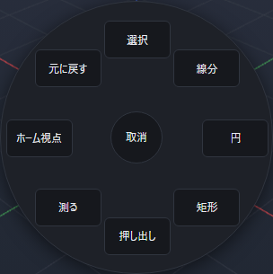

# 右クリックで道具を選ぶ

作図する画面の上で右クリックすると、よく使う8つの道具が表示されます。部品・組立・図面で使える道具が違うため、表示中の画面に合わせて一覧が変わります。ツールバーまでマウスを動かさずに道具を選べます。

## クリックして選ぶ

1. 作図する画面の何もないところで、右ボタンを短く押して離します。
2. 出てきた道具の名前を左クリックします。
3. 道具に応じて対象を選ぶか、数値を入力します。

一覧を出した後は、矢印キーで道具を選び、Enterで実行することもできます。道具に焦点を当ててF1を押すと、その道具の手順を開きます。名前の上でマウスを止めると、現在割り当てているキーも確認できます。

## 右ボタンを押したまま選ぶ

右ボタンを押したまま、中央から道具の方向へマウスを動かし、その方向でボタンを離します。明るい枠で示された道具を選べます。中央へ戻す、隣の道具との境目へ動かす、一覧の外へ動かす場合は、何も実行しません。

画面の端では、一覧全体が見える位置へ中央を移します。押し始めた位置が中央から離れている場合は、いったん見えている中央へマウスを動かしてから道具を選んでください。短い右クリックで一覧を残して、道具を左クリックする方法も使えます。

## 取り消す・使えないとき

中央の{{ui:radial.cancel}}を押すか、Escで一覧を閉じます。一覧を開くだけ、閉じるだけの操作では文書は変わりません。別の文書へ切り替えたり、画面を作り直したりした場合も閉じます。選んでいる間に対象が変わった場合は、古い状態のまま道具を実行しません。

計算中や別の確認画面が開いている間は、この一覧を開けません。また、一覧と説明を置けないほど作図画面が小さい場合は、画面を広げるかツールバーを使ってください。

対象が足りない道具は、先に対象を選ぶ必要があります。理由が出た場合は対象を選び直すか、その道具のヘルプを参照してください。

## 視点操作・保存・元に戻す

中ボタンやAltと左ボタンによる視点操作は、今までと同じです。道具の一覧が開いているときに視点操作を始めると、一覧を閉じてから視点を動かします。

選んだ道具の確定・取消・保存・{{ui:toolbar.history.undo}}は、ツールバーから選んだ場合と同じです。右クリックの一覧自体は文書へ保存しません。キーを変える手順は[ショートカット一覧](./shortcuts.md)を参照してください。
