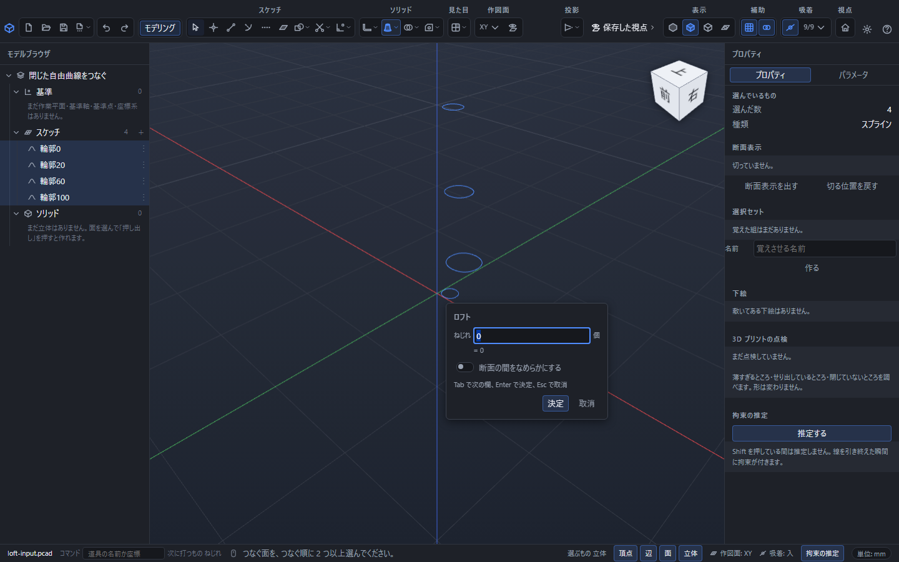
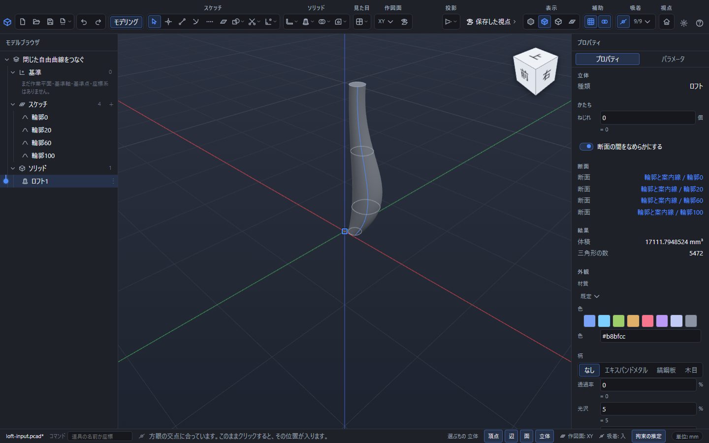

# 面と面をつなぐ・ロフト

離れたところにある 2 つの面を選ぶと、そのあいだを埋める立体ができます。上の「ソリッド」の区画にある「作る」のボタンを押すと一覧が開き、基本の形の下に「面をつなぐ」と「ロフト」が並んでいます。

つなぎ方が 2 通りあります。

| 道具 | つなぎ方 | 向いている形 |
|---|---|---|
| 面をつなぐ | 輪郭どうしを**まっすぐな線**で結びます | 四角錐台、円錐台、じょうご、球を支える柱 |
| ロフト | 輪郭どうしを**ふくらんだ曲線**で結びます | 船の胴、持ち手、なめらかにねじれる形 |

どちらも**もとの面や立体は消えません**。つないだあとも、貸したほうはそのまま画面に残ります。要らなければ、あとから「合わせる」の「和」で 1 つにまとめられます。

## つなぎ方

1. つなぐ面を選びます。**選んだ順が、つながる順**になります。
2. 「ソリッド」の「作る」を押して、「面をつなぐ」か「ロフト」を選びます。
3. 小さな入力欄が出ます。そのまま Enter を押せばできあがります。

やめたいときは Esc を押します。何も作られません。

## つなげるもの

選べるのは次の 4 つです。「面をつなぐ」は**ちょうど 2 つ**、「ロフト」は**2 つ以上**選びます。

- **かいた面**: 「面」の道具で作った面です。作図面を変えて上下に 2 枚かき、それをつなぐのがいちばん素直な使い方です。
- **閉じた自由曲線**: 「スプライン」で閉じてかいた輪郭を、そのまま選べます。先に「面」を作る必要はありません。開いた自由曲線や構築線は断面に使えません。
- **立体の面**: すでにある立体の平らな面です。下の帯の「選ぶもの」が「面」になっていることを確かめてから、面をクリックします。板の上面と、その上にかいた四角をつなぐ、といった使い方ができます。
- **球**: 「球」で置いた球です。球そのものをクリックしても、球の表面をクリックしても同じように選べます。球は「面をつなぐ」でだけ使えます。

穴のあいた面や、丸まった面(円柱の側面など)はつなげません。選び直してください。

### 例: 箱の上面と、その上の四角をつなぐ

1. 「箱」を置きます。
2. 箱の上の面より高いところに作図面を作り、「四角」で小さめの四角をかき、「面」で面にします。
3. 下の帯の「選ぶもの」を「面」にして、箱の上面をクリックします。
4. Shift を押しながら、かいた四角の面をクリックします。
5. 「作る」→「面をつなぐ」→ Enter。四角錐台ができます。

### 例: 球と円をつなぐ

1. 「球」を置きます。
2. 球から少し離れたところに円をかき、「面」で面にします。
3. 球をクリックし、Shift を押しながら円の面をクリックします。
4. 「作る」→「面をつなぐ」→ Enter。

球につなぐと、線は**球の表面にちょうど触れる向き**になります。まっすぐな柱ではなく、球にすっと吸い付く形になるのはこのためです。ラッパのような形や、球を下から支える台を作るのに使えます。

**円が球の真上や真下になくてもかまいません。** 斜めにずれた円でも、四角でも、球につなげます。

## なめらかさ(球をつなぐときだけ)

球をつなぐときは、入力欄に「なめらかさ」が出ます。

| 選ぶもの | 仕上がり | 待ち時間 |
|---|---|---|
| ふつう | ふだんはこれで十分です | いちばん速い |
| 細かい | 面の継ぎ目が目立つときに | ふつうの倍くらい |
| とても細かい | 仕上げの確認や書き出しの前に | かなり待ちます |

まず「ふつう」で形を決めて、最後に上げるのがおすすめです。**球を選んでいないときはこの欄は出ません**(選んでも形が変わらないためです)。

## 自由曲線の断面をつないで形を整える

1. 高さの違う場所に、閉じたスプラインを2本以上かきます。例えば高さ0、20、60、100mmに輪郭を置き、途中の輪郭を大きくするとふくらみを決められます。
2. 左のモデルブラウザで最初の輪郭を選び、Shiftを押しながら残りの輪郭をつなぐ順に選びます。
3. 「作る」→「ロフト」を選び、「決定」を押します。
4. 作成欄または右のプロパティの **「断面の間をなめらかにする」** を入れると、選んだ断面を通る形を保ちながら、断面のあいだのふくらみを調整できます。既定は切です。断面の数や形によっては、入と切で見た目がほとんど変わらない場合もあります。
5. もとのスプラインの点や式を編集すると、つないだ立体も変わります。平滑化の切替は「元に戻す」で戻せ、保存して開き直しても指定が残ります。

この指定は、ロフト自身のふくらみを整えるものです。**隣にある別の面へ、接線の向きまで自動的に合わせる指定ではありません。** 穴のある面を断面にすると理由を出して作成を断ります。穴を埋めた別の形へ勝手に置き換えることはありません。

## ねじれ

つないだ形が途中でねじれてしまうことがあります。輪郭のどこから結び始めるかが、思っていたのと違ったときに起こります。

入力欄の「ねじれ」に `1`、`2`、… と入れると、2 つ目の輪郭の結び始めが 1 つずつずれます。形を見ながら、ねじれが取れる数を探してください。`-1` のように負の数を入れると逆向きにずれます。

- 入れられるのは**整数だけ**です。`1.5` のような数は受け付けません。
- **立体の面から取った輪郭には効きません。** かいた面どうしをつないだときにだけ効きます。プロパティにもその旨が出ます。

## あとから直す

作ったものは自動的に選ばれた状態になり、道具は「選択」に戻ります。左の「モデルブラウザ」に「面をつなぐ1」「ロフト1」のように並びます。

行をクリックすると、右のプロパティに次が出ます。

- **かたち**: ねじれの欄。書き換えるとその場で形が変わります。式も書けます。球をつないでいるときは、なめらかさのボタンもここに出ます。
- **断面**: つないだ面の名前。「1 つ目の面」「2 つ目の面」(ロフトは並んだ順)。名前をクリックすると、その面が画面で光ります。
- **結果**: できた立体の体積と三角形の数。

つなぐ面そのものを選び直すことはできません。選び直したいときは、いったん消してから作り直してください。

## うまくいかないとき

下の帯に理由が出ます。ボタンを押す前に読めるので、直してから押してください。

| 出る文 | 直し方 |
|---|---|
| つなぐ面を 2 つ選んでください(スケッチの面・立体の面・球)。 | 選んだ面が 1 つ、または 3 つ以上です。「面をつなぐ」はちょうど 2 つです |
| 球どうしを直線でつなぐことはできません。片方は面を選んでください。 | 球を 2 つ選んでいます。片方は面にしてください |
| 中心を立体の頂点で決めた球は、まだ面をつなぐ相手にできません。 | 球を置くときに立体の角を中心にした場合です。プロパティで中心を座標に直してください |
| ねじれは整数にしてください。 | `1.5` のような数が入っています |
| 面または閉じたスプラインを、つなぐ順に2つ以上選んでください。 | ロフトの断面を2つ以上、つなぐ順に選びます |
| ロフトには球を使えません。「面をつなぐ」を使ってください。 | ロフトの断面に球が混ざっています |
| 球を直線でつなぐには、丸い輪郭の中心が球の中心の真上か真下にある必要があります。 | どうしても形が求まらないときに出ます。輪郭が球の中に入り込んでいないか確かめてください |

輪郭の大きさや向きが極端に違うと、うまい形にならないことがあります。そのときは片方を作り直すか、あいだにもう 1 枚面をかいてロフトで 3 段につなぐと落ち着きます。

作ったものは、和・差・積で他の立体と組み合わせたり、穴をあけたり角を丸めたりできます。
