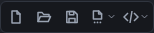
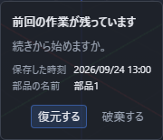
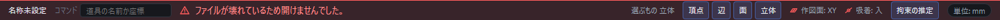

# 保存する・開く

作った部品はファイルに保存できます。ファイルの名前の終わりは `.pcad` で、これが **PointerCAD の部品ファイル**です。

組み立ては `.pcada` という名前で保存します。置いた部品も一緒に保存されるため、元の部品ファイルを移動した後でも開けます。

## ボタンとキー

画面のいちばん上、製品名のとなりに 3 つのボタンが並んでいます。

| ボタン | すること | キー |
|---|---|---|
| 新規 | まっさらな部品または組み立てにする | Ctrl+N |
| 開く | 保存したファイルを読み込む | Ctrl+O |
| 保存 | いま開いているものをファイルに書く | Ctrl+S |

その右の▾の付いたボタン(**{{ui:toolbar.fileMenu.groupLabel}}**)には、名前を付けて保存・書き出す・読み込む・印刷・ひな形・図面や組み立ての新規作成など、たまに使うファイルの操作がまとめてあります。

**名前を付けて保存**は、保存のボタンを Shift を押しながら押します。キーボードでは Ctrl+Shift+S です。保存先を選び直したいときや、別名で残しておきたいときに使います。

ボタンに指を乗せると、名前とキーが読めます。

## はじめて保存するとき

「保存」を押すと、どこに置くかを聞かれます。名前を決めて保存すると、その後の「保存」は同じファイルへそのまま書き込みます。いちいち場所を聞かれません。

ブラウザによっては場所を選べません。そのときは、いつものダウンロード先へファイルが落ちます。保存のボタンに指を乗せると、その旨が読めます。この場合は「保存」を押すたびに新しいファイルができるので、古いほうは削除してください。

## いま何を開いているか

画面のいちばん下の左に、開いているファイルの名前が出ます。まだ一度も保存していない部品は **名称未設定** と出ます。

名前の右に `*` が付いているときは、**保存していない変更がある**という意味です。保存すると `*` は消えます。同じ印は、ブラウザのタブ(デスクトップ版では窓)の見出しにも出ます。

## 保存していない変更があるとき

`*` が付いたまま「新規」や「開く」を押すと、画面の中に「{{ui:file.discardConfirm.title}}」の窓が出て、「{{ui:file.discardConfirm}}」と聞かれます。答えるまで、後ろの画面は操作できません。

- **{{ui:file.discardConfirm.save}}** を選ぶと、いまの部品を保存してから続けます。保存の場所を選ぶ窓を取り消したときや保存できなかったときは続けず、いまの部品がそのまま残ります。
- **{{ui:file.discardConfirm.discard}}** を選ぶと、最後に保存してからの変更を捨てて続けます。
- **{{ui:file.discardConfirm.cancel}}** を選ぶか Esc を押すと、何もせずにいまの部品へ戻ります。最初はこのボタンが選ばれています。

図面を閉じて部品へ戻るとき、ひな形から新しい部品を始めるとき、新しいアセンブリを始めるときも、同じ確認が出ます。Web版でもデスクトップ版でも、ボタンの名前は同じです。

いちども手を付けていない、まっさらな部品のときは聞かれません。失うものが無いためです。

## 読み直す・タブを閉じるとき

Web版で `*` が付いたまま、タブを閉じる、画面を読み直す、別のページへ移ろうとすると、ブラウザーが確認を出します。確認の文言とボタンの名前はブラウザーごとに決まっていて、PointerCAD からは変えられません。

- **キャンセル**(ブラウザーによっては **ページに留まる**)を選ぶと、画面も保存していない変更もそのまま残ります。保存してから閉じてください。
- **再読み込み**・**移動**・**ページから移動** など、離れる側を選ぶと、保存していない変更は失われます。自動保存の控えが残っていれば、次に開いたときに控えの時点まで復元できます。

`*` が付いていないとき(まだ何もしていないとき、開いた直後、保存した直後)は確認されません。図面を開いているときは、図面の元の部品に保存していない変更が残っている場合も確認されます。保存に失敗したときは `*` が残るので、確認も出ます。

その画面で一度もクリックやキー入力をしていないと、ブラウザーが確認を出さないことがあります。

通信なしで使う準備や新しい版への切り替えを別のタブで行っても、開いている画面が勝手に読み直されることはありません。

## デスクトップ版で窓を閉じるとき

デスクトップ版で `*` が付いたまま窓を閉じる(右上の ×、Alt+F4、タスクバーの「ウィンドウを閉じる」)と、「{{ui:file.closeGuard.message}}」と聞かれます。答えるまで窓は閉じません。

- **{{ui:file.closeGuard.save}}** を選ぶと、「保存」と同じように保存してから閉じます。まだ一度も保存していないときは、保存先を聞かれます。保存先を選ぶのをやめたときや、保存に失敗したときは閉じません。失敗したときは画面のいちばん下の帯に理由が出るので、場所を変えて保存し直してください。
- **{{ui:file.closeGuard.discard}}** を選ぶと、保存しないで閉じます。最後に保存してからの変更は失われます。自動保存の控えが残っていれば、次に開いたときに控えの時点まで復元できます。
- **{{ui:file.closeGuard.cancel}}** を選ぶと、閉じずにもとの画面へ戻ります。

図面を開いているときは、図面と、図面の元の部品の両方が対象です。**{{ui:file.closeGuard.save}}** を選ぶと、図面を保存した後で元の部品の画面へ戻り、部品も保存します。部品の保存先を選ぶのをやめたときは、部品の画面のまま閉じずに残ります。

`*` が付いていないとき(まだ何もしていないとき、開いた直後、保存した直後)は、聞かれずに閉じます。

Windows の電源を切る・再起動する・サインアウトするときも、`*` が付いていれば同じ確認が出ます。Windows の画面に PointerCAD が終了を止めていると出たら、PointerCAD の窓で答えてください。Linux でサインアウトや電源を切るときも、アプリに終了の知らせが届けば同じ確認が出ます。ただし、答えないまま時間がたつと、Linux がアプリを終わらせることがあります。サインアウトや電源を切る前に保存してください。

画面が応答しないまま閉じようとすると、「{{ui:file.closeGuard.unresponsiveMessage}}」と出ます。**{{ui:file.closeGuard.forceClose}}** を選ぶと、保存していない変更を捨てて閉じます。**{{ui:file.closeGuard.cancel}}** を選ぶと閉じずに残るので、しばらく待ってからもう一度閉じてください。

## ファイルの中身

保存されるのは、**あなたが行った操作の記録**(かいた点・線分・円弧・面、入れた式、作った立体)です。計算した形そのものは入っていません。開いたときに同じ手順をたどり直すので、式を入れてあれば式のまま残り、あとから数を変えられます。

いっしょに、そのときの画面の小さな絵も入ります。ファイルを探すときの目印です。3D の絵がまだ出ていないうちに保存したときは、絵は入りません。ファイルはそのまま開けます。

## 自動保存

作業の控えを、**最初は5分ごとに自動で**残します。歯車の「表示設定」から「自動保存の間隔」を開き、1～60分の整数を指定して「保存間隔を適用」を押すと変更できます。残るのは、前に控えを残したときから何かを変えたときだけです。控えはこのアプリの中に置かれ、ファイルとしては出てきません。

停電やアプリの終了で作業が途切れても、次に開いたときに画面の中ほどに **前回の作業が残っています** と出ます。控えを残した時刻と部品の名前がいっしょに読めます。

- **復元する** を押すと、控えの部品が開きます。まだファイルには保存されていないので、名前は **名称未設定** に戻ります。続きから作業して、あらためて保存してください。
- **破棄する** を押すと、控えは消えます。

このお知らせが出ているあいだも、画面の操作はふつうにできます。どちらかを押すまで消えないので、あわてて選ぶ必要はありません。

**この版では前回の作業を復元できません** と出ることもあります。そのときは **復元できない理由** が読めます。**控えを書き出す** を押すと、控えを `.pcad` のまま保存できます。控えは **破棄する** を明示的に押すまで残ります。

自動保存に失敗したときは、状態欄に **自動保存できませんでした。変更はまだ保存されていません。** と出るので、成功した場合と見分けられます。

自分で保存(Ctrl+S)に成功すると、控えは消えます。保存したファイルのほうが新しいためです。

## 開けなかったとき

読めないファイルを選んでも、**いま開いている部品はそのまま**です。画面のいちばん下の帯が赤くなり、理由が出ます。

| 帯に出ること | 意味 |
|---|---|
| ファイルを開けませんでした | ファイルの容量が **256MiB を超えている**、選ぶ窓が使えないなど、中身を読みに行く前の段階で開けませんでした |
| ファイルが壊れているため開けませんでした。 | ファイルの中身が途中で切れている、内部の記録が壊れている(記録の照合〔CRC〕が合わない)、または中に入っている部品が展開後の上限(1項目あたり 512MiB・合計 1024MiB・項目数 4096 個)を超えると宣言しているなど、読み取れない状態です |
| PointerCAD の部品ファイルではないようです。 | 別のアプリのファイルか、部品ではないファイルです |
| ファイルの中身が見つかりませんでした。 | 名前は `.pcad` ですが、中に部品が入っていません |
| 古い形式のため開けません。 | 古い版の PointerCAD で保存されたファイルです |
| 新しい版の PointerCAD で保存されたファイルです。アプリを更新してください。 | あなたのアプリより新しい版で保存されています |

大きすぎるファイル(**256MiB 超**)は、中身を読み込む前に断られます。ファイルの中の記録が「本当は小さいのに大きく展開されると宣言している」「本当は宣言よりずっと大きい」「中身の記録(CRC)が合わない」といった、壊れている・偽装されているファイルも、実際に大きな記憶を確保する前に断ります。とても大きなファイルや開けないファイルに出会ったときは、元のファイルが壊れていないか、開こうとしている場所が正しいかを確かめてください。

**どの理由で開けなかったときも、いま開いている部品(未保存の変更を含む)と自動保存の控えは変わりません。** 開こうとしたファイルの中身が文書へ反映されるのは、最後まで読み終わって検証できたときだけです。

ファイルを選ぶのをやめたときは、何も起きません。帯にも何も出ません。
