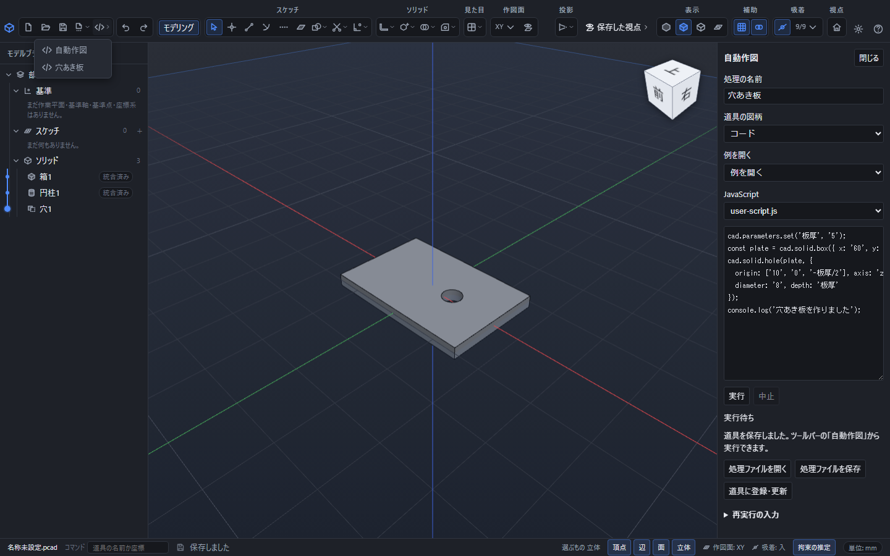
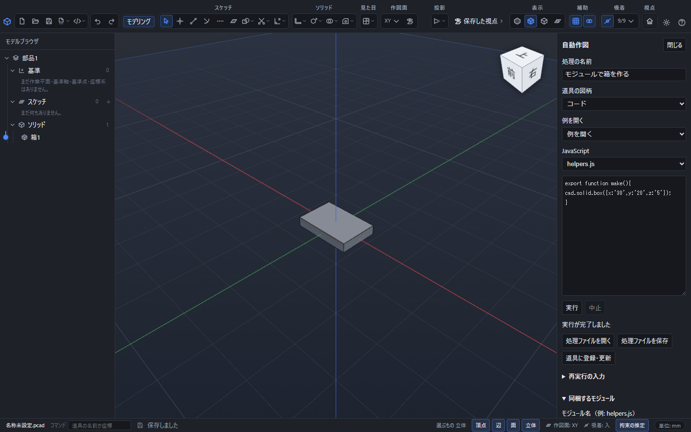

# 処理を保存し、道具として登録する

## 処理ファイルを保存する

「自動作図」で名前とコードを入力し、「処理ファイルを保存」を押します。`.pcadscript`ファイルに名前、図柄、API版、コード、同梱モジュール、照合値、乱数の種、入力時刻を保存します。作成した部品そのものは、通常の「保存」で`.pcad`へ保存してください。

処理ファイルを書き出しても、部品のCtrl+Sの保存先は変わりません。保存を取り消した場合も、編集中のコードは残ります。

## 処理ファイルを開く

「処理ファイルを開く」で`.pcadscript`を選びます。コードと設定が編集欄に入り、**開いた時点では実行しません**。内容を確認してから「実行」を押してください。形式・版・照合値・大きさに問題があるファイルは開かず、現在のコードを残します。

## ツールバーに登録する

1. 「処理の名前」と「道具の図柄」を決めます。図柄はコード・点・線分・立体・加工から選びます。
2. 「道具に登録・更新」を押します。
3. ツールバーの「自動作図」の一覧に、図柄と名前が表示されます。
4. 一覧の道具を選ぶと、現在の部品でその処理を実行します。再実行するときも、この一覧から道具を選びます。

登録はこの端末のアプリ領域に保存されます。別の端末やWebブラウザーへ移す場合は、処理ファイルを保存して移動してください。端末への登録は最大100件、保存内容の合計8MiBです。保存容量が不足した場合は、以前の道具を上書きせず理由を表示します。



## 編集・削除・復元

右の「登録した道具」から「編集」を押すとコードを開きます。「道具に登録・更新」で同じ道具の内容を更新します。別の道具と同じ名前は登録できません。「例を開く」は新しい道具の下書きを作り、以前の登録を上書きしません。

「削除」は端末の一覧から道具を削除します。生成済みの部品は変わりません。「削除を取り消す」で直前に削除した道具を戻せます。同じ名前が別の道具に使われていると復元を断ります。

道具への割当を保存するときの識別子は名前とは別です。名前を変えても同じ道具を指し、削除した道具への割当は実行できなくなります。

## モジュールを分ける

「同梱するモジュール」を開き、`helpers.js`などの名前を入力して「モジュールを追加」を押します。JavaScriptのファイル選択欄で、主処理`user-script.js`と各モジュールを切り替えて編集できます。モジュールは最大32個、主処理と合わせたコードのUTF-8合計は1MiBです。

`helpers.js`:

```javascript
export const width = '30';
```

`user-script.js`:

```javascript
import { width } from './helpers.js';
cad.solid.box({x: width, y:'20', z:'5'});
```

モジュール名は英数字・`_`・`-`と`.js`、必要ならフォルダー区切り`/`を使います。`../`や外部URLは使えません。モジュールを削除すると参照しているコードは実行時に失敗するため、呼出し側の`import`も編集してください。



## 関連項目

- [実行・中止・エラーの見方](scripts.md)
- [使えるAPIの一覧](script-api.md)
