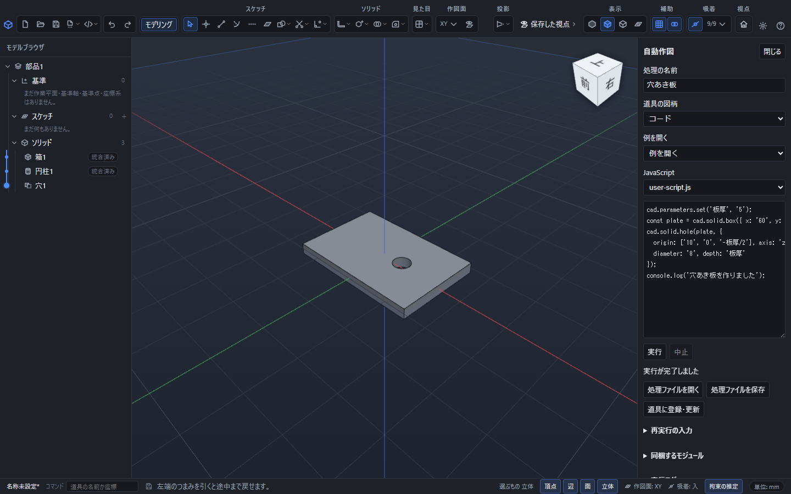
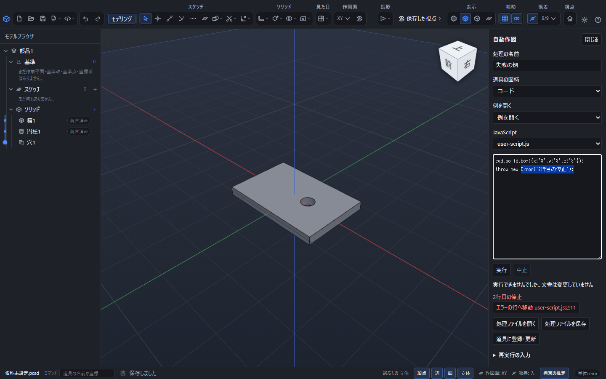

# JavaScriptで自動作図する

同じ形を繰り返し作る、寸法の式をまとめて設定する、といった操作をJavaScriptで実行します。作った点・線・面・立体は通常の部品履歴に残り、後から画面で編集できます。

## 最初の操作

1. 部品を開き、上のツールバーから「自動作図」の一覧を開いて「自動作図」を選びます。
2. 右のプロパティ領域で「例を開く」から「穴あき板」を選びます。
3. 名前とJavaScriptを確認し、「実行」を押します。Ctrl+Enterでも実行できます。
4. 「実行が完了しました」と表示されたら、画面の板と穴を確認します。「閉じる」またはEscで通常のプロパティへ戻ります。
5. 「元に戻す」1回で、この実行による全変更を取り消せます。「やり直す」で戻せます。

例の板は60×40×5mm、穴径8mmです。`板厚`パラメータを変更すると、板の厚みと穴の深さが追従します。詳しいコードは[APIの説明](script-api.md)を参照してください。

## 編集と中止

「JavaScript」の欄にコードを入力します。Enterは改行、Tabは「実行」ボタンへの移動、Shift+Tabは前の欄への移動です。字下げには空白を入力します。Ctrl+Enterが実行、Escが中止してパネルを閉じる操作です。編集中のコードはパネルを閉じても現在のアプリ内に残ります。アプリを終了する前には[処理ファイルを保存](script-tools.md)してください。

実行中は「中止」を押せます。途中まで作れた形も含め、処理全体が成功したときだけ文書へ反映します。実行中に部品を編集したり、別の文書へ移動したり、コード・単位・履歴の位置を変更した場合は、その実行結果を捨てます。現在の内容を確認して再実行してください。

履歴を途中へ戻した状態での実行も、通常の作図と同じ位置へ追加します。依存関係が成立しない形や閉じていない輪郭は、反映前に失敗として表示します。組立文書・図面文書への直接作図APIはありません。

## エラーとログ

エラーには理由と、取得できたファイル名・行・列が表示されます。「エラーの行へ移動」を押すと、対象のJavaScriptまたは同梱モジュールを開いて該当行を選択します。読込前の形式エラーなど、コード上の位置がないエラーには行番号を付けません。

`console.log()`、`console.info()`、`console.warn()`、`console.error()`は「実行ログ」に表示します。成功時はAPI版、ソースのSHA-256、乱数の種、入力時刻、命令数と処理時間も記録します。

## 再現可能な入力

「再実行の入力」で乱数の種とUTC時刻を指定します。時刻は1970年1月1日00:00:00.000から2554年7月21日23:34:33.709までのUTCを指定できます。`Math.random()`は指定した種から生成し、`Date`は指定時刻を使います。現時刻を使う場合は「現在時刻を入れる」を押してください。同じ文書・コード・モジュール・種・時刻を入力すると同じ命令列になります。実行結果を追加した後の文書は入力が変わるため、同じ形の追加作成になります。

## 使用できる範囲と上限

処理は専用の隔離実行器で動作します。ブラウザーの画面、ファイルシステム、Electron、ネットワーク、外部パッケージは使用できません。`fetch`、`WebSocket`、`require`などはありません。`import`できるのは処理ファイルに同梱したローカルモジュールだけです。

| 項目 | 上限 |
|---|---|
| コードと同梱モジュールのUTF-8合計 | 1MiB |
| 同梱モジュール | 32個 |
| JavaScript処理時間 | 5秒 |
| 読込・JavaScript・形状計算を含む実行全体 | 30秒 |
| 実行器のメモリ／スタック | 64MiB／128KiB |
| CAD命令数／命令列 | 1000件／8MiB |
| ログ | 1000行、合計1MiB |

上限を超えた処理は、コード内で例外を捕捉しても文書へ反映しません。形状計算の中断できない区間では後片付けに時間がかかる場合がありますが、中止後の結果を文書へ適用しません。

## 関連項目

- [使えるAPIと全引数](script-api.md)
- [保存・道具の登録・モジュール](script-tools.md)
- [パラメータを使う](parameters.md)
