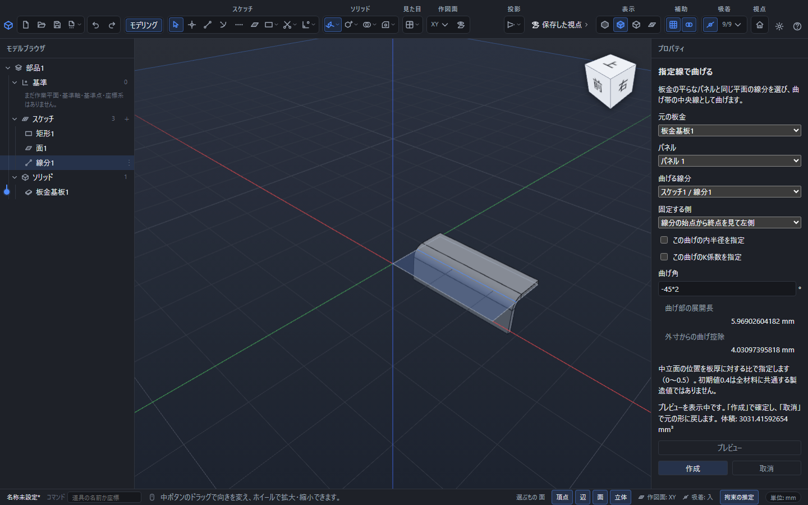
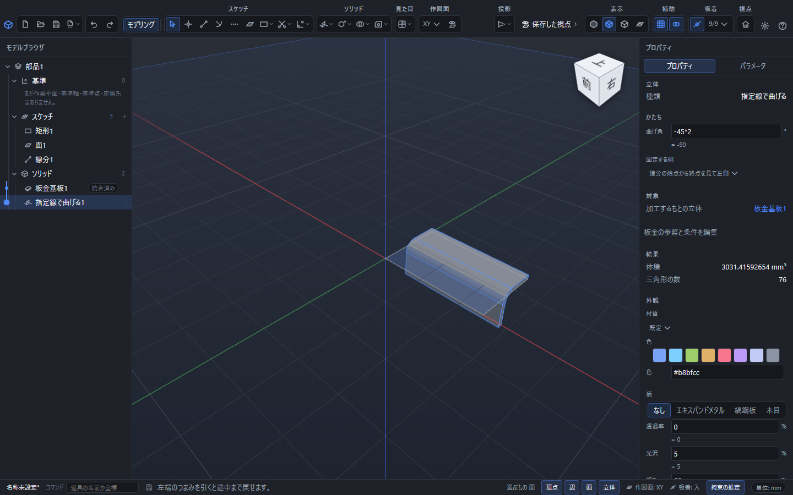
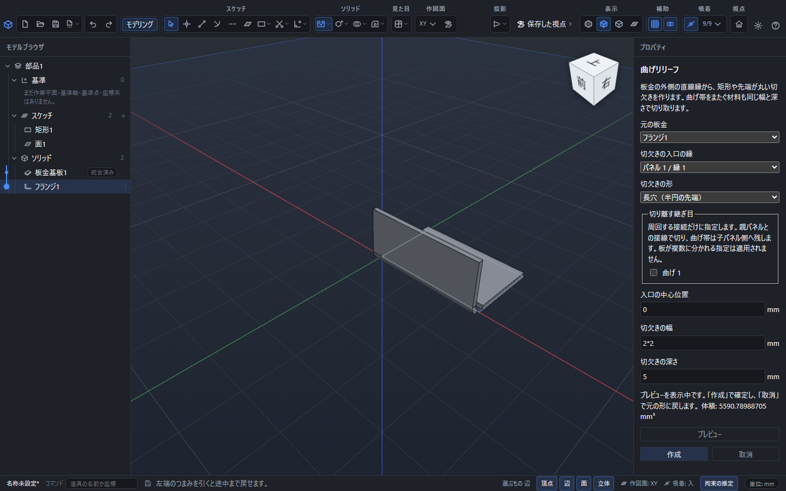
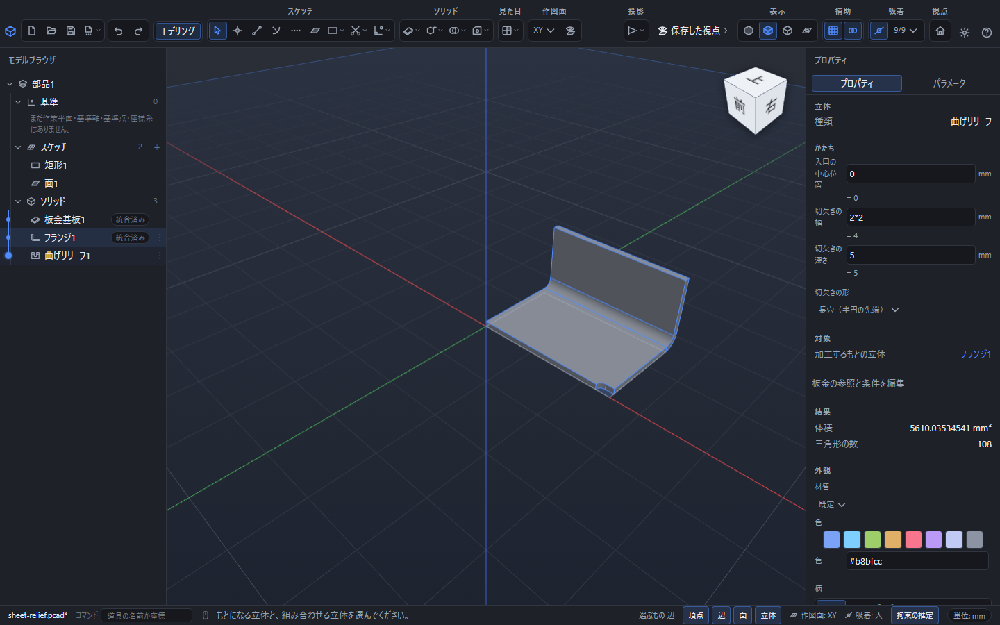

# 指定線で板を曲げる・曲げリリーフを作る

すでにある平板を線に沿って曲げる場合は「指定線で曲げる」を使います。曲げの端などに逃げを設ける場合は「曲げリリーフ」を使います。縁に新しい板を足す操作は[フランジ](sheet-metal-flange.md)を参照してください。

## 指定線で曲げる

1. 板金基板を作り、曲げる平面パネルと同じ平面に線分をかきます。線分は曲げ帯の中央を指定します。
2. 線分または元の板金を選び、上部の「板金」から「指定線で曲げる」を開きます。
3. 「元の板金」「パネル」「曲げる線分」を選びます。
4. 「固定する側」と「曲げ角」を指定し、必要なら内半径とK係数をその曲げだけ変更します。
5. 「プレビュー」で確認し、「作成」で確定します。

線分は両端の間だけを切る工具ではなく、両端を通る直線として扱います。「固定する側」の左右は、線分の始点から終点を見る向きが基準です。向きが分かりにくい場合はプレビューを表示して確認します。角度の正負で曲がる方向を反転できます。

## 曲げ帯と動く範囲

指定線の左右へ、曲げ部の展開長の半分ずつを取ります。たとえば板厚2mm、内半径3mm、K係数0.4、90°なら、指定線から左右約2.984513mmの間が曲げ帯です。その外の平らな部分のうち、指定した側が固定され、反対側が回ります。

移動する側に既存のフランジなどがつながっている場合は、それらも一緒に移動します。新しい曲げ帯が既存の接続を横切る場合や、固定する側へつながって一意に動かせない場合は、理由を示して適用しません。曲げる線や半径を変更してください。

穴や切欠きが曲げ帯を分けている場合も、残った材料を使います。元の板厚を変更すると曲げ帯の幅も変わるため、近くの穴や既存の曲げとの位置関係を確認してください。

## 矩形・長穴の曲げリリーフ

1. 元の板金を選び、上部の「板金」から「曲げリリーフ」を開きます。
2. 「切欠きの入口の縁」で、外側の直線縁を選びます。立体の直線稜線を選んで指定することもできます。
3. 「切欠きの形」を「矩形」または「長穴（半円の先端）」から選びます。
4. 「入口の中心位置」「切欠きの幅」「切欠きの深さ」を入力します。
5. 閉じた周回の板金では「切り離す継ぎ目」も指定します。
6. 「プレビュー」で確認し、「作成」で確定します。

| 欄 | 測るところ |
|---|---|
| 入口の中心位置 | 縁の始端から切欠きの中心まで。縁の端の角にも置けます |
| 切欠きの幅 | 縁に沿った幅。初期値は板厚です |
| 切欠きの深さ | 縁から板内へ進む総深さ。初期値は内半径＋板厚です |

縁の始端は、板の表側から外周を反時計回りにたどる向きで決まります。長穴の深さには半円の先端も含まれ、幅の半分以上が必要です。初期値は加工できる最小値を保証するものではなく、製造条件に合わせて変更します。

切欠きは展開面上の幅と深さで作り、つながっている平面や曲げ帯へ続きます。指定した継ぎ目を飛び越えて離れた材料を削ることはありません。切欠きによって材料がなくなる、分離するなどの場合は確定されません。

## 再編集・取消・保存

確定後に左の一覧から曲げやリリーフを選ぶと、右側で角度や寸法の式を編集できます。「板金の参照と条件を編集」では、線分、固定する側、切欠きの縁、形、継ぎ目を選び直せます。

変更中のプレビューは「変更を適用」で確定し、「取消」またはEscで元へ戻します。確定した変更は「元に戻す」で戻せます。計算中の「取消」は中止の操作です。

式と参照を残す部品は.pcadで保存します。展開を見直すときは[固定面・継ぎ目・展開図](sheet-metal-flat.md)へ進んでください。板金の操作欄でF1を押すとこの説明を開けます。
