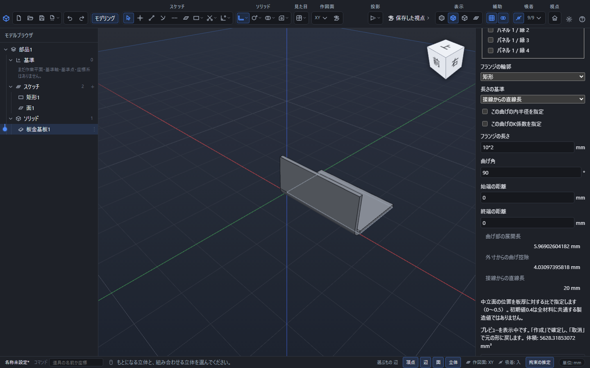
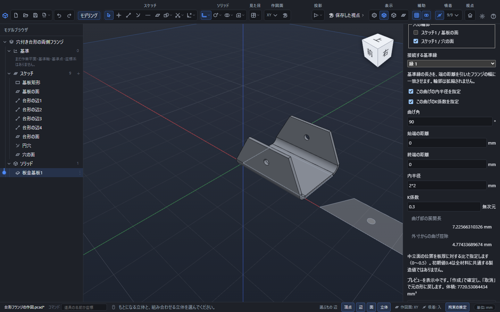

# 板金の縁からフランジを作る

フランジは、既存の板の直線縁に曲げと平らな部分を追加する操作です。まず[板金基板](sheet-metal.md)を作成します。

## 矩形のフランジ

1. 元の板金を選び、上部の「板金」から「フランジ」を開きます。
2. 「元の板金」を確認し、「曲げる縁」で必要な直線縁を選びます。複数選ぶと同じ条件でまとめて追加します。
3. 「フランジの輪郭」は「矩形」を選びます。
4. 「フランジの長さ」「曲げ角」「始端の距離」「終端の距離」を入力し、「長さの基準」を指定します。
5. 「プレビュー」で形と体積を確認し、「作成」で確定します。取消やEscでは元の板金へ戻ります。

立体の直線稜線を選んでから道具を開くことも、道具を開いた後で選ぶこともできます。同じ場所に複数の縁が重なって特定できない場合は、パネルと縁の一覧で明示してください。曲線の縁や、すでに曲げが付いている接線は選べません。

## 長さの3つの基準

| 基準 | 長さを測るところ |
|---|---|
| 接線からの直線長 | 曲げが終わって直線になる位置から先端まで |
| 外側の仮想交点まで | 板の外側の2直線を延ばして交わる点から先端まで |
| 内側の仮想交点まで | 板の内側の2直線を延ばして交わる点から先端まで |

板厚2mm、内半径3mm、90°のとき、長さ30mmを「外側の仮想交点まで」で指定すると、接線からの直線長は25mmです。「内側の仮想交点まで」なら27mm、「接線からの直線長」なら30mmになります。入力欄の下の換算値で確認できます。

仮想交点までの長さが曲げ部分より短いと、平らな部分を残せないため作成できません。長さを増やすか、半径や基準を見直してください。

## 曲げ方向と端の距離

曲げ角は平板から曲げる量です。正負を変えると曲がる方向が変わります。初期値は90°で、0°では同じ平面に延長します。正負が意図どおりかプレビューで確認してください。

「始端の距離」「終端の距離」は、選んだ縁の両端からフランジを短くする量です。0以上の値を指定し、両端を差し引いて幅が残るようにします。縁は板の表側から反時計回りにたどる向きが基準です。幅全体を使う場合は両方0にします。

内半径とK係数は基板から継承します。曲げごとに変えたいときは、それぞれの「この曲げの…を指定」を入れます。K係数の意味は[基板と曲げ条件](sheet-metal.md)を参照してください。

## スケッチの任意輪郭

「フランジの輪郭」を「スケッチの任意輪郭」にすると、台形や曲線を含む輪郭を使えます。先に閉じた輪郭へ面を張り、必要な穴もそれぞれ面として用意します。

「フランジの外周」「接続する基準縁」「穴の輪郭」を選びます。基準縁には直線を1本指定し、その長さを元の縁から始端・終端の距離を引いた幅に一致させます。輪郭が自動で拡大・縮小されることはありません。任意輪郭では、フランジの長さはスケッチの寸法で決まります。

輪郭の基準縁が違う、幅が合わない、穴や輪郭が不正な場合は説明が出ます。参照を選び直すか元のスケッチを直してください。

## 編集と保存

左の一覧でフランジを選ぶと、右側で長さ・角度・端の距離の式を編集できます。「板金の参照と条件を編集」では元の板金、縁、輪郭、穴、条件の上書きを変更します。不要な参照が残っている場合は明示して解除します。

変更後の形が元の板へ食い込む、離れてつながらない、幅がなくなる場合は確定されません。元の形を確認しながら条件を変えます。複数縁の同時作成も「元に戻す」1回で戻せます。

編集を続ける部品は.pcadで保存します。平板の型紙や製造図へ進む場合は[展開・書き出し](sheet-metal-flat.md)を参照してください。
