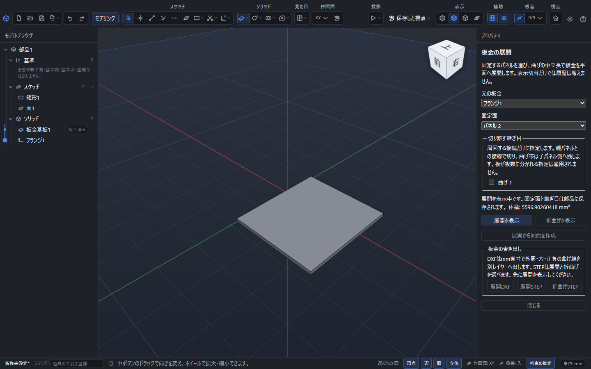
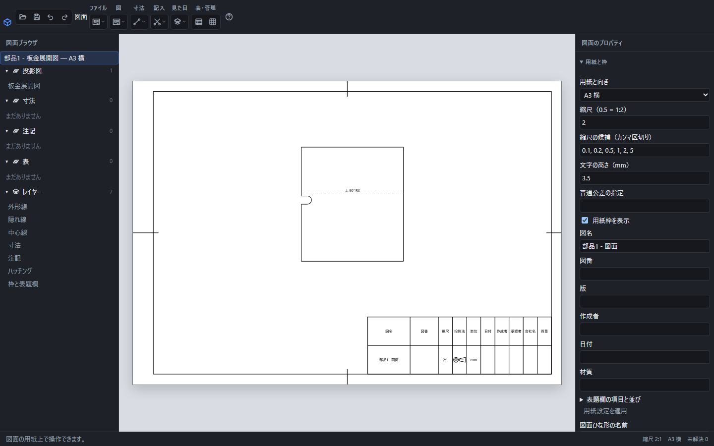

# 板金を展開し、穴表・図面・加工用ファイルを作る

板金の「展開」は、曲げた部品を平らな板へ開いた形です。固定面と継ぎ目を明示して、曲げ部をK係数に応じた長さへ伸ばします。

## 固定面と表示切替

1. 部品の板金を選び、上部の「板金」から「板金の展開」を開きます。
2. 「元の板金」で展開する操作を選びます。履歴の途中の板金も選べます。
3. 「固定面」で基準にするパネルを選びます。
4. 周回する接続がある場合は「切り離す継ぎ目」を選びます。
5. 「展開を表示」を押します。成功すると体積と展開中の案内が出ます。

「折曲げを表示」で元の立体へ戻り、「展開を表示」で再び開けます。表示の切替だけでは履歴を増やしません。固定面や継ぎ目を変えた場合は部品へ保存され、「元に戻す」で戻せます。失敗や取消では変更した展開条件を確定しません。

固定面を変えると、展開面上の向きと原点も変わります。展開の寸法、穴の位置、切断する輪郭は同じ材料を表します。固定面にしたパネルがなくなった場合は、残っているパネルから選び直してください。

## 継ぎ目の意味

閉じた周回を開く場合だけ、切り離す曲げを指定します。切断位置は親パネルと曲げ部が接する接線です。曲げ部はその全長を子パネル側に残します。継ぎ目を選びすぎて板が複数に分かれる指定は適用されません。

切欠きで曲げの接続が分割された場合も、選んだ継ぎ目との対応を追跡します。なくなった参照を推測で別の曲げへ置き換えません。参照を見つけられないときは、画面で解除して必要な継ぎ目を選び直します。

展開したパネルが互いに重なる場合は作成できません。元の曲げ位置・角度・長さ、固定面と継ぎ目を見直してください。

## 曲げ指示付きの展開図

展開を表示した状態で「展開から図面を作成」を押します。展開面を上から見た図が新しい図面に入り、図面の[用紙と縮尺](drawing-scale.md)、[寸法](dimension.md)、[注記](drawing-note.md)、[表題欄](drawing-table.md)を使用できます。

曲げ線には「上」「下」、曲げ角、内半径Rを表示します。穴や切欠きの内側へ曲げ線を延ばしません。図の位置や縮尺を変えても角度とRの数値は変わらず、文字の高さは用紙の指定値を使います。裏面から見る図では上・下が反転します。斜視や側面の図には同じ上下指示を付けません。

元の板金を編集した場合は、その部品を.pcadで保存し、図面の「元の部品・組立を取り込み直す」で読み直します。展開条件と新しい板金から図が更新されます。更新は「元に戻す」で戻せます。

## 展開面の穴表

図面の「表題欄と表」で「穴表」を選び、「穴の座標を測る図」を指定します。「穴座標の基準点（展開面のmm）」のX・Y・Zを入力して「表を配置」を押します。展開図では、基準点は曲げる前の元部品座標ではなく、表示に使っている展開面の座標です。

表には円形の内周から記号、X・Y、直径、貫通を記入し、図中の穴へ同じ記号の引出線を付けます。同じ径はA1・A2のように分類されます。長穴や不規則な内周に、円の直径を割り当てることはありません。

「表を更新」で基準点を変更すると座標が変わり、「元に戻す」で元へ戻せます。元の穴位置を変更して部品を取り込み直すと、表と引出線も追従します。表へ数値を直接上書きする操作ではありません。

図面を.pcaddで保存すると、元の部品と展開条件、表の基準点も一緒に保持され、開き直すと穴表を求め直します。

## DXF・STEPで渡す

部品の「板金の展開」で展開を表示すると、「板金の書き出し」を使えます。保存ダイアログでは用途が分かる名前を付けます。

| 操作 | 内容 |
|---|---|
| 展開DXF | 展開した外周・穴・曲げ線。mmの実寸 |
| 展開STEP | 平らに展開した板厚付きの形 |
| 折曲げSTEP | 元の曲げた板厚付きの形 |

展開DXFは、外周を`CUT_OUTER`、穴を`CUT_HOLES`、上向きの曲げを`BEND_UP`、下向きの曲げを`BEND_DOWN`のレイヤーへ分けます。曲げ部の両端にある接線を切断する線として出しません。円弧は円弧で保持し、その他の曲線を分割して出す場合は0.001mmを基準とします。

加工先へ渡す際は、どのレイヤーを切断・曲げに使うかを相手と合わせてください。STEPやDXFにはPointerCADの式と履歴を引き継ぐ目的はないため、編集元の.pcadも残します。

## PDF・SVG・画像・印刷

寸法、曲げ指示、穴表を含む用紙は、図面側の「図面を書き出す」からPDF・SVG・画像へ出せます。図面の縮尺と用紙を確認し、印刷ではプリンター側の用紙合わせや拡大縮小も確認します。詳しくは[図面の保存・書き出し・印刷](drawing-export.md)を参照してください。

加工用の実寸輪郭が目的なら「展開DXF」、用紙・表題欄・寸法を含む配布図が目的なら図面の書き出しを使います。リリーフ、参照、図、寸法などに未解決の箇所があれば、先に理由を確認して修正してください。
