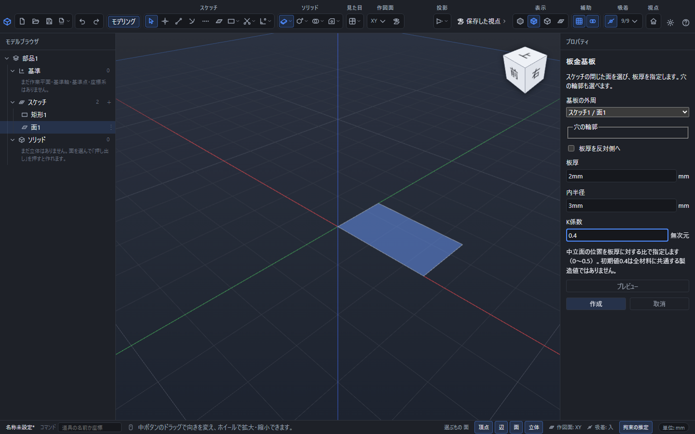
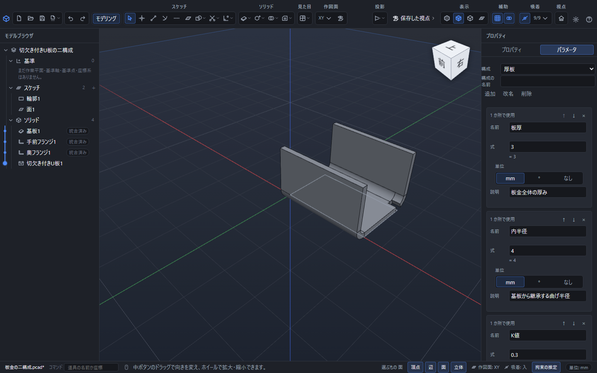

# 板金の基板と曲げ条件を作る

板金は、同じ厚さの板を曲げて作る部品です。PointerCADではスケッチの面から基板を作り、縁のフランジや指定線の曲げを追加します。曲げた形と平らな展開を切り替え、寸法や曲げ指示を付けた図面へ渡せます。

この章はアプリ内ヘルプと取扱説明書の共通の本文です。操作別には[フランジ](sheet-metal-flange.md)、[指定線曲げと切欠き](sheet-metal-bend-relief.md)、[展開・穴表・書き出し](sheet-metal-flat.md)を参照してください。

## 最初の基板を作る

1. 部品のスケッチで、矩形などの閉じた輪郭をかきます。
2. 輪郭を選び、「面」で面を張ります。穴を設ける場合は、外周の内側に円などをかき、それぞれ別の面を張ります。
3. 基板の外周にする面を選び、上部の「板金」から「板金基板」を開きます。道具を開いた後で一覧から選ぶこともできます。
4. 「基板の外周」と「穴の輪郭」を確認し、「板厚」「内半径」「K係数」を入力します。
5. 「プレビュー」で形を確認し、「作成」で確定します。「取消」またはEscでは基板を追加しません。

穴の輪郭を外周と同じ面に指定したり、同じ穴を重複して選んだりしないでください。穴は板を貫く内側の輪郭になります。開いた輪郭、自己交差、同じ平面にない輪郭は修正してから作成します。

板厚は基板の面から片側へ付きます。「板厚を反対側へ」で向きを反転できます。作った後の基板とその後の曲げでは、同じ板厚を使います。

## 板厚・内半径・K係数

| 欄 | 意味 | 初期値と入力範囲 |
|---|---|---|
| 板厚 | 板全体の厚さ | 1mm、正の長さ |
| 内半径 | 曲がった部分の内側の半径 | 1mm、正の長さ |
| K係数 | 内側から中立面までの距離を板厚で割った値 | 0.4、0〜0.5 |

K係数は、曲げた部分をどの長さへ展開するかを決めます。初期値0.4はすべての材料に共通する製造値ではありません。材質、板厚、曲げ方などに合わせて、加工先で使用する値を入力してください。

長さの欄には「2mm」「1/8in」「板厚*2」のように単位や式を使えます。単位を省略した新しい入力は現在のmm/in設定に従います。K係数は無次元、曲げ角は度の値なので、mmやinを付けません。再編集では元の式を保持します。[数値と式](numeric-input.md)・[パラメータ](parameters.md)も参照してください。

## 曲げの長さを読む

曲げた部分には、平らなパネルとは別に展開長があります。曲げ角をラジアンで表すと、曲げ部の展開長は `|角度| × (内半径 + K係数 × 板厚)` です。

板厚2mm、内半径3mm、K係数0.4、90°の例では、曲げ部の展開長は約5.969026mmです。両側の直線部分が50mmと30mmなら、全展開長は約85.969026mmになります。

フランジや指定線曲げの入力中は「曲げ寸法の換算」で曲げ部の展開長と外寸からの曲げ控除を確認できます。矩形フランジでは、選んだ長さの基準から換算した接線直線長も表示します。曲げた形の体積と展開板の体積は、K係数の指定によって異なります。

## 条件を継承する・曲げごとに変える

後から作るフランジと指定線曲げは、基板の内半径とK係数を使います。「この曲げの内半径を指定」「この曲げのK係数を指定」を入れると、その曲げだけ別の値にできます。チェックを外すと基板の値へ戻ります。

フランジでK係数だけを変更した場合、曲げた外形は同じで、展開長が変わります。指定線曲げでは元の平板から曲げ帯を取り分けるため、K係数を変えると帯幅と移動する側の位置も変わります。

## 寸法違いを構成に保存する

同じ形の板厚や曲げ半径を変えた案は、[パラメータの構成](parameters.md)として同じ部品へ保存できます。

1. 右の「パラメータ」タブで「板厚」「内半径」「K値」「腕長」などの名前を作ります。板厚・半径・長さの単位はmm、K値は「なし」にします。
2. 基板の「板厚」「内半径」「K係数」の欄へ対応する名前を入力します。フランジの長さにも「腕長」のように名前を入力します。
3. パラメータの表で現在の値を確認し、構成に名前を付けて追加します。選択中の構成で値を編集し、別の寸法の案を作ります。
4. 「構成」の一覧で切り替えます。計算が終わると、基板から継承する曲げと後続の切欠きまで形が更新されます。
5. 「板金の展開」で展開長を確認し、編集用の.pcadを保存します。選択中の構成と、各構成の式が残ります。

構成の切替は「元に戻す」1回で戻せます。曲げごとに半径やK係数を上書きしている場合、その曲げは上書きした値を使います。全ての曲げを基板の条件へ追従させるときは、その曲げの上書きを解除してください。

## 作成済みの板金を編集する

左の一覧で基板・フランジ・指定線曲げ・曲げリリーフを選ぶと、右側で式を編集できます。面や縁などの参照を変えるときは「板金の参照と条件を編集」を開きます。作成時と同じ欄で選び直し、「プレビュー」で後続の形まで確かめてから「変更を適用」を押します。

元の形へ戻すときは「取消」またはEscを使います。確定した一連の変更は「元に戻す」1回で戻せます。抑制中の操作を形状付きで再編集するには、先に抑制を解除します。元の面や縁がなくなった場合は理由が表示されるので、必要な参照を選び直してください。

編集用には部品を.pcadで保存します。作成した板金の順序、式、曲げ条件、展開の固定面と継ぎ目が残ります。DXFやSTEPは受渡し用なので、再編集を続けるための.pcadも保存してください。

## 対応する形

一定厚の平面パネル、直線を軸とした円筒状の曲げ、矩形またはスケッチ輪郭のフランジ、円などの穴、矩形・長穴の切欠きを扱います。曲げ角0°は平板です。角度は−180°より大きく180°未満を指定します。

二重に湾曲する絞り形状や、加工後に穴がどの程度変形するかを求める成形解析は扱いません。形が成立しても、実加工の最小半径や工具への適合を自動保証するものではありません。

板金の操作欄でF1を押すと対応する説明を開けます。計算中は「取消」で中止できます。失敗した場合は理由を確認し、元の板を残したまま条件を直してください。
