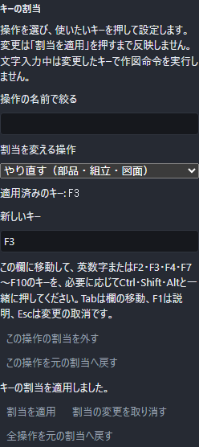

# ショートカット一覧

よく使う操作にキーを割り当てると、メニューを開かずに同じ操作を始められます。画面内のこの一覧には、現在設定しているキーが表示されます。

図はやり直す操作にF3を適用した例です。元に戻す操作をF2へ設定した後、やり直す操作をF3へ設定しています。

## キーを変更する

1. 上端の「設定」を開き、「{{ui:settings.shortcuts.title}}」まで移動します。
2. 「{{ui:settings.shortcuts.search}}」へ操作名を入力し、「{{ui:settings.shortcuts.command}}」から変更したい操作を選びます。
3. 「{{ui:settings.shortcuts.capture}}」の欄を選び、使いたいキーの組合せを押します。文字・数字やF2・F3・F4・F7〜F10に、必要に応じてCtrl/Cmd・Shift・Altを組み合わせられます。
4. 「{{ui:settings.shortcuts.apply}}」を押します。変更後は、古いキーではなく新しいキーで操作が始まります。

二つの操作のキーを交換するときは、両方を変更してから「{{ui:settings.shortcuts.apply}}」を押します。片方だけ変更した段階で重複していても、もう片方の編集を続けられます。重複が残っている間は適用できず、ぶつかっている操作名が表示されます。

入力中にF1を押すとこの説明を開きます。Tabは次の欄へ進み、Escは変更案を取り消します。「{{ui:settings.shortcuts.cancel}}」も、まだ適用していない変更だけを捨てます。適用前に別の場所でキー設定が変わったときは、古い変更案で上書きしません。取り消して、現在の設定から変更し直してください。

## 割当を外す・元へ戻す

「{{ui:settings.shortcuts.remove}}」を選んで適用すると、その操作にキーを割り当てない状態になります。操作自体はボタンやメニューから使えます。「{{ui:settings.shortcuts.restoreOne}}」は選択中の操作だけを、「{{ui:settings.shortcuts.restoreAll}}」はキー設定全体を元へ戻します。どちらも「{{ui:settings.shortcuts.apply}}」するまで現在のキーは変わりません。

設定は使用中のブラウザーまたはデスクトップアプリに残り、次回の起動にも引き継がれます。作図した形、入力途中の式、保存ファイル、元に戻す履歴は変更しません。他の端末へ作図ファイルを渡しても、渡した相手のキー設定は変わりません。

## 変更できないキー

F1のヘルプ、Ctrl/Cmd+Sの保存、入力確定や取消などの基本操作は固定です。ブラウザーを閉じる、再読込みする、アドレス欄へ移るなどのキーも割り当てられません。使用できない組合せには理由が表示されます。日本語変換中やAltGrによる文字入力を、割当キーとして記録することもできません。

## 現在の一覧

<!-- pointercad:current-shortcuts -->

## 入力中の扱い

自分で割り当てたキーは、文字入力・日本語変換・メニュー選択中には作図操作を始めません。入力欄では、文字の編集に使うUndo・Redo、数字、Space、Enter、Delete、Backspaceをそのまま使えます。既定の保存・名前を付けて保存・開く・新規は入力欄でも使えます。モーダル画面の中ではF1だけが共通操作として働き、ほかのキーはその画面へ渡します。

## 文書による違い

図面ではUndo・RedoにCtrlまたはCmdを使えます。部品と組立の現行割当はCtrlだけです。`1`～`4`とSpaceは部品・組立で使い、図面では図面固有のEnter、Delete、Backspace、Escを使います。

割り当てた操作が現在の画面に対応していないときは、何も作りません。対象の面や辺が必要な道具では、ボタンから始めた場合と同じように、選ぶものの案内を確認して操作を続けてください。
