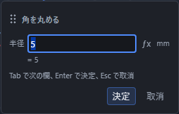
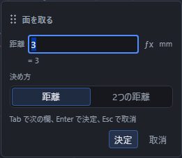

# 線の角を丸める・面取りする

かいた線と線が作る角を、**丸める(フィレット)**か**斜めに切り落とす(面取り)**ことができます。

道具は「作図」の隣、**編集**の一覧にある「フィレット」と「面取り」です。

立体の辺を丸める・面を取る道具は別にあります(「角を丸める・面を取る」を参照)。こちらは**スケッチの線**が対象です。

## 角を丸める(フィレット)

1. **編集**の一覧から「フィレット」を選びます。
2. 丸めたい角(線と線が端でつながっている所)にマウスを乗せます。**丸めたあとの形が薄く表示されます。**
3. クリックすると、その 2 本が選ばれて小さな入力欄が出ます。
4. 半径(既定 5mm)を入れて Enter。角が円弧で丸まります。

   

5. 道具はそのまま残るので、続けて別の角にマウスを乗せてクリックすれば何か所でも丸められます。終わるときは Esc を押すか、別の道具を選びます。

半径は式でも入れられます(たとえば `10/2`)。

丸めると、角を作っていた 2 本の線は円弧との接点まで短くなり、そのあいだに円弧が 1 本増えます。モデルブラウザにも「円弧1」のような行が 1 行増えます。

先に 2 本の線を選んでおいてから「フィレット」を押しても同じことができます。その場合はクリックせずにすぐ入力欄が出ます。

## 角を面取りする

1. **編集**の一覧から「面取り」を選びます。
2. 面取りしたい角にマウスを乗せます。**切り落とされる形が薄く表示されます。**
3. クリックして、距離(既定 3mm)を入れて Enter。

   

「決め方」で **距離**(等距離)と **2つの距離** を切り替えられます。

| 決め方 | 出る欄 | 意味 |
|---|---|---|
| 距離 | 距離 | 2 本とも同じ長さだけ削ります |
| 2つの距離 | 距離・距離2 | 1 本目・2 本目を別々の長さだけ削ります |

「1 本目」は先にクリック(または先に選択)した線です。仕上がりが左右逆になったときは、2 つの値を入れ替えるか、Ctrl+Z で戻して逆の順に選び直してください。

面取りすると、2 本の線が短くなり、そのあいだを結ぶ線分が 1 本増えます。

## 丸められないとき

マウスを乗せても薄い形が出ないときは、そこを丸められません。クリックすると画面の下の帯に理由が出ます。

| 帯に出る言葉 | どうすればよいか |
|---|---|
| ここには角がありません | 線と線が端でつながっている所へマウスを乗せます。少し離れた 2 本は、先にトリム・延長でつなげてください |
| 2 本の線が端点でつながっていません | 同上。見た目が近くても端が離れていると角になりません |
| 2 本が一直線または重なっているため、丸める角がありません | 一直線に続く 2 本には丸める角がありません |
| 丸め・面取りができるのは、2 本の線分が作る角だけです | 円弧・楕円・スプライン・オフセットの結果を含む角は、まだ丸められません |
| 半径・距離が線の長さに収まりません | 半径や距離を小さくします。短いほうの線に収まる大きさが必要です |
| 作図面が違う 2 本では角を作れません | 同じ作図面にかいた 2 本を選びます |
| この角を使っている面の境界をつなげられません | 面の同じ閉じた輪郭で隣り合う 2 本を選びます。片方だけを使う別の面がある場合や、輪郭がすでに閉じていない場合は加工できません。線と面は変更されません |
| 面の後に「直前の点」を基準にした図形があるため、角を加工できません | その図形の座標入力で、基準を特定の点や絶対座標に変えてから試します。基準の点が意図せず動くのを防ぐため、加工前の状態を保ちます |

加工できないときは線と面を変更せず、理由を表示します。加工した結果を元に戻すには、Ctrl+Z を 1 回押します。

線の終点をその線の始点から指定するなど、同じ図形の中だけで使う「直前の点」は、そのまま利用できます。

## 矩形・正多角形・長穴の角を丸めたとき

矩形・正多角形・長穴は、ふだんは「1 つの図形」として扱われますが、**その角を丸めると、線分と円弧に分かれます。** モデルブラウザの並びも「矩形1」1 行から「線分1」「線分2」…の複数行に変わります。丸めた 1 か所だけを短くするために必要な変化です。元に戻したいときは Ctrl+Z を 1 回押せば、丸める前の図形に戻ります。

## 面を張ったあとに丸めたとき

丸めた 2 本の線を、すでに**面の境界**として使っていた場合は、増えた円弧を面の境界にも自動で追加します。面取りの場合も、増えた線分を自動で追加します。帯に「角の加工に合わせて面の境界も更新しました。」と出ます。

**面を張り直す必要はありません。** 元の面はそのまま残り、その面から作った押し出しなども新しい輪郭で再計算されます。Ctrl+Z を 1 回押すと、線と面の境界が一緒に加工前へ戻ります。

更新できるのは、2 本が同じ閉じた輪郭で隣り合っている場合です。穴の内外など複数の輪郭を 1 つの面の境界へ並べたものは対象外です。つなげられない面がある場合は、理由が表示され、線も面も加工前のまま残ります。

## 3D スケッチでも使えます

作図面を使わない 3D スケッチでも、線と線が作る角を丸め・面取りできます。丸めの円弧は、その 2 本が作る平面の上に置かれます。
