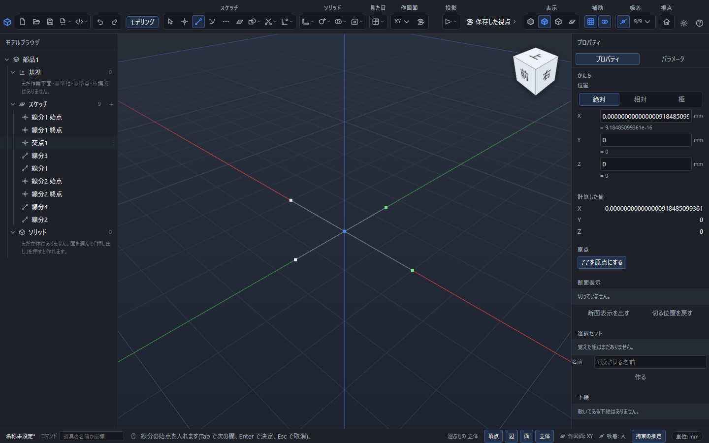
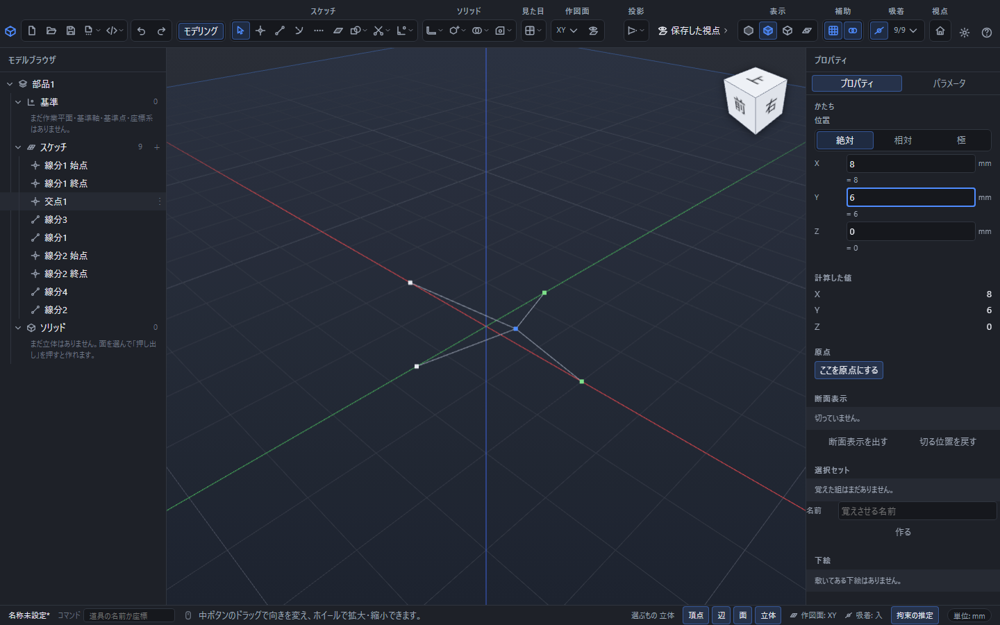
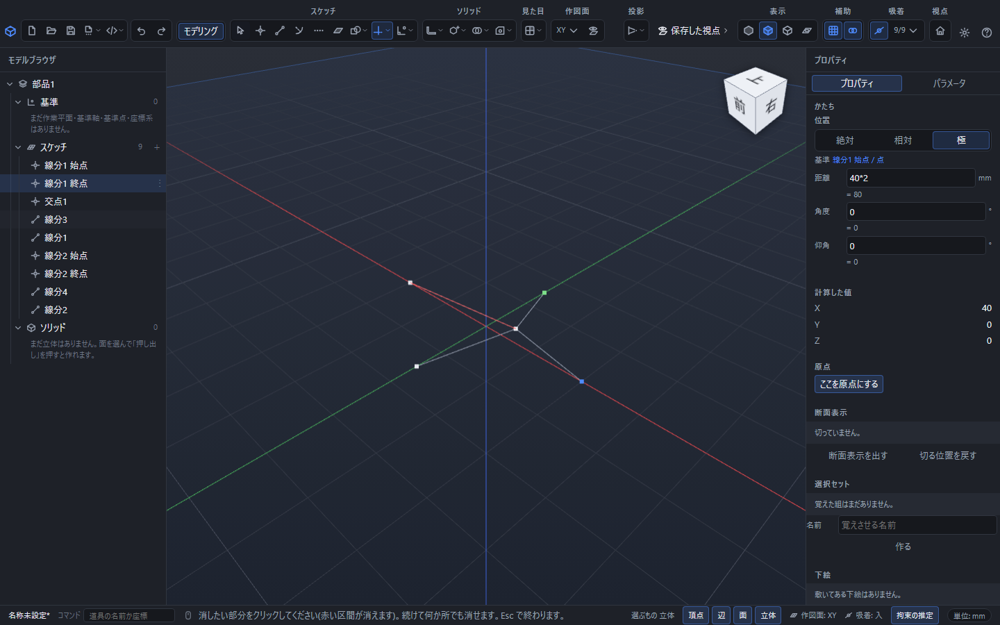

# 交点で線をつなぐ・曲げる・区間を消す

2本の線分が交わるところに点を作り、両方の線をその点で分けられます。交点を動かすと、つながっている区間が一緒に動くため、途中で曲がる線を作れます。

## 角度と長さを指定してつなぐ

1. 「スケッチ」の「線分」を選び、1本目の始点を指定します。既存の点への吸着、クリック、数値入力が使えます。
2. 終点の入力で「極」を選び、長さと角度を入れます。「交点でつなぐ」は最初から入になっています。
3. Enterで確定します。別の場所から2本目を引くときは「選択」に戻り、もう一度「線分」を選んで始点を指定します。
4. 2本目を確定すると、実際に交わった位置に「交点1」ができ、2本の線分は4区間になります。T字なら3区間になり、交点が複数あればそれぞれの位置で分かれます。

たとえばコマンド欄で `L` → `-40,0` → `@40*2<0` と入れると、長さ80mm、角度0度の線分になります。「選択」に戻して `L` → `0,-30` → `@30*2<90` と入れると、長さ60mm、角度90度の線分が交差します。各項目の後はEnterで確定します。

「交点でつなぐ」を切にすると、交わっていても2本を分けずに残します。この選択は続けて引く線にも引き継がれます。すでにある線を後からまとめて分割するボタンではなく、線分を新しく確定するときの設定です。

## 交点を動かして曲げる

1. 「選択」の道具へ戻ります。
2. ビューポートに見える交点の四角い点を、左ボタンでつかんで動かします。
3. ボタンを離すと位置が決まります。外側の端を保ったまま、同じ交点につながる区間が一緒に曲がります。

位置を正確に決めたいときは、左のモデルブラウザで「交点1」を選び、右のプロパティでX・Y・Zを直します。`4*3`のような式も使えます。式や拘束で位置が決まっていてつかめない場合は、プロパティで値を変更します。作図面のない3Dスケッチは、ドラッグではなくプロパティで位置を指定します。

交点は作成時の位置を持つ編集可能な点です。外側の端をあとで動かしても、元の2直線の交わる位置を探し直すことはありません。曲げた後も共有点の位置を維持します。

## はみ出した区間を消す

1. 「編集」の一覧から「トリム」を選びます。
2. 消したい区間にマウスを乗せ、赤く表示された範囲を確認します。
3. クリックすると、その区間だけが消えます。

「選択」で区間を選び、Deleteキーを押しても削除できます。交点の点を選んで削除すると、その点を使う線を計算できなくなるため、残したい線がある場合は区間を選んでください。消しすぎた場合はCtrl+Zを1回押すと戻ります。

## 元の式を直す・保存する

分割された線は通常の「線分」として一覧に並びます。元の始点と終点の指定は「線分1 始点」「線分1 終点」などの点に残ります。長さや角度の式を直すときは、その点を選んでください。上の例の`40*2`も計算結果の`80`へ置き換えずに残ります。

Ctrl+Sで部品を保存し、開き直しても共有点と各区間、元の式は残ります。線の作成と交点の分割はまとめて1回、ドラッグの確定と区間の削除はそれぞれ1回のCtrl+Zで取り消せます。

## つながらないとき

| 状況 | 対処・動作 |
|---|---|
| 平行、同じ線上の重なり、端同士が触れるだけ | 新しい分割は行いません。長さ0の線は作りません |
| 画面では交差して見えるが、高さが違う | 3D空間で本当に交わる必要があります。座標を確認します |
| 構築線、円弧、楕円、スプライン、矩形などの図形 | この自動接続の対象は通常の線分同士です。円弧などの不要区間には[トリム](edit-curves.md)を使います |
| 分割する線に拘束が付いている | 帯に理由が出て、今回の線の作成を確定しません。拘束が必要なら「交点でつなぐ」を切にし、分割したい場合は関連する拘束を確認して外します |
| ほかの形の参照を保てない | 帯に理由が出て変更を確定しません。作成済みの形はそのまま残ります |

[数値と式の入れ方](numeric-input.md) / [かいたものを直す](edit-sketch.md) / [オフセット・トリム・延長](edit-curves.md)
