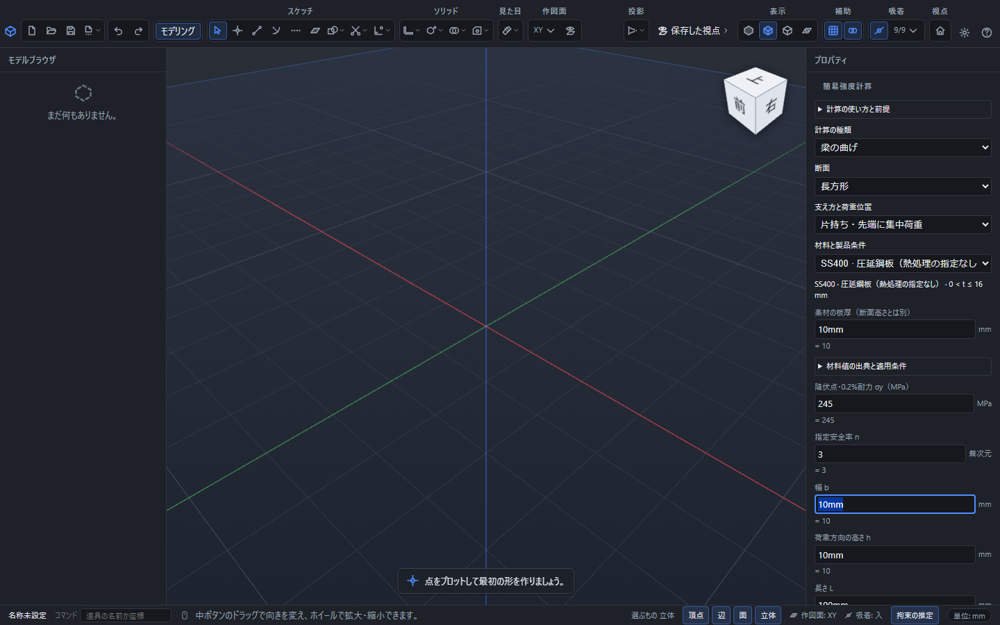
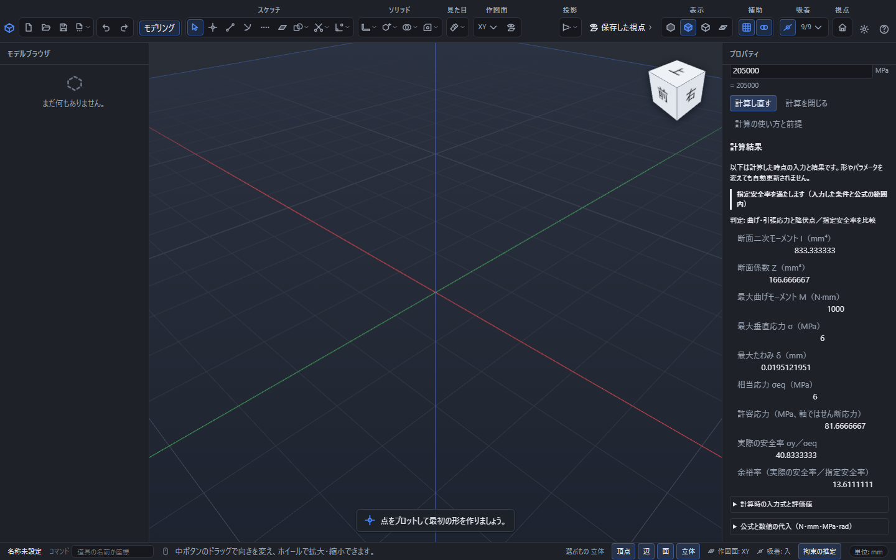
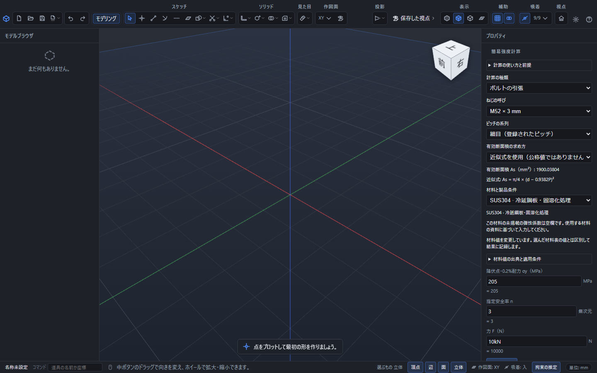
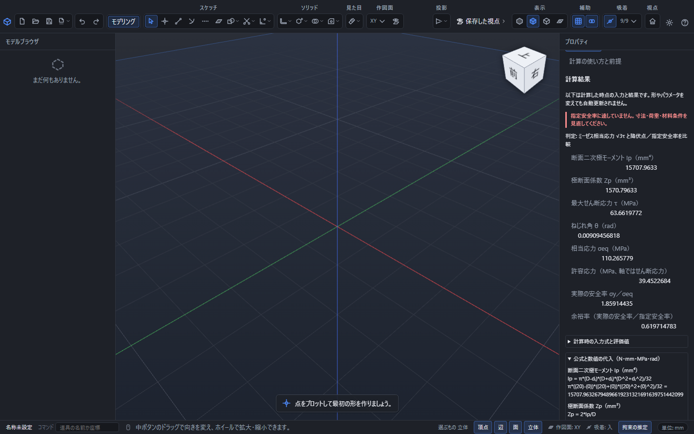

# 梁・軸・ボルトの簡易強度計算

「見た目」→「簡易強度計算」で、寸法・力・材料値を式で入力し、応力・たわみ・余裕率を調べられます。部品でもアセンブリでも、形状を作る前から使えます。パラメータは現在開いている文書の表を参照します。選択した立体から寸法や材料を自動取得する機能ではありません。

## 最初の計算

1. 「見た目」を開き、「簡易強度計算」を選びます。右のプロパティ区画に入力欄が開きます。
2. 「計算の種類」を「梁の曲げ」、「断面」を「長方形」、「支え方と荷重位置」を「片持ち・先端に集中荷重」にします。
3. 材料を「SS400・圧延鋼板・0 < t ≤ 16 mm」、素材の板厚を `10mm` にします。**素材の板厚は、切り出した断面の高さとは別の値です。**
4. 幅 `10mm`、荷重方向の高さ `10mm`、長さ `100mm`、力 `10N`、縦弾性係数 `205000` MPa、降伏点 `245` MPa、指定安全率 `3` を確認します。
5. 「計算する」を押すと、曲げモーメント `1000 N·mm`、曲げ応力 `6 MPa`、たわみ約 `0.019512195 mm`、実際の安全率約 `40.833333`、余裕率約 `13.611111` が出ます。
6. 「公式と数値の代入」を開くと、記号の公式と計算した数値の両方を確認できます。表示の端数を丸めた値で合否を判定することはありません。

右欄を下へスクロールすると「計算する」と結果が見えます。

## 梁・軸・ボルトの入力

| 計算 | 支え方と断面 | 入力 | 主な出力 |
|---|---|---|---|
| 梁の曲げ | 片持ちの先端荷重／両端支持の中央荷重。長方形・円・円筒 | 断面寸法、長さ、力、E、降伏点、指定安全率 | 最大曲げモーメント、断面係数、曲げ応力、最大たわみ |
| 軸のねじり | 中実円／中空円 | 外径、内径（中実は0）、長さ、トルク、G、降伏点、指定安全率 | 極断面係数、最大せん断応力、ねじれ角（rad） |
| ボルトの引張 | M2〜M64、登録された並目／細目ピッチ | 呼び、系列、有効断面積の求め方、軸力、降伏点、指定安全率 | 有効断面積、引張応力 |

長方形の「高さ h」は荷重で曲がる方向の寸法です。円筒の肉厚は外径の半分より小さく、軸の内径は外径より小さくしてください。零・負値・無限大・不正な式は、入力欄の理由を直すまで計算できません。

### 式と単位

長さの欄は開いた時点の表示単位で入力します。`10mm`、`1/2in` のように単位を明記できます。計算中にアプリの表示単位を切り替えても、その入力欄の単位は変わりません。閉じて開き直すと新しい表示単位になります。

力は N（`1/10 kN` も可）、応力・弾性係数は MPa（`205 GPa` も可）、トルクは N·mm（`100N*m` は `100000N·mm`）です。単位の付いた式では末尾の単位を式全体に適用します。パラメータ表の名前も使えます。長さ以外の入力では「単位なし」のパラメータを使い、mmや角度のパラメータを混ぜないでください。

## 材料の選び方

材料の表は、立体の色・質量に使う材質表とは別です。SS400の板厚区分、S45Cの焼ならし／焼入焼戻、SUS304の冷延・固溶化処理、A5052P-H34の確認した板厚範囲を分けています。「材料値の出典と適用条件」で、その表の値と掲載元を確認できます。

資料にない値は推測して補っていません。SUS304のG、A5052P-H34のE・Gは空欄になります。使用する材料の資料に基づいて入力してください。材料を切り替えると、前の材料の弾性係数が未掲載欄へ残ることはありません。材料値を変更した場合は「材料値を変更しています」と区別して表示します。「任意の材料値を入力」も選べます。

掲載元の抜粋と参考値を区別しています。規格全文・最新版への適合や、出典に記載のない温度条件は確認済みと扱っていません。

### ボルトの有効断面積

既定では出典で確認した**公称値**を使います。M10並目は `58 mm²` です。掲載値が未確認の組合せでは計算を止めます。「近似式を使用」を明示的に選ぶと `As = π/4 × (d − 0.9382P)²` で求めます。近似値と公称値は同じ数値にならないことがあります。

材料の降伏点はボルトの強度区分を自動選択するものではありません。実際に使用するボルトの資料に基づいて設定してください。締付けトルク、予荷重、接合部の荷重分担はこの引張計算に含みません。

## 安全率と結果の残り方

「指定安全率 n」は求めたい倍率です。「実際の安全率」は `降伏点／計算した相当応力`、「余裕率」は `実際の安全率／指定安全率` です。余裕率が1以上のとき、**入力した条件と公式の範囲内で**指定安全率を満たします。

軸のねじりはミーゼスの条件で相当応力 `√3τ` を計算します。軸の「許容応力」はせん断応力で、`降伏点／(√3 × 指定安全率)` です。梁とボルトの許容応力は `降伏点／指定安全率` です。

入力・パラメータ・形状を変えても、計算済みの結果は計算時点の値で残ります。「計算し直す」を押したときだけ更新します。「計算時の入力式と評価値」で元の条件を確認できます。Esc、「計算を閉じる」、またはメニューの「簡易強度計算」をもう一度押すと閉じます。新規作成・別文書の読込でも消えます。形状の履歴・保存ファイルには入りません。

一定断面・線形弾性・静荷重の公式です。大たわみ、座屈、疲労、応力集中、温度変化、複雑な拘束や荷重分布は扱いません。詳しい形状の解析には、[ファイルの書き出し](./export.md)でSTEPを書き出し、使用する解析ソフトへ読み込んで条件を設定します。

## STEPをFreeCAD FEM／CalculiXへ渡す

1. PointerCADの「書き出し」でSTEPを選び、対象の立体を保存します。強度計算の入力・荷重・材料条件はSTEPには入りません。
2. FreeCADでそのSTEPを開き、対象の立体と寸法を確認します。FEMワークベンチで解析を作成し、CalculiXを選びます。
3. 使用する材料のE・ポアソン比などを設定し、固定する面と力を加える面・方向・大きさを指定します。PointerCADの材料表が自動的に引き継がれるわけではありません。
4. 対象形状を選びGmshなどでメッシュを生成します。CalculiXの解析種類を静解析にし、実行します。新しい画面ではApply、旧画面ではWrite .inp File→Run CalculiXの順です。
5. 終了後に変位とミーゼス応力を確認します。表示上の変形倍率と実変位を区別し、必要に応じてメッシュを細かくして結果の変化を調べます。

操作名はFreeCADの版・表示言語で異なります。画面例は[FreeCAD公式のFEM入門](https://blog.freecad.org/2025/09/16/getting-started-with-fem/)を参照してください。CalculiXが見つからない場合は[公式のFEM導入手順](https://github.com/FreeCAD/FreeCAD-documentation/blob/main/wiki/FEM_Install.md)に従い、設定のFEM→CalculiXで実行ファイルを指定します。この案内は外部ソフトの公開手順の確認に基づきます。

## 材料・断面積の出典

- [JFEスチール・建築便覧 第4章](https://www.jfe-steel.co.jp/products/building/assets/pdf/binran/binran_chapter04.pdf)：鋼のE・Gの参考値。
- [日本製鉄・CORSPACE資料](https://www.nipponsteel.com/product/plate/list/machinery/pdf/kyouken.pdf)：表4-1のSS400と同じと記載された板厚別機械的性質。
- [日本製鉄・ステンレス冷延鋼板S008](https://www.nipponsteel.com/product/catalog_download/pdf/S008.pdf)：SUS304の機械的・物理的性質。
- [日本アルミニウム協会・建材ガイド](https://www.aluminum.or.jp/fields/kenchiku/kenzai/guide/b/)：A5052P-H34の掲載板厚範囲。
- [椿本チエイン・降伏点強度一覧](https://tt-net.tsubakimoto.co.jp/tecs/calc/kpl/calc_kpl_strength.asp?lang=jp&yp=b)：S45C熱処理別の参考値。
- [SOLIDWORKS・ボルトの引張応力面積](https://help.solidworks.com/2018/english/solidworks/cworks/r_tensile_stress_area_bolt.htm)：近似式の定義。
- [ミルコン・有効断面積](https://www.milcon.co.jp/data/pdf/product_2669.pdf)：公称断面積の表（PDF2頁）。
- [ハードロック・ねじの構造](https://navi.hardlock.co.jp/column/%E3%81%AD%E3%81%98%E3%81%AE%E6%A7%8B%E9%80%A0%E3%81%AB%E3%81%A4%E3%81%84%E3%81%A6/)：小径並目と大径細目の公称断面積。

確認日：2026年9月11日。
